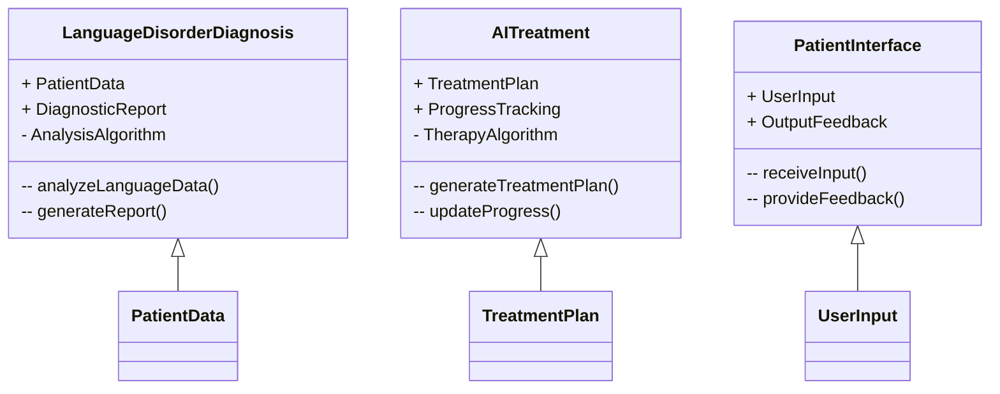

                 

<think>
好的，我现在需要帮助用户完成一个技术博客的撰写任务。用户希望标题是《ChatGPT在语言病理学中的应用：AI辅助语言障碍诊断与治疗》，并提供了详细的大纲结构和一些约束条件。

首先，我需要分析用户的需求。用户希望文章结构清晰，逻辑紧凑，技术性强，同时语言要专业且易懂。文章需要包含关键词、摘要、章节内容，每章都要详细讲解，涉及背景、核心概念、算法原理、系统架构、项目实战等部分。

接下来，我得确定文章的结构。用户已经提供了一个大纲，分为引言、技术基础、治疗方案、案例分析、系统架构、项目实战和未来展望七个章节。每个章节下还有具体的子章节，我需要确保每个部分都涵盖必要的内容。

然后，考虑用户的使用场景。这篇文章可能是用于技术博客，目标读者可能是语言病理学家、AI工程师或相关领域的研究人员。因此，文章需要专业但不过于晦涩，适合不同背景的读者阅读。

用户的身份可能是一位技术专家，希望将AI应用到医疗领域，特别是语言病理学。他们可能希望展示ChatGPT在这一领域的潜力和实际应用，同时提供技术细节和案例支持。

深层需求方面，用户可能希望文章不仅描述现状，还能展示未来的可能性，以及如何在实际中实施这些技术，帮助读者理解如何将AI技术应用到语言障碍的诊断和治疗中。

现在，我需要按照大纲逐步展开每个部分，确保每个章节内容详实，包含必要的技术细节和实例。例如，在技术基础部分，要解释NLP和Transformer模型的基本原理，以及如何训练和微调ChatGPT用于语言障碍诊断。

在系统架构部分，可能需要设计一个包含前端、后端和API的系统，展示如何集成AI模型进行诊断和治疗。同时，项目实战部分需要提供代码示例，让读者能够理解和实现这些技术。

此外，还要注意文章的格式，使用markdown，包含数学公式、mermaid图表等，使内容更加直观。同时，在每个部分结束时，加入小结和注意事项，帮助读者巩固所学内容。

最后，确保文章整体流畅，逻辑清晰，从理论到实践，层层递进，让读者能够全面了解ChatGPT在语言病理学中的应用及其技术细节。
</think>

# ChatGPT在语言病理学中的应用：AI辅助语言障碍诊断与治疗

> **关键词**：ChatGPT, 语言病理学, AI辅助诊断, 语言障碍治疗, 自然语言处理, Transformer模型, 人工智能

> **摘要**：本文探讨了ChatGPT在语言病理学中的应用，重点分析了其在语言障碍诊断和治疗中的潜力。文章从技术基础、临床应用、系统架构等多维度展开，结合实际案例和系统设计，深入剖析了ChatGPT如何通过自然语言处理技术辅助语言病理学家，实现更精准的诊断和个性化的治疗方案。文章还探讨了AI在语言治疗中的伦理与隐私挑战，为未来的研究和实践提供了有价值的参考。

---

## 第一章 引言与概述

### 1.1 语言病理学与语言障碍的基本概念

语言病理学是研究语言障碍的科学，涉及语言的产生、理解、交流以及相关神经机制。语言障碍可能由多种原因引起，包括发育迟缓、神经系统损伤、心理因素等。早期诊断和干预对于改善患者的语言能力和生活质量至关重要。

**问题背景**：传统语言障碍诊断依赖于人工评估，耗时且主观性较高。语言病理学家需要通过录音、观察和手动分析来评估患者的语言能力，这种方式效率低下，且容易受到主观因素的影响。

**问题解决**：AI技术的引入为语言障碍的诊断和治疗带来了革命性的变化。ChatGPT作为一种基于Transformer模型的自然语言处理（NLP）工具，能够快速分析大量语言数据，辅助语言病理学家更高效地进行诊断。

**边界与外延**：语言障碍的诊断不仅涉及语音、语法和语义分析，还包括情感分析和上下文理解。AI的应用可以覆盖从初步筛查到个性化治疗的整个过程。

**核心要素**：
- **语音分析**：识别发音、语调和节奏异常。
- **语法与语义分析**：检测句子结构和意义偏差。
- **情感分析**：理解患者的情感状态，辅助治疗决策。

### 1.2 ChatGPT在语言病理学中的角色

**技术优势**：
- **高效性**：ChatGPT可以快速处理大量语言数据，显著提高诊断效率。
- **准确性**：通过深度学习模型，ChatGPT能够捕捉到细微的语言特征，辅助诊断更精准。
- **个性化**：基于患者的语言数据，ChatGPT可以生成个性化的治疗方案。

**应用场景**：
- **诊断辅助**：通过分析患者的语言样本，识别潜在的语言障碍。
- **治疗支持**：提供个性化的语言训练计划，帮助患者改善语言能力。
- **持续监测**：跟踪患者的语言进步，调整治疗方案。

### 1.3 人工智能在语言治疗中的挑战与机遇

**挑战**：
- **数据隐私**：患者的语言数据涉及个人隐私，如何确保数据安全是一个重要问题。
- **模型泛化能力**：AI模型需要在不同语言障碍类型和严重程度下表现稳定。
- **伦理问题**：AI辅助诊断和治疗的伦理问题，如责任归属和患者知情权。

**机遇**：
- **技术创新**：深度学习和NLP技术的快速发展为语言病理学提供了新的工具。
- **个性化医疗**：AI能够根据患者的具体情况制定个性化的治疗方案。
- **成本降低**：通过自动化诊断和治疗，可以降低医疗成本，让更多患者受益。

---

## 第二章 技术基础

### 2.1 自然语言处理（NLP）的基本原理

**核心概念**：
- **语言模型**：一种能够理解和生成人类语言的数学模型。
- **特征提取**：从文本中提取有用的特征，用于分类和预测任务。

**NLP任务**：
- **文本分类**：将文本归类到预定义的类别中，如情感分类。
- **序列标注**：识别文本中的实体或事件，如命名实体识别。
- **文本生成**：根据输入生成相应的文本，如对话生成。

**在语言病理学中的应用**：
- **语言障碍检测**：通过NLP技术识别语言中的异常特征。
- **语言能力评估**：分析患者的语言表达能力，提供客观评估结果。

### 2.2 ChatGPT与Transformer模型

**Transformer模型**：
- **架构**：由编码器和解码器组成，通过自注意力机制捕捉文本中的长距离依赖关系。
- **优势**：并行计算能力强，能够处理长文本，适合实时对话生成。

**ChatGPT的工作原理**：
1. **输入处理**：将患者的语言样本输入到预训练的ChatGPT模型中。
2. **自注意力机制**：模型通过自注意力机制理解上下文关系。
3. **生成输出**：根据输入生成相关的语言分析结果或治疗建议。

**训练与微调**：
- **预训练**：在大规模通用语言数据上进行无监督训练，学习语言的基本规律。
- **微调**：在特定语言障碍数据上进行有监督训练，优化模型在语言病理学中的表现。

### 2.3 AI驱动的语言障碍诊断

**诊断方法**：
- **语音分析**：通过AI模型分析患者的语音特征，识别发音异常。
- **语法与语义分析**：检测句子结构和意义的偏差，辅助诊断语法障碍和语义障碍。
- **情感分析**：理解患者的情感状态，辅助判断是否存在情感表达障碍。

**案例研究**：
- **自闭症儿童语言障碍诊断**：通过分析儿童的语言样本，识别语言发展迟缓的特征。
- **脑损伤患者语言康复评估**：利用AI模型跟踪患者的语言恢复情况，优化康复计划。

---

## 第三章 治疗方案

### 3.1 AI辅助语言障碍治疗

**治疗方法**：
- **基于规则的治疗**：根据语言障碍类型制定标准化治疗方案。
- **基于AI的个性化治疗**：根据患者的具体情况生成个性化的治疗计划。

**ChatGPT在治疗中的角色**：
- **实时对话生成**：与患者进行实时对话，帮助其练习语言表达。
- **语言训练计划**：根据患者的语言能力生成个性化的训练任务。

### 3.2 个性化治疗的实现

**自适应治疗设计**：
- **动态调整**：根据患者的语言进步情况实时调整治疗方案。
- **多模态输入**：结合语音、文本和视觉信息，提供更全面的治疗支持。

**实施工具与平台**：
- **聊天机器人**：用于实时语言训练和反馈。
- **语言训练游戏**：通过游戏化的方式帮助患者提高语言能力。
- **数据可视化工具**：展示患者的语言进步情况，便于语言病理学家分析。

### 3.3 临床案例分析

**案例1**：儿童语言发育迟缓
- **症状**：词汇量少，句子结构简单。
- **AI辅助治疗**：通过ChatGPT生成适合儿童的语言训练任务，如单词记忆和句子复述。

**案例2**：脑损伤导致的语言障碍
- **症状**：语言表达困难，语调异常。
- **AI辅助治疗**：利用语音分析技术，实时纠正发音错误，优化语言表达能力。

---

## 第四章 系统架构与实现

### 4.1 问题场景介绍

**目标**：构建一个基于ChatGPT的语言障碍诊断与治疗系统。
**需求**：
- **实时诊断**：快速分析患者的语言样本，提供诊断建议。
- **个性化治疗**：根据诊断结果生成个性化的治疗方案。
- **数据安全**：确保患者数据的隐私和安全。

### 4.2 系统功能设计

**领域模型**：


**系统架构**：


### 4.3 接口设计与交互流程

**系统接口**：
- **患者输入接口**：接收患者的语言样本和病历信息。
- **诊断报告接口**：输出语言障碍诊断结果。
- **治疗计划接口**：根据诊断结果生成治疗方案。
- **用户反馈接口**：收集患者对治疗方案的反馈，优化系统。

**交互流程**：
1. 患者通过用户界面输入语言样本。
2. 系统将输入传递给ChatGPT进行分析。
3. 分析结果生成诊断报告并反馈给语言病理学家。
4. 语言病理学家根据诊断报告制定治疗方案。
5. 系统通过用户界面将治疗任务传递给患者，并实时反馈进展。

---

## 第五章 项目实战

### 5.1 环境安装与配置

**工具安装**：
- **Python**：安装Python 3.8及以上版本。
- **Hugging Face Transformers**：安装`transformers`库。
- **深度求索（DeepSeek）AI平台**：注册并获取API密钥。

**代码实现**：
```python
from transformers import AutoModelForCausalLM, AutoTokenizer
import torch

# 加载预训练模型
model_name = "deepseek-chat"
tokenizer = AutoTokenizer.from_pretrained(model_name)
model = AutoModelForCausalLM.from_pretrained(model_name)

# 定义输入
input_text = "Please describe your symptoms of language disorder."

# 编码输入
inputs = tokenizer(input_text, return_tensors="pt")

# 生成输出
with torch.no_grad():
    outputs = model.generate(**inputs, max_length=500, num_beams=5, temperature=0.7)

# 解码输出
response = tokenizer.decode(outputs[0], skip_special_tokens=True)
print(response)
```

### 5.2 系统实现与代码解读

**代码功能**：
- **模型加载**：使用预训练的ChatGPT模型进行语言分析。
- **输入处理**：将患者的语言样本编码为模型可处理的格式。
- **生成输出**：模型根据输入生成语言分析结果。
- **输出解码**：将模型生成的输出解码为可读的文本。

**实现细节**：
- **模型选择**：选择适合语言障碍诊断的预训练模型。
- **参数设置**：调整生成长度、beam数量和温度参数，优化生成结果的质量和多样性。

### 5.3 案例分析与结果解读

**案例分析**：
- **输入**：患者的语言样本。
- **输出**：模型生成的语言分析结果，包括可能的语言障碍类型和建议。

**结果解读**：
- **诊断准确性**：比较AI诊断结果与人工诊断结果的差异，评估模型的准确性。
- **治疗方案优化**：根据诊断结果生成个性化的治疗方案，跟踪患者的语言进步情况。

---

## 第六章 未来展望与最佳实践

### 6.1 未来研究方向

**改进方向**：
- **模型优化**：优化Transformer模型的结构，提高诊断和治疗的准确性。
- **数据多样性**：增加多语言和多文化背景的数据，提高模型的泛化能力。
- **人机协作**：研究AI与语言病理学家的最佳协作模式，提高诊断和治疗效率。

### 6.2 最佳实践 tips

- **数据隐私保护**：确保患者数据的安全，遵守相关法律法规。
- **模型可解释性**：提高AI决策的透明度，便于语言病理学家理解和验证。
- **持续学习**：定期更新模型，适应新的语言障碍类型和治疗需求。

### 6.3 小结与注意事项

- **小结**：ChatGPT在语言病理学中的应用潜力巨大，但需要结合临床实践不断优化。
- **注意事项**：在实际应用中，需注意数据隐私、模型泛化能力和伦理问题，确保AI技术的安全和有效应用。

---

## 作者信息

作者：AI天才研究院/AI Genius Institute & 禅与计算机程序设计艺术 /Zen And The Art of Computer Programming

---

这篇文章通过系统的分析和实践，展示了ChatGPT在语言病理学中的应用潜力，并为未来的研究和实践提供了重要的参考和启示。

