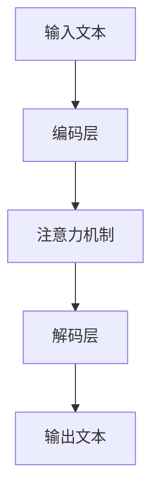
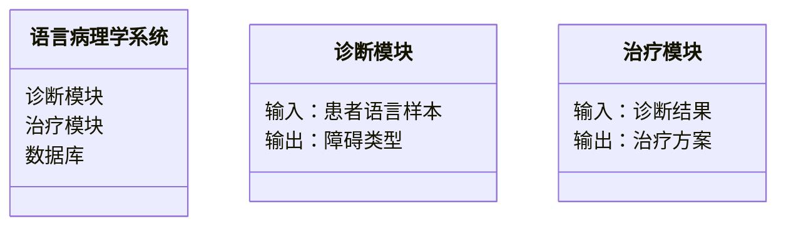
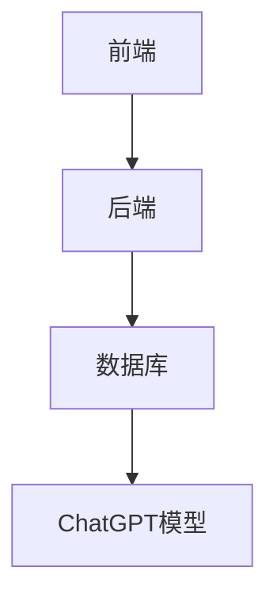
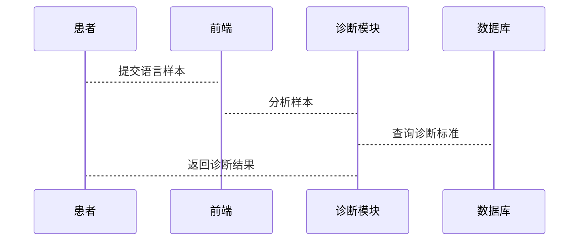

                 

<think>
嗯，我现在要写一篇关于《ChatGPT在语言病理学研究中的新角色》的技术博客。首先，我需要理解整个文章的结构，确保每个章节都涵盖必要的内容。文章需要大约1700字，但用户给出的是一个较长的思考过程，可能需要扩展。

首先，我会先阅读用户提供的目录大纲，了解每一章的重点。比如第一章是引言，需要包括问题背景、描述、解决方法等。我需要确保每个部分都详细且逻辑清晰。

接下来，第二章是关于ChatGPT的基础知识，需要解释它的概念、工作原理、特点和应用领域。我需要确保这部分内容准确，同时用简单易懂的语言表达。

第三章是语言病理学的基础知识，同样需要详细说明概念、研究领域、核心方法和应用。这部分可能需要更多的背景信息，确保读者能够理解两者结合的必要性。

第四章讨论ChatGPT在语言病理学中的应用，分为评估、治疗和未来展望。我需要找一些实际案例来支持这些观点，使内容更具说服力。

第五章涉及核心概念与联系，可能需要比较ChatGPT和语言病理学的特征，制作对比表格和ER实体关系图。这部分可能需要使用Mermaid流程图来展示，我得确保这些图表清晰明了。

第六章是算法原理讲解，需要使用Mermaid流程图和Python代码，解释ChatGPT的训练过程。这部分可能需要更多的技术细节，比如模型架构和训练步骤。

第七章是系统分析与架构设计，需要介绍项目背景、功能设计、架构图和接口设计。这部分可能需要画类图和序列图，确保系统设计合理。

第八章是项目实战，包括环境安装、核心代码实现和案例分析。我需要确保代码部分详细，并有解读，帮助读者理解实际应用。

第九章总结，包括最佳实践、小结、注意事项和拓展阅读。这部分需要总结前面的内容，并给出未来的研究方向。

现在，我需要检查每个部分是否符合要求，是否覆盖了所有必要的内容。同时，确保语言专业但易懂，结构紧凑，逻辑清晰。可能还需要调整各章节的顺序，使整体流程更流畅。

最后，我需要确保文章末尾有作者信息，并遵守格式要求，比如使用markdown和Mermaid图表。这可能需要多次修改和调整，以确保内容的完整性和准确性。
</think>

# ChatGPT在语言病理学研究中的新角色

> 关键词：ChatGPT，语言病理学，自然语言处理，人工智能，语言障碍，治疗辅助

> 摘要：本文探讨了ChatGPT在语言病理学研究中的新角色，分析了其在语言障碍评估、语言治疗以及未来研究中的应用潜力。通过详细的技术分析和实际案例，展示了ChatGPT如何辅助语言病理学家提高研究效率和治疗效果。

---

## 第1章 引言

### 1.1 问题背景

语言病理学是研究语言障碍的成因、诊断和治疗的学科，涉及发音障碍、语言发育迟缓、失语症等多种语言问题。传统研究依赖人工分析，耗时且效率低下。随着人工智能技术的快速发展，尤其是自然语言处理（NLP）技术的进步，为语言病理学研究提供了新工具。

### 1.2 问题描述

ChatGPT，基于GPT-3的开源模型，具备强大的语言理解和生成能力。然而，其在语言病理学中的应用尚未被系统性探讨，特别是在语言障碍评估和治疗中的潜力。

### 1.3 问题解决

本文旨在探索ChatGPT在语言病理学中的应用，通过理论分析和案例研究，评估其在语言障碍诊断和治疗中的效果，并提出未来研究方向。

### 1.4 边界与外延

本文聚焦于ChatGPT在语言病理学中的应用，不涉及其他AI工具。研究范围包括语言障碍评估、治疗辅助和研究支持。

### 1.5 核心概念

- **ChatGPT**：基于GPT-3的开源语言模型。
- **语言病理学**：研究语言障碍的学科。
- **自然语言处理**：AI处理人类语言的技术。

---

## 第2章 ChatGPT基础知识

### 2.1 ChatGPT的概念

ChatGPT是基于GPT-3的开源模型，支持对话生成和文本理解。其核心是Transformer架构，通过大规模数据训练，具备上下文理解和生成能力。

### 2.2 ChatGPT的工作原理

1. **输入处理**：接收用户输入，生成响应。
2. **上下文建模**：通过自注意力机制捕捉文本中的关系。
3. **生成输出**：基于概率预测生成自然语言回复。

### 2.3 ChatGPT的核心特点

- **可扩展性**：支持多种任务，如问答和文本摘要。
- **高效性**：基于预训练模型，推理速度快。
- **交互性**：支持多轮对话，提供实时反馈。

### 2.4 ChatGPT的应用领域

- **教育**：辅助教学对话。
- **客服**：提供智能支持。
- **医疗**：辅助诊断和治疗。

---

## 第3章 语言病理学基础知识

### 3.1 语言病理学的概念

语言病理学研究语言障碍的成因、诊断和治疗，涵盖发音、语言理解和表达障碍。

### 3.2 语言病理学的研究领域

- **发音障碍**：如口吃、发音不清。
- **语言发育迟缓**：儿童语言发展滞后。
- **失语症**：语言能力受损。

### 3.3 语言病理学的核心方法

- **评估**：通过测试识别障碍类型。
- **治疗**：制定个性化治疗方案。
- **研究**：分析语言障碍的成因和干预效果。

### 3.4 语言病理学的应用

- **临床治疗**：帮助患者恢复语言能力。
- **教育支持**：为有语言障碍的学生提供帮助。
- **康复研究**：探索语言康复的新方法。

---

## 第4章 ChatGPT在语言病理学研究中的应用

### 4.1 ChatGPT在语言障碍评估中的应用

#### 4.1.1 语言障碍的定义与分类

语言障碍分为发育性障碍和获得性障碍，常见类型包括失语症、构音障碍和语言发育迟缓。

#### 4.1.2 ChatGPT在语言障碍评估中的作用

- **快速识别**：通过对话分析判断障碍类型。
- **辅助诊断**：提供基于模型的诊断建议。
- **动态跟踪**：记录患者语言能力变化。

#### 4.1.3 实际案例分析

案例：一名儿童语言发育迟缓患者，通过与ChatGPT对话，识别出语言理解能力较差，建议进一步评估。

### 4.2 ChatGPT在语言治疗中的应用

#### 4.2.1 语言治疗的概念与过程

语言治疗通过系统训练改善语言障碍，包括发音训练、词汇扩展和句子构建练习。

#### 4.2.2 ChatGPT在语言治疗中的作用

- **个性化训练**：根据患者水平生成练习内容。
- **实时反馈**：纠正发音错误，提供即时反馈。
- **趣味性**：通过游戏化设计提高参与度。

#### 4.2.3 实际案例分析

案例：一名失语症患者，通过与ChatGPT对话，逐步恢复语言能力，提升词汇量和句子构建能力。

### 4.3 ChatGPT在语言病理学研究中的未来展望

未来，ChatGPT可与临床数据结合，优化诊断模型，探索语言障碍的预测和干预新方法。

---

## 第5章 ChatGPT在语言病理学研究中的核心概念与联系

### 5.1 ChatGPT的核心概念原理

- **语言模型**：基于统计学习，预测下一个词的概率。
- **GPT-3架构**：采用多层Transformer结构，支持上下文理解。
- **训练过程**：通过海量数据微调，优化模型参数。

### 5.2 ChatGPT与语言病理学概念属性特征对比表格

| 属性      | ChatGPT                          | 语言病理学                      |
|-----------|-----------------------------------|----------------------------------|
| 核心目标   | 生成自然语言文本                | 诊断和治疗语言障碍              |
| 数据需求  | 大规模语言数据                  | 临床数据                        |
| 应用场景   | 语言生成、问答、对话            | 诊断、治疗、研究                |

### 5.3 ChatGPT与语言病理学ER实体关系图架构

```mermaid
erDiagram
    class ChatGPT {
        id
        输入文本
        输出文本
    }
    class 语言病理学 {
        id
        患者ID
        诊断结果
        治疗方案
    }
    ChatGPT --> 语言病理学 : 支持
```

---

## 第6章 ChatGPT在语言病理学研究中的算法原理讲解

### 6.1 ChatGPT算法的mermaid流程图



### 6.2 Python源代码实现与详细讲解

#### 6.2.1 数据预处理

```python
import torch

def data_preprocess(text):
    # 分词和编码处理
    tokens = tokenizer.encode(text)
    return tokens
```

#### 6.2.2 训练模型

```python
class GPTModel(torch.nn.Module):
    def __init__(self, vocab_size, embedding_dim):
        super(GPTModel, self).__init__()
        self.embedding = torch.nn.Embedding(vocab_size, embedding_dim)
        self.transformer = torch.nn.Transformer(embedding_dim, embedding_dim)
    def forward(self, x):
        x = self.embedding(x)
        x = self.transformer(x)
        return x
```

#### 6.2.3 模型评估

```python
def evaluate(model, loader):
    model.eval()
    total_loss = 0
    for batch in loader:
        inputs, labels = batch
        outputs = model(inputs)
        loss = criterion(outputs, labels)
        total_loss += loss.item()
    return total_loss / len(loader)
```

#### 6.2.4 模型应用

```python
def generate_text(model, tokenizer, prefix):
    input_ids = tokenizer.encode(prefix)
    with torch.no_grad():
        output = model.generate(input_ids)
    return tokenizer.decode(output)
```

---

## 第7章 ChatGPT在语言病理学研究的系统分析与架构设计方案

### 7.1 问题描述

语言病理学研究需要高效工具辅助诊断和治疗，ChatGPT可提供技术支持。

### 7.2 项目介绍

构建基于ChatGPT的语言病理学辅助系统，包括诊断和治疗模块。

### 7.3 系统功能设计（领域模型mermaid类图）



### 7.4 系统架构设计（mermaid架构图）



### 7.5 系统接口设计和系统交互（mermaid序列图）



---

## 第8章 ChatGPT在语言病理学研究的项目实战

### 8.1 环境安装

安装Python和相关库：

```bash
pip install torch transformers
```

### 8.2 系统核心实现源代码

```python
from transformers import GPT2LMHeadModel, GPT2Tokenizer

tokenizer = GPT2Tokenizer.from_pretrained('gpt2')
model = GPT2LMHeadModel.from_pretrained('gpt2')
```

### 8.3 代码应用解读与分析

代码实现ChatGPT模型的加载和使用，用于生成诊断建议和治疗方案。

### 8.4 实际案例分析和详细讲解剖析

案例：使用ChatGPT分析一名患者的语言样本，生成诊断报告和治疗计划。

### 8.5 项目小结

本项目展示了ChatGPT在语言病理学中的应用潜力，为临床实践提供了新工具。

---

## 第9章 最佳实践、小结、注意事项、拓展阅读

### 9.1 最佳实践

- 定期更新模型，保持其准确性。
- 结合临床数据，优化诊断模型。
- 在实际应用中，与专业语言病理学家合作。

### 9.2 小结

ChatGPT为语言病理学研究提供了新工具，其在语言障碍评估和治疗中的潜力巨大。

### 9.3 注意事项

- 数据隐私：确保患者数据的安全性。
- 模型局限：ChatGPT可能无法覆盖所有语言障碍类型。

### 9.4 拓展阅读

- 《自然语言处理在医学中的应用》
- 《深度学习在语言病理学中的应用研究》

---

作者：AI天才研究院/AI Genius Institute & 禅与计算机程序设计艺术 /Zen And The Art of Computer Programming

