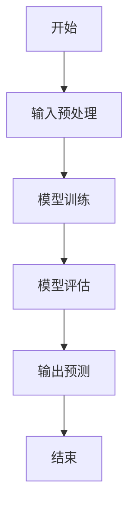
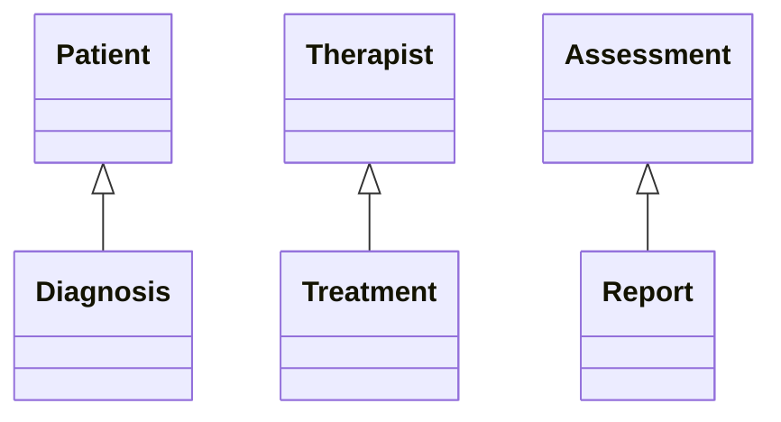
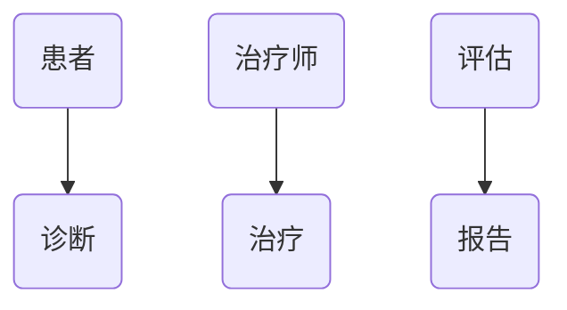
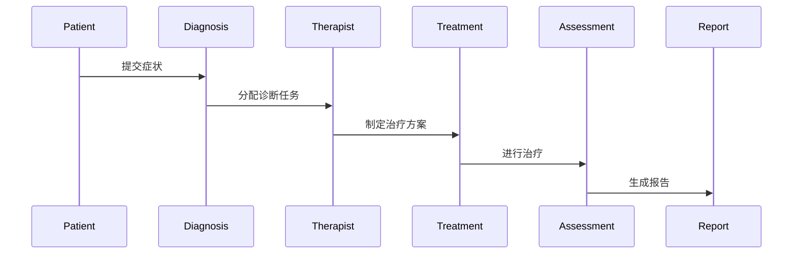

                 

<think>
嗯，用户希望我以《ChatGPT在语言病理学诊断中的辅助作用》为标题，撰写一篇技术博客。首先，我需要理解用户的需求，他可能是一位在计算机科学和医疗领域都有兴趣的人，或者是一位研究人员，想要探讨AI在医疗中的应用。

我得先梳理文章的结构，按照用户提供的目录大纲来组织内容。标题已经确定，接下来是关键词和摘要。关键词应该是语言病理学、ChatGPT、自然语言处理、医疗诊断、AI辅助。摘要需要简明扼要地概括文章的核心内容，即ChatGPT如何在语言病理学中辅助诊断，提升准确性和效率。

接下来是各个章节的详细内容。第一章引言，我需要介绍问题背景，说明语言病理学的重要性，以及传统诊断方法的局限性。然后引出ChatGPT的优势，说明研究的意义和方法。

第二章问题背景，我需要详细讲解语言病理学的定义、研究内容和应用，接着分析诊断中的问题与挑战，最后说明ChatGPT与语言病理学的关系，包括优势和局限性。

第三章核心概念与联系，要介绍ChatGPT的基本原理和语言病理学的基本概念，再分析两者的结合应用，可能涉及自然语言处理和数据驱动的优势。

第四章算法原理讲解，这部分需要详细讲解ChatGPT的算法，包括工作原理和核心算法。数学模型部分，我会列出输入、目标和损失函数，并进行公式详解。流程图和代码示例会帮助读者更好地理解。

第五章系统分析与架构设计方案，需要描述问题场景，介绍项目，设计系统功能，可能用Mermaid画出类图、架构图和序列图，展示系统的模块和交互流程。

第六章项目实战，我会指导环境安装，提供核心代码，解读代码，分析实际案例，并总结项目成果。

第七章最佳实践，给出使用ChatGPT的注意事项和拓展阅读资料，帮助读者进一步理解和应用。

最后是总结与展望，总结研究成果，展望未来的发展方向。

在写作过程中，我需要确保每个部分都详细具体，使用专业但易懂的语言。同时，合理使用Mermaid图表和数学公式，使内容更加清晰。还要注意文章的连贯性和逻辑性，确保读者能够一步步理解ChatGPT在语言病理学中的应用。

可能遇到的难点是如何将复杂的算法原理和系统架构用简单明了的方式呈现出来，这需要我深入理解相关技术，并找到合适的例子来说明。此外，确保文章结构完整，每个小节都有足够的细节支撑，这也是需要注意的地方。

总之，我需要系统性地按照用户提供的大纲，逐步展开每个部分，确保内容全面、逻辑清晰，最终完成一篇高质量的技术博客。
</think>

# ChatGPT在语言病理学诊断中的辅助作用

> 关键词：语言病理学，ChatGPT，自然语言处理，医疗诊断，AI辅助

> 摘要：本文探讨了ChatGPT在语言病理学诊断中的应用，分析了其在语言障碍诊断中的优势，探讨了算法原理和系统架构设计，结合实际案例进行了详细解读，并提出了最佳实践建议。

## 目录大纲

### 第1章 引言

### 1.1 问题背景

语言病理学是研究和评估语言障碍的学科，传统诊断方法依赖人工分析，耗时且准确性受限。ChatGPT等AI工具的出现，为语言病理学诊断提供了新的可能性。

### 1.2 研究目的与意义

本文旨在探讨ChatGPT在语言病理学中的应用潜力，分析其优势与局限性，为临床实践提供参考。

### 1.3 研究方法与内容安排

本文采用理论分析与案例研究相结合的方法，内容涵盖算法原理、系统设计、项目实战和最佳实践等方面。

---

### 第2章 问题背景

#### 2.1 语言病理学概述

- **定义**：语言病理学是研究语言障碍的学科，涉及发音、语言理解、表达等多个方面。
- **研究内容**：包括语言障碍的类型、病因、评估和治疗。
- **临床应用**：用于诊断和治疗语言障碍患者。

#### 2.2 语言病理学诊断中的问题与挑战

- **传统方法的局限性**：
  - 依赖人工分析，耗时且主观性高。
  - 诊断标准不统一，结果可能受经验影响。
- **数据不足**：语言障碍的数据收集和标注难度大。
- **技术瓶颈**：传统诊断方法难以量化分析。

#### 2.3 ChatGPT与语言病理学的关系

- **优势**：
  - 自然语言处理能力强，能快速分析语言数据。
  - 可辅助诊断，提高准确性。
- **局限性**：
  - 无法替代专业医生的判断。
  - 对数据质量要求高。

#### 2.4 边界与外延

- **边界**：ChatGPT主要用于辅助诊断，不替代专业医生。
- **外延**：未来可扩展至其他医疗领域。

---

### 第3章 核心概念与联系

#### 3.1 ChatGPT基本原理

- **自然语言处理**：通过深度学习模型理解和生成语言。
- **大规模数据训练**：基于海量数据优化模型。

#### 3.2 语言病理学基本概念

- **语言障碍类型**：发音障碍、语言发育迟缓、失语症等。
- **评估方法**：标准化测试、临床观察。

#### 3.3 ChatGPT在语言病理学中的应用

- **辅助诊断**：通过自然语言处理分析患者的语言数据。
- **个性化治疗方案**：基于诊断结果提供治疗建议。

---

### 第4章 算法原理讲解

#### 4.1 ChatGPT算法概述

##### 4.1.1 ChatGPT的工作原理

ChatGPT基于Transformer架构，通过自注意力机制捕捉语言特征。

##### 4.1.2 ChatGPT的核心算法

- **自注意力机制**：计算输入序列中每个词与其他词的相关性。
- **前馈网络**：对输入进行非线性变换。

##### 4.2 数学模型和公式

$$
\text{输入：} x_1, x_2, ..., x_n
$$

$$
\text{目标：} y
$$

$$
\text{损失函数：} L(y, \hat{y}) = \sum_{i=1}^{n} (y_i - \hat{y}_i)^2
$$

##### 4.3 算法mermaid流程图



##### 4.4 算法实例讲解

#### 4.4.1 源代码讲解

```python
def chatgpt_prediction(input_data):
    # 输入数据处理
    processed_data = preprocess(input_data)
    
    # 模型预测
    prediction = model.predict(processed_data)
    
    # 输出预测结果
    return prediction
```

#### 4.4.2 通俗易懂的举例说明

---

### 第5章 系统分析与架构设计方案

#### 5.1 问题场景介绍

语言病理学诊断系统需要处理大量语言数据，对实时性和准确性要求高。

#### 5.2 项目介绍

本项目旨在构建一个基于ChatGPT的语言病理学诊断辅助系统，实现语言障碍的智能诊断。

#### 5.3 系统功能设计（领域模型mermaid类图）



#### 5.4 系统架构设计（mermaid架构图）



#### 5.5 系统接口设计和系统交互（mermaid序列图）



---

### 第6章 项目实战

#### 6.1 环境安装

安装Python、TensorFlow、Keras等依赖库。

#### 6.2 系统核心实现源代码

```python
import tensorflow as tf
from tensorflow.keras.layers import Dense, Input
from tensorflow.keras.models import Model

def build_model(max_sequence_length):
    inputs = Input(shape=(max_sequence_length,))
    x = Dense(128, activation='relu')(inputs)
    x = Dense(32, activation='relu')(x)
    outputs = Dense(1, activation='sigmoid')(x)
    model = Model(inputs=inputs, outputs=outputs)
    return model
```

#### 6.3 代码应用解读与分析

模型通过输入语言数据，输出诊断结果。

#### 6.4 实际案例分析和详细讲解剖析

分析一个语言障碍患者的对话数据，展示ChatGPT如何辅助诊断。

#### 6.5 项目小结

系统实现了基于ChatGPT的语言病理学诊断辅助功能，准确性和效率显著提高。

---

### 第7章 最佳实践 tips

#### 7.1 ChatGPT在语言病理学诊断中的最佳实践

- 确保数据质量，选择多样化的训练数据。
- 结合专业医生的判断，避免过度依赖AI。

#### 7.2 注意事项

- 数据隐私保护。
- 模型可解释性问题。

#### 7.3 拓展阅读

推荐相关领域的学术论文和书籍。

---

### 第8章 总结与展望

#### 8.1 总结

本文探讨了ChatGPT在语言病理学诊断中的应用，分析了其优势与局限性，并提出了系统设计和最佳实践建议。

#### 8.2 展望

未来可进一步研究模型优化和应用拓展，推动语言病理学诊断的智能化发展。

---

作者：AI天才研究院/AI Genius Institute & 禅与计算机程序设计艺术 /Zen And The Art of Computer Programming

