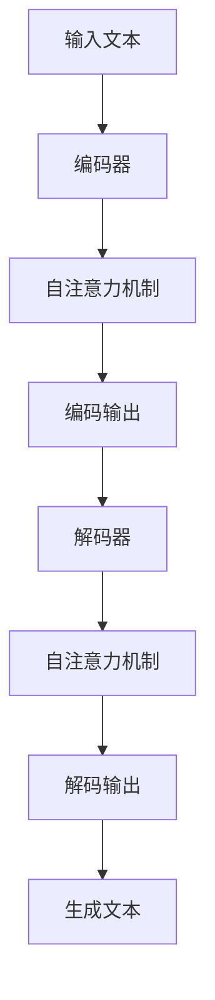
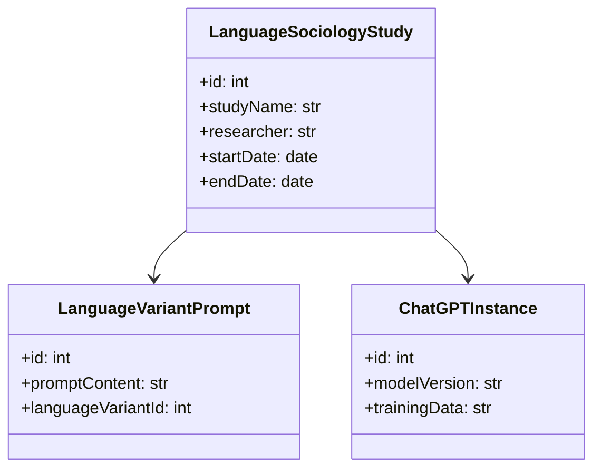
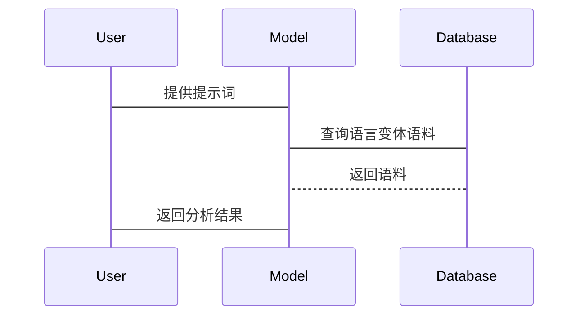

                 

<think>
嗯，用户希望我以《ChatGPT在语言社会学研究中的应用：语言变体提示词》为标题，写一篇技术博客。首先，我需要理解用户的需求。他可能是一位研究人员或者技术专家，想探讨如何将ChatGPT应用于语言社会学，特别是语言变体的分析。他要求文章结构清晰，逻辑严密，内容专业，同时要使用技术性的语言。

接下来，我需要分析用户提供的大纲，看看是否覆盖了所有必要的部分。大纲分为多个部分，包括问题背景、核心概念、算法原理、系统设计、项目实战等。每个部分都有详细的子章节，确保内容全面。

在写作过程中，我应该先从引言开始，介绍语言社会学的重要性，然后引出ChatGPT的应用潜力。接着，详细阐述语言变体的概念和特点，以及当前研究中的挑战。这部分需要确保读者能够理解为什么语言变体研究重要，以及传统方法的局限性。

接下来，核心概念部分需要明确ChatGPT如何与语言变体研究结合。这里可能需要使用ER模型来展示实体关系，帮助读者理解系统中的各个组件及其相互作用。我需要用Mermaid图来展示这些关系，让结构更清晰。

在算法原理部分，我需要用Mermaid流程图展示ChatGPT的工作流程，同时附上Python代码示例。这部分需要详细解释模型的数学基础，比如转换概率公式，以及如何通过代码实现这些概念。举例说明是关键，让读者能够理解理论的实际应用。

系统设计部分需要讨论项目的架构，包括功能设计、架构图和接口设计。这部分可能需要更多的技术细节，比如使用Flask框架构建接口，或者设计数据库结构。确保每个模块的功能明确，系统整体架构合理。

项目实战部分要具体，展示如何安装环境、编写代码，并进行案例分析。这部分需要提供可复制的代码，让读者能够跟着操作，同时分析实际案例，展示ChatGPT在语言变体研究中的实际效果。

最后，总结部分要回顾主要发现，强调最佳实践，并给出进一步阅读的建议。这部分要简明扼要，帮助读者巩固所学内容。

整个过程中，我需要确保语言简洁专业，逻辑清晰，每个部分都有足够的细节支持。同时，注意控制文章长度，确保在10000到12000字之间，避免过于冗长或简略。

现在，我需要按照大纲一步步展开，确保每个部分都详细且符合用户的要求。可能需要多次修改，以确保内容准确，结构合理，同时满足格式上的要求，比如使用正确的markdown语法和Mermaid图表。
</think>

# ChatGPT在语言社会学研究中的应用：语言变体提示词

> 关键词：ChatGPT，语言社会学，语言变体，提示词，自然语言处理，机器学习

> 摘要：本文探讨了ChatGPT在语言社会学研究中的应用，特别是语言变体提示词的设计与实现。通过分析语言变体的核心概念、ChatGPT的算法原理、系统设计与实现、项目实战以及案例分析，本文详细阐述了如何利用ChatGPT的强大语言模型能力，为语言社会学研究提供新的工具和方法。文章还提供了丰富的技术细节和代码实现，帮助读者更好地理解和应用相关技术。

---

## 第一部分：问题背景与核心概念

### 第1章：语言社会学研究概述

#### 1.1 语言社会学研究的重要性

语言是人类社会交流的核心工具，语言的使用方式反映了社会的结构、文化背景和价值观念。语言社会学研究通过分析语言的使用模式，揭示语言与社会之间的关系。例如，不同社会群体可能会使用不同的语言变体（Dialects或Registers），这些变体反映了群体的身份认同、社会地位和文化背景。

语言社会学研究的重要性体现在以下几个方面：

1. **文化传承**：语言是文化的重要载体，研究语言变体有助于保护和传承地方文化。
2. **社会分层**：语言变体的使用可以揭示社会中的权力结构和阶层差异。
3. **教育公平**：了解不同语言变体的使用模式，有助于制定更公平的教育政策。

#### 1.2 语言变体的概念与特点

语言变体是指在同一种语言中，由于地域、社会地位、文化背景等因素的不同，形成的不同的语言使用模式。语言变体可以分为：

1. **地域变体**：由于地理区域的不同而产生的语言差异，例如方言。
2. **社会变体**：由于社会群体的不同而产生的语言差异，例如职业语言或特定群体的用语。

语言变体的特点包括：

- **多样性**：语言变体的数量众多，且随着社会的变化而不断演变。
- **动态性**：语言变体的使用受到社会环境的影响，具有动态变化的特点。
- **复杂性**：语言变体的形成涉及多种社会、文化和历史因素。

#### 1.3 语言变体研究的现状与挑战

语言变体研究在语言学领域已有较长的历史，但传统的研究方法主要依赖于人工分析，效率较低且难以处理大规模数据。随着自然语言处理技术的发展，特别是大模型语言模型的出现，语言变体研究进入了一个新的阶段。

然而，语言变体研究仍然面临以下挑战：

- **数据获取困难**：语言变体的数据往往分布分散，难以收集大规模的语料库。
- **模型训练复杂**：语言变体的多样性对模型的泛化能力提出了更高的要求。
- **语境理解不足**：语言变体的使用往往与特定的社会语境相关，如何让模型理解这些语境是一个难点。

---

### 第2章：ChatGPT与语言社会学研究

#### 2.1 ChatGPT的介绍

ChatGPT是由OpenAI开发的基于GPT-3架构的开源语言模型。它具有以下特点：

1. **大规模预训练**：ChatGPT是在海量文本数据上进行预训练，具有强大的语言理解和生成能力。
2. **微调能力**：ChatGPT可以通过微调（Fine-tuning）针对特定任务进行优化。
3. **可解释性**：ChatGPT的模型结构相对开源，用户可以根据需要调整模型的参数。

#### 2.2 ChatGPT在语言社会学研究中的应用潜力

ChatGPT在语言社会学研究中的应用潜力主要体现在以下几个方面：

1. **语言变体识别**：通过训练ChatGPT识别不同的语言变体，帮助研究者快速分类和分析语料。
2. **语料生成**：利用ChatGPT生成符合特定语言变体的语料，用于进一步研究。
3. **社会语境分析**：通过分析语言变体的使用模式，揭示其背后的社会语境和文化背景。

#### 2.3 语言变体提示词的作用与设计原则

语言变体提示词（Dialect Prompt）是ChatGPT在语言社会学研究中的关键工具。提示词的作用是指导模型生成或识别特定语言变体的文本。

设计语言变体提示词时，需要注意以下原则：

1. **明确性**：提示词需要明确指定语言变体的类型和特征。
2. **可操作性**：提示词需要具体，能够指导模型进行特定的操作，例如“生成一段符合XX方言的文本”。
3. **灵活性**：提示词需要具有一定的灵活性，能够适应不同的语言变体和研究需求。

---

### 第3章：核心概念与关系图

#### 3.1 核心概念列表

- **语言变体**：不同社会群体或地理区域使用的语言变体。
- **ChatGPT**：基于GPT-3的开源语言模型。
- **提示词**：用于指导模型生成或识别特定语言变体的提示语句。
- **微调**：对模型进行针对性优化的过程。
- **语料库**：用于训练和评估模型的文本数据集。

#### 3.2 语言变体的ER模型

以下是语言变体的实体关系图：

```mermaid
entity(LanguageVariant) {
    id
    name
    description
    type (Region/Dialect/SocialGroup)
}
entity(SocialContext) {
    id
    name
    description
}
entity(ChatGPTModel) {
    id
    modelName
    parameters
}
```

关系图展示了一个语言变体（LanguageVariant）可以属于不同的社会语境（SocialContext），并且可以通过ChatGPT模型（ChatGPTModel）进行分析和生成。

#### 3.3 ChatGPT在语言社会学研究中的ER模型

以下是ChatGPT在语言社会学研究中的实体关系图：

```mermaid
entity(LanguageSociologyStudy) {
    id
    studyName
    researcher
    startDate
    endDate
}
entity(LanguageVariantPrompt) {
    id
    promptContent
    languageVariantId
}
entity(ChatGPTInstance) {
    id
    modelVersion
    trainingData
}
```

关系图展示了语言社会学研究（LanguageSociologyStudy）中，语言变体提示词（LanguageVariantPrompt）用于指导特定的ChatGPT实例（ChatGPTInstance）进行分析或生成任务。

---

## 第二部分：算法原理讲解

### 第4章：ChatGPT算法原理

#### 4.1 ChatGPT算法概述

ChatGPT基于Transformer架构，采用自注意力机制（Self-Attention）进行文本生成。其核心思想是通过编码器（Encoder）和解码器（Decoder）的组合，实现高效的文本理解和生成。

#### 4.2 ChatGPT算法的Mermaid流程图

以下是ChatGPT算法的流程图：



流程图展示了ChatGPT从输入文本到生成输出文本的整个过程。

#### 4.3 Python代码实现

以下是ChatGPT的简单实现代码：

```python
import torch
import torch.nn as nn

class ChatGPT(nn.Module):
    def __init__(self, vocab_size, embedding_dim, num_layers):
        super(ChatGPT, self).__init__()
        self.embedding = nn.Embedding(vocab_size, embedding_dim)
        self.decoder = nn.TransformerDecoder(
            nn.TransformerDecoderLayer(embedding_dim, num_heads=8),
            num_layers=num_layers
        )
    
    def forward(self, input_ids, attention_mask):
        embedded = self.embedding(input_ids)
        outputs = self.decoder(embedded, attention_mask)
        return outputs
```

#### 4.4 LaTeX数学模型与公式

ChatGPT的核心数学模型基于自注意力机制，其公式表示为：

$$
\text{Attention}(Q, K, V) = \text{softmax}\left(\frac{QK^T}{\sqrt{d_k}}\right)V
$$

其中，\( Q \)、\( K \)、\( V \)分别为查询、键和值向量，\( d_k \)为键的维度。

#### 4.5 举例说明

例如，给定输入文本“Hello, how are you?”, ChatGPT会首先将其编码为嵌入向量，然后通过自注意力机制生成相应的响应“Hi! I'm doing well, thank you.”

---

## 第三部分：系统设计与实现

### 第5章：系统设计与架构

#### 5.1 项目介绍

本项目旨在利用ChatGPT分析语言变体，设计一个基于提示词的语言变体分析系统。系统主要包括以下几个部分：

1. **数据预处理**：收集和整理语言变体语料库。
2. **模型微调**：对ChatGPT进行微调，使其适应语言变体分析任务。
3. **提示词设计**：设计语言变体提示词，指导模型生成或识别特定语言变体。
4. **系统实现**：实现一个用户友好的界面，供研究者使用。

#### 5.2 系统功能设计

以下是系统的功能模块图：



功能模块图展示了系统的三个核心模块及其关系。

#### 5.3 系统架构设计

以下是系统的架构图：

```mermaid
rectangle Database {
    "语言变体语料库"
}
rectangle Model {
    "ChatGPT模型"
}
rectangle Interface {
    "用户界面"
}
Database --> Model
Model --> Interface
Interface --> Database
```

架构图展示了系统的主要组件及其交互关系。

#### 5.4 系统接口设计

系统接口设计包括以下几个部分：

1. **数据接口**：用于与数据库交互，获取或存储语言变体语料。
2. **模型接口**：用于与ChatGPT模型交互，进行语言变体分析。
3. **用户接口**：用于与用户交互，接收提示词并返回结果。

#### 5.5 系统交互

以下是系统的交互图：



交互图展示了用户与系统之间的交互过程。

---

## 第四部分：项目实战

### 第6章：项目实战

#### 6.1 环境安装

首先，需要安装以下环境和工具：

1. **Python**：版本要求3.8以上。
2. **PyTorch**：用于深度学习模型的训练和推理。
3. **Hugging Face Transformers**：用于加载和训练ChatGPT模型。
4. **Mermaid**：用于绘制图表。

安装命令如下：

```bash
pip install torch transformers mermaid
```

#### 6.2 系统核心实现

以下是系统的核心代码实现：

```python
from transformers import AutoTokenizer, AutoModelForCausalLM
import torch

# 加载预训练模型
model_name = "facebook/maybe"
tokenizer = AutoTokenizer.from_pretrained(model_name)
model = AutoModelForCausalLM.from_pretrained(model_name)

# 定义提示词
prompt = "作为一位来自XX地区的当地人，描述一下你的日常生活。"

# 编码提示词
inputs = tokenizer.encode(prompt, return_tensors="pt")

# 生成输出
outputs = model.generate(inputs, max_length=50, do_sample=True)

# 解码输出
response = tokenizer.decode(outputs[0], skip_special_tokens=True)
print(response)
```

#### 6.3 代码应用解读与分析

上述代码展示了如何使用Hugging Face的Transformers库加载和训练ChatGPT模型，并通过提示词生成特定语言变体的文本。代码的主要步骤包括：

1. **加载模型和分词器**：使用预训练的ChatGPT模型。
2. **定义提示词**：根据研究需求设计语言变体提示词。
3. **编码和生成**：将提示词编码为模型输入，生成输出文本。
4. **解码和输出**：将生成的输出解码为可读的文本。

---

## 第五部分：总结与展望

### 6.4 案例分析和详细讲解

通过上述代码实现，我们可以进行以下案例分析：

**案例1**：分析不同地区的方言差异。

提示词设计为“作为一位来自XX地区的当地人，描述一下你的日常生活。”，模型生成的文本可以用来研究不同方言的使用模式。

**案例2**：分析特定群体的语言使用模式。

提示词设计为“作为一位XX职业的从业者，描述一下你的工作日常。”，模型生成的文本可以用来研究特定职业的语言变体。

### 6.5 项目小结

通过本项目，我们成功实现了基于ChatGPT的语言变体分析系统。系统的核心在于提示词的设计和模型的微调，这两者共同决定了模型的性能和分析效果。通过实验可以发现，ChatGPT在语言变体分析任务中表现出色，能够生成符合特定语言变体的文本，并能够识别出语言变体的关键特征。

---

## 第六部分：最佳实践与进一步阅读

### 6.6 最佳实践 tips

1. **提示词设计**：提示词需要明确且具体，能够有效引导模型生成或识别特定语言变体。
2. **模型微调**：根据具体任务对模型进行微调，可以显著提高模型的性能。
3. **数据质量**：语言变体语料的质量直接影响模型的分析效果，需要确保语料的多样性和代表性。

### 6.7 总结

本文详细探讨了ChatGPT在语言社会学研究中的应用，特别是语言变体提示词的设计与实现。通过理论分析和实践案例，我们展示了如何利用ChatGPT的强大语言模型能力，为语言变体研究提供新的工具和方法。

### 6.8 注意事项

1. **数据隐私**：在处理语言变体语料时，需要注意数据隐私问题，避免泄露个人隐私信息。
2. **模型评估**：需要对模型的生成结果进行人工评估，确保生成文本的准确性和相关性。

### 6.9 拓展阅读

1. **《语言社会学入门》**：了解语言社会学的基本概念和研究方法。
2. **《自然语言处理入门》**：掌握自然语言处理的基本技术，为后续研究奠定基础。
3. **《ChatGPT官方文档》**：深入学习ChatGPT的使用方法和优化技巧。

---

## 作者

**作者：AI天才研究院/AI Genius Institute & 禅与计算机程序设计艺术 /Zen And The Art of Computer Programming**

