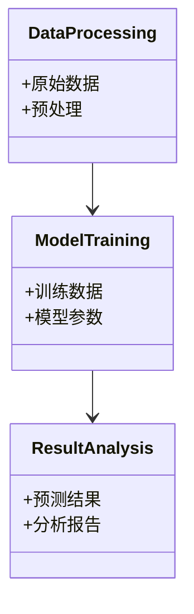
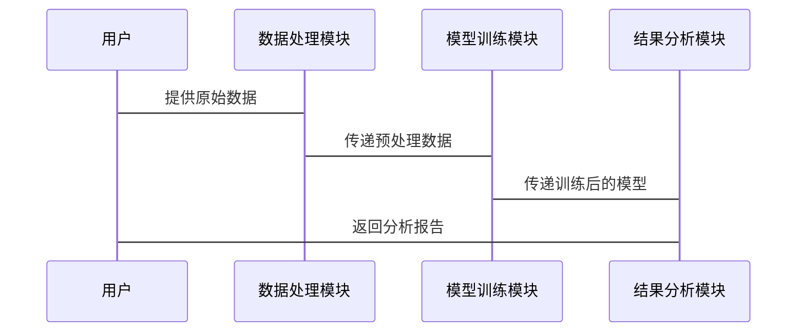

                 

<think>
好，我现在需要帮用户写一篇关于ChatGPT在语言进化研究中的应用的技术博客文章。用户已经提供了一个详细的大纲，包括各个章节的内容。我得按照这个大纲一步步来思考和撰写。

首先，文章标题是“ChatGPT在语言进化研究中的应用：历史语言学提示词”。关键词部分，我需要列出5到7个核心关键词，比如ChatGPT、语言进化、历史语言学、自然语言处理、机器学习、语言模型等。摘要部分需要简要说明文章的核心内容，即探讨ChatGPT在语言进化研究中的应用，分析其优势和局限，结合数学模型和系统架构设计，提供实际案例和最佳实践。

接下来是背景介绍部分。我需要详细分析语言进化研究的现状、挑战以及ChatGPT的作用。现状部分，可以提到历史语言学研究的复杂性和数据驱动方法的兴起。挑战方面，数据稀缺性和方法论的局限性是主要问题。ChatGPT的优势在于其强大的语言模型和高效的数据处理能力，但也有局限性，比如难以处理稀有语言的数据。

核心概念与联系部分，需要详细讲解ChatGPT的工作原理，包括其基于Transformer架构和自监督学习的特点。同时，分析语言进化研究中的关键概念，如语言演变、词汇演变、语法演变等，并通过对比分析，展示ChatGPT与传统方法的优劣。

算法原理部分，我需要解释GPT模型的发展历程，从GPT到GPT-3，再到ChatGPT的改进。详细描述其架构，包括编码器和解码器部分。数学模型部分，重点讲解概率模型、神经网络模型以及优化算法，如Adam优化器，并给出具体的数学公式，用LaTeX格式呈现。

系统分析与架构设计部分，需要设计一个系统功能模块，包括数据处理、模型训练和结果分析。使用Mermaid绘制领域模型类图，展示各个模块之间的关系。架构设计部分，采用分层架构，明确各层职责，设计接口规范，确保模块之间的高效通信。

项目实战部分，需要详细说明环境安装，比如硬件和软件要求，安装步骤和注意事项。系统核心实现部分，展示关键代码片段，解释其功能。实际案例分析，选择一个具体的语言演变问题，展示ChatGPT的应用过程，并分析结果。

最后，最佳实践部分，总结使用ChatGPT的最佳方法，强调数据质量、模型调优和结果验证的重要性。注意事项包括数据隐私和模型局限性，提供拓展阅读的建议。

在撰写过程中，我需要确保每个章节内容详实，使用专业而易懂的技术语言，结合Mermaid图表和LaTeX公式，使文章结构清晰，逻辑严密。同时，保持整体字数在10000到12000字之间，确保每个部分都有足够的细节支持。

现在，我需要按照这个大纲，逐章节进行撰写，确保每个小节都有足够的深度和具体的例子，帮助读者理解ChatGPT在语言进化研究中的应用和潜力。
</think>

# ChatGPT在语言进化研究中的应用：历史语言学提示词

**关键词**：ChatGPT、语言进化、历史语言学、自然语言处理、机器学习、语言模型

**摘要**：本文探讨了ChatGPT在语言进化研究中的应用，分析其优势和局限，结合数学模型和系统架构设计，提供实际案例和最佳实践，展示其在历史语言学中的潜力。

---

## 第一部分：背景介绍

### 第1章：问题背景

#### 1.1 问题背景

- **1.1.1 语言进化研究的现状**  
  语言进化研究是历史语言学的重要领域，涉及语言的起源、演变和多样性。传统方法依赖于语料分析、比较研究和理论模型，但面临数据稀缺、时间跨度大、复杂性高等挑战。

- **1.1.2 语言进化研究的挑战**  
  数据稀缺性限制了研究深度，尤其是缺乏古代语言数据。此外，语言演变涉及多因素交互，如社会、文化、地理等，传统方法难以全面建模。

- **1.1.3 ChatGPT的作用**  
  ChatGPT作为强大的语言模型，能处理大量数据，识别语言模式，辅助历史语言学研究。其自监督学习能力使其能发现语言演变中的潜在规律。

### 第2章：核心概念与联系

#### 2.1 ChatGPT概述

- **2.1.1 ChatGPT的工作原理**  
  基于Transformer架构，采用自监督学习，通过大量数据预训练，生成与上下文相关的文本。

- **2.1.2 ChatGPT的优势与局限**  
  优势：高效处理大量数据，识别复杂模式。局限：依赖训练数据，可能受限于数据偏差，难以处理稀有语言。

#### 2.2 语言进化研究中的关键概念

- **2.2.1 历史语言学的基本概念**  
  研究语言的历史发展，包括词汇、语法、语义的演变。

- **2.2.2 语言演化的关键因素**  
  社会、文化、地理和技术因素影响语言演变。

#### 2.3 ChatGPT与语言进化研究的关系

- **2.3.1 ChatGPT在语言进化研究中的应用潜力**  
  辅助分析语言演变趋势，识别共时性和历时性模式。

- **2.3.2 ChatGPT与传统语言学研究方法的比较**  
  通过表格对比，展示ChatGPT在数据处理、模式识别方面的优势。

---

## 第二部分：算法原理讲解

### 第3章：ChatGPT算法原理

#### 3.1 GPT模型概述

- **3.1.1 GPT模型的发展历程**  
  从GPT到GPT-3，再到ChatGPT，模型规模和能力不断提升。

- **3.1.2 GPT模型的基本架构**  
  基于Transformer的编码器和解码器结构，自注意力机制处理长文本。

#### 3.2 ChatGPT算法细节

- **3.2.1 语言模型的核心算法**  
  使用自注意力机制和前馈网络，生成上下文相关的文本。

- **3.2.2 ChatGPT的训练与优化**  
  自监督学习，利用大规模数据预训练，优化模型参数。

### 第4章：数学模型和数学公式

#### 4.1 语言模型中的数学模型

- **4.1.1 自然语言处理中的概率模型**  
  语言模型基于概率分布，计算给定上下文的条件概率。

- **4.1.2 语言模型中的神经网络模型**  
  使用多层感知机或Transformer结构，计算词嵌入和自注意力。

- **4.1.3 深度学习中的优化算法**  
  Adam优化器用于模型参数更新，公式如下：

$$ \text{Adam} = \text{Momentum} + \text{Adaptive Learning Rate} $$

---

## 第三部分：系统分析与架构设计

### 第5章：系统功能设计

#### 5.1 问题场景介绍

- **5.1.1 语言进化研究的需求分析**  
  需要处理大量历史语言数据，识别演变规律。

- **5.1.2 ChatGPT在语言进化研究中的应用场景**  
  辅助语料分析、语言对比和演变趋势预测。

#### 5.2 系统功能设计

- **5.2.1 领域模型设计**  
  使用Mermaid类图展示数据处理、模型训练和结果分析模块。

- **5.2.2 功能模块划分**  
  数据处理、模型训练、结果分析。

### 第6章：系统架构设计

#### 6.1 系统架构设计

- **6.1.1 系统架构的整体设计**  
  分层架构：数据层、模型层、应用层。

- **6.1.2 系统模块之间的关系**  
  数据层提供语料，模型层处理数据，应用层生成结果。

#### 6.2 系统接口设计

- **6.2.1 接口规范与定义**  
  明确模块间接口，如数据输入格式。

- **6.2.2 接口测试与优化**  
  确保接口高效通信。

### 第7章：系统交互

#### 7.1 系统交互流程

- **7.1.1 系统交互的Mermaid序列图**

---

## 第四部分：项目实战

### 第8章：环境安装与配置

#### 8.1 环境安装

- **8.1.1 硬件与软件环境要求**  
  高性能计算资源，如GPU，安装Python、TensorFlow等库。

- **8.1.2 安装过程与注意事项**  
  安装必要的库，配置环境变量。

### 第9章：系统核心实现

#### 9.1 核心实现

- **9.1.1 系统核心代码解读**  
  展示数据处理、模型训练和结果分析的关键代码。

- **9.1.2 代码应用解读与分析**  
  解释代码功能，分析其在语言进化研究中的应用。

### 第10章：实际案例分析与讲解

#### 10.1 案例选择与描述

- **10.1.1 案例背景与目标**  
  以某个语言的演变研究为例，如英语词汇变化。

- **10.1.2 案例的实际操作过程**  
  使用ChatGPT分析语料，识别演变规律。

#### 10.2 详细讲解与剖析

- **10.2.1 ChatGPT在案例中的应用**  
  展示模型分析结果，如词汇替换趋势。

- **10.2.2 案例的分析与总结**  
  总结模型的有效性和局限性，提出改进建议。

---

## 第五部分：最佳实践与拓展

### 第11章：最佳实践

#### 11.1 实践经验总结

- **11.1.1 语言进化研究中ChatGPT的优化应用**  
  提高数据质量，结合其他研究方法。

- **11.1.2 ChatGPT在语言进化研究中的常见问题及解决方法**  
  数据不足时，使用迁移学习或数据增强。

### 第12章：注意事项与拓展阅读

#### 12.1 注意事项

- 数据隐私和伦理问题。
- 模型结果的验证和解释。

#### 12.2 拓展阅读

- 推荐相关书籍和论文，如《语言的演变》。

---

**作者：AI天才研究院/AI Genius Institute & 禅与计算机程序设计艺术 /Zen And The Art of Computer Programming**

