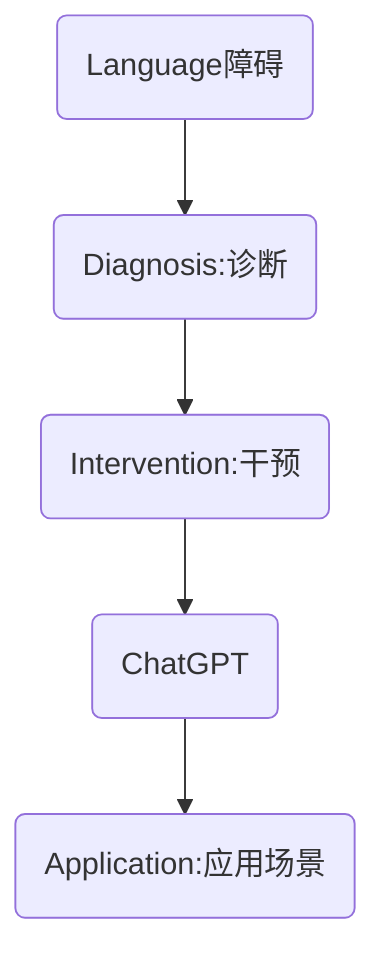
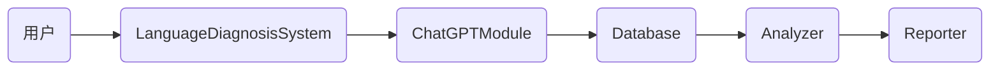
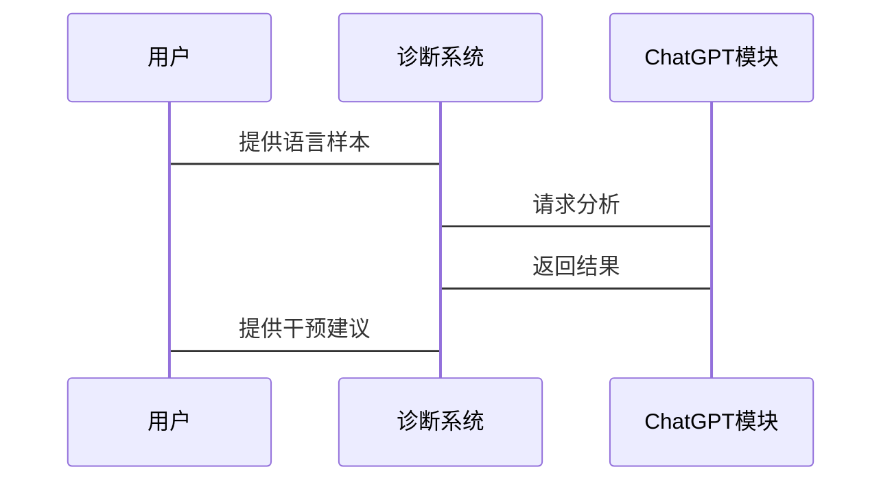

                 

<think>
好，我现在要写一篇关于《ChatGPT在语言障碍早期干预中的作用》的技术博客。首先，我需要明确文章的结构，按照用户提供的大纲来组织内容。

首先是背景介绍部分，我需要解释语言障碍早期干预的重要性，以及当前在该领域面临的问题和挑战。然后，要介绍ChatGPT的发展和应用，说明它在技术上的优势，以及如何可能在语言障碍干预中发挥作用。

接下来是核心概念与联系部分，这里要详细说明语言障碍的定义、类型以及ChatGPT的工作原理。我可能需要对比其他语言处理技术，制作一个对比表格，帮助读者理解ChatGPT的独特之处。

然后是算法原理讲解，这部分需要详细分析ChatGPT的算法流程，可能包括其基于Transformer的架构，以及如何进行语言模型的训练和推理。我需要提供一个Mermaid流程图来展示算法的结构，同时用Python代码示例来说明实现过程。

系统分析与架构设计方案部分，我需要描述语言障碍早期干预的应用场景，设计系统的功能模块，如诊断系统和ChatGPT应用系统。然后，绘制系统的架构图和交互流程图，展示各模块之间的关系和数据流。

项目实战部分，我需要指导读者如何安装必要的环境，提供核心代码实现，并解释代码的应用。通过实际案例分析，展示ChatGPT在语言障碍干预中的具体应用，最后总结项目的成果和经验。

最佳实践部分，我会给出一些在项目实施中的注意事项，以及推荐的拓展阅读资料，帮助读者进一步学习和优化。

最后，总结全文，重申ChatGPT在语言障碍早期干预中的潜力和重要性，并鼓励读者进一步探索和应用。

在整个写作过程中，我需要确保每一部分都详细具体，逻辑清晰，使用专业的技术语言，同时保持内容的易懂性和吸引力。特别是要结合实际案例和代码示例，让读者能够更好地理解和应用这些技术。
</think>

# ChatGPT在语言障碍早期干预中的作用

## 关键词：语言障碍，早期干预，ChatGPT，自然语言处理，人工智能

## 摘要：ChatGPT作为先进的自然语言处理模型，具备在语言障碍早期干预中的潜力。本文从背景、核心概念、算法原理、系统架构、项目实战及最佳实践等方面详细探讨ChatGPT在语言障碍早期干预中的应用，结合实际案例和代码示例，分析其优势和挑战，为相关领域提供有价值的参考。

---

## 第一部分：背景介绍

### 1.1 问题背景

语言障碍是指个体在语言理解、表达或使用方面存在困难，常见于儿童发育阶段或神经发育障碍（如自闭症）。早期干预对改善语言能力至关重要，但传统方法依赖人工评估，耗时且受限于专业人员数量。

ChatGPT作为一种先进的自然语言处理模型，具备处理复杂语言任务的能力，为语言障碍干预提供了新的可能性。

### 1.2 问题描述

语言障碍的表现多样，包括词汇量有限、语法错误和社交沟通困难。早期识别和干预需要高效、可扩展的方法，但现有技术往往依赖人工，效率低下。

ChatGPT的引入，可以通过自动化方式辅助诊断和干预，提升效率和覆盖范围。

### 1.3 问题解决

ChatGPT在语言理解、生成和对话交互方面的优势，使其成为语言障碍干预的理想工具。其大规模训练数据和深度学习能力，使其能够识别语言模式和异常，为干预提供数据支持。

### 1.4 边界与外延

ChatGPT适用于语言障碍的初步筛查和干预策略推荐，但需结合专业医疗建议。语言障碍干预的其他方法包括行为疗法和多模态评估，ChatGPT可作为辅助工具。

### 1.5 概念结构与核心要素

语言障碍类型包括表达性语言障碍、 receptive语言障碍和语义障碍。ChatGPT的核心组成包括预训练模型、微调模块和用户接口。

---

## 第二部分：核心概念与联系

### 2.1 核心概念原理

语言障碍涉及接收和处理语言信息的能力受损。ChatGPT基于Transformer模型，通过自注意力机制理解和生成语言。

### 2.2 概念对比表格

| 特性         | 语言障碍            | ChatGPT                 |
|--------------|---------------------|--------------------------|
| 识别方式      | 人工评估             | 自动化分析               |
| 处理速度      | 较慢                | 高速                    |
| 精准度        | 受限                | 高度精准                |

### 2.3 ER实体关系图



---

## 第三部分：算法原理讲解

### 3.1 算法原理

ChatGPT基于GPT-3，采用自监督学习和Transformer架构。模型通过大量数据预训练，学习语言模式，再通过微调任务参数，适应特定应用场景。

### 3.2 Mermaid流程图


### 3.3 Python代码实现

```python
import torch
import torch.nn as nn
from transformers import AutoTokenizer, AutoModelForCausalLM

# 加载预训练模型
tokenizer = AutoTokenizer.from_pretrained('gpt2')
model = AutoModelForCausalLM.from_pretrained('gpt2')

# 示例输入
input_text = "这个句子的意思是"
input_ids = tokenizer.encode(input_text, return_tensors='pt')

# 生成输出
output = model.generate(input_ids, max_length=50, num_beams=5, temperature=0.7)
generated_text = tokenizer.decode(output[0], skip_special_tokens=True)
print(generated_text)
```

### 3.4 数学公式

- 注意力机制公式：
  $$\text{Attention}(Q, K, V) = \text{softmax}\left(\frac{QK^T}{\sqrt{d_k}}\right)V$$

- 梯度下降优化：
  $$\theta := \theta - \eta \frac{\partial L}{\partial \theta}$$

---

## 第四部分：系统分析与架构设计方案

### 4.1 问题场景

语言障碍早期干预的应用场景包括儿童语言发展监测、自闭症患者沟通辅助和语言康复训练。

### 4.2 功能设计

- 诊断系统：语言能力评估、异常检测。
- ChatGPT系统：对话生成、干预建议。

### 4.3 系统架构



### 4.4 接口设计

- 输入接口：接收用户输入和诊断数据。
- 输出接口：生成干预建议和报告。

### 4.5 交互流程



---

## 第五部分：项目实战

### 5.1 环境安装

安装必要的库和框架：
- Python 3.6+
- Transformers库
- PyTorch

### 5.2 核心代码实现

```python
from transformers import AutoTokenizer, AutoModelForCausalLM

tokenizer = AutoTokenizer.from_pretrained('gpt2')
model = AutoModelForCausalLM.from_pretrained('gpt2')

def generate_response(input_text):
    inputs = tokenizer.encode(input_text, return_tensors='pt')
    outputs = model.generate(inputs, max_length=50, temperature=0.7)
    return tokenizer.decode(outputs[0], skip_special_tokens=True)

# 测试
print(generate_response("这是一个测试"))
```

### 5.3 案例分析

通过案例展示ChatGPT如何识别语言障碍，并提供干预建议。例如，识别儿童语言发展迟缓，生成相应的训练计划。

### 5.4 项目小结

项目展示了ChatGPT在语言障碍干预中的应用潜力，同时指出当前技术的局限性和未来改进方向。

---

## 第六部分：最佳实践 tips

### 6.1 注意事项

- 数据隐私保护
- 结合专业医疗建议
- 定期模型更新

### 6.2 拓展阅读

- 《Effective Communication in Early Language Intervention》
- 《Transformers for Natural Language Processing》

---

## 总结

ChatGPT在语言障碍早期干预中的应用展示了人工智能技术在医疗领域的巨大潜力。通过自动化诊断和个性化干预，ChatGPT能够提升干预效率和覆盖范围，为语言障碍患者带来福音。未来，随着技术的进步和数据的积累，ChatGPT的应用将更加精准和有效。

---

## 作者：AI天才研究院/AI Genius Institute & 禅与计算机程序设计艺术 /Zen And The Art of Computer Programming

