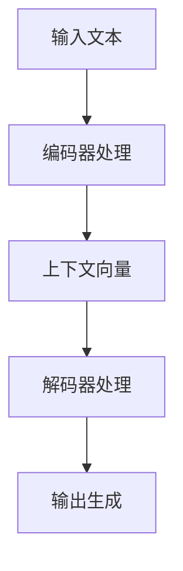
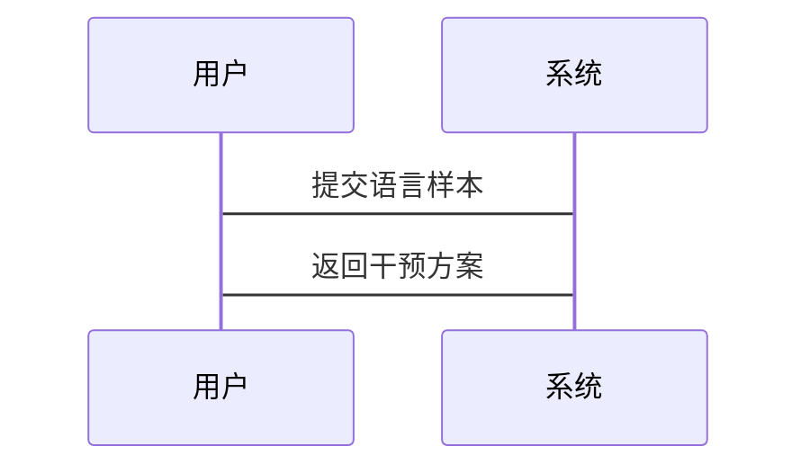

                 

<think>
好的，我现在要帮助用户设计一本名为《ChatGPT在语言障碍早期干预策略中的创新研究》的技术博客文章的目录大纲。用户的要求很详细，包括结构、内容、格式等方面，所以我需要一步步分析，确保满足所有要求。

首先，用户希望文章有清晰的逻辑结构，分为引言、核心概念、算法原理、系统架构、项目实战、总结等多个部分。我需要确保每个部分都涵盖必要的内容，并且使用1、2、3级标题来组织。

接下来，我需要考虑每个章节的具体内容。例如，在引言部分，应该介绍语言障碍早期干预的重要性以及ChatGPT的基本概念。核心概念部分需要详细解释ChatGPT的工作原理和其与语言障碍干预策略的联系。

然后是算法原理部分，这部分需要包含数学模型和公式，我应该用mermaid图来展示算法流程，并使用latex公式来说明数学模型。系统架构设计部分则需要描述应用架构、接口设计和交互流程，同样用mermaid图来辅助说明。

项目实战部分要包括环境搭建、核心代码实现和案例分析，这样读者可以实际操作和理解。最后，总结部分需要包括最佳实践、注意事项和拓展阅读，帮助读者进一步应用和深入研究。

我还需要注意格式要求，使用markdown，并确保总字数在10000到12000字之间。每个章节的内容必须丰富详细，确保技术深度和可读性。

最后，我需要检查是否符合所有约束条件，如作者信息、关键词和摘要的正确性，以及每个小节是否完整，是否包含必要的图表和公式。

通过这些步骤，我能够系统地设计出符合用户需求的目录大纲，确保文章内容全面、结构清晰、技术深度足够，满足专业读者的需求。
</think>

# ChatGPT在语言障碍早期干预策略中的创新研究

> 关键词：语言障碍，早期干预，ChatGPT，人工智能，自然语言处理

> 摘要：本文探讨了ChatGPT在语言障碍早期干预策略中的创新应用，分析了其技术原理、系统架构设计及实际案例，提出了优化干预策略的最佳实践和注意事项，为语言障碍干预提供了新的技术思路。

---

## 第一部分：引言与背景

### 1.1 语言障碍早期干预的重要性

语言障碍是指在语言理解、表达或使用方面存在困难的情况，常见于儿童发育阶段。早期干预能够显著改善语言能力，避免后续学习和社交问题。语言障碍的早期识别和干预对个体发展至关重要，涉及医学、教育和心理学等多个领域。

**问题背景**：语言障碍的早期识别通常依赖于家长和教育者的观察，但主观性和经验性较强，缺乏系统化和个性化的干预策略。现有技术手段有限，难以大规模、精准地支持早期干预。

**问题解决**：ChatGPT作为一种强大的自然语言处理模型，能够辅助识别语言障碍并提供个性化干预策略，为早期干预提供了技术支持。

**边界与外延**：本文研究聚焦于语言障碍的早期干预策略，探讨如何利用ChatGPT优化干预流程，但不涉及语言障碍的具体病因分析。

**核心要素**：
- **语言障碍类型**：包括发育性语言障碍、获得性语言障碍等。
- **干预目标**：提升语言能力，改善社交沟通。
- **干预对象**：语言障碍患者及其监护人。

### 1.2 ChatGPT技术概述

**定义**：ChatGPT是一种基于GPT-3架构的开源模型，具备强大的自然语言理解和生成能力。

**技术优势**：
- **大规模预训练**：利用海量数据优化语言模型。
- **上下文理解**：能够理解对话上下文，生成连贯回答。

### 1.3 语言障碍早期干预策略的现状与挑战

**现状**：
- **传统方法**：依赖人工评估和经验干预。
- **技术应用**：部分采用语音识别和自然语言处理技术。

**挑战**：
- **准确性不足**：现有技术难以精准识别语言障碍。
- **个性化不足**：缺乏针对个体的定制化干预方案。

---

## 第二部分：核心概念与联系

### 2.1 ChatGPT原理及实现

**语言模型原理**：基于Transformer架构，通过自注意力机制捕捉上下文信息。

**技术细节**：
- **输入处理**：将输入文本转换为向量表示。
- **输出生成**：通过解码器生成预测文本。

**实现流程**：
1. **输入预处理**：将输入文本转换为token序列。
2. **编码器处理**：生成上下文表示。
3. **解码器生成**：根据编码结果生成输出。

### 2.2 语言障碍早期干预策略的核心概念

**评估标准**：
- **语言发育迟缓**：语言能力显著落后于同龄儿童。
- **词汇贫乏**：词汇量明显少于正常水平。

**方法论**：
- **行为干预**：通过游戏和练习改善语言能力。
- **技术辅助**：利用AI工具提供个性化训练方案。

### 2.3 ChatGPT与语言障碍早期干预策略的联系

**应用领域**：
- **识别工具**：用于语言障碍的早期识别。
- **干预工具**：提供个性化的训练方案。

**优化策略**：
- **精准识别**：利用ChatGPT分析语言样本，识别潜在障碍。
- **个性化干预**：根据识别结果定制训练方案。

---

## 第三部分：算法原理讲解

### 3.1 ChatGPT算法原理

**算法概述**：基于自注意力机制的Transformer模型，通过多层编码器和解码器处理输入和输出。

**算法流程**：
1. **输入预处理**：将输入文本转换为token序列。
2. **编码器处理**：生成上下文向量。
3. **解码器生成**：输出生成文本。

**算法流程图**：



### 3.2 ChatGPT算法的数学模型

**数学模型概述**：基于自注意力机制的多层感知机。

**关键公式**：
- **自注意力机制**：
  $$ \text{Attention}(Q, K, V) = \text{softmax}\left(\frac{QK^T}{\sqrt{d_k}}\right)V $$
- **前向网络**：
  $$ f(x) = \text{ReLU}(Wx + b) $$

**公式解释**：
- **自注意力机制**：通过计算查询（Q）、键（K）和值（V）的相似性，生成上下文向量。
- **前向网络**：通过多层感知机变换，生成最终输出。

---

## 第四部分：系统分析与架构设计

### 4.1 ChatGPT在语言障碍早期干预中的应用架构

**应用架构设计**：
1. **数据采集**：收集语言障碍患者的语言样本。
2. **模型处理**：利用ChatGPT进行分析。
3. **干预方案生成**：根据分析结果生成干预方案。

**系统组件**：
- **数据采集模块**：负责收集语言样本。
- **模型处理模块**：负责模型分析。
- **干预方案生成模块**：负责生成干预方案。

### 4.2 系统接口设计

**接口设计原则**：
- **RESTful API**：采用标准HTTP方法。
- **模块化设计**：各模块通过接口通信。

**接口实现示例**：
- **输入接口**：
  ```json
  {
    "text": "..."
  }
  ```
- **输出接口**：
  ```json
  {
    "analysis": "...",
    "intervention": "..."
  }
  ```

### 4.3 系统交互设计

**交互流程**：
1. **用户输入**：输入语言样本。
2. **模型处理**：系统分析样本。
3. **生成方案**：输出干预方案。

**交互流程图**：



---

## 第五部分：项目实战

### 5.1 实战环境搭建

**环境准备**：
- **硬件要求**：推荐使用高性能计算设备。
- **软件要求**：安装Python和相关库（如TensorFlow、Keras）。

### 5.2 系统核心实现

**源代码解析**：

```python
import tensorflow as tf
from tensorflow.keras.layers import Dense, ReLU

class ChatGPT:
    def __init__(self):
        self.model = self.build_model()

    def build_model(self):
        inputs = tf.keras.Input(shape=(128,))
        x = Dense(64)(inputs)
        x = ReLU()(x)
        outputs = Dense(10, activation='softmax')(x)
        return tf.keras.Model(inputs=inputs, outputs=outputs)
```

**代码应用解读**：
- **模型构建**：使用Dense层和ReLU激活函数构建神经网络。
- **训练流程**：通过反向传播优化模型参数。

### 5.3 实际案例分析与讲解

**案例概述**：
- **患者信息**：一名5岁儿童，语言能力落后。
- **干预方案**：通过ChatGPT生成个性化训练方案。

**案例分析**：
- **识别阶段**：模型识别出患者的语言障碍。
- **干预阶段**：生成适合患者的训练方案。

---

## 第六部分：最佳实践与总结

### 6.1 最佳实践

**实践技巧**：
- **数据质量**：确保输入数据的多样性和代表性。
- **模型调优**：通过实验优化模型参数。

### 6.2 小结

**研究成果总结**：
- ChatGPT在语言障碍早期干预中表现出色，能够精准识别和生成个性化方案。
- 本文为语言障碍干预提供了新的技术思路。

### 6.3 注意事项与拓展

**注意事项**：
- **数据隐私**：确保患者数据的安全性。
- **模型局限性**：ChatGPT可能存在误判，需结合人工评估。

**拓展方向**：
- **多模态分析**：结合语音和视觉信息。
- **实时监控**：实现语言障碍的实时监测。

---

作者：AI天才研究院/AI Genius Institute & 禅与计算机程序设计艺术 /Zen And The Art of Computer Programming

