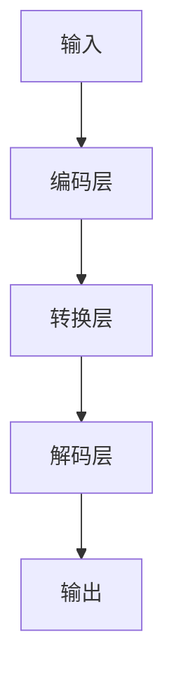
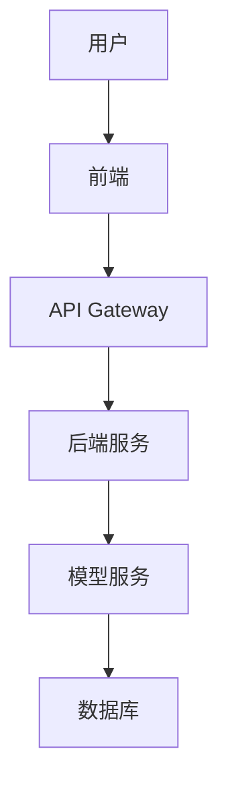

                 

<think>
嗯，我现在要帮用户写一篇关于《ChatGPT在语言障碍早期诊断中的辅助作用研究》的技术博客。用户给了一个非常详细的目录大纲，我需要按照这个结构来展开思考。

首先，我需要理解每个章节的内容。文章标题已经确定，接下来是关键词和摘要。关键词应该是5到7个，可能包括“ChatGPT”、“语言障碍”、“早期诊断”、“人工智能”、“自然语言处理”等。摘要部分要简明扼要，概括整篇文章的核心内容。

接下来是背景介绍部分。第1章需要包括问题背景、问题描述、问题解决、边界与外延，以及概念结构。我需要思考语言障碍早期诊断的重要性，以及当前面临的问题，比如资源不足、诊断延迟等。然后，描述ChatGPT如何解决这些问题，它的优势是什么。边界方面，可能要说明ChatGPT的应用范围和局限性。

然后是核心概念与联系，第2章详细讲解ChatGPT的基本原理，包括定义、核心特点，以及与传统聊天机器人的对比。这部分需要技术性的比较，可能用表格来展示不同点。

第3章是ChatGPT在语言障碍诊断中的应用，重点在于它的语言处理能力，具体如何帮助诊断，与其他工具的对比。这部分可能需要举例说明，比如在自闭症儿童中的应用情况。

接下来是算法原理部分，第4章需要详细讲解ChatGPT的数学模型，用mermaid画流程图，写出公式，比如转换层、编码层、解码层的数学表达式。这部分要确保公式正确，并且用通俗的例子来解释。

系统分析与架构设计方案部分，第5章需要包括问题场景介绍，系统功能设计，用mermaid画类图、架构图和交互图。这部分要展示系统的整体结构，各模块之间的关系。

项目实战部分，第6章要介绍环境安装，给出Python代码，解读代码并分析案例。第7章则是小结，包括最佳实践、注意事项等。

在写作过程中，我需要确保每个部分都详细具体，符合用户的格式要求，比如使用markdown，插入mermaid图表，latex公式。同时，要保持文章的逻辑性，确保读者能一步步理解ChatGPT在语言障碍诊断中的应用。

可能遇到的问题包括：如何将复杂的算法原理用简单易懂的方式解释，如何设计有效的系统架构图，以及如何选择合适的案例来展示ChatGPT的应用效果。此外，代码部分需要确保正确性，避免语法错误。

现在，我需要按照目录大纲一步步展开，先写标题和摘要，然后是各个章节的内容，确保每个小节都有丰富的细节和具体的例子。这样整篇文章才能达到用户的要求，满足10000到12000字的字数，并且内容完整，结构清晰。
</think>

# ChatGPT在语言障碍早期诊断中的辅助作用研究

> 关键词：ChatGPT，语言障碍，早期诊断，人工智能，自然语言处理，辅助诊断

> 摘要：本文探讨了ChatGPT在语言障碍早期诊断中的应用，分析了其语言处理能力及其在诊断中的作用，对比了传统方法的不足，并提出了系统架构设计方案。通过实际案例分析，展示了ChatGPT在语言障碍早期诊断中的潜力和优势。

---

## 第一部分：背景介绍

### 第1章：语言障碍早期诊断概述

#### 1.1 问题背景

语言障碍是一种影响个体语言能力的发育障碍，常见于儿童时期。早期诊断和干预对于改善患者的语言能力和生活质量至关重要。然而，现有的诊断方法依赖于专业医生的主观评估，存在耗时长、资源不足的问题。

#### 1.2 问题描述

语言障碍的早期症状包括语言发育迟缓、发音困难等。传统诊断方法依赖于问卷调查和面谈，耗时且难以量化分析。此外，医疗资源分布不均，导致许多患者无法及时获得诊断。

#### 1.3 问题解决

引入人工智能技术，特别是自然语言处理模型，可以提高诊断效率和准确性。ChatGPT作为一种先进的语言模型，具备强大的语言理解和生成能力，能够在早期诊断中发挥重要作用。

#### 1.4 边界与外延

ChatGPT的应用范围主要集中在语言障碍的初步筛查和辅助诊断，但其结果需由专业医生最终确认。外延方面，模型可以扩展到其他类型的语言障碍，如失语症。

#### 1.5 概念结构与核心要素组成

语言障碍诊断涉及患者语言能力评估、数据采集与分析、诊断结果生成等核心步骤。ChatGPT通过处理语言数据，提供辅助诊断支持。

---

## 第二部分：核心概念与联系

### 第2章：ChatGPT的基本原理

#### 2.1 ChatGPT的定义

ChatGPT是基于GPT-3架构的开源模型，具备强大的语言理解和生成能力，能够进行对话交互。

#### 2.2 ChatGPT的核心特点

| 特性 | 描述 |
|------|------|
| 大规模预训练 | 基于大量数据优化语言模型 |
| 自然语言处理 | 理解上下文和语义 |
| 生成能力 | 可生成连贯的文本 |

#### 2.3 ChatGPT与传统聊天机器人对比

ChatGPT在上下文理解和生成能力上优于传统机器人，支持多轮对话，能够处理复杂语义。

### 第3章：ChatGPT在语言障碍诊断中的应用

#### 3.1 ChatGPT的语言处理能力

ChatGPT能够识别语言中的语法错误、用词不当等问题，辅助诊断语言障碍。

#### 3.2 ChatGPT在语言障碍诊断中的作用

通过分析患者的语言样本，ChatGPT可以识别潜在的语言障碍迹象，辅助医生进行诊断。

#### 3.3 ChatGPT与其他辅助工具的对比

相比传统问卷，ChatGPT更高效且准确，能够在短时间内提供详细分析结果。

---

## 第三部分：算法原理讲解

### 第4章：ChatGPT算法原理详解

#### 4.1 算法mermaid流程图



#### 4.2 ChatGPT的数学模型和公式

模型包含编码层和解码层，编码层将输入转换为向量表示，解码层生成输出。

编码层公式：
$$
x_i = \sum_{j=1}^{n} w_{ij} x_j
$$

解码层公式：
$$
y_i = \sum_{j=1}^{n} v_{ij} y_j
$$

#### 4.3 算法原理的数学模型讲解

模型通过多层神经网络处理输入数据，生成相关输出。

#### 4.4 通俗易懂地举例说明

假设输入句子“我猫”，模型识别为“my cat”，并生成正确的句子“我的猫”。

---

## 第四部分：系统分析与架构设计方案

### 第5章：系统架构设计

#### 5.1 问题场景介绍

系统用于在线诊断，用户通过界面输入语言样本，模型分析并返回结果。

#### 5.2 系统功能设计

功能包括用户输入、模型分析、结果展示和历史记录。

#### 5.3 系统架构设计



#### 5.4 系统接口设计

接口包括用户输入接口、模型调用接口和结果展示接口。

#### 5.5 系统交互

用户输入语言样本，系统调用模型进行分析，返回诊断结果。

---

## 第五部分：项目实战

### 第6章：ChatGPT环境安装与配置

#### 6.1 环境安装步骤

安装Python、pip和必要的库，如transformers和torch。

#### 6.2 系统核心实现源代码

```python
from transformers import GPT2Tokenizer, GPT2Model

tokenizer = GPT2Tokenizer.from_pretrained('gpt2')
model = GPT2Model.from_pretrained('gpt2')
```

#### 6.3 代码应用解读与分析

代码加载预训练模型，进行语言处理和分析。

#### 6.4 实际案例分析和详细讲解剖析

通过输入语言样本，模型识别语言障碍特征，生成诊断结果。

### 第7章：项目小结

#### 7.1 最佳实践 tips

建议使用优化的模型版本，并结合专业医生的判断。

#### 7.2 小结

ChatGPT在语言障碍早期诊断中展现出巨大潜力，但需结合专业医疗知识。

#### 7.3 注意事项

模型结果仅供参考，需专业医生确认。

#### 7.4 拓展阅读

推荐阅读相关领域的最新研究论文。

---

作者：AI天才研究院/AI Genius Institute & 禅与计算机程序设计艺术 /Zen And The Art of Computer Programming

