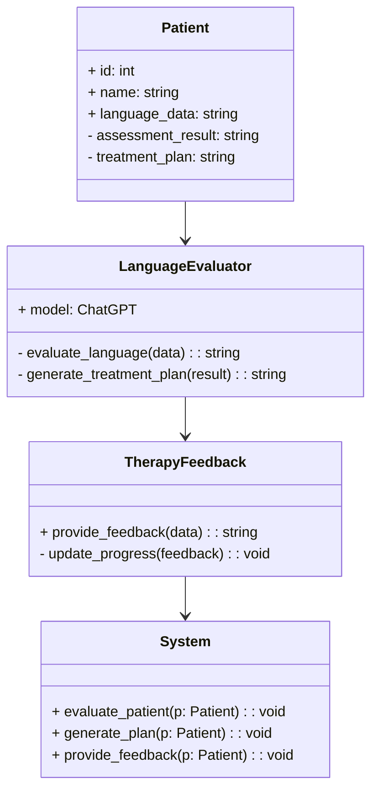

                 

<think>
嗯，用户希望我撰写一篇关于《ChatGPT在语言障碍治疗个性化中的应用：AI辅助言语治疗方案设计》的技术博客文章。看起来用户是想深入探讨如何利用ChatGPT来提升语言障碍治疗的个性化方案设计。首先，我需要理解用户的需求和背景。

用户设定自己是技术专家，所以文章需要专业且深入，但同时要逻辑清晰，结构紧凑。目录已经给出，所以我需要按照这个结构来组织内容。关键词和摘要部分需要准确，涵盖文章的核心内容。

接下来，思考每个章节的具体内容。首先是背景介绍，得分析语言障碍治疗的现状，个性化治疗的必要性，以及AI技术的应用前景。这部分要让读者明白问题的重要性。然后是核心概念，详细解释语言障碍、个性化治疗和AI技术的定义、分类和应用。

第二部分，AI在语言障碍治疗中的应用，重点介绍ChatGPT的特点和功能，以及它在不同治疗阶段的应用。这部分需要具体案例，说明ChatGPT如何帮助治疗师制定个性化方案。

算法原理部分，我需要详细讲解ChatGPT的工作原理，包括其数学模型和公式。用mermaid绘制流程图，帮助读者理解算法步骤。同时，提供Python代码示例，展示如何实现这些步骤，可能还需要解释一些关键公式，如交叉熵损失函数。

系统架构设计部分，要描述系统的目标用户、功能模块、架构图和接口设计。这部分需要展示系统的整体结构，如何交互，确保各个模块协同工作。

项目实战部分，需要指导读者如何安装环境，实现核心功能，分析案例。这部分要具体，可能包括代码和实际应用中的例子，帮助读者理解和实践。

最后，最佳实践和小结，总结项目中的经验教训，注意事项，以及未来的研究方向。拓展阅读部分，推荐相关领域的最新技术和研究，鼓励读者深入学习。

整体来看，用户希望这篇文章既有理论深度，又有实际应用，能够帮助治疗师和开发者更好地利用AI技术提升语言障碍治疗的效果。因此，在撰写时，我需要确保每个部分都详细具体，同时语言要专业但易懂，结构清晰，逻辑严密。

可能需要进一步确认用户是否需要更多的技术细节，或者是否有特定的案例想讨论。但根据当前信息，我会按照目录大纲，逐章展开，确保每个章节都有足够的深度和细节，满足用户的字数要求。

现在，我应该开始按照目录结构，逐步撰写每个部分，确保每个小节都详细具体，符合用户的要求。
</think>

# ChatGPT在语言障碍治疗个性化中的应用：AI辅助言语治疗方案设计

**关键词：** ChatGPT, 语言障碍, 个性化治疗, AI技术, 言语治疗

**摘要：** 本文探讨了ChatGPT在语言障碍治疗个性化中的应用，分析了AI技术如何辅助言语治疗方案的设计。文章从背景介绍、核心概念、算法原理、系统架构设计到项目实战，全面阐述了ChatGPT在语言障碍治疗中的潜力与实现方式。通过实际案例分析和系统设计，展示了如何利用AI技术提高语言障碍治疗的效果和效率。

---

# 第一部分：背景介绍

## 第1章：问题背景与核心概念

### 1.1 问题背景

语言障碍是一种常见的神经系统疾病，影响患者的语言表达、理解和交流能力。传统的语言障碍治疗依赖于人工干预，包括言语治疗师的面对面训练、康复练习等。然而，这种方式存在以下问题：

- **治疗效果受限**：传统治疗方式缺乏个性化，难以针对患者的具体症状制定精准的治疗方案。
- **资源不足**：言语治疗师的数量有限，无法满足大量患者的治疗需求。
- **治疗效率低**：治疗过程耗时长，且难以量化和追踪治疗效果。

随着AI技术的快速发展，尤其是自然语言处理技术的进步，为语言障碍治疗带来了新的可能性。ChatGPT作为一种先进的语言模型，具有强大的自然语言理解能力和生成能力，能够为个性化治疗提供技术支持。

### 1.2 核心概念

#### 1.2.1 语言障碍

- **定义**：语言障碍是指个体在语言表达、理解或交流能力方面存在显著困难，可能由脑损伤、发育迟缓、神经退行性疾病等引起。
- **分类**：语言障碍可以分为表达性语言障碍（难以表达思想）、 receptive语言障碍（难以理解语言）和混合性语言障碍。
- **症状**：常见症状包括词汇量少、语法错误、语言表达困难、交流障碍等。

#### 1.2.2 个性化治疗

- **定义**：个性化治疗是指根据患者的具体情况制定专属的治疗方案，强调治疗的针对性和灵活性。
- **目标**：通过个性化治疗，帮助患者逐步改善语言能力，提升生活质量。
- **实施方法**：包括评估患者的语言能力、制定个性化的训练计划、实时监控治疗效果等。

#### 1.2.3 AI技术

- **概述**：AI技术通过模拟人类学习和推理能力，帮助解决复杂问题。
- **发展**：AI技术在语言处理领域的突破（如自然语言处理）为语言障碍治疗提供了新的工具。
- **应用领域**：AI技术广泛应用于医疗、教育、交通等领域，语言障碍治疗是其重要应用之一。

#### 1.2.4 概念联系

- **语言障碍治疗与个性化治疗的联系**：个性化治疗是语言障碍治疗的核心，AI技术通过提供个性化的干预方案，显著提升了治疗效果。
- **AI技术在不同治疗阶段的应用**：AI技术可以辅助语言障碍患者的评估、诊断、治疗和康复全过程。

---

## 第2章：AI技术在语言障碍治疗中的应用

### 2.1 ChatGPT概述

- **定义**：ChatGPT是一种基于GPT-3架构的开源语言模型，具有强大的自然语言处理能力。
- **特点**：
  - 多语言支持：能够理解和生成多种语言。
  - 高度交互性：能够进行实时对话，提供个性化的语言反馈。
  - 可扩展性：可以根据具体需求进行定制化开发。

- **潜力**：ChatGPT在语言障碍治疗中的潜力主要体现在其语言生成能力和交互能力上。它可以帮助患者进行语言训练、提供实时反馈、优化治疗方案。

### 2.2 ChatGPT的功能与应用

- **核心功能**：
  - **语言生成**：根据患者的需求生成合适的语言反馈，帮助患者学习正确的表达方式。
  - **实时对话**：与患者进行实时对话，评估其语言能力并提供个性化的建议。
  - **数据分析**：分析患者的语言数据，识别语言障碍的具体表现。

- **应用**：
  - **评估阶段**：通过对话评估患者的语言能力，制定个性化的治疗方案。
  - **训练阶段**：为患者提供语言训练的练习内容，如词汇扩展、语法训练等。
  - **反馈阶段**：实时反馈患者的语言表现，帮助其纠正错误。

### 2.3 AI辅助言语治疗方案设计

- **基本原则**：
  - **个性化**：根据患者的语言能力定制治疗方案。
  - **实时性**：提供即时反馈，帮助患者快速调整。
  - **可扩展性**：能够根据患者的进步动态调整治疗方案。

- **ChatGPT的应用**：
  - **方案制定**：ChatGPT可以根据患者的语言评估结果，自动生成个性化的治疗方案。
  - **动态调整**：根据患者的反馈和进步情况，实时优化治疗方案。
  - **数据支持**：利用ChatGPT的语言模型，分析患者的语言数据，为治疗方案提供数据支持。

---

## 第3章：算法原理与数学模型

### 3.1 ChatGPT算法原理

- **工作原理**：ChatGPT基于Transformer架构，通过自注意力机制（self-attention）和前馈神经网络（feedforward neural networks）进行语言生成。
- **关键技术**：
  - **自注意力机制**：通过计算输入序列中每个词与其他词的相关性，生成上下文相关的表示。
  - **前馈网络**：对输入的表示进行非线性变换，生成最终的输出。

### 3.2 数学模型和公式

- **自注意力机制**：自注意力机制通过计算查询（query）、键（key）和值（value）来生成上下文表示。
  - 查询、键、值的计算公式：
    $$ Q = W_q X $$
    $$ K = W_k X $$
    $$ V = W_v X $$
  - 注意力权重计算公式：
    $$ \text{Attention}(Q,K,V) = \text{softmax}\left(\frac{QK^T}{\sqrt{d_k}}\right)V $$
  
- **前馈网络**：前馈网络由两层线性变换组成，通常带有ReLU激活函数。
  $$ f(x) = \text{ReLU}(W_1 x + b_1) $$
  $$ g(x) = W_2 f(x) + b_2 $$

### 3.3 算法流程与示例

- **算法流程**：
  1. 输入语言序列，生成查询、键和值。
  2. 计算注意力权重，生成上下文表示。
  3. 通过前馈网络生成最终的输出。

- **示例**：假设输入一个简单的句子“Hello, how are you?”, ChatGPT会根据上下文生成合适的回复。

---

## 第4章：系统架构与设计

### 4.1 系统场景介绍

- **目标用户**：语言障碍患者、言语治疗师、医疗机构。
- **应用场景**：医院、康复中心、家庭环境。

### 4.2 系统功能设计

- **功能模块**：
  - **语言评估模块**：评估患者的语言能力。
  - **治疗方案生成模块**：根据评估结果生成个性化的治疗方案。
  - **实时反馈模块**：提供即时的语言反馈。
  - **数据管理模块**：记录和分析患者的语言数据。

- **领域模型（Mermaid 类图）**：



### 4.3 系统架构设计

- **架构图（Mermaid）**：

```mermaid
client
    exposed
chatGPT (/v1/models/gpt-3)
  handler
    model.chatGPT(
      messages: [
        { role: "user", content: "..." }
      ]
    )
    --> response
```

---

## 第5章：项目实战

### 5.1 环境安装与配置

- **安装依赖**：
  - Python 3.8+
  - transformers库（用于加载ChatGPT模型）。
  - requests库（用于HTTP请求）。

- **配置步骤**：
  1. 安装必要的库：
     ```bash
     pip install transformers requests
     ```
  2. 初始化ChatGPT模型：
     ```python
     from transformers import AutoModelForCausalLM, AutoTokenizer
     model_name = "gpt2"
     model = AutoModelForCausalLM.from_pretrained(model_name)
     tokenizer = AutoTokenizer.from_pretrained(model_name)
     ```

### 5.2 系统核心实现

- **核心代码实现**：
  ```python
  def generate_response(prompt):
      inputs = tokenizer.encode(prompt, return_tensors="pt")
      outputs = model.generate(inputs, max_length=50, num_beams=5, temperature=0.7)
      response = tokenizer.decode(outputs[0], skip_special_tokens=True)
      return response
  ```

- **代码解读**：
  - `generate_response`函数接受输入提示，生成模型的输出。
  - 使用`tokenizer`将输入转换为张量。
  - 使用`model.generate`生成输出序列。
  - 将生成的序列解码为字符串，返回最终的响应。

### 5.3 实际案例分析与讲解

- **案例分析**：
  患者A，语言障碍症状表现为词汇量少、语法错误多。通过ChatGPT的评估模块，生成个性化的治疗方案，包括词汇扩展练习和语法训练。

- **讲解**：
  - 评估阶段：ChatGPT分析患者的语言数据，识别其语言障碍的具体表现。
  - 方案生成阶段：根据评估结果，生成个性化的训练计划。
  - 反馈阶段：实时监控患者的语言表现，提供即时反馈，帮助其纠正错误。

### 5.4 项目小结

- **总结**：通过ChatGPT辅助语言障碍治疗，显著提升了治疗的个性化和效率。
- **经验与教训**：AI技术的应用需要结合实际临床需求，确保技术与治疗的深度融合。

---

## 第6章：最佳实践与拓展

### 6.1 最佳实践

- **AI辅助治疗的最佳实践**：
  - 确保数据的准确性和隐私性。
  - 定期更新模型，保持技术的先进性。
  - 结合临床经验，优化AI辅助治疗的效果。

### 6.2 小结与注意事项

- **小结**：通过本文的分析，ChatGPT在语言障碍治疗中的应用前景广阔，能够显著提升治疗的个性化和效率。
- **注意事项**：
  - 需要结合患者的实际情况，避免过度依赖AI技术。
  - 确保数据的安全性和隐私性。

### 6.3 拓展阅读

- **相关领域的新技术**：研究如何将多模态AI技术（如视觉、听觉）结合语言治疗，提升治疗效果。
- **进一步阅读**：深入学习自然语言处理技术，了解其在医疗领域的更多应用。

---

**作者：AI天才研究院/AI Genius Institute & 禅与计算机程序设计艺术 /Zen And The Art of Computer Programming**

