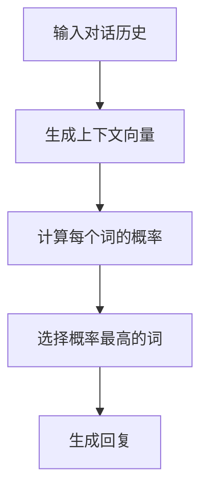
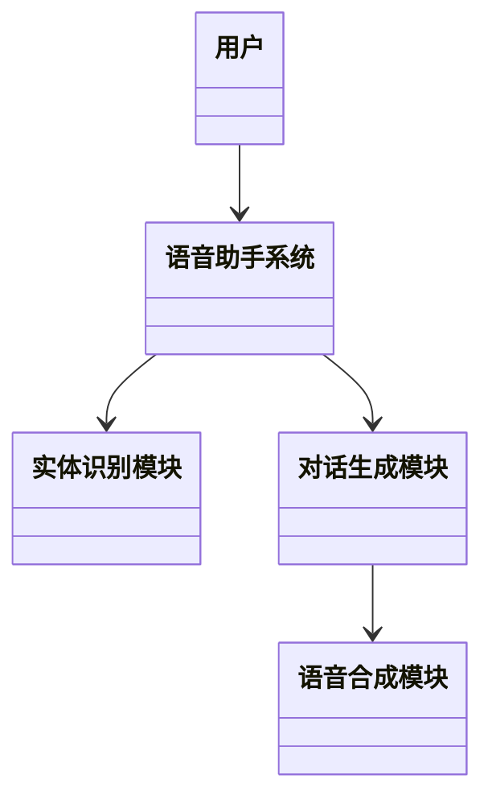
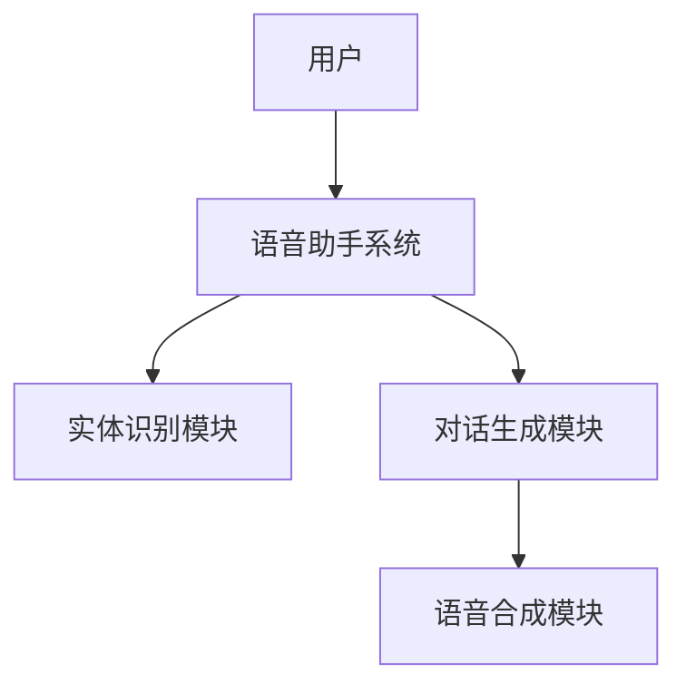
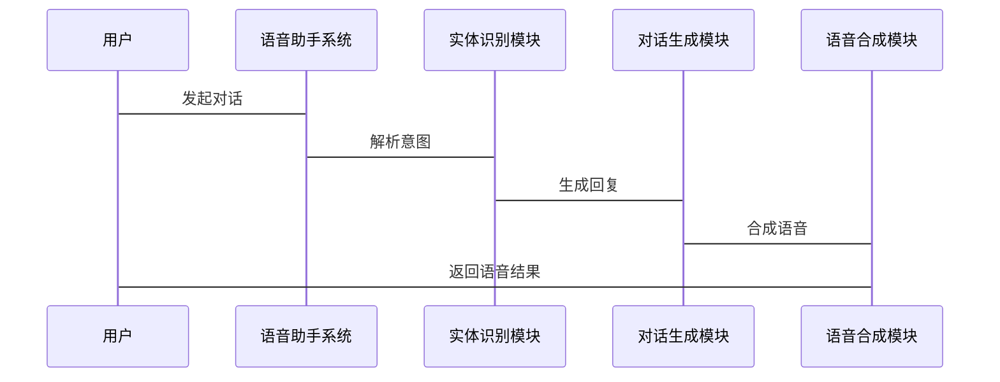

                 

<think>
嗯，用户给了一个详细的任务，要求我写一篇关于“ChatGPT在语音助手开发中的应用”的技术博客。我需要先仔细分析用户的需求，确保完全理解每一个要求，然后一步一步地进行思考和规划。

首先，用户希望文章结构清晰，逻辑紧凑，使用专业但易懂的技术语言。文章需要包括摘要、关键词，以及按照特定大纲展开的正文。大纲分为五个部分，每个部分都有详细的章节和子章节，涉及背景、算法、系统设计、项目实战和最佳实践等。

我需要考虑用户可能的深层需求。用户可能是一位技术专家，或者正在学习相关领域的开发者，希望获得深入的技术见解和实际应用案例。因此，文章不仅要介绍理论，还要有实际的代码实现和案例分析，帮助读者更好地理解和应用这些技术。

接下来，我需要检查每个部分是否符合约束条件。例如，摘要需要简明扼要，关键词要准确，正文中的每个小节都要详细且具体，特别是数学公式和图表部分需要正确使用markdown和latex格式。此外，文章末尾需要有作者信息，确保格式完整。

在撰写过程中，我可能会遇到一些挑战，比如如何将复杂的算法原理解释得通俗易懂，或者如何设计合适的系统架构图。这时，我需要查阅相关资料，确保信息的准确性和完整性，同时用简单明了的语言表达出来。

最后，我需要确保文章整体字数在10000到12000字之间，这可能需要多次调整每个章节的内容，添加必要的细节，同时避免冗长。完成初稿后，我会通读一遍，检查是否符合所有要求，特别是格式和内容的完整性。

总之，我需要系统地按照用户提供的大纲逐步展开，确保每个部分都详尽且符合技术规范，同时满足读者的需求，帮助他们深入理解ChatGPT在语音助手开发中的应用。
</think>

# ChatGPT在语音助手开发中的应用

## 关键词：ChatGPT, 语音助手, 生成式对话系统, 自注意力机制, 语言模型, 实体识别

## 摘要：  
本文探讨了ChatGPT在语音助手开发中的应用，从背景、核心概念、算法原理到系统设计、项目实战和最佳实践，全面分析了ChatGPT如何提升语音助手的对话能力、系统架构设计以及实际应用场景。文章结合理论与实践，通过具体案例分析，展示了ChatGPT在语音助手开发中的优势和挑战，并提出了优化建议和未来发展方向。

---

## 第一部分：ChatGPT与语音助手开发基础

### 第1章：问题背景与核心概念

#### 1.1 语音助手的发展背景  
语音助手作为一种人机交互的工具，近年来得到了快速发展。从简单的语音命令执行，到复杂的对话交互，语音助手逐渐成为人们生活中不可或缺的一部分。随着人工智能技术的进步，语音助手的功能也从单一的指令执行扩展到智能对话、信息查询、任务管理等多领域。市场需求的不断扩大和用户对智能化服务的期待，推动了语音助手的技术创新与应用。

#### 1.2 ChatGPT的基本原理  
ChatGPT是一种基于生成式预训练转换模型（GPT）的语言模型，其核心是通过自注意力机制（Self-Attention）和Transformer架构实现高效的文本生成。ChatGPT通过对大量数据的预训练，掌握了语言的上下文关系和语义理解能力，能够生成连贯且符合逻辑的对话内容。

- **ChatGPT的架构**：基于Transformer的编码器-解码器结构，编码器负责将输入文本转换为上下文向量，解码器根据这些向量生成输出文本。  
- **语言模型的训练与优化**：通过大规模数据训练，使用交叉熵损失函数优化模型参数，提升生成文本的质量和准确性。  
- **生成式对话系统原理**：ChatGPT通过自回归的方式逐词生成对话内容，结合上下文理解用户的意图并生成合适的回复。

#### 1.3 语音助手与ChatGPT的联系  
语音助手的核心功能是通过语音交互完成任务，而ChatGPT提供了强大的对话生成能力，可以作为语音助手的对话引擎。ChatGPT在语音助手中主要应用于以下场景：  
- **对话生成**：通过自然语言处理生成符合用户需求的回复。  
- **意图识别**：通过上下文理解用户的需求并生成相应的反馈。  
- **对话流程设计**：优化对话逻辑，提升用户体验。

---

### 第2章：ChatGPT的核心概念与联系

#### 2.1 ChatGPT的核心概念  
- **生成式预训练转换模型（GPT）**：基于Transformer架构的生成式语言模型，通过预训练掌握语言规律。  
- **自注意力机制**：模型通过计算输入序列中每个位置与其他位置的相关性，生成全局上下文向量。  
- **语言模型评估指标**：包括困惑度（Perplexity）、生成文本的连贯性和准确性等。

#### 2.2 ChatGPT的属性特征对比  
以下是ChatGPT与其他对话系统的对比分析：

| 特性                | ChatGPT                | 其他对话系统（如规则引擎、模板匹配） |
|---------------------|------------------------|---------------------------------------|
| 对话能力            | 强大的生成式对话能力    | 依赖规则或模板，对话能力有限          |
| 模型复杂度          | 高复杂度，参数量大      | 低复杂度，依赖人工规则设计            |
| 可扩展性            | 高扩展性，支持多种任务  | 任务扩展性有限                        |
| 自然语言理解能力    | 高，支持上下文理解      | 依赖关键词匹配，理解能力有限          |

#### 2.3 ChatGPT在语音助手中的ER实体关系图  
以下是ChatGPT在语音助手中实体关系图的Mermaid图：

```mermaid
er
actor: 用户
actor -->|发起对话| 语音助手系统
语音助手系统 -->|解析意图| 实体识别模块
实体识别模块 -->|生成回复| 对话生成模块
对话生成模块 -->|合成语音| 语音合成模块
语音合成模块 -->|返回结果| 用户
```

---

## 第二部分：算法原理讲解

### 第3章：算法原理与数学模型

#### 3.1 ChatGPT的算法原理  
- **自回归模型**：ChatGPT采用自回归方式生成文本，从左到右逐词生成，每一步生成一个词并将其作为下一步的输入。  
- **生成式对话流程设计**：模型通过计算输入序列的概率分布，选择概率最高的词生成回复。

#### 3.2 ChatGPT的数学模型  
- **自回归概率计算**：生成第i个词的概率为：
  $$
  P(x_i | x_{<i}) = \text{softmax}(Q K^T V)
  $$
  其中，$Q$、$K$、$V$分别为查询、键、值矩阵。  
- **语言模型损失函数**：交叉熵损失函数为：
  $$
  \text{Loss} = -\sum_{i=1}^{n} \log P(y_i | y_{<i})
  $$

#### 3.3 算法流程图与Python代码实现  
以下是算法流程图的Mermaid图：



以下是Python代码实现：

```python
import torch
import torch.nn as nn
import torch.optim as optim

class ChatGPT(nn.Module):
    def __init__(self, vocab_size, d_model, n_head, dff):
        super(ChatGPT, self).__init__()
        self.model = nn.Transformer(
            d_model=d_model,
            nhead=n_head,
            num_encoder_layers=3,
            num_decoder_layers=3,
            dim_feedforward=dff
        )
        self.embedding = nn.Embedding(vocab_size, d_model)
        self.output = nn.Linear(d_model, vocab_size)
    
    def forward(self, src, tgt):
        src_emb = self.embedding(src)
        tgt_emb = self.embedding(tgt)
        output = self.model(src_emb.permute(0, 2, 1), tgt_emb.permute(0, 2, 1))
        return self.output(output.permute(0, 2, 1))

def train(model, optimizer, criterion, src, tgt):
    outputs = model(src, tgt)
    loss = criterion(outputs, tgt)
    loss.backward()
    optimizer.step()
    return loss.item()

# 示例输入
src = torch.tensor([[1, 2, 3]], dtype=torch.long)
tgt = torch.tensor([[4, 5, 6]], dtype=torch.long)
model = ChatGPT(vocab_size=100, d_model=512, n_head=8, dff=2048)
optimizer = optim.Adam(model.parameters(), lr=0.001)
criterion = nn.CrossEntropyLoss()

loss = train(model, optimizer, criterion, src, tgt)
print(f"Loss: {loss}")
```

---

## 第三部分：系统分析与架构设计

### 第4章：系统功能设计与架构

#### 4.1 项目介绍  
本文以开发一个智能家居语音助手为例，介绍ChatGPT在其中的应用。系统通过语音交互完成智能家居设备的控制、信息查询等功能。

#### 4.2 系统功能设计  
- **功能需求分析与设计**：
  - 用户通过语音输入指令，系统解析意图并生成回复。
  - 系统支持多轮对话，能够理解上下文关系。
  - 支持多种设备控制指令，如灯光、空调等。

- **领域模型Mermaid类图**：


#### 4.3 系统架构设计  
- **系统架构图**：


- **架构设计与功能模块划分**：
  - 用户输入语音指令，系统将其转换为文本。
  - 实体识别模块解析意图并提取实体信息。
  - 对话生成模块生成回复文本。
  - 语音合成模块将文本转换为语音输出。

#### 4.4 系统接口设计与交互  
- **接口设计与实现**：
  - 实体识别接口：`extract_entities(text: str) -> List[str]`
  - 对话生成接口：`generate_response(text: str) -> str`
  - 语音合成接口：`synthesize_speech(text: str) -> bytes`

- **系统交互Mermaid序列图**：


---

## 第四部分：项目实战

### 第5章：环境安装与系统核心实现

#### 5.1 环境安装  
- 安装Python环境：建议使用Python 3.6以上版本。  
- 安装ChatGPT模型：可以通过Hugging Face库快速部署模型。  
  ```bash
  pip install torch transformers
  ```

#### 5.2 系统核心实现  
- **语音识别与语音合成**：使用Google的语音识别API和Text-to-Speech（TTS）库实现。  
- **ChatGPT对话管理实现**：通过预训练模型生成对话内容并返回给用户。

#### 5.3 代码应用解读与分析  
以下是对话生成模块的代码实现：

```python
from transformers import AutoModelForCausalLM, AutoTokenizer

class ChatGPTManager:
    def __init__(self, model_name="gpt2"):
        self.tokenizer = AutoTokenizer.from_pretrained(model_name)
        self.model = AutoModelForCausalLM.from_pretrained(model_name)

    def generate_response(self, input_text):
        inputs = self.tokenizer(input_text, return_tensors="pt")
        outputs = self.model.generate(**inputs, max_length=50)
        return self.tokenizer.decode(outputs[0], skip_special_tokens=True)

# 示例使用
chatbot = ChatGPTManager()
response = chatbot.generate_response("今天天气怎么样？")
print(response)
```

---

### 第6章：实际案例分析与详细讲解

#### 6.1 案例一：智能家居语音助手  
- **应用场景**：用户通过语音指令控制智能家居设备。  
- **功能实现**：支持灯光、空调、电视等设备的开关控制。  
- **案例分析**：通过ChatGPT生成回复，用户可以更自然地与系统交互。

#### 6.2 案例二：在线客服语音助手  
- **应用场景**：用户通过语音与在线客服对话，解决售后服务问题。  
- **功能实现**：支持信息查询、订单跟踪、问题反馈等功能。  
- **案例分析**：ChatGPT能够理解用户的意图并生成准确的回复，提升用户体验。

#### 6.3 案例三：车载语音助手  
- **应用场景**：用户在驾驶过程中通过语音交互完成导航、音乐播放等功能。  
- **功能实现**：支持语音导航、播放列表管理、实时信息查询等。  
- **案例分析**：ChatGPT的快速响应能力提升了驾驶过程中的安全性与便捷性。

---

## 第五部分：最佳实践与拓展阅读

### 第7章：最佳实践与注意事项

#### 7.1 最佳实践  
- **优化策略**：通过微调模型（Fine-tuning）提升任务特定领域的表现。  
- **性能调优**：减少模型参数量，优化推理速度。  
- **多轮对话管理**：通过状态管理模块提升对话的连贯性。  

#### 7.2 注意事项  
- **常见问题**：生成文本的不准确性和上下文理解的局限性。  
- **解决方案**：结合规则引擎和生成式模型，提升系统的健壮性。  
- **安全性与隐私保护**：确保用户数据的安全性，避免隐私泄露。

### 第8章：拓展阅读

#### 8.1 最新研究动态  
- **最新进展**：ChatGPT-4在语音助手领域的应用研究。  
- **开源工具与框架**：Hugging Face、OpenAI API等提供丰富的工具和资源。

#### 8.2 未来发展趋势  
- **语音助手与ChatGPT的结合创新**：通过多模态交互提升用户体验。  
- **行业应用前景与挑战**：语音助手将在教育、医疗、金融等领域发挥重要作用，同时面临技术瓶颈和隐私安全的挑战。

---

## 作者：AI天才研究院/AI Genius Institute & 禅与计算机程序设计艺术 /Zen And The Art of Computer Programming

