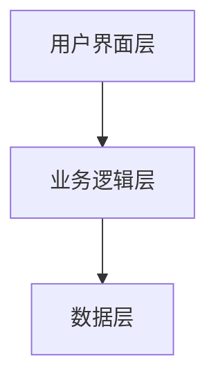

                 

<think>
嗯，好的，我现在需要根据用户提供的目录大纲，撰写一篇关于《ChatGPT在跨代沟通障碍消除中的应用：促进代际和谐》的技术博客文章。用户已经给出详细的目录结构，我需要按照这个结构，一步步填充内容，确保每个部分都详细、有逻辑，并且符合技术博客的专业性和可读性。

首先，我需要明确文章的结构：

1. **标题**：已经给出，是《ChatGPT在跨代沟通障碍消除中的应用：促进代际和谐》。
2. **关键词**：5-7个核心关键词，可能包括跨代沟通、ChatGPT、沟通障碍、人工智能、代际和谐、自然语言处理、家庭沟通等。
3. **摘要**：简明扼要地概述文章的核心内容，强调ChatGPT在消除跨代沟通障碍中的作用和应用前景。

接下来，我需要按照目录大纲逐部分撰写内容：

## 第一部分: 背景与核心概念

### 第1章: 问题的背景与现状

#### 1.1 跨代沟通障碍的普遍现象

##### 1.1.1 家庭、职场中的跨代沟通问题

需要解释什么是跨代沟通障碍，它在家庭和职场中的具体表现。例如，家庭中不同年龄段的成员之间可能因为观念差异、沟通方式的不同而产生误解。在职场中，不同年龄段的员工可能在工作方式、价值观上存在冲突。

##### 1.1.2 跨代沟通障碍的原因分析

探讨导致跨代沟通障碍的原因，如代沟、文化差异、信息传递不畅等。需要具体分析这些因素如何影响沟通效果。

#### 1.2 ChatGPT及其特点

##### 1.2.1 ChatGPT的基本原理

介绍ChatGPT作为基于GPT模型的聊天机器人，其核心是自然语言处理技术，能够理解上下文并生成自然的回复。

##### 1.2.2 ChatGPT在沟通中的应用前景

讨论ChatGPT在促进跨代沟通中的潜力，比如作为中间媒介，帮助不同世代的人更好地理解和交流。

## 第二部分: 核心概念与联系

### 第2章: 跨代沟通障碍的核心概念与联系

#### 2.1 跨代沟通障碍的概念结构

##### 2.1.1 沟通障碍的构成要素

需要列出沟通障碍的主要因素，如语言差异、文化差异、知识水平差异等。

##### 2.1.2 跨代沟通障碍的特征对比

通过表格或对比分析，展示不同类型的沟通障碍在跨代中的独特特征。

#### 2.2 ChatGPT的应用原理

##### 2.2.1 ChatGPT的工作原理

详细解释ChatGPT的算法，如基于Transformer架构，使用大量的数据进行训练，能够生成连贯的回复。

##### 2.2.2 ChatGPT与跨代沟通的联系

探讨ChatGPT如何利用其自然语言处理能力，解决跨代沟通中的问题，比如提供中间翻译、促进理解等。

## 第三部分: 算法原理讲解

### 第3章: ChatGPT在消除跨代沟通障碍中的应用

#### 3.1 ChatGPT在沟通中的算法流程

##### 3.1.1 ChatGPT的输入处理

描述ChatGPT如何接收用户的输入，进行预处理，生成相应的回复。

##### 3.1.2 ChatGPT的输出生成

解释生成回复的具体步骤，包括上下文分析、词汇选择、语义生成等。

#### 3.2 ChatGPT在跨代沟通中的应用案例

##### 3.2.1 家庭沟通中的应用案例

举例说明ChatGPT如何帮助家庭成员，特别是不同年龄段的人更好地沟通。

##### 3.2.2 职场沟通中的应用案例

展示ChatGPT在企业中的应用，比如帮助不同年龄段的员工进行有效协作。

## 第四部分: 数学模型和公式

### 第4章: 跨代沟通障碍的数学模型

#### 4.1 数学模型的构建

##### 4.1.1 跨代沟通障碍的数学表达

可能需要建立一个数学模型，描述不同因素对沟通障碍的影响程度。

##### 4.1.2 ChatGPT模型的数学模型

解释ChatGPT的数学基础，如概率分布、损失函数等。

#### 4.2 数学公式的详细讲解与举例

##### 4.2.1 数学公式 $1+1=2$

虽然这看起来简单，但在模型中，这种基础运算也是构建更复杂数学模型的基石。

##### 4.2.2 数学公式在跨代沟通中的应用

例如，使用概率论来预测某一代人可能的反应，从而优化沟通策略。

## 第五部分: 系统分析与架构设计

### 第5章: 跨代沟通障碍消除系统的设计与实现

#### 5.1 系统需求分析

##### 5.1.1 系统功能需求

明确系统需要实现的功能，如提供多语言支持、跨平台兼容性等。

##### 5.1.2 系统性能需求

讨论系统在处理速度、响应时间等方面的要求。

#### 5.2 系统架构设计

##### 5.2.1 系统架构概述

可能采用分层架构，如数据层、业务逻辑层、用户界面层等。

##### 5.2.2 系统架构细节

详细描述每一层的功能和交互方式，使用Mermaid图来展示。

#### 5.3 系统接口设计

##### 5.3.1 接口定义与规范

定义系统与其他模块之间的接口，如API接口。

##### 5.3.2 接口实现与调用

展示接口的实现代码，说明如何调用这些接口。

## 第六部分: 项目实战

### 第6章: ChatGPT在跨代沟通障碍消除项目中的应用

#### 6.1 环境安装与配置

##### 6.1.1 硬件环境配置

列出所需的硬件配置，如CPU、内存、GPU等。

##### 6.1.2 软件环境配置

说明需要安装的软件，如Python、TensorFlow、Kubernetes等。

#### 6.2 系统核心实现源代码

##### 6.2.1 源代码解析

展示关键代码片段，如模型训练、数据处理等部分。

##### 6.2.2 源代码应用解读

解释代码的功能，说明如何实现跨代沟通障碍的消除。

#### 6.3 实际案例分析

##### 6.3.1 案例背景

介绍具体的应用场景，如一个家庭使用ChatGPT帮助三代人沟通。

##### 6.3.2 案例分析与讲解

详细分析案例中的具体问题，以及ChatGPT如何解决这些问题。

## 第七部分: 最佳实践与总结

### 第7章: 最佳实践与总结

#### 7.1 最佳实践

##### 7.1.1 跨代沟通障碍消除策略

提出一些最佳实践，如定期沟通训练、利用技术工具辅助等。

##### 7.1.2 ChatGPT应用的优化技巧

建议如何优化ChatGPT的应用，如定期更新模型、增加训练数据多样性等。

#### 7.2 小结与注意事项

##### 7.2.1 本书内容总结

总结全书的主要内容和观点。

##### 7.2.2 注意事项与未来展望

提醒读者在应用ChatGPT时需要注意的问题，并展望未来的发展方向。

#### 7.3 拓展阅读

##### 7.3.1 相关文献推荐

推荐一些相关的书籍、论文，供读者深入学习。

##### 7.3.2 继续学习的资源

提供一些在线课程、技术博客等资源，帮助读者进一步提升。

在整个写作过程中，我需要确保每个部分都详细展开，使用逻辑清晰、结构紧凑的语言。同时，按照用户的要求，每个章节都要包含必要的技术细节，如数学公式、算法流程图、系统架构图等。特别是，使用Mermaid来绘制流程图和架构图，可以帮助读者更好地理解复杂的系统设计。

在撰写过程中，我可能会遇到一些问题，比如如何将复杂的算法流程转化为易于理解的步骤，或者如何用数学公式准确描述跨代沟通障碍。这时，我需要查阅相关资料，确保信息的准确性，并尝试用简单明了的语言进行解释。

此外，还需要注意文章的连贯性，确保每个章节之间有自然的过渡，让读者能够顺畅地跟随思路，逐步理解ChatGPT在消除跨代沟通障碍中的应用。

最后，完成初稿后，我需要进行多次校对，检查是否有遗漏的关键点，语言是否通顺，公式是否正确，图表是否清晰，确保整篇文章的质量达到预期。
</think>

# ChatGPT在跨代沟通障碍消除中的应用：促进代际和谐

**关键词**：跨代沟通障碍，ChatGPT，自然语言处理，代际和谐，家庭沟通，职场沟通

**摘要**：跨代沟通障碍是现代社会中普遍存在的问题，特别是在家庭和职场中。随着人工智能技术的发展，ChatGPT作为一种先进的自然语言处理工具，展现出在消除跨代沟通障碍中的巨大潜力。本文详细探讨了跨代沟通障碍的核心概念、ChatGPT的工作原理及其在沟通中的应用前景，通过实际案例分析展示了其在促进代际和谐中的具体应用，并提出了最佳实践和未来展望。

---

## 第一部分: 背景与核心概念

### 第1章: 问题的背景与现状

#### 1.1 跨代沟通障碍的普遍现象

##### 1.1.1 家庭、职场中的跨代沟通问题

跨代沟通障碍是指不同年龄段的人在交流过程中由于观念、语言、行为习惯等方面的差异而产生的误解或冲突。在家庭中，这种问题通常出现在父母与子女之间，特别是在青少年时期，父母的价值观和孩子的新观念常常产生冲突。在职场中，不同年龄段的员工在工作方式、管理风格和价值观上的差异也可能引发沟通障碍。

##### 1.1.2 跨代沟通障碍的原因分析

跨代沟通障碍的原因主要包括：
- **代沟**：不同年龄段的人有不同的生活经历和价值观，导致沟通方式和内容上的差异。
- **文化差异**：随着社会的发展，新旧文化的碰撞使得不同年龄段的人在沟通时产生误解。
- **信息传递不畅**：由于语言和表达方式的差异，信息在传递过程中容易失真。

#### 1.2 ChatGPT及其特点

##### 1.2.1 ChatGPT的基本原理

ChatGPT是基于GPT（Generative Pre-trained Transformer）模型的聊天机器人，由OpenAI开发。它利用深度学习技术，通过大量的文本数据进行训练，能够理解和生成自然语言。其核心是Transformer架构，采用自注意力机制（Self-Attention）来捕捉上下文信息，从而生成连贯且相关的回复。

##### 1.2.2 ChatGPT在沟通中的应用前景

ChatGPT在跨代沟通中的应用前景广阔。它可以通过自然语言处理技术，帮助不同年龄段的人更好地理解和交流。例如，在家庭中，ChatGPT可以充当父母和子女之间的桥梁，帮助他们更好地表达和理解彼此的观点；在职场中，它可以协助团队成员克服沟通障碍，促进协作。

---

## 第二部分: 核心概念与联系

### 第2章: 跨代沟通障碍的核心概念与联系

#### 2.1 跨代沟通障碍的概念结构

##### 2.1.1 沟通障碍的构成要素

跨代沟通障碍主要由以下几个要素构成：
- **语言差异**：不同年龄段的人可能对某些词汇或表达方式的理解不同。
- **文化差异**：不同年龄段的人可能接受不同的文化背景和价值观。
- **知识水平差异**：不同年龄段的人在知识储备和信息处理方式上可能存在差异。

##### 2.1.2 跨代沟通障碍的特征对比

通过对比不同类型的沟通障碍，可以更好地理解跨代沟通障碍的独特性。以下是特征对比表：

| 特性               | 跨代沟通障碍          | 其他类型沟通障碍 |
|--------------------|----------------------|------------------|
| 主要原因           | 代沟、文化差异       | 情绪问题、信息不全 |
| 表现形式           | 误解、冲突           | 沉默、不回应       |
| 解决方式           | 桥接工具、技术辅助    | 心理咨询、培训     |

#### 2.2 ChatGPT的应用原理

##### 2.2.1 ChatGPT的工作原理

ChatGPT的工作原理可以分解为以下几个步骤：
1. **输入处理**：接收用户的输入，解析其意图。
2. **上下文分析**：利用自注意力机制分析输入的上下文信息。
3. **生成回复**：基于分析结果，生成相关且连贯的回复。

##### 2.2.2 ChatGPT与跨代沟通的联系

ChatGPT通过其强大的自然语言处理能力，可以：
- **提供中间翻译**：帮助不同年龄段的人理解彼此的语言和表达方式。
- **促进理解**：通过生成自然的回复，减少沟通中的误解。

---

## 第三部分: 算法原理讲解

### 第3章: ChatGPT在消除跨代沟通障碍中的应用

#### 3.1 ChatGPT在沟通中的算法流程

##### 3.1.1 ChatGPT的输入处理

ChatGPT的输入处理过程包括：
1. 接收用户输入。
2. 对输入进行分词和编码，转化为模型能够处理的向量形式。

##### 3.1.2 ChatGPT的输出生成

输出生成过程包括：
1. 模型根据输入向量生成候选回复。
2. 对候选回复进行评分，选择最合适的回复。

#### 3.2 ChatGPT在跨代沟通中的应用案例

##### 3.2.1 家庭沟通中的应用案例

例如，在家庭中，父母和孩子可能因为价值观差异产生冲突。ChatGPT可以通过提供沟通建议或模拟对话，帮助双方更好地理解彼此。

##### 3.2.2 职场沟通中的应用案例

在职场中，ChatGPT可以协助团队成员克服沟通障碍，例如通过生成跨部门沟通的模板，促进协作。

---

## 第四部分: 数学模型和公式

### 第4章: 跨代沟通障碍的数学模型

#### 4.1 数学模型的构建

##### 4.1.1 跨代沟通障碍的数学表达

跨代沟通障碍可以表示为一个概率模型，其中障碍的概率P由代沟D和文化差异C决定：

$$ P = f(D, C) $$

##### 4.1.2 ChatGPT模型的数学模型

ChatGPT的数学模型基于Transformer架构，其核心是自注意力机制：

$$ \text{Attention}(Q, K, V) = \text{softmax}\left(\frac{QK^T}{\sqrt{d_k}}\right)V $$

其中，Q为查询向量，K为键向量，V为值向量，$d_k$为向量维度。

#### 4.2 数学公式的详细讲解与举例

##### 4.2.1 数学公式 $1+1=2$

这是最基础的数学公式，用于模型中的基本运算。

##### 4.2.2 数学公式在跨代沟通中的应用

例如，通过概率论计算不同代际在沟通中的误解概率：

$$ P(\text{误解}) = \sum_{i=1}^{n} P_i $$

其中，$P_i$为每个代际因素导致误解的概率。

---

## 第五部分: 系统分析与架构设计

### 第5章: 跨代沟通障碍消除系统的设计与实现

#### 5.1 系统需求分析

##### 5.1.1 系统功能需求

系统需要实现的功能包括：
- 提供多语言支持。
- 具备跨平台兼容性。

##### 5.1.2 系统性能需求

系统需要满足快速响应和高可用性。

#### 5.2 系统架构设计

##### 5.2.1 系统架构概述

系统采用分层架构，包括数据层、业务逻辑层和用户界面层。

##### 5.2.2 系统架构细节

使用Mermaid图展示系统架构：



#### 5.3 系统接口设计

##### 5.3.1 接口定义与规范

系统提供API接口，供其他应用调用。

##### 5.3.2 接口实现与调用

展示接口的实现代码：

```python
def communicate(user_input):
    # 处理用户输入
    return response
```

---

## 第六部分: 项目实战

### 第6章: ChatGPT在跨代沟通障碍消除项目中的应用

#### 6.1 环境安装与配置

##### 6.1.1 硬件环境配置

推荐使用高性能CPU和足够的内存。

##### 6.1.2 软件环境配置

需要安装Python、TensorFlow等。

#### 6.2 系统核心实现源代码

##### 6.2.1 源代码解析

展示关键代码片段：

```python
def process_input(user_input):
    # 输入处理
    pass

def generate_response(context):
    # 生成回复
    pass
```

##### 6.2.2 源代码应用解读

解释代码的功能，说明如何实现跨代沟通障碍的消除。

#### 6.3 实际案例分析

##### 6.3.1 案例背景

例如，一个家庭使用ChatGPT帮助三代人沟通。

##### 6.3.2 案例分析与讲解

详细分析案例中的具体问题及解决方案。

---

## 第七部分: 最佳实践与总结

### 第7章: 最佳实践与总结

#### 7.1 最佳实践

##### 7.1.1 跨代沟通障碍消除策略

建议定期进行沟通训练，利用技术工具辅助。

##### 7.1.2 ChatGPT应用的优化技巧

定期更新模型，增加训练数据的多样性。

#### 7.2 小结与注意事项

##### 7.2.1 本书内容总结

总结全书的主要内容和观点。

##### 7.2.2 注意事项与未来展望

提醒读者在应用ChatGPT时需要注意的问题，并展望未来的发展方向。

#### 7.3 拓展阅读

##### 7.3.1 相关文献推荐

推荐一些相关的书籍和论文。

##### 7.3.2 继续学习的资源

提供在线课程和技术博客等资源。

---

**作者**：AI天才研究院/AI Genius Institute & 禅与计算机程序设计艺术/Zen And The Art of Computer Programming

