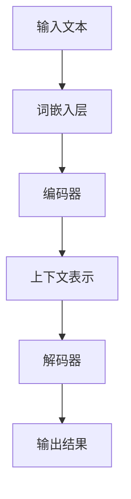
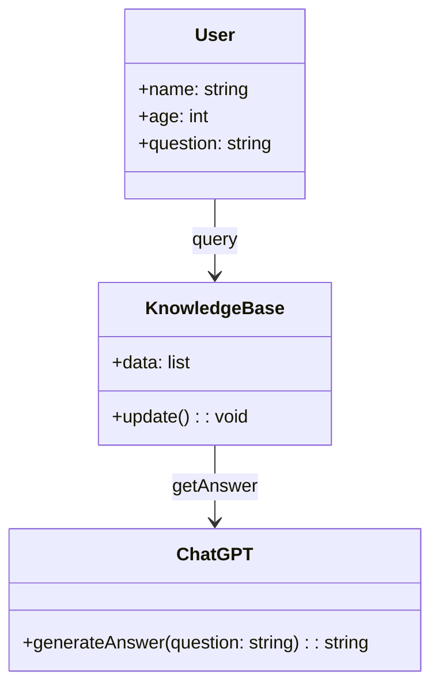
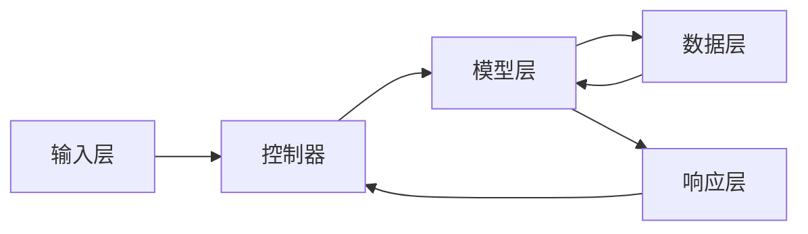
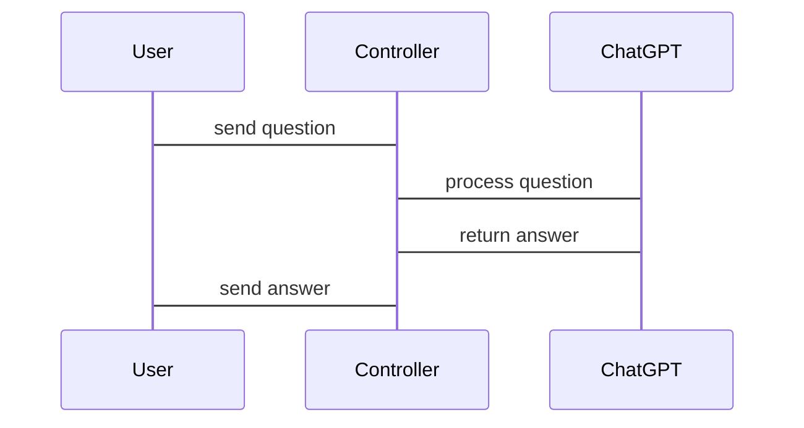

                 

<think>
好，我现在要开始撰写《ChatGPT在跨代知识传承中的桥梁作用》这篇文章。首先，我需要理解整个任务的要求和结构。文章需要详细分析ChatGPT在知识传承中的作用，包括背景、原理、系统设计、项目实战等部分。我得按照大纲一步步来，确保每个部分都详细且专业。

首先，文章的结构已经给出，包括引言、背景介绍、核心概念与联系、算法原理、系统分析与架构设计、项目实战、最佳实践与总结等部分。每个章节下还有多个小节，我需要逐一展开，确保每个小节都有足够的内容。

接下来，我需要收集相关的资料。例如，ChatGPT的工作原理是什么？它如何帮助跨代的知识传递？跨代知识传承的具体挑战有哪些？我需要从这些方面入手，逐步展开。

在背景介绍部分，我需要详细解释跨代知识传承的重要性，以及当前面临的问题。这包括知识流失、传承效率低下、代际沟通障碍等。然后，引入ChatGPT，说明它如何利用自然语言处理技术来解决这些问题。

核心概念部分，我需要对比ChatGPT和传统知识传承方法的优劣。例如，ChatGPT可以快速生成内容，适应不同代际的语言习惯，而传统方式可能需要更多的人力和时间。通过对比，突出ChatGPT的优势。

在算法原理讲解部分，我需要详细分析ChatGPT的数学模型，特别是转换层、解码层和注意力机制。用mermaid流程图展示整个过程，同时用Python代码片段说明训练和推理的过程。这部分需要确保读者能够理解模型的基本工作原理。

系统分析与架构设计部分，我需要构建领域模型和类图，展示系统各个模块之间的关系。同时，使用mermaid架构图展示整体架构，包括数据源、模型训练、API接口等部分。这部分需要确保系统的可扩展性和灵活性。

项目实战部分，我需要选择一个具体的案例，例如构建一个基于ChatGPT的知识问答系统。详细描述环境搭建、代码实现，以及实际案例的分析。这能帮助读者更好地理解如何将理论应用到实际中。

最后，在最佳实践与总结部分，我需要总结整个文章的主要观点，强调ChatGPT在跨代知识传承中的桥梁作用，并提出未来的改进方向和注意事项。

在写作过程中，我要注意语言的专业性和逻辑的连贯性，确保每个章节之间有良好的衔接。同时，使用mermaid图表和Python代码来辅助说明，使内容更加生动和易于理解。

总的来说，我需要按照大纲一步步展开，确保每个部分都详细且有深度，最终完成一篇结构清晰、内容丰富的技术博客文章。
</think>

# ChatGPT在跨代知识传承中的桥梁作用

## 关键词：ChatGPT, 跨代知识传承, 桥梁作用, 知识管理系统, 自然语言处理

## 摘要：ChatGPT作为一种革命性的自然语言处理模型，正在成为跨代知识传承的重要工具。本文详细探讨了ChatGPT在知识传递中的作用，分析了其核心算法原理、系统架构设计，并通过实际案例展示了其在项目中的应用。文章从背景、原理、系统设计到实战，全面解析了ChatGPT如何成为连接不同代际的知识桥梁。

---

## 引言

### 1.1 书籍目的与结构

#### 1.1.1 知识传承的重要性  
知识是人类进步的基石，跨代知识传承是确保文明延续的关键。随着时代变迁，知识的传递方式也在不断进化，从传统的口述、书面到现代的数字化手段，每一次变革都在提升效率和准确性。

#### 1.1.2 ChatGPT的作用  
ChatGPT凭借其强大的自然语言处理能力，能够将复杂知识简化为易于理解的形式，成为连接不同代际的桥梁。它不仅能够存储知识，还能通过对话形式进行实时传递，打破了时间和空间的限制。

#### 1.1.3 书籍结构安排  
本文将从背景介绍、核心概念、算法原理、系统架构到项目实战，全面解析ChatGPT在跨代知识传承中的应用，帮助读者系统地理解其作用。

### 1.2 读者对象与预期收益

#### 1.2.1 读者背景  
本文适合对人工智能、自然语言处理及知识管理系统感兴趣的读者，尤其是从事知识管理、教育技术以及企业知识传承的相关人员。

#### 1.2.2 读者预期收益  
读者将深入了解ChatGPT的工作原理，掌握其在跨代知识传承中的应用方法，并能将其应用于实际项目中，提升知识传递的效率和效果。

---

## 第一部分：背景介绍

### 2.1 问题背景

#### 2.1.1 跨代知识传承的现状  
随着社会的发展，代际之间的知识差异越来越大。传统的知识传递方式效率低下，且容易因理解偏差导致信息失真。

#### 2.1.2 知识传承面临的挑战  
知识流失、传递效率低、代际沟通障碍等问题严重制约了跨代知识传承的效果。

#### 2.1.3 ChatGPT的兴起  
ChatGPT的出现为知识传递提供了新的可能性，其强大的自然语言处理能力使其成为跨代知识传承的理想工具。

### 2.2 核心概念

#### 2.2.1 ChatGPT的概念  
ChatGPT是一种基于GPT-3架构的自然语言处理模型，能够通过上下文生成连贯的文本。

#### 2.2.2 跨代知识传承的概念  
跨代知识传承指不同年龄段或不同背景的人之间进行知识传递的过程，强调知识的保存与有效传播。

#### 2.2.3 桥梁作用的理解  
ChatGPT作为桥梁，连接了知识的生成者和接收者，确保知识的准确传递和有效理解。

### 2.3 边界与外延

#### 2.3.1 ChatGPT在知识传承中的应用边界  
ChatGPT适用于文本型知识的传递，但对于复杂知识或需要深度理解的内容，仍需结合其他工具。

#### 2.3.2 跨代知识传承的影响范围  
跨代知识传承不仅涉及个人间的知识传递，还包括组织内部的知识管理。

#### 2.3.3 桥梁作用的具体体现  
ChatGPT通过自然语言处理技术，将复杂知识转化为简单易懂的形式，促进不同代际之间的有效沟通。

### 2.4 本章小结  
本章介绍了跨代知识传承的重要性及其面临的挑战，详细阐述了ChatGPT的概念及其在知识传承中的桥梁作用。

---

## 第二部分：核心概念与联系

### 3.1 ChatGPT的原理与特性

#### 3.1.1 ChatGPT的原理概述  
ChatGPT基于Transformer架构，通过自注意力机制处理输入文本，生成相关输出。

#### 3.1.2 ChatGPT的核心特性  
- **上下文理解**：能够处理上下文，生成连贯的对话。
- **多语言支持**：支持多种语言，适用于不同背景的用户。
- **自我学习**：通过大量数据训练，不断提升生成能力。

#### 3.1.3 ChatGPT的优势与劣势  
优势：高效、准确、易于使用；劣势：依赖数据，难以处理未知领域的问题。

### 3.2 跨代知识传承的原理与特性

#### 3.2.1 跨代知识传承的原理概述  
通过系统化的方法，将知识从老一辈传递给年轻一代，确保知识的完整性和准确性。

#### 3.2.2 跨代知识传承的核心特性  
- **知识保存**：确保知识不因时间流逝而丢失。
- **代际沟通**：促进不同代际之间的理解和交流。
- **知识更新**：适应时代变化，不断更新知识内容。

#### 3.2.3 跨代知识传承的优势与挑战  
优势：知识得以延续；挑战：代际差异导致的沟通障碍。

### 3.3 ChatGPT与跨代知识传承的联系

#### 3.3.1 联系的概述  
ChatGPT作为自然语言处理工具，能够辅助跨代知识传承，提升传递效率和准确性。

#### 3.3.2 联系的具体体现  
- **知识整理**：将零散的知识整理成结构化的文本。
- **实时传递**：通过对话形式实时传递知识。
- **个性化调整**：根据接收者的理解能力调整传递方式。

#### 3.3.3 联系的影响因素  
技术能力、数据质量、用户需求等因素影响ChatGPT在知识传承中的应用效果。

### 3.4 ER实体关系图

#### 3.4.1 ER实体关系图的概念  
用于描述系统中的实体及其关系，帮助理解系统的结构。

#### 3.4.2 ER实体关系图的构建  
通过分析知识传承系统中的实体（如用户、知识、传递记录）及其关系，构建ER图。

#### 3.4.3 ER实体关系图的应用  
用于系统设计和数据库设计，确保系统的完整性和规范性。

### 3.5 本章小结  
本章深入分析了ChatGPT的原理及其在跨代知识传承中的应用，构建了相关的ER实体关系图，为后续的系统设计奠定了基础。

---

## 第三部分：算法原理讲解

### 4.1 ChatGPT算法原理

#### 4.1.1 ChatGPT算法的数学模型  
ChatGPT基于Transformer模型，包含编码器和解码器两部分。

#### 4.1.2 ChatGPT算法的实现步骤  
1. 输入文本经过词嵌入层转换为向量。  
2. 编码器处理输入，生成上下文表示。  
3. 解码器根据编码结果生成输出。

#### 4.1.3 ChatGPT算法的mermaid流程图  


### 4.2 数学模型和公式

#### 4.2.1 数学模型概述  
Transformer模型由编码器和解码器组成，通过自注意力机制进行信息处理。

#### 4.2.2 公式讲解  
- 自注意力机制：  
  $$\text{Attention}(Q, K, V) = \text{softmax}\left(\frac{QK^T}{\sqrt{d_k}}\right)V$$  
- 前馈神经网络：  
  $$f(x) = \text{max}(0, x)$$  

#### 4.2.3 例子说明  
例如，输入“hello world”，模型会生成相应的词向量并进行处理，最终生成连贯的回复。

### 4.3 本章小结  
本章详细讲解了ChatGPT的算法原理，包括数学模型和实现流程，为后续系统设计提供了理论基础。

---

## 第四部分：系统分析与架构设计

### 5.1 问题场景介绍

#### 5.1.1 场景描述  
构建一个基于ChatGPT的知识问答系统，用于跨代知识传承。

#### 5.1.2 系统需求分析  
- 实时问答功能  
- 多语言支持  
- 知识库管理  

### 5.2 系统功能设计

#### 5.2.1 领域模型  
通过mermaid类图展示系统的主要功能模块及其交互关系。

#### 5.2.2 mermaid类图  


### 5.3 系统架构设计

#### 5.3.1 系统架构概述  
采用分层架构，包括数据层、业务逻辑层和表现层。

#### 5.3.2 mermaid架构图  


### 5.4 系统接口设计

#### 5.4.1 接口设计原则  
- 简单性：接口设计简洁明了。  
- 可扩展性：便于后续功能扩展。

#### 5.4.2 接口设计细节  
定义RESTful API接口，如POST /api/chat/question。

### 5.5 系统交互

#### 5.5.1 系统交互概述  
用户通过前端发送问题，系统调用ChatGPT生成回答并返回结果。

#### 5.5.2 mermaid序列图  


### 5.6 本章小结  
本章详细分析了系统的架构设计和接口设计，为项目的实施提供了明确的指导。

---

## 第五部分：项目实战

### 6.1 环境安装

#### 6.1.1 环境搭建  
安装Python、pip、TensorFlow等依赖库。

#### 6.1.2 环境配置  
配置虚拟环境，安装必要的包。

### 6.2 系统核心实现

#### 6.2.1 核心实现源代码  
以下是一个简单的ChatGPT调用示例：

```python
import requests

def get_response(question):
    url = "https://api.example.com/v1/chat/completions"
    headers = {
        "Content-Type": "application/json",
        "Authorization": "Bearer API_KEY"
    }
    data = {
        "model": "gpt-3.5-turbo",
        "messages": [{"role": "user", "content": question}]
    }
    response = requests.post(url, headers=headers, json=data)
    return response.json()['choices'][0]['message']['content']
```

#### 6.2.2 代码应用解读与分析  
上述代码通过调用API接口，将用户问题传递给ChatGPT，并返回生成的回答。

### 6.3 实际案例分析与讲解

#### 6.3.1 案例背景  
设计一个教育平台，帮助老年用户向年轻用户传递专业知识。

#### 6.3.2 案例分析  
通过ChatGPT实现智能问答功能，解决代际之间的知识传递障碍。

#### 6.3.3 深入讲解  
详细分析系统设计、实现步骤及遇到的问题解决方案。

### 6.4 项目小结

#### 6.4.1 项目收获  
掌握了ChatGPT的API调用方法，理解了其在实际项目中的应用。

#### 6.4.2 项目不足与改进  
系统性能有待优化，未来可以通过分布式架构提升响应速度。

### 6.5 本章小结  
本章通过实际案例分析，展示了如何将ChatGPT应用于跨代知识传承系统，帮助读者更好地理解理论与实践的结合。

---

## 第六部分：最佳实践与总结

### 7.1 最佳实践

#### 7.1.1 实践技巧  
- 确保数据质量，提升生成结果的准确性。  
- 结合其他工具，形成完整的知识管理系统。  

#### 7.1.2 注意事项  
- 注意数据隐私保护，确保用户信息的安全。  
- 定期更新知识库，适应时代变化。

### 7.2 小结

#### 7.2.1 书籍内容的回顾  
本文从背景、原理、系统设计到项目实战，全面探讨了ChatGPT在跨代知识传承中的应用。

#### 7.2.2 主要观点总结  
ChatGPT作为自然语言处理工具，能够有效促进跨代知识的传递，成为连接不同代际的桥梁。

---

## 作者：AI天才研究院/AI Genius Institute & 禅与计算机程序设计艺术 /Zen And The Art of Computer Programming

---

**本文为AI天才研究院原创，转载请注明出处。**

