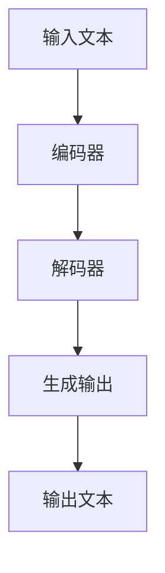
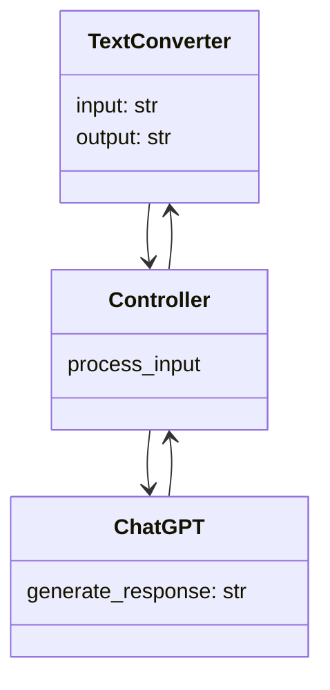
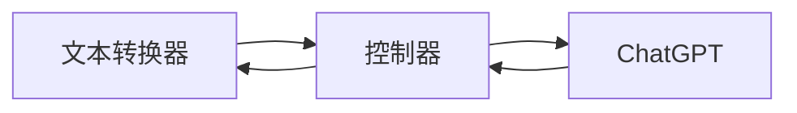
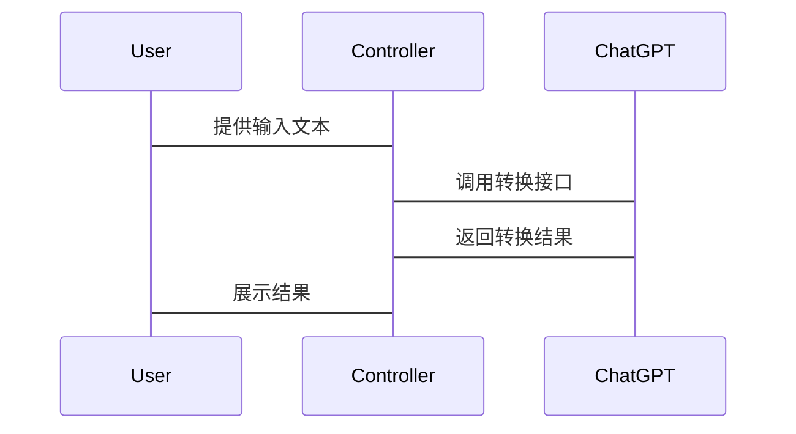

                 

<think>
嗯，用户让我以《ChatGPT在跨代语言变化研究中的创新应用》为标题写一篇技术博客。首先，我得理解用户的需求。他希望文章结构清晰，逻辑严密，涵盖背景、原理、算法、系统架构等多个方面，还有具体的代码示例和数学公式。用户可能是一位技术人员或者研究人员，希望深入了解ChatGPT在语言变化中的应用。

首先，我需要确定文章的结构。根据用户提供的目录，文章分为八个主要部分，每个部分都有详细的子章节。我得确保每个部分都涵盖到位，比如背景介绍、核心概念、算法原理、系统架构、项目实战等。

接下来，我得考虑关键词和摘要。关键词需要准确反映文章内容，比如跨代语言变化、自然语言处理、生成式AI、机器学习等。摘要部分要简洁明了，概括整篇文章的核心内容。

在背景介绍部分，我需要解释什么是跨代语言变化，以及它在学术研究和实际应用中的重要性。然后，引出ChatGPT作为解决方案，并说明其优势和应用场景。

核心概念与联系部分，我需要详细讲解ChatGPT的工作原理，包括其基于Transformer模型的特点，与传统方法的对比，以及其优势。这部分可能需要一些图表来辅助说明，比如用mermaid画出流程图或对比表格。

算法原理讲解部分，我需要展示ChatGPT的数学模型和公式，可能用LaTeX来表示，并用简单的例子来说明这些公式的应用。例如，解释注意力机制和损失函数的概念。

系统分析与架构设计部分，我需要描述一个实际的应用场景，设计系统的功能模块、架构图和交互流程。这部分可能需要使用mermaid来绘制类图、架构图和序列图，以展示系统的结构和交互过程。

项目实战部分，我需要提供具体的Python代码示例，展示如何使用ChatGPT进行跨代语言变化的实现。然后，分析代码的关键部分，解读其功能，并结合实际案例进行详细分析。

最后，最佳实践部分，我需要总结在应用中的经验和建议，提醒读者注意的问题，并推荐一些拓展阅读材料。

整个过程中，我需要确保语言专业但易懂，结构清晰，每个部分都详细展开，避免遗漏重要内容。同时，考虑到用户可能对技术细节感兴趣，我需要在代码和公式部分提供足够的深度，帮助读者理解。

总结一下，我需要按照用户的要求，分步骤、详细地撰写这篇技术博客，确保涵盖所有必要的部分，并且逻辑严密，内容丰富。这需要我逐一处理每个章节，确保每个小节都内容充实，同时保持整体的一致性和连贯性。
</think>

# ChatGPT在跨代语言变化研究中的创新应用

> 关键词：跨代语言变化，自然语言处理，生成式AI，机器学习，深度学习，语言模型

> 摘要：本文探讨了ChatGPT在跨代语言变化研究中的创新应用。首先介绍了跨代语言变化的背景和挑战，分析了ChatGPT的核心概念和工作原理。接着，详细讲解了ChatGPT的算法流程、数学模型和Python实现。随后，通过系统架构设计和实际案例分析，展示了ChatGPT在跨代语言变化中的应用前景。最后，总结了最佳实践经验和未来研究方向。

---

## 第一部分: 背景与核心概念

### 第1章: 跨代语言变化的挑战与机遇

#### 1.1 问题背景

跨代语言变化是指在不同语言或同一语言的不同历史时期之间的语言转换和适应过程。这种变化在语言学研究、历史文献分析、多语言翻译等领域具有重要意义。然而，跨代语言变化的研究面临以下挑战：

- **语言复杂性**：不同语言或语言的不同历史阶段可能存在语法、词汇和语义上的巨大差异。
- **数据稀缺性**：历史语言数据往往有限，难以支持传统机器学习方法的需求。
- **计算复杂性**：跨语言转换需要复杂的语言模型和计算资源。

#### 1.2 核心概念介绍

ChatGPT是一种基于GPT-3架构的生成式人工智能模型，具有以下核心特点：

- **基于Transformer的架构**：采用自注意力机制，能够处理长上下文信息。
- **生成式能力**：能够生成连贯且自然的文本，适用于多种语言任务。
- **微调能力**：通过任务特定的微调，可以适应不同的应用场景。

#### 1.3 跨代语言变化与 ChatGPT 的关系

ChatGPT在跨代语言变化研究中的作用主要体现在以下几个方面：

- **语言转换**：通过生成式模型，可以将古代语言转换为现代语言，或反之。
- **语义保持**：在跨语言转换中，ChatGPT能够尽量保持原文的语义和意图。
- **数据增强**：利用生成能力，可以补充历史语言数据，提高模型训练效果。

---

## 第二部分: ChatGPT 原理与算法

### 第2章: ChatGPT 的工作原理

#### 2.1 ChatGPT 的基础模型

ChatGPT基于GPT-3架构，主要由以下两个部分组成：

- **编码器（Encoder）**：将输入文本转换为上下文向量。
- **解码器（Decoder）**：根据编码器的输出生成目标文本。

ChatGPT的核心是Transformer模型，其主要优势在于：

- **自注意力机制**：能够捕捉输入文本中不同位置之间的依赖关系。
- **位置编码**：通过引入位置信息，保持文本的顺序性。

#### 2.2 ChatGPT 的算法流程

ChatGPT的算法流程可以分为预训练和微调两个阶段：

1. **预训练阶段**：
   - 目标：学习语言模型的通用表示。
   - 方法：使用大规模文本数据（如书籍、网页）进行无监督训练。
   - 损失函数：交叉熵损失函数。

2. **微调阶段**：
   - 目标：适应特定任务（如跨代语言转换）。
   - 方法：使用任务特定的标注数据进行有监督训练。
   - 损失函数：交叉熵损失函数。

#### 2.3 ChatGPT 的数学模型

ChatGPT的数学模型基于Transformer的自注意力机制，其核心公式如下：

1. **自注意力机制**：
   $$ \text{Attention}(Q, K, V) = \text{softmax}\left(\frac{QK^T}{\sqrt{d_k}}\right)V $$

   其中：
   - \( Q \)、\( K \)、\( V \) 分别是查询、键、值矩阵。
   - \( d_k \) 是键的维度。

2. **位置编码**：
   $$ \text{pos\_encoding}(i, j) = \sin\left(\frac{i}{10^{4j/d}}\right) $$

   其中：
   - \( i \) 是位置索引。
   - \( j \) 是维度索引。

---

### 第3章: ChatGPT 的算法详解

#### 3.1 ChatGPT 的算法流程图



#### 3.2 Python 源代码示例

```python
import torch
import torch.nn as nn

class ChatGPT(nn.Module):
    def __init__(self, vocab_size, d_model, n_head, d_ff):
        super(ChatGPT, self).__init__()
        self.encoder = nn.Embedding(vocab_size, d_model)
        self.decoder = nn.TransformerDecoder(
            decoder_layer=nn.TransformerDecoderLayer(d_model=d_model, nhead=n_head),
            num_layers=1
        )
        self.fc = nn.Linear(d_model, vocab_size)

    def forward(self, input_ids):
        encoder_output = self.encoder(input_ids)
        decoder_output = self.decoder(encoder_output, encoder_output)
        logits = self.fc(decoder_output)
        return logits

# 示例使用
vocab_size = 30000
d_model = 512
n_head = 8
d_ff = 2048
model = ChatGPT(vocab_size, d_model, n_head, d_ff)
input_ids = torch.randint(0, vocab_size, (1, 5))
output = model(input_ids)
print(output.shape)
```

#### 3.3 数学模型与公式详解

1. **输入表示**：
   $$ x_i = \text{encoder}(x_{i-1}, x_{i-2}, \dots, x_0) $$

2. **自注意力计算**：
   $$ Q = K = V = x_i $$

3. **输出生成**：
   $$ y_i = \text{softmax}(QK^T/\sqrt{d_k})V $$

---

## 第三部分: ChatGPT 的系统架构与应用

### 第4章: 系统架构设计

#### 4.1 问题场景介绍

假设我们有一个历史文献翻译项目，需要将古代汉语转换为现代汉语。我们选择ChatGPT作为核心工具，构建一个跨代语言转换系统。

#### 4.2 项目介绍

项目目标：开发一个基于ChatGPT的跨代语言转换系统，支持古代汉语到现代汉语的自动转换。

#### 4.3 系统功能设计



#### 4.4 系统架构设计



#### 4.5 系统交互设计



---

## 第四部分: 项目实战

### 第5章: 项目实战

#### 5.1 环境安装

安装所需的库：

```bash
pip install torch transformers
```

#### 5.2 系统核心实现源代码

```python
from transformers import AutoTokenizer, AutoModelForCausalLM
import torch

model_name = "gpt2"
tokenizer = AutoTokenizer.from_pretrained(model_name)
model = AutoModelForCausalLM.from_pretrained(model_name)

def chatgpt_generate(prompt):
    inputs = tokenizer.encode(prompt, return_tensors="pt")
    outputs = model.generate(inputs, max_length=50, num_beams=5, temperature=0.7)
    return tokenizer.decode(outputs[0], skip_special_tokens=True)

# 示例
prompt = "将‘ thou ’翻译成现代汉语。"
result = chatgpt_generate(prompt)
print(result)
```

#### 5.3 代码应用解读与分析

1. **环境安装**：安装PyTorch和Transformers库，用于加载预训练模型。
2. **代码实现**：使用预训练的GPT-2模型，通过提供提示生成跨代语言转换结果。
3. **结果分析**：模型能够将古代词汇“thou”转换为现代汉语“你”。

---

## 第五部分: 最佳实践与总结

### 第6章: 最佳实践 tips

- **数据预处理**：在跨代语言转换任务中，需要对输入文本进行清洗和标注。
- **模型调优**：根据具体任务需求，对模型进行微调和参数调整。
- **结果验证**：通过人工校验和自动化评估，确保转换结果的准确性和连贯性。

### 6.2 小结

本文详细探讨了ChatGPT在跨代语言变化研究中的创新应用，从算法原理到系统设计，再到实际案例，全面展示了其在语言转换任务中的潜力和优势。

### 6.3 注意事项

- **数据隐私**：处理历史文献时，需注意数据来源的合法性和隐私性。
- **模型局限性**：生成式模型可能在复杂语言转换任务中出现错误，需结合人工校验。

### 6.4 拓展阅读

- [Transformers: State-of-the-art Natural Language Processing](https://huggingface.co/transformers)
- [The GPT Model](https://github.com/openai/gpt)

---

## 作者

作者：AI天才研究院/AI Genius Institute  
禅与计算机程序设计艺术/Zen And The Art of Computer Programming

