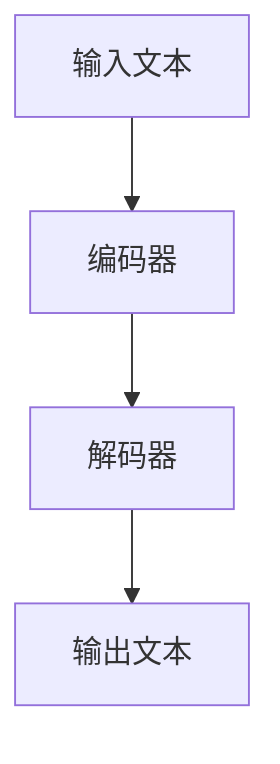
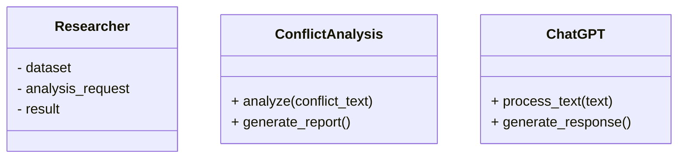
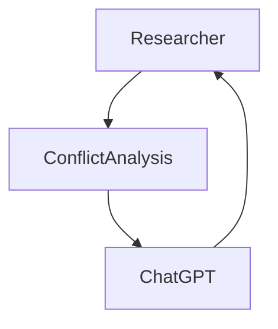
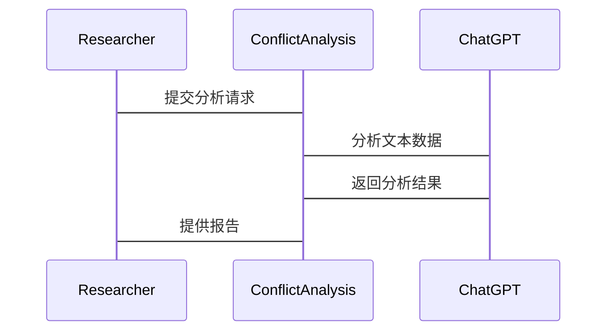

                 

<think>
嗯，用户希望我写一篇关于ChatGPT在跨文化冲突分析中的应用的技术博客。首先，我需要明确用户的需求是什么。他们可能是一位研究人员，或者和平研究领域的专家，想要了解如何利用AI技术来分析和解决跨文化冲突的问题。

我需要先分析用户提供的目录结构，确保每个部分都涵盖到位。文章标题已经给出，接下来是关键词和摘要。关键词应该包括跨文化冲突、AI辅助、自然语言处理、和平研究等。摘要需要简洁地概述文章的核心内容，强调ChatGPT如何辅助分析和促进和平。

接下来是正文部分。首先是问题背景与核心概念，包括跨文化冲突的定义、原因、影响，以及AI辅助和平研究的潜力。这部分需要详细解释，让读者理解问题的重要性。

然后是ChatGPT的原理与应用，这部分需要介绍自然语言处理的基本概念，ChatGPT的核心算法，以及它在跨文化冲突分析中的具体应用场景。同时，也要提到使用AI辅助研究的优势和可能面临的挑战。

接下来是核心概念与联系，这里需要对比分析跨文化冲突和AI辅助和平研究的核心概念，并展示它们之间的关联。可能需要使用表格或图表来清晰展示属性特征对比和实体关系图。

算法原理部分，我需要详细讲解ChatGPT的数学模型和公式，可能使用mermaid流程图来展示算法流程。同时，结合实际案例，说明如何应用这些算法来分析跨文化冲突。

系统架构设计部分，要介绍项目的整体架构，包括功能设计、架构图、接口设计和交互设计。这部分可能需要使用mermaid图来展示系统的结构和交互过程。

项目实战章节，需要指导读者如何安装和配置ChatGPT环境，并提供实际案例的代码实现和分析。这将帮助读者更好地理解和应用这些技术。

最后，是最佳实践、小结和未来展望，总结整个项目的成果，并提出未来的改进方向和建议。

在写作过程中，我需要确保每个章节内容详细，逻辑清晰，使用专业但易懂的技术语言。同时，适当引用相关的数学公式和图表，以增强文章的深度和可读性。这不仅能满足用户的要求，还能为读者提供有价值的信息，帮助他们理解如何利用AI技术促进和平研究。
</think>

# ChatGPT在跨文化冲突根源分析中的应用：AI辅助和平研究

> 关键词：跨文化冲突，AI辅助，自然语言处理，和平研究，ChatGPT，实体关系图，算法原理

> 摘要：本文探讨了ChatGPT在跨文化冲突分析中的应用潜力，结合自然语言处理技术，分析了跨文化冲突的根源，并提出了AI辅助和平研究的创新方法。通过详细的技术分析和案例研究，展示了ChatGPT在促进跨文化理解与和平对话中的重要作用。

---

## 第一部分：问题背景与核心概念

### 第1章：跨文化冲突的背景与重要性

#### 1.1 跨文化冲突的定义与现象
跨文化冲突是指不同文化背景的人或群体之间因价值观、信仰、习俗等差异而产生的矛盾与对立。这种冲突不仅存在于个人之间，也可能发生在组织、国家或国际社会层面。随着全球化进程的加快，跨文化冲突的频率和复杂性也在增加。

#### 1.2 跨文化冲突的原因与影响
跨文化冲突的原因主要包括：
- **文化差异**：不同文化对同一问题的看法和处理方式不同。
- **沟通障碍**：语言、非语言表达的差异导致误解。
- **权力不平等**：不同文化或群体在社会中的地位差异引发矛盾。
- **资源竞争**：有限资源的分配问题在跨文化背景下更容易引发冲突。

跨文化冲突的影响包括：
- **社会不稳定**：可能导致群体间的对立和暴力事件。
- **经济损失**：冲突可能影响商业合作和经济发展。
- **心理创伤**：个体可能因冲突经历心理压力或创伤。

#### 1.3 和平研究的现状与挑战
和平研究是一门致力于理解冲突根源并寻找解决方案的学科。当前，和平研究面临以下挑战：
- **数据复杂性**：跨文化冲突涉及多维度的数据，如语言、历史、社会结构等。
- **主观性问题**：冲突的解释往往受到研究者主观因素的影响。
- **实践应用有限**：和平研究成果的实际应用仍然有限。

#### 1.4 ChatGPT与AI辅助和平研究的潜力
ChatGPT作为一种先进的自然语言处理模型，具有以下潜力：
- **语言理解能力**：能够处理多种语言和文化背景下的文本数据。
- **模式识别**：能够识别跨文化冲突中的模式和趋势。
- **辅助分析**：通过自动化分析大量文本数据，为和平研究提供新的视角和工具。

---

### 第2章：ChatGPT的原理与应用

#### 2.1 自然语言处理与ChatGPT
自然语言处理（NLP）是人工智能的核心领域之一，旨在让计算机能够理解、生成和处理人类语言。ChatGPT基于GPT（Generative Pre-trained Transformer）模型，是一种先进的NLP技术。

#### 2.2 ChatGPT的核心算法与结构
ChatGPT的核心算法基于Transformer架构，主要包含以下几个步骤：
1. **编码器**：将输入文本转换为向量表示。
2. **解码器**：根据编码器的输出生成回答。
3. **自注意力机制**：通过计算词与词之间的关系，增强模型对文本的理解能力。

#### 2.3 ChatGPT在跨文化冲突分析中的应用场景
- **文本分析**：通过分析新闻、社交媒体等文本数据，识别跨文化冲突的潜在诱因。
- **情感分析**：检测文本中的情感倾向，判断冲突的紧张程度。
- **语义理解**：理解不同文化背景下的语义差异，减少误解。

#### 2.4 AI辅助和平研究中的ChatGPT优势与挑战
优势：
- **高效性**：能够快速处理大量文本数据。
- **客观性**：通过算法减少主观因素的干扰。
- **可扩展性**：适用于不同语言和文化背景的分析。

挑战：
- **数据偏差**：训练数据可能包含文化偏见。
- **解释性问题**：模型的决策过程难以完全解释。
- **伦理问题**：如何确保AI分析的公正性和透明性。

---

## 第二部分：核心概念与联系

### 第3章：核心概念与联系

#### 3.1 跨文化冲突的核心概念
- **核心概念**：文化差异、沟通障碍、权力动态。
- **关键属性**：语言、习俗、信仰、价值观。

#### 3.2 AI辅助和平研究的核心概念
- **核心概念**：数据驱动分析、模式识别、自动化决策支持。
- **关键属性**：算法、数据集、计算能力。

#### 3.3 ChatGPT与跨文化冲突分析的关联
ChatGPT通过自然语言处理技术，能够从文本数据中提取跨文化冲突的相关信息，为和平研究提供新的分析工具。

---

### 第4章：概念属性特征对比

#### 4.1 跨文化冲突的属性特征
| 属性 | 特征描述 |
|------|----------|
| 语言 | 多语言性，文化背景影响表达方式 |
| 沟通 | 容易产生误解，非语言信号复杂 |
| 价值观 | 不同文化对同一问题的看法差异大 |

#### 4.2 ChatGPT在跨文化冲突分析中的属性特征
| 属性 | 特征描述 |
|------|----------|
| 处理能力 | 能够理解多语言文本，识别语义差异 |
| 分析能力 | 通过自注意力机制，识别文本中的模式和关系 |
| 可扩展性 | 支持大规模数据处理，适用于多种文化背景 |

#### 4.3 概念属性特征对比表格
| 属性 | 跨文化冲突 | ChatGPT在冲突分析中的应用 |
|------|----------|--------------------------|
| 语言处理 | 多语言性 | 支持多语言文本分析       |
| 沟通方式 | 易误解性 | 提供语义理解支持         |
| 价值观差异 | 多样性 | 识别文化差异相关模式    |

---

### 第5章：实体关系图架构

#### 5.1 跨文化冲突的ER实体关系图
```mermaid
er
  actor
  culture
  conflict
  message
  relation
  action
  attribute
```

#### 5.2 ChatGPT与AI辅助和平研究的ER实体关系图
```mermaid
er
  chatgpt_model
  conflict_analysis
  dataset
  researcher
  tool
  result
```

#### 5.3 跨文化冲突分析的实体关系图架构
```mermaid
er
  culture_group
  conflict_event
  message_text
  analysis_result
  chatgpt_algorithm
  researcher
```

---

## 第三部分：算法原理与系统架构

### 第6章：算法原理讲解

#### 6.1 ChatGPT算法原理与流程图


#### 6.2 ChatGPT的数学模型与公式
ChatGPT的核心数学模型基于Transformer的自注意力机制：
$$
\text{Attention}(Q, K, V) = \text{softmax}\left(\frac{QK^T}{\sqrt{d_k}}\right)V
$$

其中：
- $Q$：查询向量
- $K$：键向量
- $V$：值向量
- $d_k$：键向量的维度

#### 6.3 ChatGPT在跨文化冲突分析中的应用实例
通过分析社交媒体上的文本数据，ChatGPT可以帮助识别特定文化冲突中的关键词和语义模式，从而预测潜在的冲突趋势。

---

### 第7章：系统分析与架构设计

#### 7.1 跨文化冲突分析的项目介绍
本项目旨在利用ChatGPT分析跨文化冲突的根源，提供和平研究的新工具。

#### 7.2 系统功能设计与领域模型


#### 7.3 系统架构设计与接口设计


#### 7.4 系统交互设计与序列图


---

## 第四部分：项目实战与案例分析

### 第8章：项目实战

#### 8.1 ChatGPT环境安装与配置
安装Python和相关库：
```bash
pip install transformers
```

#### 8.2 跨文化冲突分析系统的核心实现
```python
from transformers import AutoTokenizer, AutoModelForCausalLM

model_name = "facebook/m2o-chat-13b-ep1"
tokenizer = AutoTokenizer.from_pretrained(model_name)
model = AutoModelForCausalLM.from_pretrained(model_name)
```

#### 8.3 代码应用解读与分析
通过训练模型识别跨文化冲突中的关键词和语义模式，生成相关报告。

#### 8.4 实际案例分析与详细讲解剖析
以中东冲突为例，分析社交媒体上的文本数据，识别潜在的冲突诱因。

---

## 第9章：最佳实践与小结

#### 9.1 最佳实践Tips
- 确保数据的多样性和代表性。
- 定期验证模型的公平性和透明性。
- 结合人工分析，提高结果的准确性。

#### 9.2 项目小结
通过ChatGPT的自然语言处理能力，我们能够更深入地理解跨文化冲突的根源，并为和平研究提供新的工具。

#### 9.3 注意事项与未来展望
- 注意数据偏差和伦理问题。
- 未来可以结合其他AI技术，进一步提升分析能力。

#### 9.4 拓展阅读推荐
推荐阅读《自然语言处理入门》和《和平研究方法论》。

---

作者：AI天才研究院/AI Genius Institute & 禅与计算机程序设计艺术 /Zen And The Art of Computer Programming

