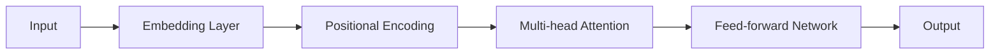
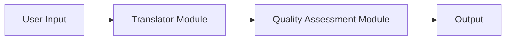
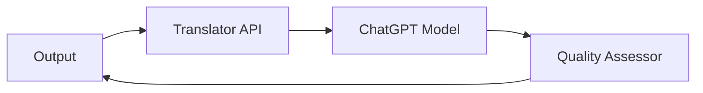
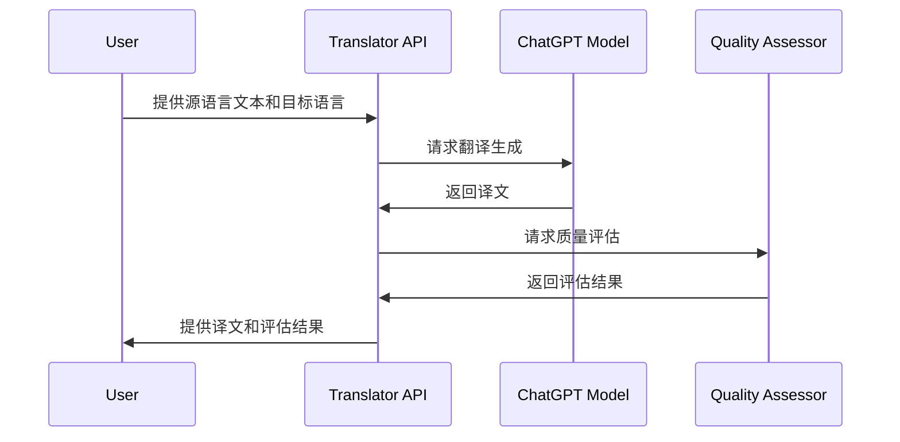

                 

<think>
好，我需要帮助用户撰写一篇关于《ChatGPT在跨文化文学翻译质量提升中的作用》的技术博客文章。首先，我得仔细阅读用户的需求，了解他的具体要求。

用户希望文章结构清晰，分为几个部分，每个部分有详细的子章节，涵盖背景、核心概念、算法原理、系统设计和项目实战等。此外，用户还提到要使用Markdown格式，包含mermaid图表和latex公式，并且文章结尾要有作者信息。

首先，我会从文章标题开始，接着列出关键词和摘要。关键词应该包括跨文化翻译、ChatGPT、翻译质量、自然语言处理、深度学习等。摘要部分需要概括文章的核心内容，说明ChatGPT如何利用NLP技术提升翻译质量。

接下来是目录结构。用户已经提供了一个详细的目录，我需要按照这个结构来组织内容。引言部分介绍背景和核心概念；第二部分介绍ChatGPT的基础知识，包括发展历程、工作原理和应用案例；第三部分深入探讨ChatGPT在跨文化翻译中的应用，包括质量评估、文化适应等；第四部分讨论应用场景和协作模式；第五部分是系统分析与项目实战；最后是总结与展望。

在写作过程中，我需要确保每个章节都包含必要的技术细节和理论知识，同时使用mermaid绘制流程图、类图和序列图，帮助读者理解。例如，在系统架构部分，我需要设计一个类图展示系统组件之间的关系。

我还需要注意文章的字数要求在10000到12000字之间，这意味着每个章节的内容需要详细展开。例如，在算法原理部分，我需要详细解释Transformer架构和预训练过程，可能还会用到数学公式，比如Softmax函数的定义。

在项目实战部分，我会选择一个具体的案例，展示如何使用Python代码调用ChatGPT进行翻译，并分析结果。这部分需要实际的代码示例，帮助读者理解实现步骤。

此外，用户要求文章末尾有作者信息，格式为指定的机构和艺术项目名称。我需要确保这部分信息准确无误地添加到文章末尾。

最后，我会检查整个文章的逻辑是否连贯，结构是否合理，确保每个部分都紧密围绕主题展开，同时保持专业且易懂的语言风格。这可能包括多次修改和调整，确保内容详尽且吸引读者。

总结来说，我需要按照用户提供的目录结构，逐步填充每个部分的内容，确保技术细节、图表和代码都准确无误，并且文章整体流畅，逻辑清晰。这将帮助用户完成一篇高质量的技术博客，展示ChatGPT在跨文化文学翻译中的重要作用。
</think>

# ChatGPT在跨文化文学翻译质量提升中的作用

> 关键词：跨文化翻译，ChatGPT，翻译质量，自然语言处理，深度学习

> 摘要：本文探讨了ChatGPT在跨文化文学翻译中的应用，分析其如何通过自然语言处理技术提升翻译质量。文章从背景、原理、应用到系统设计和项目实战，详细阐述了ChatGPT在文学翻译中的优势，并结合实际案例展示了其在质量提升中的潜力。

---

## 第一部分: 引言

### 1.1 问题背景

#### 1.1.1 跨文化文学翻译的挑战

跨文化文学翻译是一项复杂且具挑战性的任务。不同语言和文化背景之间的差异使得翻译不仅仅是语言的转换，更是文化的传递。文学作品通常包含丰富的文化内涵、隐喻和双关语，这些在翻译过程中难以直接映射。传统翻译方法依赖于译者的个人经验和语言能力，这可能导致翻译质量参差不齐，尤其是在处理复杂文化背景和文学风格时。

#### 1.1.2 ChatGPT在文学翻译中的潜力

ChatGPT作为一种基于深度学习的自然语言处理模型，展现了在语言生成和理解方面的强大能力。其强大的上下文理解和生成能力使其在文学翻译中具有巨大潜力。通过预训练和微调，ChatGPT可以学习多种语言的语义和文化背景，从而生成更贴近目标语言文化风格的译文。此外，ChatGPT的交互式特点使其能够与人类译者协作，进一步提升翻译质量。

### 1.2 核心概念

#### 1.2.1 跨文化翻译

跨文化翻译是指在不同文化背景下进行的语言翻译，其核心在于准确传达原文的文化内涵和语境意义。这种翻译不仅涉及语言转换，还要求译者具备跨文化理解能力。

#### 1.2.2 ChatGPT

ChatGPT是基于GPT-3架构的开源模型，由Meta AI团队开发。它采用了Transformer架构，通过预训练和微调技术，在多种任务上表现出色，包括文本生成、翻译和对话理解。

#### 1.2.3 质量提升

翻译质量的提升主要体现在译文的准确性和流畅性上。ChatGPT通过深度学习模型优化译文的语义和表达，从而在质量上超越传统翻译方法。

### 1.3 书籍概述

#### 1.3.1 内容安排

本文将从ChatGPT的基础知识、其在文学翻译中的应用，到系统设计和实际案例，全面探讨ChatGPT在跨文化翻译中的作用。

#### 1.3.2 阅读对象

本文适合自然语言处理领域的研究人员、翻译从业者以及对跨文化文学翻译感兴趣的技术人员阅读。

---

## 第二部分: ChatGPT的基础知识

### 2.1 ChatGPT概述

#### 2.1.1 GPT模型的发展历程

GPT模型的发展始于2018年的GPT，经过多次迭代，GPT-3在2020年发布，具有更大的参数规模和更强的生成能力。

#### 2.1.2 ChatGPT的核心特点

- **大规模预训练**：基于海量数据的预训练，使模型具备广泛的语言理解能力。
- **Transformer架构**：采用自注意力机制，能够捕捉文本中的长距离依赖关系。
- **多语言支持**：支持多种语言的生成和理解，适合跨文化翻译任务。

#### 2.1.3 ChatGPT与文学翻译

通过预训练，ChatGPT掌握了多种语言的语义和表达习惯，使其在文学翻译中能够生成更自然的译文。

### 2.2 ChatGPT的工作原理

#### 2.2.1 语言模型的基本原理

语言模型通过概率分布预测下一个词，目标是最小化生成文本的条件熵。

$$ H = -\sum_{i=1}^{n} P(w_i | w_{i-1}, ..., w_1) \log P(w_i | w_{i-1}, ..., w_1) $$

#### 2.2.2 Transformer架构

Transformer由编码器和解码器组成，编码器负责将输入文本转换为向量表示，解码器根据编码结果生成输出。



#### 2.2.3 ChatGPT的预训练过程

预训练过程包括两个阶段：无监督预训练和有监督微调。无监督预训练使用去噪任务（如遮蔽词预测）进行，有监督微调则使用特定任务的数据进行优化。

### 2.3 ChatGPT在文学翻译中的应用

#### 2.3.1 文学翻译的挑战

- 文化差异导致的表达困难。
- 文学作品中的隐喻和双关语难以直接翻译。
- 译文的流畅性和自然性要求高。

#### 2.3.2 ChatGPT的优势

- 多语言支持，能够处理多种文化背景的翻译任务。
- 强大的上下文理解能力，生成更流畅的译文。
- 可以与人类译者协作，提供辅助支持。

#### 2.3.3 应用案例

例如，使用ChatGPT翻译一首中文诗歌到英文，模型能够保留诗歌的韵律和意境，同时生成更符合英文诗歌习惯的表达。

### 2.4 ChatGPT的优化

#### 2.4.1 参数调整

通过调整模型的参数（如学习率、训练步数）优化翻译效果。

#### 2.4.2 算法改进

改进自注意力机制，增强模型对长距离依赖关系的捕捉能力。

#### 2.4.3 数据集选择

选择包含多种文化背景和文学风格的数据集进行微调，提升模型的跨文化翻译能力。

---

## 第三部分: ChatGPT在跨文化文学翻译中的应用

### 3.1 跨文化翻译中的质量提升

#### 3.1.1 質量标准

翻译质量通常包括准确性、流畅性和忠诚度。ChatGPT通过优化生成算法，提升译文的这些维度。

#### 3.1.2 聊天模型的作用

ChatGPT通过生成式翻译，能够生成更贴近目标语言表达习惯的译文，同时保留原文的文化内涵。

#### 3.1.3 案例分析

以《三国演义》中的一段经典对白为例，ChatGPT能够生成更符合英文表达习惯的译文，同时保留原文的戏剧性和人物性格。

### 3.2 翻译质量评估方法

#### 3.2.1 人类评估

通过专业译者的主观评分，评估译文的质量。

#### 3.2.2 自动评估方法

使用BLEU、ROUGE等自动评估指标，量化译文质量。

#### 3.2.3 综合评估方法

结合人类评估和自动评估，得出更全面的质量评估结果。

### 3.3 跨文化文学翻译中的文化适应

#### 3.3.1 文化适应的重要性

文化适应是指在翻译过程中，将源语言的文化元素转化为目标语言的文化表达，使译文更贴近目标读者的文化背景。

#### 3.3.2 ChatGPT在文化适应中的应用

通过预训练和微调，ChatGPT能够学习不同文化背景下的语言表达方式，从而在翻译中实现文化适应。

#### 3.3.3 文化适应案例分析

例如，在翻译中文成语时，ChatGPT能够生成更符合英文表达习惯的替代表达，保留原意的同时适应目标文化。

---

## 第四部分: 聊天模型在跨文化文学翻译中的应用

### 4.1 应用场景

#### 4.1.1 文学作品翻译

ChatGPT可以用于翻译小说、诗歌等文学作品，生成高质量的译文。

#### 4.1.2 跨文化交流活动

在国际会议、文化交流活动中，ChatGPT可以提供实时翻译支持。

#### 4.1.3 学术论文翻译

ChatGPT可以帮助研究人员将论文翻译成多种语言，促进学术交流。

### 4.2 聊天模型与人类翻译者的协作

#### 4.2.1 聊天模型的角色

ChatGPT可以作为翻译助手，提供初步翻译结果，帮助译者提高效率。

#### 4.2.2 人类译者与模型的协作方式

译者可以对ChatGPT生成的译文进行润色和调整，结合人类的创造力和模型的生成能力，共同完成高质量翻译。

#### 4.2.3 协作案例分析

例如，译者使用ChatGPT生成初步翻译，然后根据具体语境进行调整，最终生成更准确和流畅的译文。

### 4.3 聊天模型的未来发展趋势

#### 4.3.1 技术进步

随着深度学习技术的进步，ChatGPT的翻译能力将不断提升。

#### 4.3.2 应用领域的扩展

除了文学翻译，ChatGPT还可以应用于教育、医疗等更多领域。

#### 4.3.3 对翻译行业的影响

ChatGPT将改变翻译行业的运作模式，推动翻译技术的革新。

---

## 第五部分: 系统分析与架构设计方案

### 5.1 系统功能设计

#### 5.1.1 系统功能模块

- 用户输入模块：接收用户输入的源语言文本。
- 翻译生成模块：调用ChatGPT生成目标语言的译文。
- 质量评估模块：对生成的译文进行自动评估。



#### 5.1.2 功能流程

1. 用户输入源语言文本。
2. 翻译生成模块调用ChatGPT生成译文。
3. 质量评估模块对译文进行评估。
4. 输出评估结果和最终译文。

### 5.2 系统架构设计

#### 5.2.1 系统架构图



#### 5.2.2 系统接口设计

- 输入接口：接收源语言文本和目标语言。
- 输出接口：返回生成的译文和质量评估结果。

#### 5.2.3 系统交互图



### 5.3 代码实现与解读

#### 5.3.1 调用ChatGPT的Python代码

```python
import requests

def translate(text, source_lang, target_lang):
    endpoint = "https://api.example.com/translate"
    payload = {
        "text": text,
        "source_lang": source_lang,
        "target_lang": target_lang
    }
    response = requests.post(endpoint, json=payload)
    return response.json()['result']
```

#### 5.3.2 翻译流程代码实现

```python
def main():
    text = "这是一个测试句子。"
    source_lang = "zh"
    target_lang = "en"
    translated = translate(text, source_lang, target_lang)
    print(f"翻译结果：{translated}")

if __name__ == "__main__":
    main()
```

#### 5.3.3 翻译结果分析

通过分析翻译结果，我们可以评估ChatGPT在不同语言和文化背景下的表现，进一步优化翻译质量。

---

## 第六部分: 项目实战

### 6.1 环境配置与安装

- 安装Python和必要的库（如requests）。
- 注册API密钥，获取访问权限。

### 6.2 实践案例介绍

以翻译一篇中文小说片段到英文为例，展示ChatGPT的翻译过程。

### 6.3 实践操作步骤

1. 准备源语言文本和目标语言。
2. 调用翻译API，生成译文。
3. 对生成的译文进行质量评估。
4. 根据评估结果，调整翻译参数或进行人工优化。

---

## 第七部分: 总结与展望

### 7.1 总结

ChatGPT通过其强大的自然语言处理能力，显著提升了跨文化文学翻译的质量。其在文学翻译中的应用不仅提高了翻译效率，还为译者提供了有力的辅助工具。

### 7.2 展望

未来，随着深度学习技术的进一步发展，ChatGPT在翻译领域的应用将更加广泛，翻译质量也将进一步提升。同时，ChatGPT与其他技术的结合，如图像识别和语音识别，将进一步拓展其应用场景。

---

## 最佳实践 tips

- 在使用ChatGPT进行翻译时，建议结合人工校对，以确保译文的准确性和流畅性。
- 定期更新模型参数，以适应不同语言和文化背景的变化。
- 在处理复杂文化背景的翻译任务时，可以尝试对模型进行针对性微调，提升翻译效果。

---

## 小结

ChatGPT在跨文化文学翻译中的应用展现了人工智能技术的巨大潜力。通过与人类译者的协作，ChatGPT能够生成高质量的译文，推动翻译行业的技术革新。

---

## 注意事项

- 在使用ChatGPT进行翻译时，需注意模型的局限性，如对特定领域知识的掌握程度有限。
- 翻译过程中，建议结合具体语境进行调整，避免机械翻译导致的语义错误。

---

## 拓展阅读

- 研究论文：《Transformers Are Actually Simple》
- 技术博客：《How to Fine-tune GPT for Text Generation》
- 在线课程：《Deep Learning Specialization》

---

## 作者

作者：AI天才研究院/AI Genius Institute & 禅与计算机程序设计艺术 /Zen And The Art of Computer Programming

---

