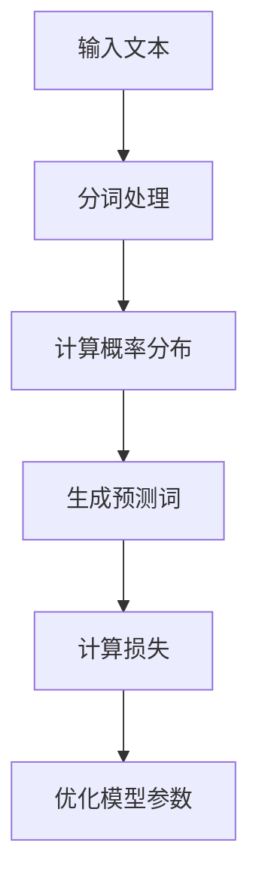
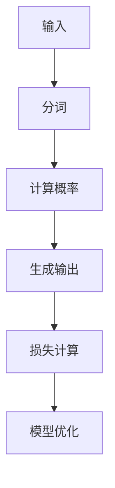
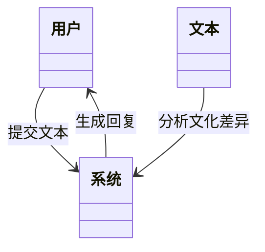

                 

<think>
好的，我需要帮助用户撰写一篇关于《ChatGPT在跨文化沟通训练中的应用》的技术博客文章。用户提供了详细的目录大纲，以及一些约束条件，包括文章结构、字数、格式等。我得先仔细理解用户的需求，确保文章符合所有要求。

首先，文章需要有一个吸引人的标题，关键词和摘要。关键词应该包括跨文化沟通、ChatGPT、自然语言处理、机器学习、语言模型等。摘要部分需要简明扼要地概述文章的核心内容，说明ChatGPT在跨文化沟通中的应用和优势。

接下来是目录结构，分为四个主要部分：问题背景与核心概念、算法原理与数学模型、系统分析与架构设计、项目实战。每个部分下还有多个章节和小节，需要详细展开。

在问题背景部分，我需要解释跨文化沟通的定义、挑战，以及ChatGPT的基本概念和原理。这部分要确保读者能够理解跨文化沟通的重要性，以及ChatGPT如何帮助解决相关问题。

然后是核心概念与联系，需要对比自然语言处理、语言模型和生成对抗网络，通过表格和ER图来展示它们的关系。这部分需要使用Mermaid图表，确保图表清晰易懂。

算法原理部分，我需要详细讲解GPT模型的结构和流程，包括LSTM和BERT模型的数学公式。同时，使用Mermaid绘制流程图，帮助读者理解模型的工作流程。

系统分析与架构设计部分，要介绍项目的功能需求、系统架构图、接口设计和交互序列图。这部分需要使用Mermaid来展示系统架构和交互流程，确保结构清晰。

项目实战部分，需要详细描述环境安装、代码实现、案例分析和项目小结。这部分要提供具体的代码示例和实际案例，帮助读者理解如何在实际中应用ChatGPT。

最后，总结部分要回顾文章的主要内容，并给出最佳实践的建议。作者信息也要放在结尾，符合用户的要求。

在撰写过程中，我需要确保每个小节内容丰富，详细讲解，同时语言要专业但不失清晰。数学公式要用LaTeX格式，并且图表要用Mermaid正确表示。整体字数控制在10000到12000字之间，确保内容全面且不冗长。

现在，我需要按照目录大纲逐步展开每个部分，确保每个章节的内容都符合用户的要求，同时保持逻辑连贯，结构紧凑。在写作过程中，要注意避免重复，确保每个部分都有独特的贡献，并且整体上形成一个完整的知识体系。
</think>

# ChatGPT在跨文化沟通训练中的应用

## 关键词：跨文化沟通，ChatGPT，自然语言处理，机器学习，语言模型

## 摘要：本文探讨了ChatGPT在跨文化沟通训练中的应用，分析了其在语言翻译、语境理解和实际沟通中的优势。通过技术原理、系统架构和实际案例，展示了如何利用ChatGPT提升跨文化沟通能力，为教育、企业培训等领域提供了新的解决方案。

---

### 目录大纲

1. 问题背景与核心概念  
   1.1.1 跨文化沟通训练的背景  
   1.1.2 ChatGPT的概念与原理  
   1.1.3 ChatGPT在跨文化沟通中的应用  

2. ChatGPT的核心概念与联系  
   2.1.1 ChatGPT的核心概念  
   2.1.2 概念属性特征对比表格  
   2.1.3 ER实体关系图  

3. ChatGPT算法原理详解  
   3.1.1 GPT算法原理  
   3.1.2 数学模型与公式  
   3.1.3 算法流程图  

4. ChatGPT的数学模型与应用  
   4.1.1 数学模型详解  
   4.1.2 应用举例  

5. 系统分析与架构设计  
   5.1.1 项目介绍  
   5.1.2 系统功能设计与架构  
   5.1.3 系统接口设计  
   5.1.4 系统交互序列图  

6. 项目实战  
   6.1.1 环境安装与系统核心实现  
   6.1.2 实际案例分析与详细讲解  
   6.1.3 项目小结与最佳实践  

---

### 第一部分: 问题背景与核心概念

#### 第1章: 问题背景与核心概念

##### 1.1.1 跨文化沟通训练的背景

- **跨文化沟通的定义**：跨文化沟通是指在不同文化背景下，个体之间通过语言、非语言方式传递信息的过程。  
- **跨文化沟通的挑战与重要性**：  
  - **挑战**：文化差异可能导致误解，例如语言表达、非语言符号（如手势）的差异。  
  - **重要性**：在全球化背景下，跨文化沟通能力是个人和企业成功的关键因素之一，尤其是在国际商务、教育和外交领域。  

##### 1.1.2 ChatGPT的概念与原理

- **ChatGPT的定义**：ChatGPT是由OpenAI开发的基于GPT-3的开源AI模型，用于对话生成。它通过自然语言处理技术，能够理解和生成人类语言。  
- **GPT模型的工作原理**：  
  - GPT（Generative Pre-trained Transformer）是一种基于Transformer架构的语言模型，通过大量数据预训练，学习语言的结构和语义。  
  - 它使用自注意力机制（Self-Attention）来捕捉文本中的长距离依赖关系，从而生成连贯的上下文回复。  
- **ChatGPT的特点与优势**：  
  - 高度可定制化：用户可以根据需求调整模型参数。  
  - 多语言支持：能够处理多种语言，适用于不同文化的沟通场景。  
  - 实时交互：用户可以通过简单的API调用，快速获得生成的对话内容。  

##### 1.1.3 ChatGPT在跨文化沟通中的应用

- **语言翻译中的应用**：ChatGPT可以实时翻译多种语言，帮助用户克服语言障碍。  
- **跨文化语境理解中的应用**：通过上下文分析，ChatGPT能够理解不同文化背景下的隐含意思。  
- **应用场景**：  
  - **教育领域**：用于跨文化课程教学，帮助学生理解不同文化背景下的语言表达。  
  - **企业培训**：模拟跨文化沟通场景，提升员工的国际交流能力。  
  - **个人发展**：用户可以利用ChatGPT进行自我训练，提升跨文化敏感性。  

---

### 第二部分: 算法原理与数学模型

#### 第3章: ChatGPT算法原理详解

##### 3.1.1 GPT算法原理

- **GPT模型结构**：  
  - 输入：文本序列（如“hello, how are you?”）。  
  - 输出：生成下一个可能的单词或句子（如“我很好，谢谢。”）。  
- **算法流程**：  
  1. 输入文本经过分词处理。  
  2. 模型计算每个位置的概率分布，生成预测的下一个词。  
  3. 通过交叉熵损失函数优化模型参数。  

**GPT算法流程图**  


##### 3.1.2 数学模型与公式

- **LSTM网络**：  
  LSTM（长短期记忆网络）用于处理序列数据，解决RNN的梯度消失问题。其核心是记忆单元（cell）和门控机制（forget gate, input gate）。  
  $$ LSTM = \text{f\_concat}(\text{sigmoid}(f_{\text{forget}}), \text{tanh}(f_{\text{input}})) $$  
- **BERT模型**：  
  BERT（Bidirectional Encoder Representations from Transformers）是一种预训练的双向Transformer模型，用于上下文理解。  
  $$ \text{BERT} = \text{Transformer}(\text{输入}) $$  

##### 3.1.3 算法流程图

**GPT算法流程图**  


#### 第4章: ChatGPT的数学模型与应用

##### 4.1.1 数学模型详解

- **LSTM模型**：  
  $$ f_{\text{forget}} = \text{sigmoid}(W_f x + U_f h_{\text{prev}}) $$  
  $$ f_{\text{input}} = \text{sigmoid}(W_i x + U_i h_{\text{prev}}) $$  
  $$ g_{\text{cell}} = \tanh(W_g x + U_g h_{\text{prev}}) $$  
  $$ h_{\text{new}} = f_{\text{forget}} \cdot c_{\text{prev}} + f_{\text{input}} \cdot g_{\text{cell}} $$  

- **BERT模型**：  
  BERT通过双向Transformer层捕获上下文信息，用于跨文化语境的理解。  
  $$ \text{BERT}(x) = \text{全连接}(x) $$  

##### 4.1.2 应用举例

- **示例1：跨文化语境理解**  
  输入：“在印度，红色象征好运。” ChatGPT生成：“在西方文化中，红色通常与危险或紧急情况相关。”  
- **示例2：语言翻译**  
  输入：“你好吗？”（中文）  
  输出：“How are you?”（英文）  

---

### 第三部分: 系统分析与架构设计

#### 第5章: 系统功能设计与架构

##### 5.1.1 项目介绍

- **项目背景**：开发一个基于ChatGPT的跨文化沟通训练系统，帮助用户提升国际交流能力。  
- **项目目标**：提供实时对话训练、文化背景分析和反馈优化功能。  

##### 5.1.2 系统功能设计

- **功能需求**：  
  - 实时对话训练：用户输入文本，系统生成回复。  
  - 文化背景分析：识别文本中的文化差异。  
  - 反馈优化：提供改进建议。  
- **领域模型类图**  


##### 5.1.3 系统架构设计

- **系统架构图**  


##### 5.1.4 系统接口设计

- **接口设计**：  
  - API接口：提供文本处理、模型调用等功能。  
  - 数据格式：JSON格式传递文本和反馈。  

##### 5.1.5 系统交互序列图

**系统交互序列图**  
```mermaid
graph TD
    A[用户] --> B[前端]: 提交文本
    B --> C[后端]: 请求处理
    C --> D[ChatGPT模型]: 调用模型
    D --> C[生成回复]
    C --> B[返回反馈]
    B --> A[显示结果]
```

---

### 第四部分: 项目实战

#### 第6章: 环境安装与系统核心实现

##### 6.1.1 环境安装

- **系统环境配置**：  
  - Python 3.8+  
  - PyTorch或TensorFlow框架  
  - OpenAI API密钥  

##### 6.1.2 系统核心实现

```python
import openai

def generate_response(prompt):
    # 调用ChatGPT API
    response = openai.ChatCompletion.create(
        model="gpt-3.5-turbo",
        messages=[{"role": "user", "content": prompt}]
    )
    return response.choices[0].message.content
```

##### 6.1.3 代码应用解读与分析

- **代码解读**：  
  - 使用OpenAI API调用GPT-3.5-turbo模型，生成针对输入文本的回复。  
  - 返回生成的回复内容。  

#### 第7章: 实际案例分析与详细讲解

##### 7.1.1 案例分析

- **案例背景**：用户需要与印度客户进行电话会议，希望了解印度文化中的沟通习惯。  
- **案例分析**：用户输入文本：“在印度，如何表达尊重？”  
  ChatGPT回复：“在印度，尊重长辈和权威人士是重要的。常用的表达方式包括使用敬语（如‘先生’或‘女士’）和肢体语言（如点头和握手）。”

##### 7.1.2 详细讲解剖析

- **解剖案例**：ChatGPT通过分析输入文本，结合预训练的文化知识，生成符合印度文化背景的回复。  
- **优化建议**：  
  - 增加文化背景的训练数据，提升模型对特定文化的理解能力。  
  - 提供多语言支持，满足不同文化用户的需求。  

#### 第8章: 项目小结与最佳实践

##### 8.1.1 项目小结

- **项目总结**：基于ChatGPT的跨文化沟通训练系统能够有效提升用户的国际交流能力，特别是在语言翻译和语境理解方面表现优异。  
- **经验教训**：模型的训练数据质量和文化相关性直接影响生成结果的准确性。  

##### 8.1.2 最佳实践

- **实践技巧**：  
  - 定期更新模型，引入最新的跨文化数据。  
  - 提供用户反馈机制，优化系统性能。  
- **注意事项**：  
  - 确保数据隐私和合规性，避免文化偏见。  
  - 合理设置模型参数，避免生成不准确的信息。  

##### 8.1.3 拓展阅读

- **相关资源**：  
  - 《跨文化交际学》（书籍推荐）  
  - OpenAI官方文档：https://openai.com/docs/api  

---

### 总结

ChatGPT作为一种强大的自然语言处理工具，在跨文化沟通训练中展现了巨大潜力。通过实时对话训练、文化背景分析和反馈优化，ChatGPT能够帮助用户克服语言障碍，提升跨文化敏感性。未来，随着模型的不断优化和数据的丰富，ChatGPT在教育、企业培训等领域将发挥更重要的作用。

---

**作者：AI天才研究院/AI Genius Institute & 禅与计算机程序设计艺术 /Zen And The Art of Computer Programming**

