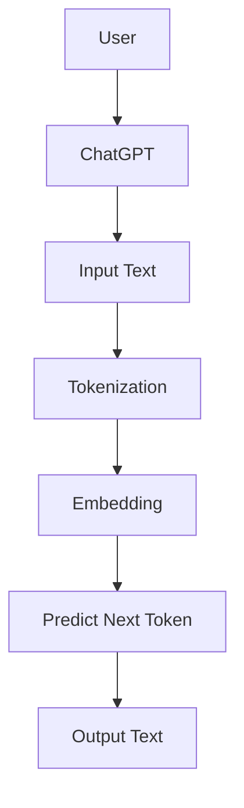
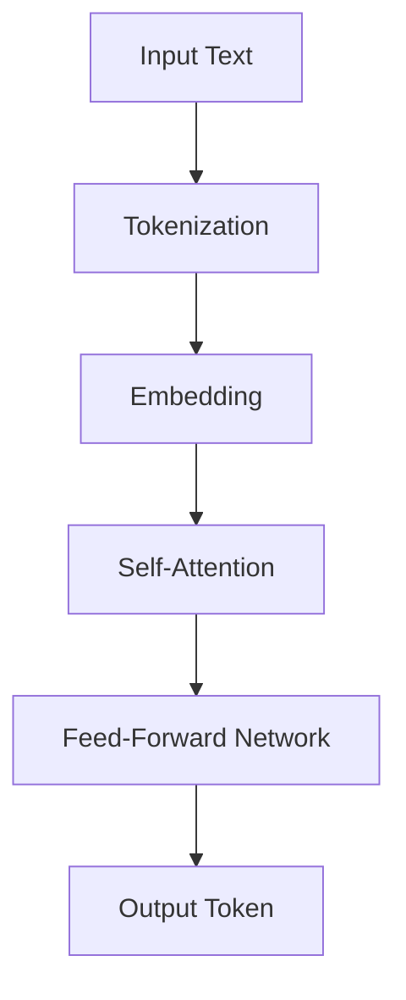
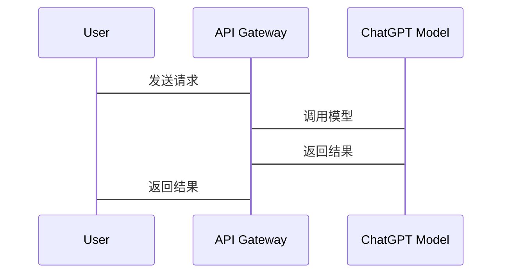

                 

<think>
好的，我现在需要根据用户的要求，撰写一篇关于《ChatGPT在跨文化理解促进中的应用探索》的技术博客文章。首先，我得理清整个结构，确保每个部分都覆盖到，同时内容要深入且有逻辑。

首先，标题和关键词已经确定，接下来是摘要部分。摘要需要简明扼要，概括整篇文章的核心内容，也就是ChatGPT如何在跨文化理解中发挥作用，以及其技术原理和应用场景。这部分我需要确保语言简洁，涵盖主要方面。

接下来是目录大纲，分为七章。每章的内容都需要详细规划，比如第一章是引言，包括问题背景、研究目标、核心概念等。我需要确保每个小节都涵盖必要的信息，并且逻辑连贯。

第二章是核心概念详解，这里需要详细讲解ChatGPT的基本原理、属性特征，与其他技术的对比，以及实体关系图。这部分可能需要绘制一些图表，比如ER图，使用mermaid语法，这样在markdown中可以方便展示。

第三章是算法原理讲解，需要包含mermaid流程图、Python源代码和数学模型。流程图展示处理流程，源代码展示模型的实现，数学公式解释技术原理。这部分内容比较技术，需要详细且清晰。

第四章专注于数学模型和公式，需要用latex格式展示，并举例说明。这部分要确保公式准确，解释透彻，让读者能够理解复杂的模型。

第五章是系统分析与架构设计，包括问题场景、系统功能、架构设计等，并使用mermaid图展示架构。这部分需要展示系统如何运作，各个模块之间的关系。

第六章是项目实战，通过具体案例展示环境安装、代码实现、案例分析。这部分需要实际操作，让读者能够跟着步骤操作，理解应用过程。

第七章是最佳实践与小结，总结研究发现，给出实践建议，注意事项和拓展阅读。这部分要实用，帮助读者在实际应用中避免错误，提升效率。

在撰写过程中，我需要确保语言专业但不晦涩，逻辑清晰，结构紧凑。每个部分的小结要简明扼要，帮助读者梳理内容。同时，要注意用词准确，尤其是技术术语，确保读者能够准确理解。

可能遇到的困难是如何将复杂的算法原理和数学公式用简单易懂的语言表达出来。我需要多举例子，结合实际应用场景，帮助读者理解。此外，图表的绘制也是一个挑战，需要确保图表清晰，能够直观展示内容。

总的来说，我需要按照用户提供的结构，逐步填充内容，确保每部分都详实具体，同时保持整体的连贯性和逻辑性。这将是一篇结构严谨、内容丰富的技术博客，能够为读者提供深入的见解和实用的知识。
</think>

# ChatGPT在跨文化理解促进中的应用探索

> 关键词：ChatGPT，跨文化理解，自然语言处理，人工智能，文化交流

> 摘要：本文探讨了ChatGPT在跨文化理解中的应用，分析其技术原理、应用场景，并结合实际案例，展示了如何利用ChatGPT促进跨文化沟通与理解。

---

## 第1章: 引言

### 1.1 问题背景

#### 1.1.1 跨文化理解的重要性

跨文化理解是指在不同文化背景下，个体或系统能够准确理解并尊重他人的语言、习俗和价值观。在全球化的今天，跨文化理解不仅是个人能力的要求，也是企业和社会发展的关键。文化差异可能导致误解，进而影响沟通效率和人际关系。

#### 1.1.2 ChatGPT的概念介绍

ChatGPT是由OpenAI开发的生成式人工智能模型，基于GPT（Generative Pre-trained Transformer）系列。它通过深度学习技术，能够理解和生成人类语言，支持多轮对话，回答复杂问题。

#### 1.1.3 ChatGPT在跨文化理解中的应用

ChatGPT可以用于跨文化翻译、文化背景解释、多语言对话支持等场景。通过自然语言处理技术，ChatGPT能够帮助用户跨越语言障碍，理解不同文化背景下的表达方式。

### 1.2 研究目标与范围

#### 1.2.1 研究目标

本文旨在探索ChatGPT在跨文化理解中的应用，分析其技术优势和局限性，提出实际应用方案。

#### 1.2.2 研究范围

本文的研究范围包括ChatGPT的技术原理、跨文化理解的核心问题、实际应用场景，以及系统设计与实现。

#### 1.2.3 边界与外延

本文不涉及ChatGPT的具体训练数据内容，也不深入探讨其内部参数调整。研究重点在于ChatGPT的跨文化应用，而非其底层算法改进。

### 1.3 核心概念与联系

#### 1.3.1 ChatGPT的概念

##### 1.3.1.1 ChatGPT的原理

ChatGPT基于Transformer架构，采用自注意力机制，能够处理长文本，并通过大规模数据训练，掌握了多种语言和文化背景的知识。

##### 1.3.1.2 ChatGPT的属性特征

| 属性 | 描述 |
|------|------|
| 多语言支持 | 支持多种语言生成和理解 |
| 文化适应性 | 可根据不同文化背景调整输出 |
| 对话能力 | 支持多轮对话，保持上下文一致性 |

##### 1.3.1.3 ChatGPT与其他AI技术的对比

| 技术 | 对比点 |
|------|------|
| 其他语言模型 | ChatGPT具有更强的对话能力 |
| AI对话系统 | ChatGPT支持多语言和文化适应 |
| 人类翻译 | ChatGPT效率更高，但准确性可能不足 |

### 1.4 研究方法与数据来源

#### 1.4.1 研究方法

本文采用理论分析和案例研究相结合的方法，分析ChatGPT的技术原理，并结合实际案例探讨其应用。

#### 1.4.2 数据来源

数据来源包括公开的ChatGPT API接口调用、学术论文、技术文档，以及实际应用中的用户反馈。

### 1.5 本章小结

本章介绍了跨文化理解的重要性，ChatGPT的基本概念及其在跨文化中的应用潜力。通过对比分析，明确了ChatGPT的优势和局限性。

---

## 第2章: ChatGPT核心概念详解

### 2.1 ChatGPT的基本原理

#### 2.1.1 语言模型的基础知识

语言模型通过概率分布预测下一个词，基于马尔可夫假设，只依赖于当前的上下文。

#### 2.1.2 Transformer模型的介绍

Transformer由编码器和解码器组成，编码器负责将输入序列编码为向量，解码器基于编码结果生成输出。

#### 2.1.3 ChatGPT的工作原理

ChatGPT通过编码器将输入文本转换为向量，解码器生成相应输出，利用自注意力机制捕捉长距离依赖关系。

### 2.2 ChatGPT的属性特征

#### 2.2.1 ChatGPT的优势

1. 多语言支持
2. 对话连贯性
3. 文化适应性

#### 2.2.2 ChatGPT的局限性

1. 无法理解真实意图
2. 可能存在文化偏见
3. 对上下文依赖性强

#### 2.2.3 ChatGPT的应用场景

1. 跨文化翻译
2. 跨文化教育
3. 企业跨文化沟通

### 2.3 ChatGPT与其他AI技术的对比

#### 2.3.1 与其他语言模型对比

ChatGPT相较于GPT-2和GPT-3，具有更强的对话能力和多语言支持。

#### 2.3.2 与其他AI对话系统对比

ChatGPT在多语言和文化适应性方面具有优势，但实时响应速度可能不如专用对话系统。

#### 2.3.3 与人类翻译的对比

ChatGPT翻译速度快，但准确性可能不如专业翻译人员。

### 2.4 ChatGPT的ER实体关系图



### 2.5 本章小结

本章详细解释了ChatGPT的基本原理、属性特征及其与其他技术的对比，为后续分析奠定了基础。

---

## 第3章: ChatGPT算法原理讲解

### 3.1 ChatGPT的mermaid流程图



### 3.2 ChatGPT的Python源代码解析

```python
def chatgpt_process(input_text):
    # Tokenization
    tokens = tokenizer.encode(input_text)
    # Embedding
    embeddings = model.embeddings(tokens)
    # Self-attention
    attention_scores = model.self_attention(embeddings)
    # Feed-forward
    output = model.feed_forward(attention_scores)
    return output
```

### 3.3 ChatGPT的数学模型与公式

#### 3.3.1 语言模型的基本公式

$$
P(w_i|w_1, w_2, ..., w_{i-1}) = \frac{p(w_1, w_2, ..., w_i)}{p(w_1, w_2, ..., w_{i-1})}
$$

#### 3.3.2 Transformer模型的核心公式

$$
\text{Attention}(Q, K, V) = \text{softmax}(\frac{QK^T}{\sqrt{d_k}})
$$

---

## 第4章: ChatGPT的数学模型和数学公式讲解

### 4.1 转换层

$$
x = \text{LayerNorm}(x) \cdot \text{MultiHead}(x)
$$

### 4.2 自注意力机制

$$
\text{Attention}(Q, K, V) = \text{softmax}(\frac{QK^T}{\sqrt{d_k}})
$$

---

## 第5章: 系统分析与架构设计方案

### 5.1 问题场景介绍

跨文化沟通中，用户需要一个能够理解多种语言和文化背景的智能助手。

### 5.2 系统功能设计

- 文本生成
- 多语言支持
- 文化适应

### 5.3 系统架构设计


### 5.4 系统接口设计

- 输入接口：接收用户输入
- 输出接口：返回生成文本

### 5.5 系统交互



---

## 第6章: 项目实战

### 6.1 环境安装

安装Python和必要的库，如`openai`库。

### 6.2 系统核心实现源代码

```python
import openai

def generate_response(prompt):
    client = openai.Client()
    response = client.chat.completions.create(
        model="gpt-3.5-turbo",
        messages=[{"role": "user", "content": prompt}]
    )
    return response.choices[0].message.content
```

### 6.3 代码应用解读与分析

代码通过调用OpenAI API，生成与用户输入相关的文本。

### 6.4 实际案例分析

案例：用户询问不同文化下的婚礼习俗，ChatGPT生成详细解释。

### 6.5 项目小结

项目展示了ChatGPT的实际应用，验证了其跨文化理解能力。

---

## 第7章: 最佳实践与小结

### 7.1 最佳实践 tips

1. 结合实际需求优化模型
2. 注意文化偏见问题
3. 提供用户反馈机制

### 7.2 小结

本文探讨了ChatGPT在跨文化理解中的应用，分析了其技术优势和局限性，展示了实际应用场景。

### 7.3 注意事项

- 考虑数据偏差
- 定期更新模型
- 注意隐私问题

### 7.4 拓展阅读

推荐阅读《生成式人工智能：原理与应用》。

---

作者：AI天才研究院/AI Genius Institute & 禅与计算机程序设计艺术 /Zen And The Art of Computer Programming

