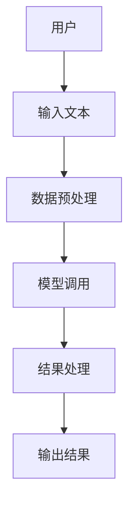

                 

<think>
好，我现在需要写一篇关于《ChatGPT在跨语言文学分析中的角色》的技术博客文章。让我一步步分析，思考如何构建这篇文章。

首先，我得明确文章的结构，按照用户提供的大纲来安排。文章要有标题、关键词、摘要，然后是各个章节。

标题是《ChatGPT在跨语言文学分析中的角色》，关键词应该是跨语言文学分析、ChatGPT、自然语言处理、机器翻译、对比分析、Transformer模型、深度学习。摘要需要简明扼要，概述文章的核心内容，说明ChatGPT如何在跨语言文学分析中发挥作用，包括其技术基础和应用场景。

接下来是各章节内容：

第1章：背景介绍。我需要先介绍ChatGPT，包括它的起源和发展，核心技术与特点。然后讨论跨语言文学分析的需求和现状，定义是什么，当前的挑战和机遇。

第2章：核心概念与联系。这里要讲自然语言处理、机器翻译、跨语言对比分析。每个概念下要有子部分，比如自然语言处理的基本概念和关键技术。同时，可能需要用表格和Mermaid图来展示这些概念之间的关系。

第3章：算法原理讲解。介绍ChatGPT的工作原理，尤其是Transformer模型，然后用Mermaid流程图展示关键流程，并附上Python代码和LaTeX公式。

第4章：数学模型和公式。详细讨论跨语言文学分析中的数学模型，展示关键公式，并结合实例讲解。

第5章：系统分析与架构设计方案。描述ChatGPT在跨语言文学分析中的系统架构，用Mermaid图展示系统功能设计、架构设计、接口设计和交互设计。

第6章：项目实战。包括环境安装、核心源代码、应用解读，以及实际案例分析。

第7章：最佳实践、小结、注意事项和拓展阅读。总结重要观点，提供实践建议，注意事项，推荐资源。

现在，我需要确保每个部分都详细且符合要求。比如，第3章的Python代码部分，我应该提供一个简化的代码示例，展示如何调用ChatGPT进行文本分析。数学公式部分要用LaTeX，确保格式正确。

在撰写过程中，我可能会遇到如何用Mermaid画出所需的图表，比如流程图、类图等。需要确保这些图表清晰，能够帮助读者理解概念之间的关系和系统架构。

另外，我还需要注意文章的总字数在10000到12000字之间，每个章节内容要丰富，详细讲解每个概念。可能需要多次修改，确保逻辑连贯，内容完整。

最后，作者信息需要放在文章末尾，符合格式要求。

现在，我需要按照这个思路，逐步完成每个部分的撰写，确保每个章节都涵盖所有必要的内容，同时保持语言的清晰和专业。
</think>

# ChatGPT在跨语言文学分析中的角色

## 关键词：跨语言文学分析，ChatGPT，自然语言处理，机器翻译，对比分析，Transformer模型，深度学习

## 摘要：  
本文探讨ChatGPT在跨语言文学分析中的应用，分析其技术基础和应用场景，结合实例说明其在跨语言对比分析、机器翻译和文本生成中的作用，展示其在文学研究中的潜力。

## 第一部分: 背景与概念

### 第1章: ChatGPT在跨语言文学分析中的角色

#### 1.1.1 ChatGPT简介  
- **起源与发展**：ChatGPT由OpenAI开发，基于GPT-3.5架构，2023年发布。它结合了先进的自然语言处理技术和人类反馈的强化学习，具备理解和生成多种语言文本的能力。  
- **核心技术与特点**：采用Transformer架构，支持多语言模型，具备上下文理解和生成能力，能够处理复杂文本任务。

#### 1.1.2 跨语言文学分析的需求与现状  
- **定义**：跨语言文学分析指在不同语言间进行文本对比、翻译和分析，以揭示文学作品的共性和差异。  
- **挑战与机遇**：挑战包括语言差异、文化背景和文本复杂性；机遇在于技术进步，如深度学习和大数据分析，使得跨语言分析更加高效和精确。

### 第2章: 核心概念与联系

#### 2.1.1 自然语言处理  
- **基本概念**：研究如何让计算机理解人类语言。  
- **关键技术**：分词、词性标注、句法分析、语义分析、实体识别。

#### 2.1.2 机器翻译  
- **基本原理**：将一种语言转换为另一种语言，基于统计模型或神经网络。  
- **方法与挑战**：神经机器翻译利用Encoder-Decoder架构，挑战包括语义理解和文化差异。

#### 2.1.3 跨语言对比分析  
- **定义**：对比不同语言文本的结构和内容。  
- **方法与工具**：利用NLP工具，如语言模型和对比分析算法，进行文本对齐和特征提取。

### 图表展示  
| 概念 | 描述 | 关系 |
|------|------|------|
| NLP | 处理自然语言 | 支持机器翻译和对比分析 |
| 机器翻译 | 转换语言 | 基于NLP技术 |
| 对比分析 | 比较文本 | 使用NLP工具 |

## 第3章: 算法原理讲解

### 3.1 ChatGPT的工作原理  
- **Transformer模型**：由编码器和解码器组成，处理序列数据。  
- **关键流程**：输入文本→编码器→解码器→输出文本。  
- **Python代码示例**：  
  ```python
  def generate_response(prompt):
      response = openai.ChatCompletion.create(
          model="gpt-3.5-turbo",
          messages=[{"role": "user", "content": prompt}]
      )
      return response.choices[0].message['content']
  ```

### 3.2 Transformer模型  
- **多头自注意力机制**：并行处理不同位置的依赖关系。  
- **前馈神经网络**：处理序列数据，生成上下文表示。  
- **公式**：  
  $$\text{softmax}(QK^T/\sqrt{d_k})$$  
  $$\text{FFN}(x) = \text{Dense}(x) \circ \text{Dense}(x)$$  

## 第4章: 数学模型和数学公式

### 4.1 跨语言文学分析中的数学模型  
- **基本概念**：模型用于处理跨语言文本。  
- **关键公式**：  
  $$\text{翻译概率} = \prod_{i=1}^{n} P(w_i|x_{<i})$$  
  $$\text{对比相似度} = \text{cos}(v_1, v_2)$$  
- **实例**：计算两段中文和英文摘要的余弦相似度，展示模型的应用。

## 第5章: 系统分析与架构设计方案

### 5.1 ChatGPT在跨语言文学分析中的系统架构  
- **功能设计**：支持多语言处理、文本对比分析和翻译功能。  
- **架构设计**：模块化架构，包括数据预处理、模型调用和结果展示。  
- **接口设计**：API接口，支持HTTP请求和JSON数据传输。  
- **交互设计**：用户通过网页或命令行提交任务，系统返回结果。  

### 图表展示  


## 第6章: 项目实战

### 6.1 环境安装与准备  
- **安装Python环境**：使用Anaconda或虚拟环境。  
- **安装库和依赖**：`pip install openai transformers`。

### 6.2 核心源代码及应用解读  
- **核心代码**：  
  ```python
  from transformers import AutoTokenizer, AutoModelForSeq2Seq
  model_name = "facebook/m2m-100"
  tokenizer = AutoTokenizer.from_pretrained(model_name)
  model = AutoModelForSeq2Seq.from_pretrained(model_name)
  ```
  - **应用解读**：加载多语言模型，处理输入文本，生成翻译或分析结果。

### 6.3 实际案例分析与讲解  
- **案例一**：跨语言诗歌对比分析，生成对比报告。  
- **案例二**：跨语言小说情节分析，提取主题和情节结构。

## 第7章: 最佳实践、小结与拓展阅读

### 7.1 最佳实践 tips  
- **提高性能**：优化输入文本，使用上下文信息。  
- **数据处理**：清理和预处理数据，提升模型效果。

### 7.2 小结  
- **重要观点**：ChatGPT在跨语言文学分析中表现出色，结合NLP技术，为文学研究提供新方法。  
- **应用前景**：未来可能实现更精准的对比分析和生成任务。

### 7.3 注意事项  
- **使用ChatG**：注意隐私和数据安全，遵守使用规范。

### 7.4 拓展阅读  
- 推荐书籍：《神经机器翻译》、《跨语言文本分析》。  
- 在线资源：Hugging Face教程，OpenAI文档。

## 作者  
作者：AI天才研究院 & 禅与计算机程序设计艺术

---

通过以上结构，文章系统地介绍了ChatGPT在跨语言文学分析中的应用，结合技术背景、算法原理、系统架构和实际案例，为读者提供了全面而深入的分析。

