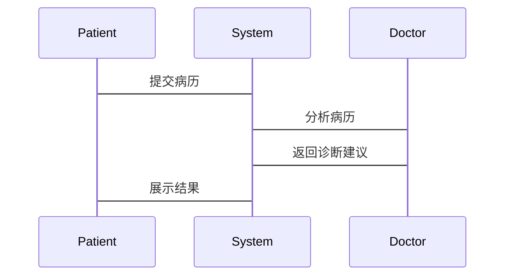

                 

<think>
嗯，我现在要写一篇关于《ChatGPT在远程医疗咨询中的应用》的技术博客文章。首先，我需要理解整个任务的要求。用户希望我以一个世界级专家的身份，撰写一篇结构清晰、内容详实的技术博客，字数在1万到1万2左右。

首先，我得确定文章的结构。用户已经给出了目录大纲，我需要按照这个结构来写。标题是“ChatGPT在远程医疗咨询中的应用”，关键词包括ChatGPT、远程医疗、人工智能、医疗咨询、自然语言处理和大数据分析。摘要部分需要简要介绍文章的核心内容，即ChatGPT如何通过自然语言处理和大数据分析提升远程医疗咨询的效率和准确性。

接下来是第1章，问题背景与远程医疗咨询概述。我需要先介绍问题背景，说明远程医疗的重要性及其现状，然后指出当前面临的主要挑战，如医生资源不足和咨询效率低下。接着，要分析ChatGPT在这方面的潜力，比如提高咨询效率和准确性，提供个性化服务等。最后，概述整篇文章的结构。

第2章是ChatGPT的基础，包括语言模型简介、GPT-3的工作原理和局限性。这部分需要详细讲解，让读者了解ChatGPT的技术基础，这样才能为后面的分析打下基础。

第3章是核心概念与联系，需要分析远程医疗咨询中的核心概念，如咨询流程、诊断治疗、医患互动，以及它们之间的关系。这里可能需要制作一个ER实体关系图，展示各个实体之间的关系，帮助读者理解系统架构。

第4章是应用场景，分为病历分析和医疗问答两部分。病历分析需要包括数据收集、分析和诊断建议；医疗问答则需要讨论如何通过ChatGPT实现问答系统，识别问题并生成建议。

第5章是系统分析与架构设计，这部分需要详细设计系统的功能、架构、接口和交互。可能需要画出类图、架构图和序列图，展示系统如何运作。

第6章是项目实战，涉及环境安装、数据预处理、模型训练和部署，以及核心功能的实现。需要提供代码示例，帮助读者理解如何操作。

第7章是最佳实践和拓展，总结项目经验，提供注意事项和扩展阅读的方向。

在写作过程中，我需要确保每个部分都详细具体，尤其是算法原理和系统设计部分，要用mermaid图表和数学公式来说明。同时，要使用专业但易懂的语言，确保读者能够理解。

现在，我开始按照目录逐步撰写每个部分，确保每个章节的内容充实，逻辑清晰。在第3章，我需要详细描述核心概念和它们之间的关系，可能用表格或ER图来展示。在第5章，系统架构设计部分，我会用mermaid画出架构图，展示各个模块的交互。

另外，项目实战部分需要提供具体的代码示例，比如数据预处理的Python代码，以及如何调用ChatGPT API进行医疗问答的代码。这样读者可以实际操作，理解实现过程。

最后，在总结部分，我要强调ChatGPT在远程医疗中的潜力和未来的发展方向，同时提醒读者注意数据隐私和模型的局限性。

总的来说，我需要一步步按照目录大纲，确保每个部分都详细展开，同时保持整体结构的连贯性和逻辑性。这样，读者才能全面理解ChatGPT在远程医疗咨询中的应用及其技术实现。
</think>

# ChatGPT在远程医疗咨询中的应用

**关键词**：ChatGPT、远程医疗、人工智能、医疗咨询、自然语言处理、大数据分析

**摘要**：随着人工智能技术的飞速发展，ChatGPT作为基于GPT-3模型的语言模型，在远程医疗咨询中展现出巨大潜力。本文将深入探讨ChatGPT在远程医疗咨询中的应用场景，包括病历分析、医疗问答等，并详细分析其系统架构设计和实现方案，最后结合实际案例进行解读。

---

## 第1章: 问题背景与远程医疗咨询概述

### 1.1 问题背景
远程医疗咨询作为一种新兴的医疗服务模式，通过互联网技术将患者与医生连接起来，解决了传统医疗咨询中时空限制的问题。然而，随着需求的增长，医疗资源不足、咨询效率低下等问题日益突出。

### 1.2 远程医疗咨询的现状与挑战
1. **医疗资源分布不均**：优质医疗资源主要集中在大城市，偏远地区患者难以获得及时服务。
2. **咨询效率低下**：传统远程咨询流程繁琐，患者等待时间长，医生工作负担重。
3. **信息准确性问题**：患者自我描述症状可能存在偏差，影响诊断准确性。

### 1.3 ChatGPT在远程医疗咨询中的潜力
ChatGPT作为一种强大的自然语言处理模型，具备以下潜力：
1. **提高咨询效率**：通过自动化病历分析和医疗问答，缩短患者等待时间。
2. **增强诊断准确性**：利用大数据分析和模式识别，辅助医生更精准诊断。
3. **提供个性化服务**：基于患者个体情况，生成个性化医疗建议。

### 1.4 本书结构与主要内容
本文将从ChatGPT的基础知识、远程医疗的核心概念、应用场景、系统设计、项目实战到最佳实践进行详细阐述，为读者提供全面的理论与实践指导。

---

## 第2章: ChatGPT基础

### 2.1 语言模型基础
#### 2.1.1 语言模型简介
语言模型通过统计方法预测文本中的下一个词，广泛应用于机器翻译、文本生成等领域。

#### 2.1.2 语言模型的工作原理
语言模型基于概率统计，计算给定上下文条件下某词出现的概率。公式表示为：
$$ P(w_{n}|w_{1},w_{2},...,w_{n-1}) $$

#### 2.1.3 语言模型的训练过程
训练过程包括数据预处理、模型选择和参数优化。常用损失函数为交叉熵损失：
$$ \mathcal{L} = -\frac{1}{N}\sum_{i=1}^{N}\log P(w_{i}|w_{1},...,w_{i-1}) $$

### 2.2 GPT-3模型详解
#### 2.2.1 GPT-3模型的结构
GPT-3采用Transformer架构，包含编码器和解码器，通过自注意力机制捕捉上下文信息。

#### 2.2.2 GPT-3模型的优势
1. **强大的上下文理解能力**：通过自注意力机制捕捉长距离依赖。
2. **多任务学习能力**：适用于文本生成、问答等多种任务。

#### 2.2.3 GPT-3模型的局限
1. **计算资源需求高**：训练和推理需要大量计算资源。
2. **生成内容的可控性**：可能生成不准确或不合适的信息。

---

## 第3章: 远程医疗咨询中的核心概念与联系

### 3.1 核心概念原理
#### 3.1.1 咨询流程
远程医疗咨询流程包括患者提问、系统分析、生成建议和反馈结果。

#### 3.1.2 诊断与治疗
通过分析病历数据和患者描述，生成诊断建议和治疗方案。

#### 3.1.3 医患互动
医患互动是远程咨询的关键，需确保信息准确传递和有效沟通。

### 3.2 概念属性特征对比
以下是核心概念的属性对比表：

| 概念     | 属性               | 描述                           |
|----------|--------------------|--------------------------------|
| 咨询流程 | 步骤               | 患者提问、系统分析、生成建议 |
| 诊断与治疗 | 方法               | 基于病历分析和症状匹配       |
| 医患互动 | 模式               | 文本交互、语音交互             |

### 3.3 ER实体关系图架构
以下是远程医疗咨询的核心实体关系图：

```mermaid
er
actor: Patient
actor: Doctor
actor: System
```

---

## 第4章: ChatGPT在远程医疗咨询中的应用场景

### 4.1 病历分析
#### 4.1.1 病历数据收集
通过API接口从电子病历系统获取结构化数据。

#### 4.1.2 病历数据分析
使用自然语言处理技术提取关键信息，如症状、诊断结果。

#### 4.1.3 病历诊断建议
基于分析结果，生成诊断建议并推荐治疗方案。

### 4.2 医疗问答
#### 4.2.1 医疗知识问答系统
构建医疗知识库，支持常见问题的自动回答。

#### 4.2.2 医疗问题的识别与理解
利用分词和实体识别技术，准确理解患者问题。

#### 4.2.3 医疗建议的生成
基于知识库和上下文，生成准确的医疗建议。

---

## 第5章: 系统分析与架构设计方案

### 5.1 问题场景介绍
远程医疗咨询系统需支持患者提问、病历分析和医疗问答等功能。

### 5.2 系统功能设计
系统功能包括：
1. 病历管理模块
2. 医疗问答模块
3. 诊断建议模块

### 5.3 系统架构设计
系统架构采用分层设计：
- **前端**：患者界面，支持提问和结果展示。
- **后端**：API接口，接收请求并调用模型。
- **模型服务**：负责病历分析和医疗问答。

### 5.4 系统接口设计
接口包括：
1. 提交病历接口：`POST /api/submit_medical_record`
2. 提问接口：`POST /api/ask_medical_question`

### 5.5 系统交互设计
使用序列图展示系统交互流程：



---

## 第6章: 项目实战

### 6.1 环境安装
需要安装Python、TensorFlow和OpenAI SDK。

### 6.2 系统核心实现
#### 6.2.1 数据收集与预处理
代码示例：
```python
import json

def load_medical_records():
    with open('records.json', 'r') as f:
        return json.load(f)
```

#### 6.2.2 ChatGPT模型训练与部署
使用OpenAI API进行医疗问答：
```python
import openai

def generate_medical_response(prompt):
    client = openai.Client('your_api_key')
    response = client.chat.completions.create(
        model="gpt-3.5-turbo",
        messages=[{
            "role": "user",
            "content": prompt
        }]
    )
    return response.choices[0].message.content
```

#### 6.2.3 系统核心功能实现
实现医疗问答功能：
```python
def medical_question_asking():
    prompt = input("请输入您的医疗问题：")
    response = generate_medical_response(prompt)
    print("建议：", response)
```

### 6.3 应用解读与分析
实际案例分析：患者描述“持续发热一周”，系统生成可能的诊断建议，如“考虑新冠或普通感冒”。

### 6.4 实际案例分析与讲解
案例：患者描述症状，系统分析后建议进行进一步检查。

### 6.5 项目小结
通过项目实战，验证了ChatGPT在远程医疗咨询中的可行性，但仍需注意数据隐私和模型的准确性。

---

## 第7章: 最佳实践与拓展

### 7.1 最佳实践 tips
1. 数据隐私保护：确保患者数据加密存储和传输。
2. 模型优化：定期更新模型，提升回答准确率。

### 7.2 小结
ChatGPT在远程医疗咨询中的应用前景广阔，但仍需解决技术与伦理问题。

### 7.3 注意事项
- 数据隐私保护
- 模型的可解释性
- 医疗伦理合规

### 7.4 拓展阅读
建议阅读相关论文和书籍，深入理解自然语言处理在医疗领域的应用。

---

**作者**：AI天才研究院/AI Genius Institute & 禅与计算机程序设计艺术 /Zen And The Art of Computer Programming

