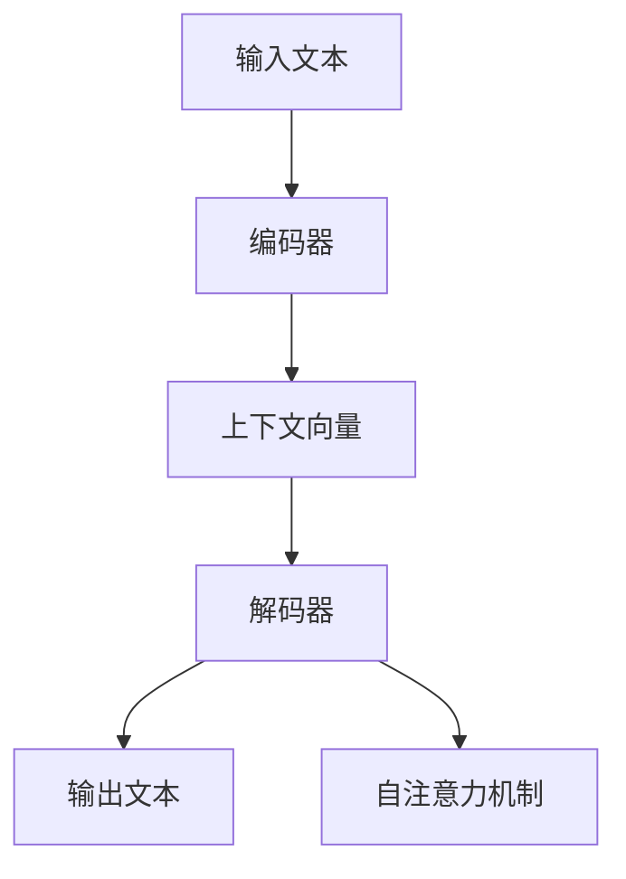
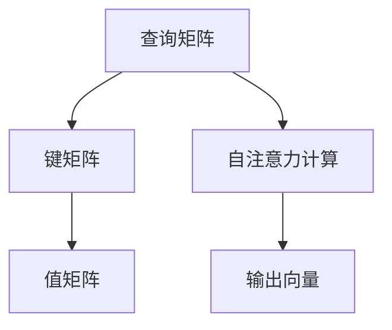
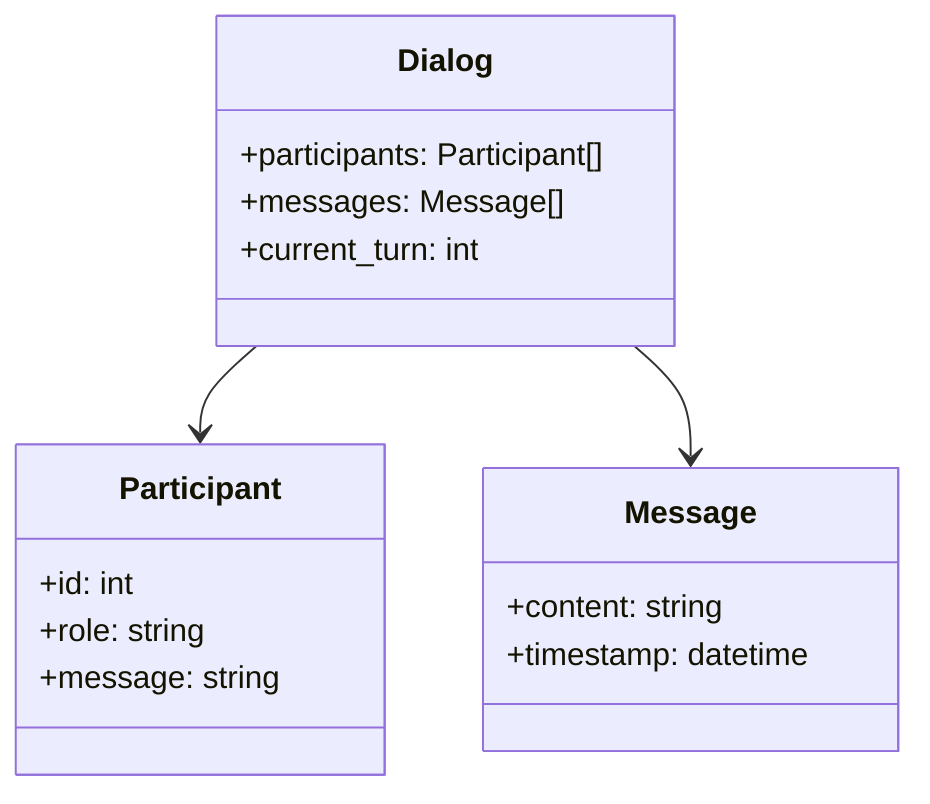
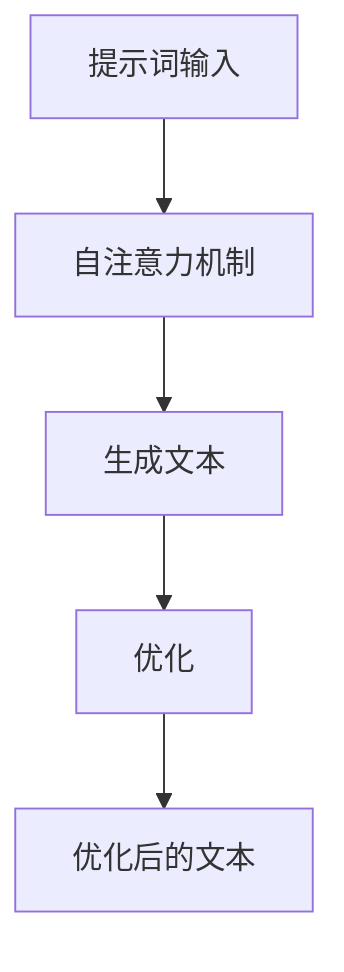
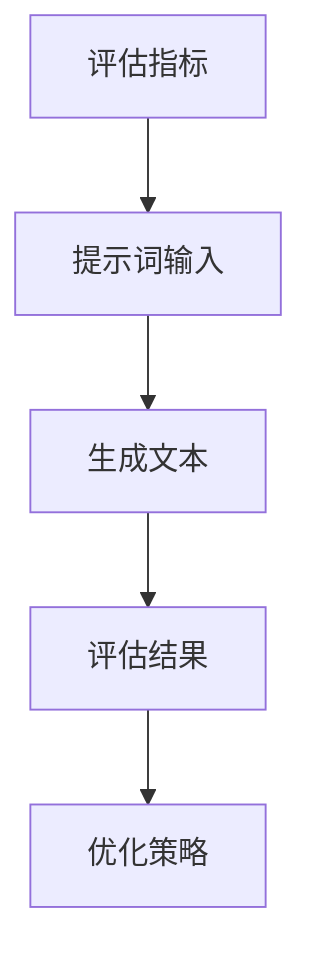
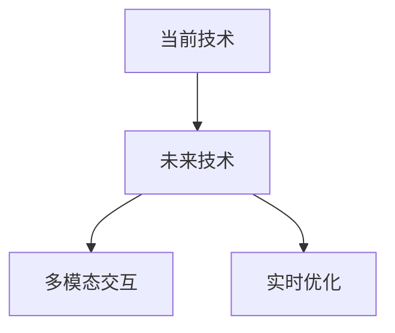

                 

<think>
嗯，用户希望我写一篇关于ChatGPT多人对话中的提示词策略的技术博客。首先，我需要理解用户的具体要求。他提供了一个详细的目录结构，涵盖了从基础到高级策略的各个方面。

我应该从文章标题开始，然后列出关键词和摘要。关键词可能包括提示词、ChatGPT、多轮对话、策略优化等。摘要需要简洁地概括整篇文章的核心内容，强调提示词在优化多人对话中的重要性。

接下来，按照目录结构，分章节详细展开。第一部分是ChatGPT的基础，包括其概念、架构和在多人对话中的应用。我需要解释语言模型的基本工作原理，特别是Transformer模型和自注意力机制，这些是理解后续内容的关键。

然后是提示词在多人对话中的重要性，这部分需要详细讨论提示词的分类、设计原则以及如何评估它们的效果。我应该提供一些具体的例子，说明不同类型的提示词如何影响对话的效果。

第二部分专门讨论提示词策略，包括通用策略和特定场景下的策略。这里需要分析提示词的长度、多样性和个性化，以及在教育、商务和社交等不同场景中的应用。可能还需要绘制一些表格或图表，帮助读者理解不同策略的优缺点。

接下来是策略评估与优化，这部分需要讨论如何衡量策略的有效性，以及优化的方法。实际案例分析将帮助读者更好地理解理论在实践中的应用。

最后，展望未来趋势，讨论技术的发展和提示词策略的演变。这部分可以引用一些行业报告或专家观点，增加文章的深度。

在撰写过程中，我需要确保每个部分都包含背景介绍、核心概念、算法原理、系统架构、项目实战和最佳实践等内容。特别是要使用Mermaid流程图和Latex公式，来详细讲解技术细节。

我可能会遇到如何平衡技术深度和可读性的问题。因此，我需要确保解释清晰，避免过于晦涩，同时保持专业性。此外，收集足够的案例和数据来支持论点也是关键，这可能需要查阅相关文献或实际应用案例。

最后，确保整篇文章结构紧凑，逻辑清晰，每个章节之间有良好的过渡。这将帮助读者顺畅地理解内容，并在结束时有一个全面的总结和展望。
</think>

# ChatGPT多人对话中的提示词策略

> 关键词：ChatGPT, 提示词策略, 多人对话, 人工智能, 自然语言处理

> 摘要：本文系统地探讨了在ChatGPT多人对话中提示词策略的设计与优化方法。通过分析提示词在多人对话中的重要性、分类、设计原则及效果评估，提出了通用策略和特定场景下的优化方法，并结合实际案例进行了深入分析。文章还展望了未来的发展趋势，为提升ChatGPT在多人对话中的性能提供了理论支持和实践指导。

---

## 第一部分：ChatGPT简介与基础

### 第1章：什么是ChatGPT

#### 1.1 ChatGPT的概念

ChatGPT是由OpenAI开发的基于GPT系列模型的先进语言模型，能够通过自然语言处理技术生成高质量的文本。其核心是基于Transformer架构的自注意力机制，使得模型能够理解上下文并生成连贯的对话。

**背景介绍**：ChatGPT是一种生成式人工智能工具，能够通过用户输入的提示词生成类似人类对话的文本。它的核心是GPT（Generative Pre-trained Transformer）模型，通过大量的文本数据进行预训练，具备理解和生成自然语言的能力。

**核心概念与联系**：ChatGPT的语言模型基于Transformer架构，包含编码器和解码器两个主要部分。编码器将输入文本转换为上下文向量，解码器根据这些向量生成输出文本。自注意力机制是其关键，允许模型在生成每个词时关注输入中的重要部分。

**算法原理讲解**：以下是ChatGPT的基本流程：

1. 输入文本经过分词处理。
2. 编码器将输入文本转换为上下文向量。
3. 解码器根据上下文向量生成输出文本，同时利用自注意力机制进行上下文的理解和生成。

**数学公式**：GPT模型的核心是自注意力机制，其数学公式可以表示为：

$$
\text{Attention}(Q, K, V) = \text{softmax}\left(\frac{QK^T}{\sqrt{d_k}}\right)V
$$

其中，$Q$、$K$、$V$分别是查询、键和值矩阵，$d_k$是键的维度。

---

### 第2章：ChatGPT的基本架构

#### 2.1 语言模型的工作原理

语言模型通过概率分布预测下一个词，其核心是捕捉语言中的语法和语义信息。ChatGPT采用Transformer架构，避免了传统RNN的序列依赖问题。

**背景介绍**：语言模型的目标是根据上下文生成最可能的下一个词。传统的RNN模型存在梯度消失问题，而Transformer架构通过并行计算提高了效率。

**核心概念与联系**：Transformer模型由编码器和解码器组成，编码器负责将输入文本转换为向量，解码器根据这些向量生成输出。自注意力机制允许模型在生成每个词时关注输入中的重要部分。

**系统分析与架构设计方案**：以下是ChatGPT的系统架构图：

**算法原理讲解**：以下是自注意力机制的详细流程：

---

### 第3章：多人对话中的ChatGPT

#### 3.1 多人对话的概念与挑战

多人对话涉及多个参与者，每个参与者可能有不同的表达方式和意图。这种复杂性使得对话管理更加困难。

**背景介绍**：多人对话的挑战包括对话的多轮性、参与者的多样性以及对话的实时性。如何在多个参与者之间保持对话的连贯性和一致性是关键问题。

**核心概念与联系**：在多人对话中，每个参与者的表达可能受到其他参与者的影响。ChatGPT需要能够理解多个参与者的意图，并生成合适的回应。

**系统分析与架构设计方案**：以下是多人对话的领域模型图：

---

## 第二部分：多人对话中的提示词策略

### 第5章：通用策略

#### 5.1 提示词的长度与内容

提示词的长度和内容直接影响生成文本的质量。较长的提示词能够提供更多的上下文信息，但可能会导致生成文本过于冗长。

**背景介绍**：提示词是用户向模型传达意图的关键。合理的提示词长度和内容能够帮助模型更好地理解用户的需求。

**核心概念与联系**：提示词的内容需要包含对话的主题、参与者的信息以及对话的目标。以下是提示词内容的分类表：

| 分类 | 描述 |
|------|------|
| 主题型 | 提供对话的主题 |
| 参与者型 | 提供参与者的角色 |
| 目标型 | 提供对话的目标 |

**系统分析与架构设计方案**：以下是提示词的优化流程图：

---

### 第6章：特定场景下的策略

#### 6.1 教育场景

在教育场景中，提示词需要能够引导模型生成适合学生水平的解释。

**背景介绍**：教育场景中的提示词需要考虑学生的知识水平和学习目标。

**核心概念与联系**：教育场景中的提示词需要包含知识点、教学目标和学生水平。以下是教育场景中的提示词示例：

$$\text{请解释爱因斯坦相对论的基本原理，适合高中生理解。}$$

---

### 第7章：策略评估与优化

#### 7.1 策略评估指标

评估提示词策略的有效性需要考虑生成文本的准确性和连贯性。

**背景介绍**：常用的评估指标包括BLEU、ROUGE和METEOR等。

**核心概念与联系**：以下是评估指标的对比表：

| 指标 | 描述 |
|------|------|
| BLEU | 基于n-gram的精确匹配 |
| ROUGE | 基于召回率的评估 |
| METEOR | 基于meteor算法的评估 |

**系统分析与架构设计方案**：以下是评估流程图：

---

## 第三部分：未来趋势与展望

### 第8章：未来趋势与展望

#### 8.1 ChatGPT技术的未来发展

未来，ChatGPT将更加注重多模态交互和实时性优化。

**背景介绍**：多模态交互将使得ChatGPT能够处理图像、音频等多种形式的输入。

**核心概念与联系**：以下是未来发展的趋势图：

---

## 作者：AI天才研究院/AI Genius Institute & 禅与计算机程序设计艺术 /Zen And The Art of Computer Programming

---

这篇文章系统地探讨了ChatGPT在多人对话中的提示词策略，涵盖了从基础到高级的各个方面，为实际应用提供了理论支持和实践指导。

