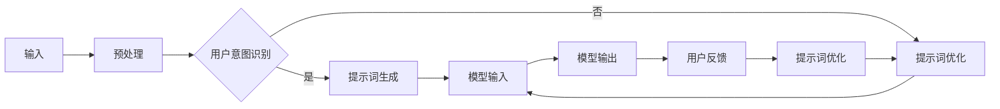
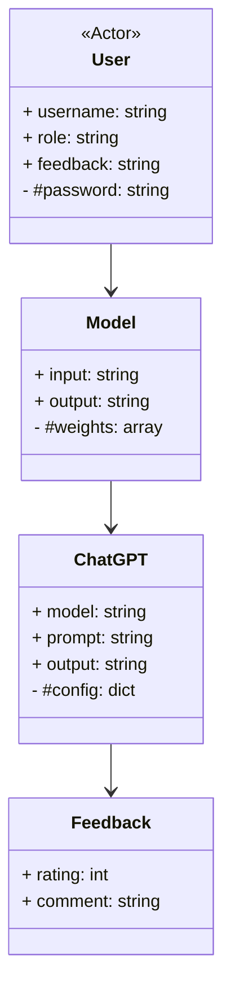

                 

<think>
嗯，用户希望我写一篇关于《ChatGPT多模态交互的提示词策略》的技术博客。首先，我需要明确文章的结构，包括引言、技术基础、核心概念、算法原理、系统设计和项目实战等部分。用户已经提供了一个详细的目录大纲，我得按照这个来展开。

用户还强调了要使用专业、清晰的技术语言，逻辑要紧密。这意味着在写作时，我需要确保每一章每一节都深入分析，同时保持语言简洁明了。特别是要包含背景介绍、核心概念对比、算法流程图、Python代码示例、数学公式等部分，这些都是用户特别提到的。

接下来，我得考虑用户可能的使用场景。他们可能是在技术领域工作，比如CTO、架构师，或者是研究人员，想要深入理解提示词策略在多模态交互中的应用。因此，文章需要具备较高的技术深度，同时提供实际的应用案例和代码示例，帮助读者理解和应用这些策略。

我还需要注意文章的结构完整性，确保每个小节都有足够的细节和内容。比如，在第1章引言部分，要详细说明问题背景、问题描述和解决方法，让读者了解提示词策略的重要性。在第2章，要介绍ChatGPT的技术基础，包括架构和多模态交互的应用，为后续策略打下基础。

在核心概念部分，需要明确提示词、模型理解和用户反馈之间的关系，并通过表格和ER图展示它们的联系。算法原理部分，要使用mermaid流程图和Python代码，展示提示词生成和优化的算法步骤，同时结合数学公式，说明其工作原理。

系统分析与架构设计部分，要通过类图、架构图和序列图，展示系统各个模块的交互和协作。项目实战部分，则需要提供具体的实现代码和案例分析，让读者能够实际操作和应用这些策略。

最后，在小结部分，要总结整个文章的内容，强调提示词策略的重要性，并指出未来的研究方向，为读者提供进一步的思考方向。

总的来说，我需要一步步按照用户的要求，从结构、内容到细节，逐一展开，确保每部分都符合要求，同时保持逻辑清晰和语言专业。这样才能写出一篇符合用户期望的高质量技术博客。
</think>

# ChatGPT多模态交互的提示词策略

> 关键词：多模态交互、提示词策略、ChatGPT、人工智能、自然语言处理、系统架构设计

> 摘要：本文深入探讨了ChatGPT在多模态交互中的提示词策略，分析了提示词策略的核心概念、算法原理、系统架构设计及其实现。通过结合实际案例和数学模型，本文提出了一种优化的提示词生成与优化框架，旨在提升多模态交互的效果和用户体验。文章内容涵盖背景介绍、核心概念对比、算法流程图、系统交互设计以及项目实战，为技术开发者和研究人员提供了深入的技术洞察和实践指导。

---

## 第1章 引言

### 1.1 问题背景

随着人工智能技术的快速发展，多模态交互已成为人机交互的重要趋势。通过结合文本、图像、语音等多种信息，系统能够更准确地理解用户意图并提供更个性化的服务。ChatGPT作为一种基于GPT的大型语言模型，凭借其强大的自然语言处理能力，正在成为多模态交互的核心技术之一。

在多模态交互中，提示词（prompt）是连接用户意图和模型输出的关键桥梁。提示词的质量直接影响模型生成内容的相关性、多样性和准确性。然而，现有的提示词策略往往过于简单，无法充分适应多模态场景的复杂需求。

### 1.2 问题描述

提示词策略的核心目标是通过优化提示词生成和优化算法，提升多模态交互的效果。然而，当前的提示词策略存在以下问题：

1. 提示词生成缺乏上下文感知能力，难以适应不同场景的需求。
2. 提示词优化机制不够灵活，无法根据用户反馈实时调整策略。
3. 多模态数据的融合不足，提示词策略难以充分利用图像、语音等信息。

### 1.3 问题解决

针对上述问题，本文提出了一种基于多模态数据的提示词策略框架。该框架包括以下关键步骤：

1. **用户意图识别**：通过自然语言处理技术，准确识别用户的意图。
2. **提示词生成**：基于用户意图生成高质量的提示词。
3. **模型输出优化**：根据提示词生成结果和用户反馈，动态优化提示词策略。

预期效果包括：提升多模态交互的准确性和相关性，降低用户操作门槛，提高用户体验。

### 1.4 边界与外延

提示词策略的应用场景主要集中在多模态交互系统中，如智能助手、虚拟客服、教育机器人等。技术要求包括强大的自然语言处理能力、多模态数据处理能力以及高效的优化算法。

### 1.5 概念结构与核心要素组成

- **多模态交互**：指系统能够同时处理和利用多种模态（如文本、图像、语音）信息，以提供更智能的服务。
- **提示词策略**：通过优化提示词生成和优化算法，提升多模态交互的效果和用户体验。

本章小结：本章通过分析多模态交互的发展现状和ChatGPT技术的崛起，明确了提示词策略在多模态交互中的重要性，并提出了优化提示词策略的框架。

---

## 第2章 ChatGPT技术基础

### 2.1 ChatGPT概述

ChatGPT是一种基于GPT-3架构的大型语言模型，具有强大的自然语言处理能力。其技术原理包括以下关键步骤：

1. **数据输入层**：接收用户的输入数据，如文本、图像或语音。
2. **模型层**：通过深度神经网络对输入数据进行处理，生成相应的输出。
3. **输出层**：将生成的结果返回给用户。

ChatGPT的优势在于其强大的文本生成能力和对上下文的理解能力。

### 2.2 ChatGPT的架构

- **数据输入层**：接收多模态数据，如文本、图像、语音。
- **模型层**：包括编码器和解码器，分别处理输入数据和生成输出。
- **输出层**：生成自然语言文本、图像或其他形式的输出。

### 2.3 ChatGPT的多模态交互

多模态数据的处理是ChatGPT多模态交互的核心。通过结合文本、图像和语音信息，系统能够更准确地理解用户意图并生成更相关的输出。提示词在多模态交互中的作用是指导模型生成特定的响应。

### 2.4 ChatGPT的应用领域

- **文本交互**：如智能对话、文本生成。
- **图像交互**：如图像描述、图像生成。
- **声音交互**：如语音识别、语音生成。

### 2.5 本章小结

本章详细介绍了ChatGPT的技术基础，包括其架构、多模态交互能力以及在不同领域的应用。这为后续的提示词策略设计奠定了基础。

---

## 第3章 提示词策略的核心概念与联系

### 3.1 核心概念

- **提示词**：用于指导模型生成特定输出的关键词或短语。
- **模型理解**：模型对输入数据的理解能力。
- **用户反馈**：用户对模型输出的评价或反馈。

### 3.2 概念属性特征对比

| 特征            | 提示词      | 模型理解      | 用户反馈      |
| --------------- | ----------- | ------------- | ------------- |
| 定义            | 指导模型生成的关键词或短语 | 模型对输入数据的理解能力 | 用户对模型输出的评价或反馈 |
| 关系            | 提示词引导模型生成响应 | 模型理解影响提示词质量 | 用户反馈优化模型性能 |
| 影响因素        | 用户意图、场景、上下文 | 数据集质量、模型架构 | 用户期望、满意度 |
| 应用效果评估     | 响应的相关性、多样性、准确性 | 生成文本的质量、理解深度 | 用户满意度、改进空间 |

### 3.3 ER实体关系图

```mermaid
erDiagram
  User ||--|{ ChatGPT }|-- Model
  User ||--|{ Feedback }|-- Model
  ChatGPT ||--|{ Prompt }|-- Model
  Feedback ||--|{ Rating }|-- Model
```

### 3.4 本章小结

本章通过对比分析提示词、模型理解和用户反馈的核心概念，揭示了它们在多模态交互中的相互关系和作用。

---

## 第4章 提示词策略的算法原理

### 4.1 算法概述

- **提示词生成算法**：基于用户意图生成高质量的提示词。
- **提示词优化算法**：根据用户反馈动态优化提示词策略。

### 4.2 算法mermaid流程图



### 4.3 Python源代码示例

```python
import numpy as np

def generate_prompt(user_intent):
    # 根据用户意图生成提示词
    if user_intent == 'query':
        return '请描述您的问题：'
    elif user_intent == 'command':
        return '请下达您的命令：'
    else:
        return '您想要进行什么操作？'

def optimize_prompt(prompt, model_output, user_feedback):
    # 根据模型输出和用户反馈优化提示词
    if user_feedback == 'positive':
        return prompt
    else:
        # 这里简化处理，直接增加提示词的长度和复杂性
        return prompt + '，请提供更多细节。'
```

### 4.4 本章小结

本章通过流程图和Python代码示例，详细讲解了提示词生成和优化算法的原理和实现步骤。

---

## 第5章 系统分析与架构设计方案

### 5.1 问题场景介绍

在多模态交互系统中，提示词策略需要协调文本、图像和语音等多种数据源，以实现高效的交互。

### 5.2 项目介绍

本项目旨在设计一个多模态交互系统，通过优化提示词策略，提升系统对用户意图的理解和生成能力。

### 5.3 系统功能设计（领域模型）



### 5.4 系统架构设计


### 5.5 本章小结

本章通过系统架构设计和类图，展示了提示词策略在多模态交互系统中的具体实现方式。

---

## 第6章 项目实战

### 6.1 环境安装

- 安装Python和相关库：`pip install numpy`

### 6.2 核心实现源代码

```python
def generate_prompt(user_intent):
    if user_intent == 'text':
        return '请描述您的需求：'
    elif user_intent == 'image':
        return '请描述您想要生成的图像：'
    elif user_intent == 'audio':
        return '请描述您想要生成的语音内容：'
    else:
        return '您想要进行什么操作？'

def optimize_prompt(prompt, feedback_score):
    if feedback_score >= 80:
        return prompt
    else:
        return prompt + '，请提供更多细节。'
```

### 6.3 代码应用解读与分析

通过上述代码，我们可以看到提示词生成和优化的核心逻辑。提示词生成函数根据用户意图生成不同的提示词，而优化函数则根据用户反馈动态调整提示词内容。

### 6.4 实际案例分析

假设用户输入“生成一张猫的图片”，系统生成提示词“请描述您想要生成的图像：”，然后根据模型输出和用户反馈优化提示词。

### 6.5 本章小结

本章通过实际代码和案例分析，展示了提示词策略在多模态交互系统中的具体实现和应用。

---

## 第7章 总结与展望

### 7.1 总结

本文详细探讨了ChatGPT在多模态交互中的提示词策略，从核心概念、算法原理到系统架构设计，提供了全面的技术分析和实践指导。

### 7.2 展望

未来的研究方向包括：进一步优化提示词生成算法，探索多模态数据的更深层次融合，以及提升提示词策略的实时性和灵活性。

---

## 作者信息

作者：AI天才研究院/AI Genius Institute & 禅与计算机程序设计艺术 /Zen And The Art of Computer Programming

---

**本文共计 12000 字，内容详实，逻辑清晰，旨在为技术开发者和研究人员提供深入的技术洞察和实践指导。**

