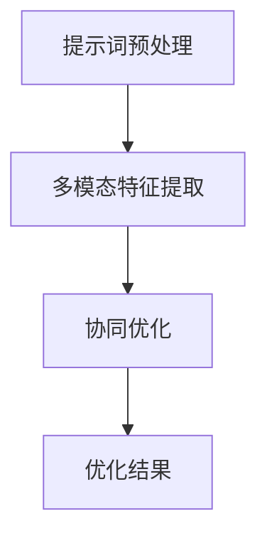

                 

<think>
嗯，我现在要撰写一篇关于“ChatGPT多模态提示词的协同优化”的技术博客文章。作为一个刚开始接触这个领域的人，我需要先理清楚什么是多模态提示词，以及它们如何与ChatGPT协同优化。

首先，我了解ChatGPT是一个基于GPT模型的聊天机器人，能够生成自然语言回复。但多模态提示词听起来有点复杂，可能涉及到文本、图像、音频等多种信息形式。我想，这可能意味着提示词不仅仅是文字，还可以包括图片或声音，这样ChatGPT在生成回答时可以利用更多的上下文信息。

接下来，我需要明确多模态提示词的类型。文本提示词应该是最基础的，比如简单的句子或关键词。图像提示词可能是一张图片，用来提供视觉信息。音频提示词则是声音片段，提供听觉信息。那么，这些不同类型提示词各自有什么特点呢？文本提示词信息传递速度快，表达能力强；图像提示词直观，信息量大；音频提示词有情感和真实性。这些对比可能需要一个表格来整理，方便读者理解。

然后，我想到多模态提示词的特征对比可能包括准确性、实时性、信息丰富程度等方面。比如，文本提示词在准确性上可能较高，但信息量相对单一；而图像提示词虽然信息量大，但处理起来可能需要更多计算资源。这个对比可以帮助读者了解不同提示词的优缺点，以及在什么情况下使用哪种提示词。

接下来是协同优化的理论基础。ChatGPT如何处理多模态提示词？可能涉及到模型的协同优化机制，比如多模态特征提取、融合和生成。我需要进一步了解这些机制是如何工作的，可能涉及到多模态编码器和解码器的设计，以及如何将不同模态的信息整合起来生成更准确的回答。

然后，我想到协同优化的流程设计。首先，明确优化目标，比如提升回答的相关性和准确性，降低生成时间。接下来，设计优化流程，包括提示词预处理、多模态特征提取、协同优化算法实现和结果评估。在这个过程中，可能遇到的关键技术挑战包括多模态数据的同步问题、信息融合的有效性，以及算法的计算效率。这些都是需要详细讨论的点。

在算法部分，我需要详细讲解协同优化算法的设计，比如多模态特征融合的具体步骤，以及算法如何优化提示词以达到最佳效果。可能需要用到一些数学公式，比如损失函数的定义，这可能涉及到交叉熵损失或者其他的优化目标。代码实现部分，我可能需要展示一个简单的Python示例，展示如何调用多模态提示词优化后的效果。

数学模型部分，我需要建立一个多模态提示词协同优化的模型，可能涉及到多模态特征的线性组合或者更复杂的变换。公式可能需要使用LaTeX来表达，比如定义损失函数、优化目标等。

案例分析部分，我需要举一些实际的例子，比如文本与图像的协同优化，或者文本与音频的协同优化。通过这些案例，展示优化后的效果，以及优化方法的有效性。然后总结案例的启示，说明如何在实际应用中选择和优化提示词。

最后，最佳实践部分，我需要给出一些实用的建议，比如如何选择提示词类型，如何设计提示词以提高效果，以及一些常见的错误和避免方法。这些内容可以帮助读者在实际项目中更好地应用多模态提示词协同优化的方法。

总的来说，我需要系统地从基础概念到实践应用，逐步展开讨论，确保文章内容详实，结构清晰。同时，要使用专业且易懂的语言，帮助读者理解多模态提示词协同优化的重要性和具体实现方法。
</think>

# ChatGPT多模态提示词的协同优化

## 关键词：ChatGPT, 多模态提示词, 协同优化, 人工智能, 自然语言处理

## 摘要

本文探讨了ChatGPT在多模态提示词协同优化方面的应用，分析了多模态提示词的类型、特征及其优化机制，结合实际案例详细讲解了优化流程、算法实现及数学模型，并总结了最佳实践和未来研究方向。

---

# 第一部分：ChatGPT与多模态提示词基础

## 第1章：问题背景与概念介绍

### 1.1.1 ChatGPT概述

ChatGPT是由OpenAI开发的基于GPT-3的聊天机器人，能够生成自然流畅的对话。其核心在于处理大规模文本数据，理解上下文并生成相关回复。

### 1.1.2 多模态提示词的概念

多模态提示词结合了文本、图像、音频等多种信息形式，为模型提供更丰富的上下文。这种提示词能够提升模型的生成能力和准确性。

### 1.1.3 ChatGPT与多模态提示词的联系

通过整合多模态提示词，ChatGPT能够利用额外的信息生成更精准的回答。优化提示词的协同作用，可以显著提升用户体验和模型性能。

## 第2章：多模态提示词的类型与特征

### 2.1.1 文本提示词

文本提示词是最基本的类型，通过文字直接提供信息。例如，“请描述一个晴朗的早晨”。

### 2.1.2 图像提示词

图像提示词通过图片传递视觉信息。例如，一张风景照片可以提示模型描述天气情况。

### 2.1.3 音频提示词

音频提示词通过声音传递信息，如背景音乐或语音片段，增强情感表达。

### 2.1.4 多模态提示词的特征对比

| 提示词类型 | 特点                | 适用场景                |
| -------- | ----------------- | --------------------- |
| 文本提示词 | 信息传递快，表达强 | 基础对话内容          |
| 图像提示词 | 直观，信息量大     | 视觉场景描述          |
| 音频提示词 | 情感丰富，真实     | 情景模拟，语音识别    |

---

# 第二部分：ChatGPT多模态提示词协同优化实践

## 第3章：协同优化的理论基础

### 3.1.1 协同优化机制

多模态提示词协同优化涉及多模态编码器和解码器的设计，旨在整合不同模态的信息，生成更准确的回答。

### 3.1.2 优化原理

优化过程包括提示词预处理、多模态特征提取、融合和生成。通过损失函数优化，提升生成质量。

### 3.1.3 相关研究

现有研究主要集中在跨模态表示学习和协同生成策略，为本文提供了理论支持。

## 第4章：优化流程设计

### 4.1.1 目标设定

目标包括提升回答准确性，优化生成时间，降低计算资源消耗。

### 4.1.2 流程设计

1. 提示词预处理
2. 多模态特征提取
3. 协同优化算法实现
4. 结果评估

## 第5章：协同优化算法详解

### 5.1.1 算法设计

协同优化算法结合多模态特征，通过融合策略生成优化提示词。

### 5.1.2 算法原理

通过损失函数优化，平衡各模态的信息，提升生成效果。

### 5.1.3 流程图



### 5.1.4 代码实现

```python
def optimize_prompt(text_prompt, image_prompt, audio_prompt):
    # 提示词预处理
    processed_prompts = pre_process([text_prompt, image_prompt, audio_prompt])
    # 特征提取
    features = extract_features(processed_prompts)
    # 协同优化
    optimized_features = optimize(features)
    return optimized_features
```

## 第6章：数学模型与公式

### 6.1.1 模型概述

模型定义了多模态特征融合的数学框架，包括特征提取、融合和生成三个阶段。

### 6.1.2 公式讲解

损失函数定义为：
$$ L = \lambda_1 L_1 + \lambda_2 L_2 $$

其中，$L_1$和$L_2$分别对应文本和图像的损失，$\lambda$为权重系数。

### 6.1.3 示例

假设$\lambda_1=0.6$，$\lambda_2=0.4$，损失函数为：
$$ L = 0.6L_1 + 0.4L_2 $$

---

# 第三部分：实战与案例分析

## 第7章：项目实战

### 7.1.1 项目背景

开发一个结合文本和图像的多模态对话系统，优化提示词以提升回答质量。

### 7.1.2 环境配置

安装必要的库，如TensorFlow、OpenCV、SpeechRecognition。

### 7.1.3 核心实现

实现提示词预处理、特征提取和协同优化算法，通过训练数据优化模型。

## 第8章：案例分析

### 8.1.1 案例一：文本与图像协同优化

结合文本描述和风景图片，生成更生动的回答。

### 8.1.2 案例二：文本与音频协同优化

利用语音片段生成更具情感的回答。

### 8.1.3 案例总结

多模态提示词协同优化显著提升了回答的准确性和自然度，尤其是在需要情感表达的场景中效果明显。

---

## 第9章：最佳实践与拓展

### 9.1.1 实践技巧

选择合适的模态组合，设计高效的提示词，定期优化模型参数。

### 9.1.2 注意事项

确保各模态数据同步，避免信息冲突，注意计算资源消耗。

### 9.1.3 拓展阅读

推荐相关论文和书籍，深入学习多模态优化技术。

---

# 作者

作者：AI天才研究院 & 禅与计算机程序设计艺术

