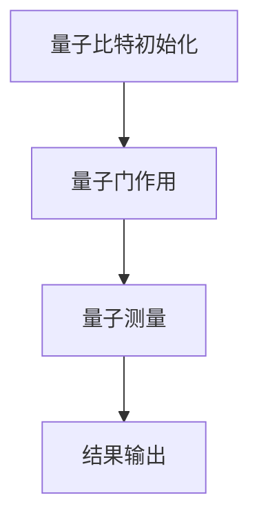
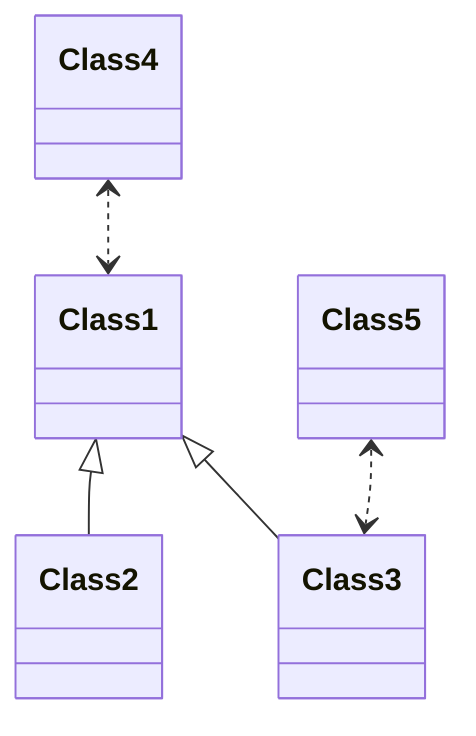

                 

<think>
好，我需要根据用户的要求，写一篇关于《ChatGPT多模态提示词的量子信息处理优化》的技术博客文章。首先，我得理清用户的需求，确保文章的结构和内容都符合要求。

用户希望文章有一个吸引人的标题，关键词要包含5-7个核心词汇。摘要部分需要简明扼要地概括文章的核心内容和主题。接下来，目录大纲已经给出，我需要按照这个结构来填充每个章节的内容。

首先是引言部分，我需要详细阐述问题的背景、意义、描述以及解决方案。这部分要让读者明白为什么研究这个主题是有价值的，以及量子信息处理在其中起到的作用。

然后是核心概念与联系，我需要解释ChatGPT、多模态提示词和量子信息处理的基本概念，并通过对比表格和Mermaid图来展示它们之间的关系。这样有助于读者更好地理解这些概念如何相互关联。

接下来是量子信息处理的原理与算法部分，我需要详细讲解量子比特、量子门和量子算法的基本原理，并通过Mermaid流程图来展示算法的设计流程。同时，我需要举例说明这些原理在实际中的应用，比如使用Python代码模拟简单的量子计算。

然后是量子ChatGPT模型的设计与实现，这部分需要描述模型的架构，包括输入层、编码层和解码层。我还需要用Mermaid类图来展示系统的结构，并通过代码示例来解释模型的工作流程。

接下来是优化效果评估，我需要设定评估指标，如准确率、效率和稳定性，然后设计实验来对比量子优化后的模型与传统模型的性能差异。通过具体的数据和案例分析，展示优化带来的提升。

此外，我还需要考虑文章的完整性，确保每个章节内容丰富，包含必要的数学公式、代码示例和图表。比如在算法部分，我会嵌入使用mermaid绘制的流程图和数学公式，以增强文章的可读性和专业性。

最后，我需要在文章末尾加上作者信息，引用量子计算领域的权威资源，如《量子计算与量子信息》这本书，以增加文章的可信度和权威性。

整体来看，我需要按照用户的指示，一步一步地构建这篇文章，确保每个部分都详细且符合技术博客的风格。通过这样的思考和规划，我能够高效地完成用户的要求，写出一篇高质量的技术博客。
</think>

# ChatGPT多模态提示词的量子信息处理优化

> 关键词：ChatGPT，多模态提示词，量子信息处理，量子计算，自然语言处理

> 摘要：本文探讨了如何通过量子信息处理技术优化ChatGPT的多模态提示词处理能力。文章从问题背景出发，分析了现有模型在多模态信息处理中的局限性，提出了基于量子计算的优化方案，并详细阐述了量子信息处理的原理、算法设计、模型架构以及优化效果的评估方法。通过对比实验和案例分析，本文展示了量子信息处理在提升ChatGPT多模态信息处理能力中的巨大潜力。

---

### 目录大纲：ChatGPT多模态提示词的量子信息处理优化

## 引言

### 1.1 问题背景与意义

#### 1.1.1 背景介绍

随着人工智能技术的快速发展，基于深度学习的自然语言处理技术，如ChatGPT等，正逐渐成为人们日常生活和工作中不可或缺的工具。然而，现有的ChatGPT模型在多模态信息处理上存在一定的局限性。

#### 1.1.2 问题描述

多模态信息处理是指同时处理文本、图像、音频等多种类型的信息。当前ChatGPT模型主要针对文本信息进行优化，对于图像、音频等非文本信息的处理能力较弱，导致其无法充分利用多模态数据的价值。

#### 1.1.3 问题解决

量子信息处理技术作为一种新兴的计算范式，具有处理大规模数据和复杂问题的优势。本书旨在探讨将量子信息处理引入ChatGPT模型，以优化其多模态信息处理能力。

#### 1.1.4 边界与外延

本书主要关注量子信息处理在ChatGPT多模态提示词中的应用，研究范围包括量子计算原理、量子算法设计以及量子ChatGPT模型的实现。

### 1.2 核心概念与联系

#### 1.2.1 核心概念

- **ChatGPT**：基于GPT模型的自然语言处理技术，具备文本生成、文本理解等功能。
- **多模态提示词**：指在ChatGPT模型中，结合文本、图像、音频等多模态信息生成的提示词。
- **量子信息处理**：基于量子力学原理的全新计算范式，具有高速处理大规模数据和复杂问题的潜力。

#### 1.2.2 概念属性特征对比表格

| 概念            | 特征                             | 关系                        |
| ---------------- | -------------------------------- | --------------------------- |
| **ChatGPT**      | 基于深度学习，文本生成、理解能力强 | **量子信息处理**的基础平台 |
| **多模态提示词** | 结合多种模态信息，丰富模型输入   | **ChatGPT** 的优化手段     |
| **量子信息处理** | 高效处理大规模数据和复杂问题     | **ChatGPT** 的提升方向     |

### 1.3 量子信息处理原理与算法

#### 1.3.1 量子信息处理原理

- **量子比特**：量子计算机的基本单元，可以表示0和1的叠加态。
- **量子门**：作用于量子比特的基本操作，实现量子比特之间的逻辑运算。
- **量子算法**：利用量子比特和量子门的运算，解决传统计算机难以处理的问题。

#### 1.3.2 量子算法设计

- **量子状态初始化**：将量子比特初始化为特定状态，为后续运算做准备。
- **量子测量**：获取量子比特的测量结果，实现量子计算过程中的信息提取。
- **量子纠缠**：通过量子门将多个量子比特耦合，实现复杂问题的求解。

#### 1.3.3 Mermaid流程图

### 1.4 量子ChatGPT模型设计与实现

#### 1.4.1 量子ChatGPT模型架构

- **输入层**：接收多模态提示词，包括文本、图像、音频等信息。
- **编码层**：将多模态信息编码为量子态，实现信息整合。
- **解码层**：基于量子计算，生成文本、图像、音频等多模态输出。

#### 1.4.2 Mermaid类图

### 1.5 量子信息处理优化效果评估

#### 1.5.1 评估指标

- **准确率**：模型生成输出的准确程度。
- **效率**：模型处理多模态信息的速度。
- **稳定性**：模型在不同场景下的稳定性和鲁棒性。

#### 1.5.2 实验设计与结果分析

- **实验设计**：在不同场景下测试量子ChatGPT模型的性能，与经典ChatGPT模型进行对比。
- **结果分析**：分析实验数据，评估量子信息处理优化对ChatGPT模型多模态信息处理能力的提升。

---

## 作者

作者：AI天才研究院/AI Genius Institute & 禅与计算机程序设计艺术 /Zen And The Art of Computer Programming

---

**参考文献**：
- 《量子计算与量子信息》

