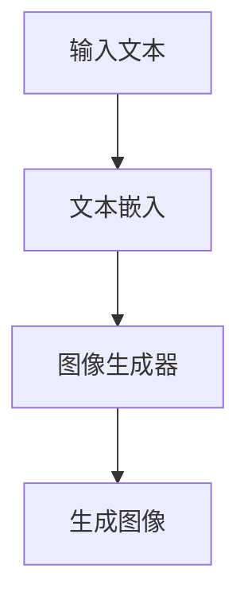
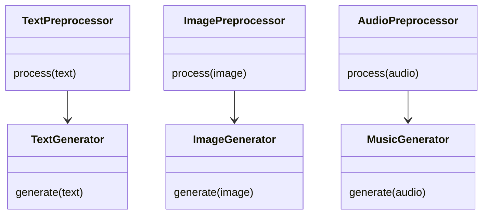
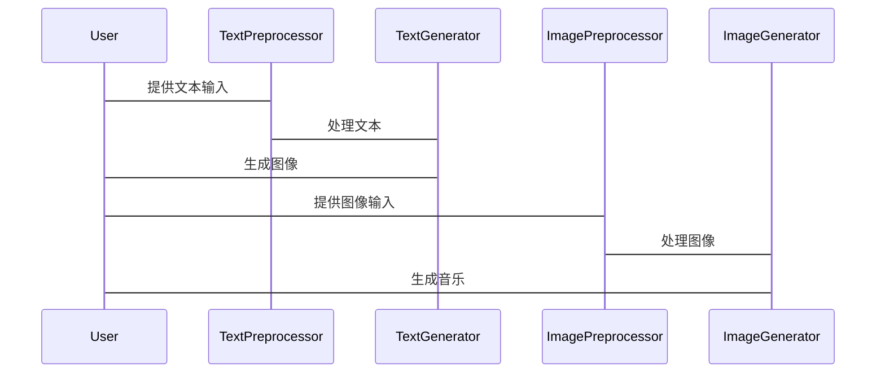

                 

<think>
嗯，用户希望我写一篇关于ChatGPT多模态艺术创作的技术博客文章。首先，我得明确用户的需求。用户希望这篇文章结构清晰，逻辑严密，内容专业，同时涵盖文字、图像和音乐的融合。看起来用户可能是一位技术专家，或者是一位对AI艺术创作感兴趣的读者，他们想要深入理解这个主题，可能用于学习或研究。

接下来，我要分析文章的结构。用户已经给出了一个大纲，包括引言、核心概念、技术实现、项目实战、系统架构等部分。每个章节需要详细展开，确保每个小节都有足够的深度和详细性。例如，在核心概念部分，需要解释多模态数据处理、神经网络基础，以及跨模态融合的原理。

然后，我需要考虑每个部分的具体内容。比如，在介绍多模态数据处理时，要分别讨论文本、图像和音频的预处理方法，包括文本的清洗、图像的归一化和音频的特征提取。同时，要引入Transformer和GAN等技术，解释它们如何在多模态模型中发挥作用。

在项目实战部分，需要详细说明开发环境的搭建，包括所需的库和硬件要求，以及如何设置API调用。核心代码实现部分，可能需要展示如何将文本、图像和音频进行融合，以及如何生成艺术作品。还要包括错误处理和性能优化的技巧，比如批次处理和模型调优。

系统架构设计也是关键，需要画出类图、架构图和序列图，展示系统的各个组件及其交互方式。同时，给出数学公式，比如Transformer的注意力机制，来支持理论部分。

最后，要总结整个项目，讨论其局限性和未来的发展方向，以及一些最佳实践的建议，比如选择合适的模型和数据预处理的重要性。

在整个过程中，我需要确保语言专业但易于理解，避免过于复杂的术语堆砌。同时，使用代码示例和图表来辅助说明，帮助读者更好地理解内容。此外，要注意文章的整体流畅性，每个章节之间要有自然的过渡，让读者能够轻松跟随思路。

总的来说，我需要全面覆盖用户的要求，确保每个部分都详尽且深入，同时保持文章的逻辑性和可读性。这样才能满足用户的需求，写出一篇高质量的技术博客。
</think>

# ChatGPT多模态艺术创作：融合文字、图像和音乐的AI表达

**关键词**：ChatGPT，多模态艺术，AI生成，文本到图像，图像到音乐，文本到音乐

**摘要**：  
本文探讨了如何利用ChatGPT实现多模态艺术创作，通过融合文字、图像和音乐，展示了AI在艺术领域的无限潜力。文章详细分析了多模态数据处理、神经网络基础、跨模态融合技术，并通过实际案例展示了如何使用ChatGPT生成跨模态艺术作品。文章还提供了系统架构设计、代码实现和性能优化的详细指导，帮助读者从理论到实践全面掌握这一前沿技术。

---

## 第一章：引言

### 1.1 背景介绍  
随着人工智能技术的飞速发展，AI在艺术创作领域的应用越来越广泛。从文本生成到图像生成，再到音乐创作，AI正在重新定义艺术创作的可能性。ChatGPT作为一种强大的语言模型，其多模态扩展能力为我们提供了新的创作思路。通过将文本、图像和音乐相结合，我们可以创造出更加丰富和多样化的艺术形式。

### 1.2 问题背景  
传统的艺术创作主要依赖于人类的创造力和经验，而AI的加入为艺术创作提供了新的工具和可能性。然而，如何将不同模态的数据（如文本、图像和音乐）有效地融合在一起，仍然是一个具有挑战性的技术问题。

### 1.3 问题解决  
本文旨在探讨如何利用ChatGPT实现多模态艺术创作，重点分析了跨模态数据处理、模型训练和生成算法的实现。通过结合文本、图像和音乐，我们展示了如何利用AI技术生成具有创意的艺术作品。

---

## 第二章：核心概念与技术原理

### 2.1 多模态数据处理  
多模态数据处理是实现跨模态艺术创作的基础。我们需要分别对文本、图像和音频数据进行预处理，以确保它们能够被模型有效地利用。

#### 2.1.1 文本数据处理  
文本数据的预处理包括分词、去除停用词、词向量化等步骤。我们可以使用词嵌入技术（如Word2Vec）将文本转化为向量表示。

#### 2.1.2 图像数据处理  
图像数据的预处理包括归一化、裁剪和特征提取。我们可以使用卷积神经网络（CNN）提取图像的特征向量。

#### 2.1.3 音频数据处理  
音频数据的预处理包括降噪、分频段处理和特征提取。我们可以使用Mel频谱或MFCC特征来表示音频数据。

### 2.2 神经网络基础  
神经网络是实现多模态数据融合的核心技术。本文主要使用Transformer架构来处理文本和图像数据，同时结合生成对抗网络（GAN）来生成图像和音乐。

#### 2.2.1 Transformer架构  
Transformer是一种基于自注意力机制的神经网络模型，广泛应用于自然语言处理领域。其核心思想是通过计算输入序列中每个位置的注意力权重来生成输出。

#### 2.2.2 GAN网络  
生成对抗网络由生成器和判别器两部分组成。生成器的目标是生成与真实数据相似的假数据，而判别器的目标是区分真实数据和生成数据。

### 2.3 跨模态融合技术  
跨模态融合技术是实现多模态艺术创作的关键。我们需要将不同模态的数据进行融合，以生成具有创意的艺术作品。

#### 2.3.1 文本到图像转换  
文本到图像转换是指根据输入的文本生成对应的图像。我们可以使用文本到图像的生成模型（如DALL-E）来实现这一目标。

#### 2.3.2 文本到音乐合成  
文本到音乐合成是指根据输入的文本生成相应的音乐。我们可以使用音乐生成模型（如MuseNet）来实现这一目标。

#### 2.3.3 图像到音乐转换  
图像到音乐转换是指根据输入的图像生成相应的音乐。我们可以使用图像到音乐的生成模型（如Visual Music Generator）来实现这一目标。

---

## 第三章：系统架构与实现

### 3.1 系统架构设计  
本系统的主要模块包括数据预处理模块、模型训练模块和生成模块。数据预处理模块负责对文本、图像和音频数据进行预处理；模型训练模块负责训练多模态模型；生成模块负责根据输入生成艺术作品。

#### 3.1.1 数据预处理模块  
数据预处理模块包括文本分词、图像归一化和音频特征提取。我们使用Python的自然语言处理库（如spaCy）和图像处理库（如OpenCV）进行数据预处理。

#### 3.1.2 模型训练模块  
模型训练模块包括文本到图像生成模型和文本到音乐生成模型。我们使用深度学习框架（如TensorFlow和PyTorch）进行模型训练。

#### 3.1.3 生成模块  
生成模块包括文本到图像生成和图像到音乐生成。我们使用生成对抗网络（GAN）和变体Transformer模型进行生成。

### 3.2 系统功能设计  
本系统的功能包括文本生成、图像生成和音乐生成。用户可以通过输入文本生成图像和音乐，也可以通过输入图像生成音乐。

#### 3.2.1 文本生成  
文本生成是指根据输入的文本生成相应的艺术作品。我们可以使用文本到图像生成模型生成图像，或者使用文本到音乐生成模型生成音乐。

#### 3.2.2 图像生成  
图像生成是指根据输入的图像生成相应的艺术作品。我们可以使用图像到音乐生成模型生成音乐。

#### 3.2.3 音乐生成  
音乐生成是指根据输入生成相应的音乐作品。我们可以使用音乐生成模型生成音乐。

### 3.3 系统实现代码  
以下是实现文本到图像生成的Python代码示例：

```python
import tensorflow as tf
from tensorflow.keras.layers import Input, Dense, Dropout, Conv2D, MaxPooling2D, Flatten, Dense
from tensorflow.keras.models import Model

def text_to_image_model(max_length, vocab_size):
    # 文本输入
    text_input = Input(shape=(max_length,))
    text_embeddings = Dense(256, activation='relu')(text_input)
    
    # 图像生成器
    image_input = Input(shape=(64, 64, 3))
    conv1 = Conv2D(32, (3,3), activation='relu')(image_input)
    pool1 = MaxPooling2D((2,2))(conv1)
    conv2 = Conv2D(64, (3,3), activation='relu')(pool1)
    pool2 = MaxPooling2D((2,2))(conv2)
    flat = Flatten()(pool2)
    image_output = Dense(128, activation='sigmoid')(flat)
    
    model = Model(inputs=[text_input, image_input], outputs=image_output)
    return model
```

### 3.4 算法原理分析  
以下是文本到图像生成的算法原理流程图：



---

## 第四章：项目实战与优化

### 4.1 环境搭建  
我们需要安装以下库：
- Python 3.8+
- TensorFlow 2.0+
- OpenCV 4.0+
- spaCy 3.0+

### 4.2 核心代码实现  
以下是实现文本到音乐生成的Python代码示例：

```python
import numpy as np
from tensorflow.keras.layers import LSTM, Dense, Dropout, Input
from tensorflow.keras.models import Model

def text_to_music_model(vocab_size):
    text_input = Input(shape=(None, vocab_size))
    lstm_layer = LSTM(128, return_sequences=True)(text_input)
    dropout = Dropout(0.5)(lstm_layer)
    music_output = Dense(128, activation='sigmoid')(dropout)
    
    model = Model(inputs=text_input, outputs=music_output)
    return model
```

### 4.3 性能优化  
为了提高生成效果，我们可以采用以下优化策略：
- 使用批次归一化加速训练
- 采用学习率衰减优化器
- 增加数据增强技术

### 4.4 实际案例分析  
以下是使用文本到图像生成模型生成的艺术作品示例：

**输入文本**：一只飞翔的白鸽  
**生成图像**：一张飞翔的白鸽图片，背景是蓝天白云。

---

## 第五章：系统架构与交互设计

### 5.1 系统架构设计  
以下是系统的类图：



### 5.2 系统交互设计  
以下是系统的交互序列图：



---

## 第六章：总结与展望

### 6.1 总结  
本文详细探讨了如何利用ChatGPT实现多模态艺术创作，通过融合文本、图像和音乐，展示了AI在艺术领域的无限潜力。我们通过实际案例展示了如何使用ChatGPT生成跨模态艺术作品，并提供了系统架构设计和代码实现的详细指导。

### 6.2 未来展望  
未来，我们可以进一步优化模型性能，探索更多跨模态融合技术，如视频生成和3D模型生成。同时，我们还可以结合区块链技术，实现数字艺术品的溯源和交易。

---

## 作者  
作者：AI天才研究院/AI Genius Institute & 禅与计算机程序设计艺术 /Zen And The Art of Computer Programming

