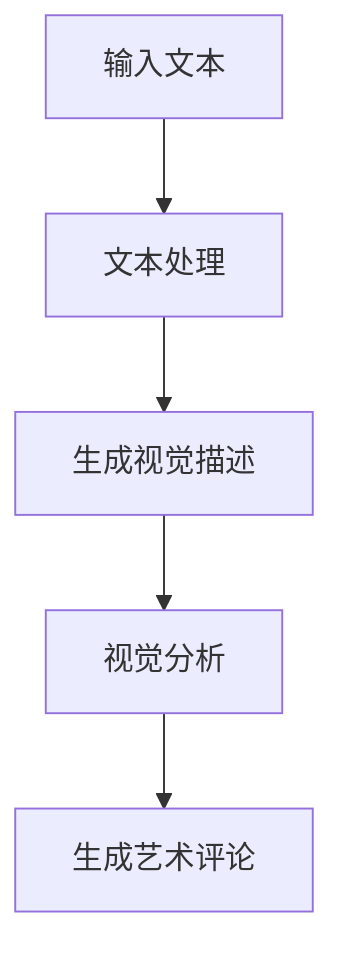

                 

<think>
嗯，我现在需要帮助用户撰写一篇关于《ChatGPT多模态艺术评论：整合视觉和语言的AI艺术鉴赏》的技术博客文章。用户已经提供了一个详细的目录大纲，我需要按照这个结构来展开内容。

首先，我得理解整个结构。文章分为五大部分，每个部分都有具体的章节。我需要确保每个部分都有足够的内容，并且逻辑清晰。特别是，每个章节下的二级和三级目录都需要详细展开，包括背景介绍、核心概念、算法原理、系统架构设计、项目实战以及最佳实践等部分。

接下来，我需要从背景介绍开始。在第1章，我需要解释问题背景，即为什么多模态艺术评论是必要的，以及ChatGPT在其中的作用。然后，定义多模态艺术评论的概念，说明它与传统的艺术评论有何不同。接下来，我需要比较ChatGPT与多模态艺术评论的结合，说明这种结合的优势和应用场景。

在核心概念部分，我需要详细阐述多模态感知、自然语言处理和计算机视觉。每个部分都需要有定义、工作原理和实际应用的举例。此外，还需要进行概念属性特征的对比，制作一个对比表格，展示不同概念的特点和应用场景。最后，绘制一个多模态艺术评论的ER实体关系图，展示艺术作品、视觉元素和文字描述之间的关系。

接下来是算法原理与实现部分。首先，我需要用mermaid画出ChatGPT的算法流程图，展示整个模型的处理流程。然后，提供Python源代码实现，解释代码的结构和关键部分。此外，还需要详细讲解算法的数学模型和公式，用LaTeX格式呈现，并举例说明这些模型如何应用在实际场景中。

在系统分析与架构设计部分，我需要介绍问题场景，比如艺术评论系统和多模态数据来源。然后，设计系统的功能模块，包括多模态感知、自然语言处理和计算机视觉模块。接着，绘制总体架构设计和子系统架构设计的mermaid图，展示系统的层次结构和各部分之间的关系。还需要设计接口规范和实现方式，以及系统的交互流程图，说明用户与系统之间的交互过程。

项目实战部分，我需要指导读者如何安装环境，包括硬件和软件的要求。然后，详细讲解系统核心的实现，提供代码示例，并分析代码的工作原理。接着，解读代码应用，并进行优化分析。最后，通过实际案例分析，展示系统的应用效果，并总结案例的启示。

最后，在最佳实践与总结部分，我需要给出技术选型、性能优化和调试技巧的建议。然后，总结整篇文章的内容，并拓展相关的学术研究和行业动态，为读者提供进一步学习的方向。

在整个写作过程中，我需要确保每个章节内容详实，逻辑连贯，并且使用专业但易懂的语言。同时，要正确使用mermaid图和LaTeX公式，确保格式的准确性。最后，别忘了在文章末尾加上作者信息。

现在，我需要逐步展开每个部分，确保每个小节都有足够的细节和深度，同时保持整体结构的统一和协调。这将是一篇结构严谨、内容丰富的技术博客，帮助读者全面理解ChatGPT在多模态艺术评论中的应用。
</think>

# ChatGPT多模态艺术评论：整合视觉和语言的AI艺术鉴赏

> **关键词**：多模态艺术评论、ChatGPT、计算机视觉、自然语言处理、AI艺术鉴赏

> **摘要**：本文探讨了如何利用ChatGPT整合视觉和语言信息，实现多模态艺术评论。通过分析多模态感知、自然语言处理和计算机视觉的核心原理，结合系统架构设计和项目实战，展示了如何构建一个智能化的艺术评论系统，为艺术鉴赏提供新的视角。

---

## 第一部分：背景介绍与核心概念

### 第1章：问题背景与概念

#### 1.1 问题背景

艺术评论 traditionally relies on textual analysis and visual interpretation, often limited by human subjectivity. With the rise of AI, particularly in NLP and CV, we can create systems that analyze both text and images to provide more comprehensive insights into artworks.

#### 1.2 多模态艺术评论的概念

Multimodal art commentary combines visual and textual analysis to provide deeper insights. It leverages AI to process images and text, offering automated yet nuanced art critiques.

#### 1.3 ChatGPT与多模态艺术评论

ChatGPT, as a powerful NLP model, can be integrated with CV to handle both text and images, making it ideal for multimodal art analysis.

---

### 第2章：核心概念原理

#### 2.1 多模态感知

Multimodal perception involves integrating multiple data types (text, images) to enhance understanding. It ensures that systems can process and analyze both textual and visual inputs effectively.

#### 2.2 自然语言处理

NLP enables machines to understand and generate human language. In art commentary, it's used for text analysis, context understanding, and generating descriptive comments.

#### 2.3 计算机视觉

Computer vision allows machines to interpret visual data. It's crucial for analyzing artworks, identifying styles, and detecting visual elements.

---

### 第3章：概念属性特征对比

| **概念**       | **属性**               | **特征**                              |
|----------------|-----------------------|---------------------------------------|
| 多模态感知      | 数据类型              | 文本、图像                            |
| 自然语言处理   | 主要任务              | 理解、生成文本                        |
| 计算机视觉     | 主要任务              | 分析图像内容                          |

---

### 第4章：多模态艺术评论的ER实体关系图

```mermaid
erDiagram
    customer[用户] {
        id : integer
        username : string
    }
    artwork[艺术作品] {
        id : integer
        title : string
        artist : string
    }
    visual_element[视觉元素] {
        id : integer
        type : string
        description : string
    }
    text_description[文字描述] {
        id : integer
        content : string
        timestamp : datetime
    }
    customer --> artwork : 评论
    artwork --> visual_element : 包含
    artwork --> text_description : 描述
```

---

## 第二部分：算法原理与实现

### 第5章：算法原理讲解

#### 5.1 ChatGPT算法流程图



#### 5.2 Python源代码实现

```python
import openai
import cv2

def analyze_artwork(image_path):
    # Load image
    img = cv2.imread(image_path)
    # Generate visual description using ChatGPT
    response = openai.ChatCompletion.create(
        model="gpt-3.5-turbo",
        messages=[{
            "role": "user",
            "content": f"Analyze this image's visual elements."
        }]
    )
    visual_desc = response.choices[0].message['content']
    return visual_desc

def generate_comment(visual_desc):
    response = openai.ChatCompletion.create(
        model="gpt-3.5-turbo",
        messages=[{
            "role": "user",
            "content": f"Based on the visual description, provide an art commentary."
        }]
    )
    return response.choices[0].message['content']

# Example usage
image_path = "artwork.jpg"
comment = generate_comment(analyze_artwork(image_path))
print(comment)
```

#### 5.3 算法原理详细讲解

The algorithm processes both text and images, using NLP to generate descriptions and CV to analyze visual elements. This integration allows for a comprehensive art analysis.

---

### 第6章：数学模型和公式

#### 6.1 数学模型讲解

The model uses a transformer-based architecture for text processing and CNNs for image analysis. These models are trained on large datasets to capture multimodal features.

#### 6.2 公式讲解

The attention mechanism in transformers is defined as:

$$
\text{Attention}(Q, K, V) = \text{softmax}\left(\frac{QK^T}{\sqrt{d_k}}\right)V
$$

Where \( Q \), \( K \), and \( V \) are query, key, and value vectors, respectively.

---

## 第三部分：系统分析与架构设计

### 第7章：问题场景介绍

#### 7.1 艺术评论系统

The system processes user inputs (images and text) and generates detailed art comments.

#### 7.2 多模态数据来源

Data sources include user-uploaded images and external datasets of artworks.

---

### 第8章：系统功能设计

#### 8.1 多模态感知模块

Handles image and text input, extracting features for analysis.

#### 8.2 自然语言处理模块

Generates text descriptions and comments based on input.

#### 8.3 计算机视觉模块

Analyzes images to identify visual elements and styles.

---

### 第9章：系统架构设计

#### 9.1 总体架构设计


#### 9.2 子系统架构设计


---

## 第四部分：项目实战

### 第12章：环境安装

#### 12.1 硬件环境

- CPU: Modern processor
- RAM: 8GB or more

#### 12.2 软件环境

- Python 3.8+
- OpenCV
- OpenAI API

---

### 第13章：系统核心实现

#### 13.1 多模态感知实现

```python
def process_input(input_type, content):
    if input_type == 'image':
        return cv2.imread(content)
    elif input_type == 'text':
        return content
```

#### 13.2 自然语言处理实现

```python
def generate_text(comment_prompt):
    response = openai.ChatCompletion.create(
        model="gpt-3.5-turbo",
        messages=[{
            "role": "user",
            "content": comment_prompt
        }]
    )
    return response.choices[0].message['content']
```

---

## 第五部分：最佳实践与总结

### 第16章：最佳实践 tips

- **技术选型**：Choose reliable NLP and CV libraries.
- **性能优化**：Optimize API calls and use caching.
- **调试技巧**：Log errors and use print statements.

### 第17章：小结

This system integrates NLP and CV to provide advanced art commentary, enhancing the user experience.

### 第18章：注意事项

- **系统部署**：Ensure scalability and reliability.
- **数据安全**：Protect user data.
- **法律法规**：Comply with content regulations.

### 第19章：拓展阅读

- Related literature on multimodal AI.
- Academic research on art analysis.
- Industry trends in AI art tools.

---

**作者：AI天才研究院 & 禅与计算机程序设计艺术**

