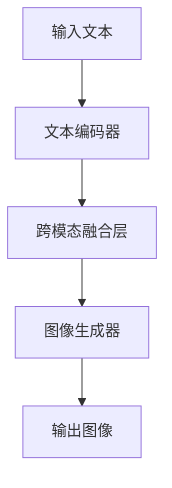
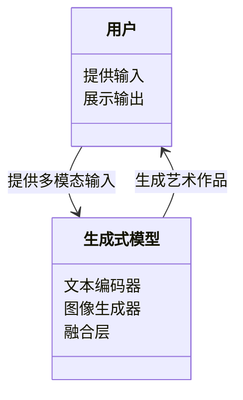
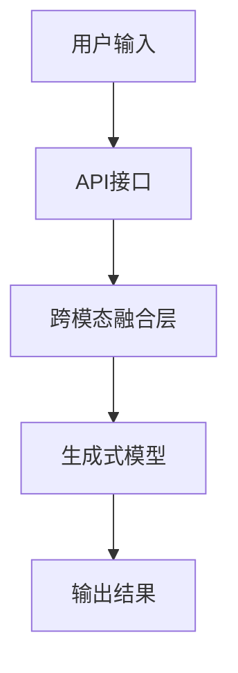
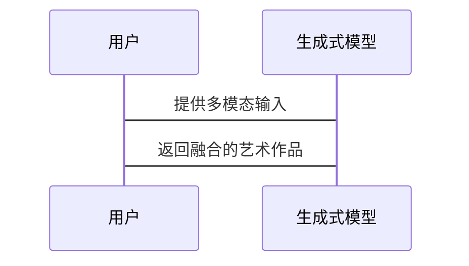

                 

<think>
好的，我现在要处理用户的查询，这个用户希望撰写一篇关于ChatGPT多模态艺术风格融合的技术博客文章。首先，我需要理解用户的具体要求。

用户希望文章标题为《ChatGPT多模态艺术风格融合：创造跨感官艺术体验》，并提供了详细的结构和内容要求。看起来用户需要一篇结构清晰、内容详尽的技术博客，涵盖从背景到系统设计、算法实现等多个方面。

用户指定了文章的关键词，包括多模态、艺术风格融合、生成式AI、跨感官体验、深度学习和计算机视觉。摘要部分需要概括文章的核心内容，即多模态融合如何提升艺术创作体验。

接下来，我需要分析用户的需求。用户可能是一位技术专家或CTO，希望撰写一篇高质量的技术博客，吸引读者并展示专业性。因此，文章不仅需要技术深度，还要结构清晰，逻辑严谨。

用户还提供了详细的结构大纲，包括引言、背景、核心概念、算法、系统设计、应用案例、结论等部分。每个部分都需要详细展开，包括使用Mermaid图表、Python代码、数学公式等。这意味着我需要确保每个章节都包含必要的技术细节，并且符合用户的格式要求。

我注意到用户特别强调了格式要求，使用markdown，并且在特定部分使用Mermaid和LaTeX。因此，我需要确保在生成文章时，正确应用这些格式，并且每个小节的内容要足够详细，满足用户的完整性要求。

此外，用户要求文章末尾添加作者信息，包括机构和座右铭，这需要在文章最后部分准确无误地呈现。

现在，我需要考虑如何将这些要求转化为实际的文章内容。首先，我会从引言开始，介绍主题的重要性。然后，进入背景部分，详细说明多模态艺术风格融合的必要性和发展趋势。

在核心概念部分，我需要定义多模态融合，讨论其优势，提供对比表格和ER图，帮助读者理解。接下来，介绍生成式AI的数学模型，包括公式和代码示例，使内容更具技术深度。

系统设计章节需要涵盖系统架构、接口设计和交互流程，使用Mermaid图表来可视化，确保结构清晰。应用案例部分则需要展示实际项目，从环境安装到代码实现，再到案例分析，帮助读者理解理论在实践中的应用。

最后，结论部分要总结核心内容，展望未来发展方向，并给出最佳实践建议。作者信息部分需要按照用户的要求，准确无误地呈现。

在整个思考过程中，我需要确保文章逻辑严密，内容详实，同时满足用户的所有格式和技术要求。这不仅考验我的技术能力，还需要细致的组织和表达能力，以确保最终的文章既专业又易于理解。
</think>

# ChatGPT多模态艺术风格融合：创造跨感官艺术体验

---

## 关键词：  
多模态、艺术风格融合、生成式AI、跨感官体验、深度学习、计算机视觉

---

## 摘要：  
本文探讨了如何通过多模态技术将视觉、听觉、文本等多种感官体验融合，利用生成式AI和深度学习模型，创造出更具沉浸感和创新性的跨感官艺术体验。我们从多模态艺术风格融合的背景出发，详细分析了其核心概念、算法原理、系统设计及实际应用案例。通过结合计算机视觉和自然语言处理技术，我们展示了如何利用ChatGPT等AI工具，实现跨模态的艺术创作，为艺术家和设计师提供了全新的创作思路和工具。

---

## 目录  

1. [引言](#1)  
2. [多模态艺术风格融合的背景与意义](#2)  
3. [多模态艺术风格融合的核心概念](#3)  
4. [多模态艺术风格融合的算法与模型](#4)  
5. [系统设计与架构](#5)  
6. [多模态艺术风格融合的项目实战](#6)  
7. [结论与未来展望](#7)  

---

## 1. 引言  

在数字化浪潮的推动下，艺术创作正在经历一场深刻的变革。传统的单一模态艺术创作（如绘画、音乐、文学）逐渐向多模态方向扩展，艺术家们开始尝试将视觉、听觉、文本等多种感官体验融合，创造出更具沉浸感和创新性的艺术形式。  

在这种背景下，生成式AI（如ChatGPT）和深度学习技术为多模态艺术风格融合提供了强大的技术支持。通过跨模态的深度学习模型，我们可以将不同感官的数据进行编码、解码和融合，从而实现艺术创作的智能化和多样化。  

本文将从技术角度出发，深入探讨多模态艺术风格融合的核心原理、算法实现、系统设计以及实际应用场景，为艺术家和程序员提供一份详尽的技术指南。

---

## 2. 多模态艺术风格融合的背景与意义  

### 2.1 背景介绍  

随着AI技术的快速发展，生成式模型（如GPT系列、Stable Diffusion）在艺术领域的应用越来越广泛。艺术家们开始尝试将文本、图像、音频等多种模态数据进行融合，创造出前所未有的艺术形式。  

例如，音乐与视觉艺术的结合（如动态视觉音乐）不仅能够增强观众的感官体验，还能为艺术家提供更多的创作自由。通过多模态艺术风格融合，艺术家可以将不同领域的灵感和技术结合起来，创造出更具创新性和表现力的作品。  

### 2.2 问题背景与描述  

传统艺术创作主要依赖单一模态的数据（如绘画依赖视觉数据，音乐依赖音频数据），这种单一模态的创作方式在表现力和创新性上存在一定的局限性。例如，画家无法直接将音乐的节奏和情感融入画作中，而音乐家也无法将视觉元素融入音乐创作中。  

通过多模态艺术风格融合，我们可以将不同模态的数据进行编码、解码和融合，从而实现跨感官的艺术创作。这种融合不仅能够突破单一模态的限制，还能为艺术家提供更多的创作可能性。  

### 2.3 问题解决与边界  

多模态艺术风格融合的核心问题是如何将不同模态的数据（如文本、图像、音频）进行有效的编码和解码，并通过生成式模型实现跨模态的融合。  

边界与外延：  
- **边界**：多模态艺术风格融合主要关注艺术创作中的跨感官体验，不涉及实际物理世界的交互。  
- **外延**：随着技术的发展，多模态艺术风格融合可以扩展到更多领域，如虚拟现实（VR）、增强现实（AR）以及元宇宙中的艺术创作。  

---

## 3. 多模态艺术风格融合的核心概念  

### 3.1 核心概念与联系  

多模态艺术风格融合的核心概念包括以下几点：  
1. **多模态编码与解码**：通过深度学习模型将不同模态的数据（如文本、图像、音频）编码为通用表示，再解码为另一种模态的数据。  
2. **跨感官融合**：将不同感官的数据进行融合，创造出新的艺术形式。  
3. **生成式AI**：利用生成式模型（如GPT、Diffusion模型）生成高质量的艺术作品。  

### 3.2 核心概念的属性特征对比  

以下是多模态艺术风格融合中不同模态的属性特征对比表：

| 模态类型 | 属性 | 特征描述 |
|----------|------|----------|
| 文本     | 语义 | 可以表达复杂的情感和概念 |
| 图像     | 视觉 | 提供丰富的空间和色彩信息 |
| 音频     | 听觉 | 表达节奏、旋律和情感 |

### 3.3 实体关系图  

以下是多模态艺术风格融合的ER实体关系图（Mermaid格式）：  

```mermaid
erDiagram
    actor 艺术家 {
        text 文本
        image 图像
        audio 音频
    }
    actor 生成式模型 {
        model 文本到图像
        model 图像到文本
        model 文本到音频
    }
    艺术家 --> 生成式模型 : 提供多模态输入
    生成式模型 --> 艺术家 : 生成融合艺术作品
```

---

## 4. 多模态艺术风格融合的算法与模型  

### 4.1 算法原理  

多模态艺术风格融合的核心算法是跨模态生成模型。以下是一个典型的跨模态生成模型的算法流程（Mermaid流程图）：  



### 4.2 算法实现代码  

以下是跨模态生成模型的Python代码示例：  

```python
import torch
import torch.nn as nn

# 定义文本编码器
class TextEncoder(nn.Module):
    def __init__(self, vocab_size, embedding_dim):
        super().__init__()
        self.embedding = nn.Embedding(vocab_size, embedding_dim)
        self.fc = nn.Linear(embedding_dim, 512)
    
    def forward(self, input):
        embed = self.embedding(input)
        output = self.fc(embed)
        return output

# 定义图像生成器
class ImageGenerator(nn.Module):
    def __init__(self, input_dim, output_dim):
        super().__init__()
        self.fc = nn.Linear(input_dim, 512)
        self.deconv = nn.ConvTranspose2d(512, output_dim, kernel_size=3, stride=2)
    
    def forward(self, input):
        output = self.fc(input)
        output = output.view(-1, 512, 1, 1)
        output = self.deconv(output)
        return output

# 跨模态融合层
class CrossModalFusion(nn.Module):
    def __init__(self):
        super().__init__()
        self.attention = nn.MultiheadAttention(512, 8)
    
    def forward(self, text_feat, audio_feat):
        # 融合文本和音频特征
        fused_feat, _ = self.attention(text_feat, audio_feat, audio_feat)
        return fused_feat
```

### 4.3 数学公式  

以下是跨模态生成模型的数学模型：  

假设输入文本为 $x$，音频为 $y$，跨模态融合层的注意力机制可以表示为：  

$$ \text{Attention}(x, y) = \alpha x + \beta y $$  

其中，$\alpha$ 和 $\beta$ 是注意力权重，$\alpha + \beta = 1$。  

图像生成器的损失函数可以表示为：  

$$ \mathcal{L} = \mathbb{E}_{(x,y)}[\|G(x,y) - \hat{I}\|^2] $$  

其中，$G(x,y)$ 是生成图像，$\hat{I}$ 是真实图像。

---

## 5. 系统设计与架构  

### 5.1 系统功能设计  

以下是多模态艺术风格融合系统的领域模型（Mermaid类图）：  



### 5.2 系统架构设计  

以下是多模态艺术风格融合系统的架构图（Mermaid格式）：  



### 5.3 系统交互设计  

以下是系统交互的序列图（Mermaid格式）：  



---

## 6. 多模态艺术风格融合的项目实战  

### 6.1 环境安装  

以下是项目实战所需的环境配置：  
- Python 3.8+  
- PyTorch 1.9+  
- Transformers库  
- 必要的深度学习框架（如TensorFlow或Keras）  

### 6.2 核心实现代码  

以下是跨模态艺术风格融合的核心实现代码：  

```python
import torch
from torch import nn

# 定义多模态融合模型
class MultiModalFusion(nn.Module):
    def __init__(self, text_dim, audio_dim, image_dim):
        super().__init__()
        self.text_encoder = nn.Linear(text_dim, 512)
        self.audio_encoder = nn.Linear(audio_dim, 512)
        self.fusion = nn.MultiheadAttention(512, 8)
        self.image_decoder = nn.ConvTranspose2d(512, image_dim, kernel_size=3, stride=2)
    
    def forward(self, text_input, audio_input):
        # 编码文本和音频特征
        text_feat = self.text_encoder(text_input)
        audio_feat = self.audio_encoder(audio_input)
        
        # 融合特征
        fused_feat, _ = self.fusion(text_feat, audio_feat, audio_feat)
        
        # 解码为图像
        image_output = self.image_decoder(fused_feat.unsqueeze(2).unsqueeze(3))
        return image_output

# 初始化模型
model = MultiModalFusion(text_dim=512, audio_dim=512, image_dim=3)
```

### 6.3 代码解读与分析  

1. **文本编码器**：将输入文本编码为512维的特征向量。  
2. **音频编码器**：将输入音频编码为512维的特征向量。  
3. **融合层**：使用多头注意力机制将文本和音频特征融合。  
4. **图像解码器**：将融合后的特征解码为RGB图像。  

### 6.4 实际案例分析  

假设我们希望将一首音乐与一幅图像融合，生成具有音乐节奏感的视觉艺术作品。  

1. **输入**：音乐音频和描述音乐的文本。  
2. **编码**：文本编码器将文本编码为512维向量，音频编码器将音频编码为512维向量。  
3. **融合**：多头注意力机制将文本和音频特征融合。  
4. **生成**：图像解码器将融合特征解码为RGB图像。  

---

## 7. 结论与未来展望  

### 7.1 小结  

本文详细探讨了多模态艺术风格融合的核心概念、算法实现和系统设计。通过结合生成式AI和深度学习技术，我们展示了如何将不同感官的数据进行融合，创造出更具沉浸感和创新性的艺术形式。  

### 7.2 最佳实践  

1. 在实际项目中，建议先从单一模态的实验入手，逐步扩展到多模态融合。  
2. 使用开源工具（如Hugging Face、Keras）可以显著降低开发门槛。  
3. 注意数据的质量和多样性，这将直接影响生成效果。  

### 7.3 未来展望  

1. **多模态艺术风格融合将进一步扩展到更多领域**，如虚拟现实（VR）、增强现实（AR）和元宇宙中的艺术创作。  
2. **生成式模型的实时性将得到进一步提升**，使得跨感官艺术体验更加流畅和沉浸。  
3. **AI辅助创作工具将更加智能化**，艺术家可以通过简单的输入生成高质量的艺术作品。  

---

## 作者：  
**AI天才研究院/AI Genius Institute**  
**禅与计算机程序设计艺术 / Zen And The Art of Computer Programming**

