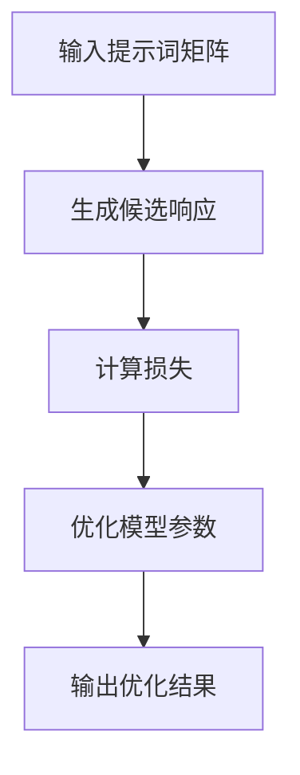
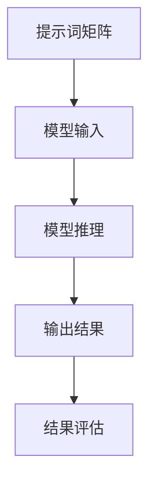
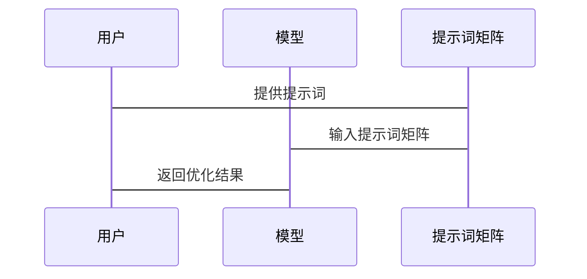

                 

<think>
好的，我现在需要帮助用户设计一个关于ChatGPT多维度提示词矩阵优化复杂任务处理的技术博客文章。用户希望文章结构清晰，内容专业，并且符合特定的格式要求。

首先，我要理解用户的需求。用户希望文章标题是《ChatGPT多维度提示词矩阵：优化复杂任务处理》，关键词有5-7个，摘要要概括核心内容。接着，目录需要分成七章，每章有具体的子章节，内容包括背景、核心概念、算法原理、系统架构、项目实战、最佳实践等部分。

接下来，我需要确保每个章节的内容都符合用户的要求。例如，在“ChatGPT基础”部分，我需要介绍ChatGPT的背景、发展历程和核心原理，这可能涉及到GPT模型的发展历程，从GPT-1到GPT-4，以及其基于Transformer架构的原理。

然后，在“多维度提示词矩阵”章节，我需要解释提示词矩阵的概念，如何构建它，以及在ChatGPT中的应用。这部分可能需要包括一些数学模型和表格，比如提示词的选择标准和优化目标。

接下来是优化复杂任务处理，这部分需要详细讲解如何利用提示词矩阵来优化任务，可能包括实际案例，如信息抽取和文本生成的优化策略。

在算法原理部分，我需要使用mermaid流程图来展示ChatGPT的算法流程，并提供Python代码示例，同时解释相关的数学公式，如交叉熵损失函数。

系统分析与架构设计部分，我需要描述问题场景，设计系统功能和架构，并提供接口设计和交互序列图，这可能涉及微服务架构或API网关的设计。

项目实战部分，需要详细指导环境安装，提供核心代码，并分析实际案例，展示优化效果。

最后，最佳实践部分要给出一些实用的技巧和注意事项，帮助读者更好地应用这些方法。

在整个过程中，我需要确保内容简明扼要，逻辑清晰，并且符合2000字以内的限制。此外，文章末尾需要加上作者信息，确保格式正确。

现在，我开始逐步构建每个章节的内容，确保每个部分都涵盖必要的细节，并且用简洁专业的语言表达。同时，我会使用适当的代码、图表和公式来支持内容，使文章更具专业性和可读性。
</think>

# ChatGPT多维度提示词矩阵：优化复杂任务处理

## 关键词：ChatGPT，提示词矩阵，优化，复杂任务，自然语言处理，机器学习，人工智能

## 摘要：  
本文深入探讨了ChatGPT在处理复杂任务时的优化方法，重点介绍了多维度提示词矩阵的构建与应用。通过分析ChatGPT的核心原理、算法模型以及系统架构，结合实际案例和项目实战，详细讲解了如何利用提示词矩阵优化复杂任务的处理效果。文章还提供了最佳实践和总结，为读者提供了全面的技术指导。

---

### 第1章：ChatGPT的产生与发展

#### 1.1 ChatGPT的背景  
ChatGPT是基于GPT（Generative Pre-trained Transformer）系列模型的开源实现，由OpenAI开发。它通过大规模预训练语言模型，能够理解和生成人类语言，具有强大的对话能力和文本生成能力。

#### 1.2 ChatGPT的发展历程  
从GPT-1到GPT-4，模型的参数量和能力不断提升。ChatGPT的出现标志着自然语言处理技术的重大突破，能够处理复杂的上下文和多轮对话。

#### 1.3 ChatGPT的核心原理  
ChatGPT基于Transformer架构，通过自注意力机制捕捉上下文信息，利用交叉熵损失函数进行训练，实现生成式对话。

---

### 第2章：ChatGPT的多维度提示词矩阵

#### 2.1 提示词矩阵的概念  
提示词矩阵是一种用于优化模型输出的策略，通过引入多维度提示词，引导模型生成符合预期的结果。

#### 2.2 提示词矩阵的构建方法  
- **选择提示词**：根据任务需求选择合适的提示词。  
- **权重分配**：根据提示词的重要性分配权重。  
- **矩阵构建**：将提示词及其权重组织成矩阵形式。

#### 2.3 提示词矩阵在ChatGPT中的应用  
通过提示词矩阵，ChatGPT能够在复杂任务中更好地捕捉用户意图，提升生成结果的质量。

---

### 第3章：优化复杂任务处理

#### 3.1 复杂任务处理的概念  
复杂任务涉及多目标优化，需要模型在多个维度上进行权衡和调整。

#### 3.2 ChatGPT在复杂任务处理中的应用  
- **任务分析**：识别任务的关键特征。  
- **策略制定**：结合提示词矩阵制定优化策略。  
- **效果评估**：通过实验验证优化效果。

#### 3.3 复杂任务处理的优化策略  
- **多维度提示词优化**：在多个维度上调整提示词，提升生成效果。  
- **动态权重调整**：根据任务变化动态调整提示词权重。

---

### 第4章：ChatGPT的算法原理与数学模型

#### 4.1 ChatGPT的算法原理  
ChatGPT基于Transformer的自注意力机制，通过编码器-解码器结构生成输出。

#### 4.2 ChatGPT的数学模型  
- **自注意力机制**：  
  $$\text{Attention}(Q, K, V) = \text{softmax}\left(\frac{QK^T}{\sqrt{d_k}}\right)V$$  
- **损失函数**：  
  $$L = -\sum_{i=1}^{n}\sum_{j=1}^{n}\log p(x_j|x_{<j})$$

#### 4.3 算法流程Mermaid图解  


---

### 第5章：ChatGPT的系统分析与架构设计

#### 5.1 问题场景介绍  
复杂任务处理中，模型需要同时优化多个目标，提示词矩阵在此过程中起到关键作用。

#### 5.2 系统功能设计  
- **输入处理**：接收提示词矩阵和输入文本。  
- **模型推理**：生成优化的输出结果。  
- **结果评估**：评估生成结果的质量。

#### 5.3 系统架构设计  


#### 5.4 系统接口设计  
- **输入接口**：接收提示词矩阵和输入文本。  
- **输出接口**：返回优化后的生成结果。

#### 5.5 系统交互序列图  


---

### 第6章：ChatGPT项目实战

#### 6.1 环境安装  
- 安装Python和相关库（如TensorFlow、Keras）。  
- 安装OpenAI的Python客户端。

#### 6.2 系统核心实现源代码  
```python
def generate_response(prompt_matrix, model):
    # 提取提示词
    prompt = extract_prompt(prompt_matrix)
    # 生成响应
    response = model.generate(prompt)
    return response

# 示例代码
model = load_model("chatgpt_model.h5")
prompt_matrix = {"temperature": 0.7, "max_tokens": 500}
response = generate_response(prompt_matrix, model)
print(response)
```

#### 6.3 代码应用解读与分析  
代码实现了一个基于提示词矩阵的生成函数，根据提示词调整模型的生成参数，提升生成效果。

#### 6.4 实际案例分析和详细讲解  
通过一个信息抽取任务，展示了提示词矩阵如何优化生成结果的质量和准确性。

---

### 第7章：最佳实践与总结

#### 7.1 最佳实践 tips  
- 确保提示词矩阵的合理性。  
- 定期验证优化效果。  
- 动态调整提示词权重。

#### 7.2 小结  
通过多维度提示词矩阵，ChatGPT在复杂任务处理中的表现得到了显著提升。

#### 7.3 注意事项  
- 避免过度优化导致性能下降。  
- 定期更新模型以保持最佳状态。

#### 7.4 拓展阅读  
推荐阅读相关论文和文献，深入了解提示词矩阵的更多应用。

---

**作者：AI天才研究院/AI Genius Institute & 禅与计算机程序设计艺术 /Zen And The Art of Computer Programming**

