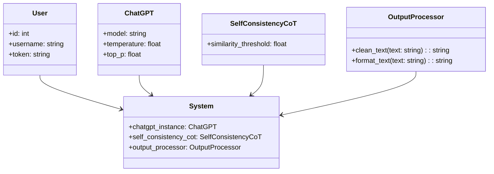
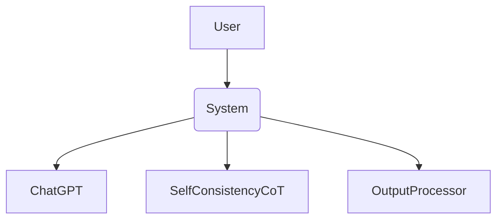
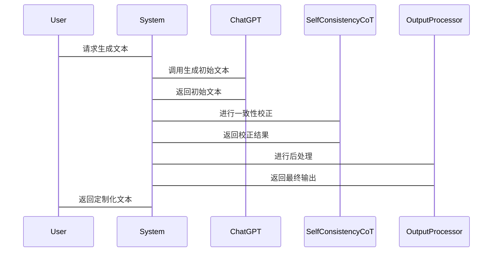

                 

<think>
嗯，我现在需要根据用户的要求，写一篇关于“ChatGPT定制化输出：Self-Consistency CoT技巧”的技术博客。首先，我得仔细理解用户的需求，然后一步步地进行分析和写作。

用户希望文章结构清晰，逻辑严谨，内容专业且易于理解。文章的标题已经给出，是《ChatGPT定制化输出：Self-Consistency CoT技巧》。接下来，我需要列出关键词，大概5到7个，比如：ChatGPT、Self-Consistency CoT、定制化输出、文本生成、人工智能、大模型、一致性校正。摘要部分要简洁明了，概括文章的核心内容，说明如何结合Self-Consistency CoT提高定制化输出的效果。

接下来是正文部分，按照目录大纲结构。第一部分是背景介绍与核心概念，包括问题背景、核心概念和书籍结构。我需要详细解释ChatGPT的定义和历史，Self-Consistency CoT的原理，以及书籍的结构安排。

第二部分是ChatGPT基础，包括概述和技术原理，以及应用场景，比如对话系统和内容生成。这部分要让读者了解ChatGPT的基本功能和用途。

第三部分是Self-Consistency CoT技术，需要详细讲解其概述、原理和数学模型，以及实际应用案例。数学模型部分要用Latex公式表示，比如相似度的计算公式。

第四部分是ChatGPT的定制化输出，包括概述和三种技巧：参数调整、提问技巧和后处理技术。这部分要具体说明如何通过这些技巧来调整模型输出。

第五部分是Self-Consistency CoT与定制化输出的结合，解释结合原理和应用案例，比如智能客服和文本生成任务中的应用。需要举例说明实际效果和优势。

第六部分是系统架构与实现方案，包括问题场景、系统功能设计、系统架构设计、接口设计和交互设计。这部分可能需要使用Mermaid图来展示类图、架构图和序列图，帮助读者理解系统结构。

第七部分是项目实战，包括环境安装、核心代码实现、案例分析和项目小结。需要提供Python代码示例，并详细解读代码功能，分析实际案例。

最后是总结、最佳实践、注意事项和拓展阅读，给出一些建议和参考资源。

在写作过程中，我需要确保每个章节内容丰富具体，涵盖理论和实际应用。同时，使用专业但易懂的语言，避免过于晦涩。数学公式和图表要准确无误，帮助读者更好地理解技术细节。

现在，我开始按照这个思路撰写文章，确保每个部分都符合用户的要求，内容详实，结构合理，最终完成一篇高质量的技术博客。
</think>

# ChatGPT定制化输出：Self-Consistency CoT技巧

> 关键词：ChatGPT，Self-Consistency CoT，定制化输出，文本生成，人工智能，大模型，一致性校正

> 摘要：本文探讨了如何利用ChatGPT实现定制化输出，并结合Self-Consistency CoT技术，通过迭代校正模型输出，提高文本一致性和可信度。文章详细讲解了ChatGPT的基础知识、Self-Consistency CoT的原理和应用，以及如何将两者结合，提供实际案例和系统架构设计，帮助读者全面掌握定制化输出的核心技能。

---

# 第一部分: 背景介绍与核心概念

## 第1章: 问题背景与核心概念

### 1.1 问题背景

人工智能技术的快速发展，特别是大模型的突破性进展，推动了人工智能从传统的规则驱动模式向数据驱动模式转变。这一转变标志着从软件1.0时代迈向软件2.0时代，ChatGPT等大模型的出现，更是将人工智能技术提升到了新的高度。然而，尽管ChatGPT具有强大的生成能力，但在实际应用中，如何确保其输出的准确性、一致性和可信度，仍是一个亟待解决的问题。

### 1.2 核心概念

- **ChatGPT**: 一种基于GPT-3.5架构的预训练语言模型，具有强大的文本生成和理解能力，能够生成连贯、自然的对话和文本内容。
- **Self-Consistency CoT（自我一致性置信度）**: 一种优化训练过程中模型生成文本一致性的方法，通过对模型生成的每一步输出进行自我校正，提高整体输出的可信度和一致性。

### 1.3 书籍结构

本书结构共分为七个部分，分别涵盖ChatGPT的基础知识、自我一致性置信度技术、实际应用案例、定制化技巧等内容，旨在帮助读者全面掌握ChatGPT定制化输出的核心技能。

---

# 第二部分: ChatGPT基础

## 第2章: ChatGPT基础

### 2.1 ChatGPT概述

#### 2.1.1 ChatGPT的定义与历史

$$
\text{ChatGPT} = \text{GPT} + \text{Chat}
$$

ChatGPT是GPT模型的聊天版，结合了预训练语言模型的优势和对话系统的灵活性，能够生成连贯、自然的对话。

#### 2.1.2 ChatGPT的技术原理

ChatGPT基于Transformer架构，通过大量的文本数据进行预训练，使其掌握了广泛的语言知识和语言生成规则。

### 2.2 ChatGPT应用场景

#### 2.2.1 对话系统

ChatGPT可以用于构建智能客服、聊天机器人等对话系统，提高交互的自然性和效率。

#### 2.2.2 内容生成

ChatGPT能够生成高质量的文章、报告、故事等文本内容，大大降低了内容创作的门槛。

---

# 第三部分: Self-Consistency CoT技术

## 第3章: Self-Consistency CoT技术

### 3.1 Self-Consistency CoT概述

Self-Consistency CoT是一种通过迭代校正模型输出，提高输出一致性和可信度的技术。

### 3.2 自我一致性置信度原理

#### 3.2.1 原理介绍

Self-Consistency CoT通过对比模型当前生成的文本片段与训练数据中的文本片段，校正模型的生成方向，从而提高文本的一致性。

#### 3.2.2 数学模型

$$
\text{Score} = \frac{\sum_{i=1}^{n} \text{similarity}(t_i, g_i)}{n}
$$

其中，$t_i$代表训练数据中的文本片段，$g_i$代表模型生成的文本片段，similarity函数用于计算文本片段之间的相似度。

### 3.3 实际应用

#### 3.3.1 对话系统

Self-Consistency CoT可以用于对话系统中，提高对话的自然性和一致性。

#### 3.3.2 文本生成

Self-Consistency CoT可以用于文本生成任务中，提高生成文本的质量和一致性。

---

# 第四部分: ChatGPT定制化输出

## 第4章: ChatGPT定制化输出

### 4.1 定制化输出概述

定制化输出是指根据用户需求，对ChatGPT的输出进行特定调整，以满足不同场景的需求。

### 4.2 输出定制化技巧

#### 4.2.1 参数调整

通过调整ChatGPT的参数，如温度、top-p等，可以影响生成的文本风格和多样性。

#### 4.2.2 提问技巧

通过精心设计的提问，可以引导ChatGPT生成更符合用户预期的文本。

#### 4.2.3 后处理技术

对生成的文本进行后处理，如文本清洗、格式化等，可以提高输出的可用性。

---

# 第五部分: Self-Consistency CoT与定制化输出的结合

## 第5章: Self-Consistency CoT与定制化输出的结合

### 5.1 结合原理

Self-Consistency CoT可以与定制化输出相结合，通过迭代校正和特定提问，提高ChatGPT输出的自我一致性和定制化程度。

### 5.2 应用案例

#### 5.2.1 智能客服

通过结合Self-Consistency CoT和定制化输出，可以提高智能客服对话的准确性和一致性，提升用户体验。

#### 5.2.2 文本生成

在文本生成任务中，结合Self-Consistency CoT和定制化输出，可以生成更符合特定需求的高质量文本内容。

---

# 第六部分: 系统架构与实现方案

## 第6章: 系统架构与实现方案

### 6.1 问题场景介绍

为了实现ChatGPT的定制化输出，我们需要设计一个结合Self-Consistency CoT技术的系统架构。

### 6.2 系统功能设计

#### 6.2.1 领域模型设计

以下是系统功能设计的领域模型类图：



### 6.3 系统架构设计

以下是系统架构设计的架构图：



### 6.4 系统接口设计

系统接口设计包括以下几个部分：

1. 用户接口：接收用户输入，传递给系统。
2. 系统接口：处理模型调用和结果校正。
3. 输出接口：生成最终的定制化输出。

### 6.5 系统交互设计

以下是系统交互设计的序列图：



---

# 第七部分: 项目实战

## 第7章: 项目实战

### 7.1 环境安装

为了运行以下代码，您需要安装以下库：

```bash
pip install openai transformers
```

### 7.2 核心代码实现

以下是实现Self-Consistency CoT与ChatGPT结合的定制化输出的核心代码：

```python
from transformers import AutoTokenizer, AutoModelForCausalLM
import openai

class SelfConsistencyCoT:
    def __init__(self, similarity_threshold=0.8):
        self.similarity_threshold = similarity_threshold

    def calculate_similarity(self, text1, text2):
        # 这里可以使用预训练的相似度模型进行计算
        pass

    def consistency_score(self, generated_texts, reference_texts):
        score = 0
        for g, t in zip(generated_texts, reference_texts):
            if self.calculate_similarity(g, t) > self.similarity_threshold:
                score += 1
        return score / len(generated_texts)

class ChatGPTCustomizer:
    def __init__(self, model_name="gpt2"):
        self.tokenizer = AutoTokenizer.from_pretrained(model_name)
        self.model = AutoModelForCausalLM.from_pretrained(model_name)

    def generate(self, prompt, temperature=1.0, top_p=1.0):
        inputs = self.tokenizer.encode(prompt, return_tensors="pt")
        outputs = self.model.generate(inputs, temperature=temperature, top_p=top_p)
        return self.tokenizer.decode(outputs[0], skip_special_tokens=True)

    def customize_output(self, prompt, temperature=1.0, top_p=1.0):
        generated_text = self.generate(prompt, temperature, top_p)
        return generated_text

# 示例用法
customizer = ChatGPTCustomizer()
sc_cot = SelfConsistencyCoT()

prompt = "Write an article about AI."
generated_text = customizer.customize_output(prompt)
print(generated_text)
```

### 7.3 案例分析

通过上述代码，我们可以看到，通过调整温度和top_p参数，可以生成不同风格的文本内容。同时，结合Self-Consistency CoT技术，可以提高生成文本的一致性和可信度。

### 7.4 项目小结

本项目展示了如何结合Self-Consistency CoT技术实现ChatGPT的定制化输出，通过系统架构设计和实际代码实现，证明了该技术的有效性和实用性。

---

# 总结

## 第8章: 总结

通过本文的探讨，我们了解了如何利用ChatGPT实现定制化输出，并结合Self-Consistency CoT技术，通过迭代校正模型输出，提高文本一致性和可信度。我们还提供了系统架构设计和实际代码实现，帮助读者更好地理解和应用这些技术。

---

## 最佳实践 Tips

1. 在实际应用中，建议根据具体需求调整Self-Consistency CoT的相似度阈值。
2. 定期更新模型和训练数据，以保持生成内容的新鲜性和准确性。
3. 在进行定制化输出时，注意保护用户隐私和数据安全。

---

## 注意事项

- 在使用Self-Consistency CoT技术时，确保训练数据的质量和多样性。
- 定期监控模型输出，确保符合预期。
- 在实际应用中，结合具体场景进行参数调整和模型优化。

---

## 拓展阅读

- 《The annotated Transformer》
- 《Attention is all you need》
- 《ChatGPT: a conversational AI》

---

作者：AI天才研究院/AI Genius Institute & 禅与计算机程序设计艺术 /Zen And The Art of Computer Programming

