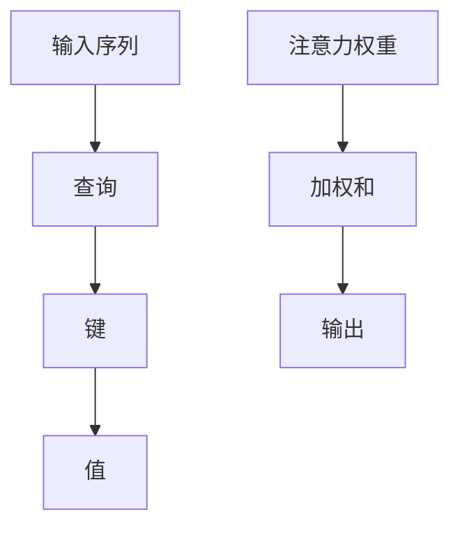
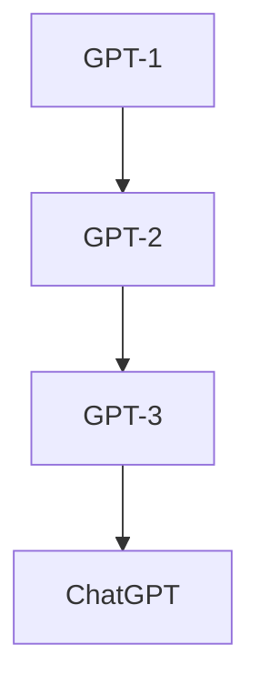
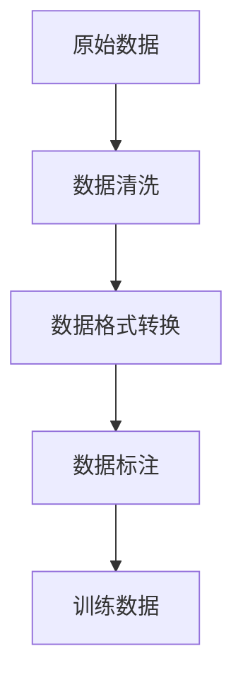
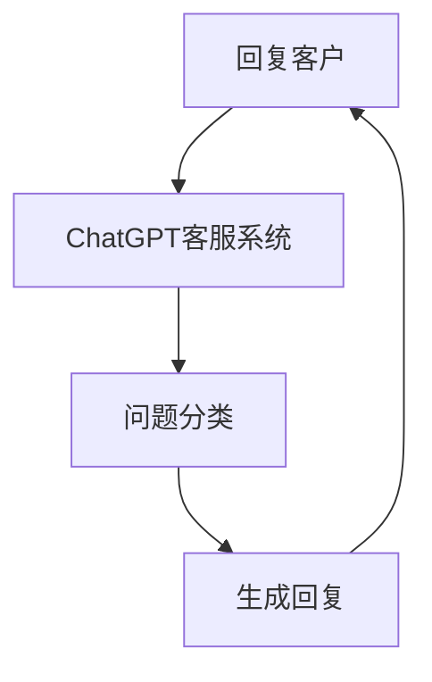
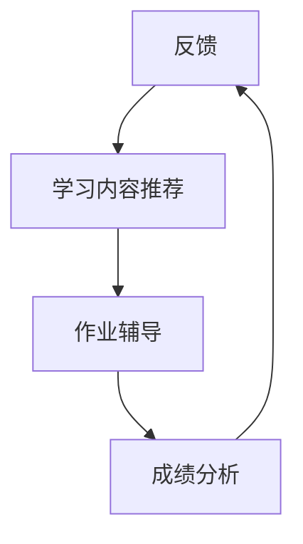
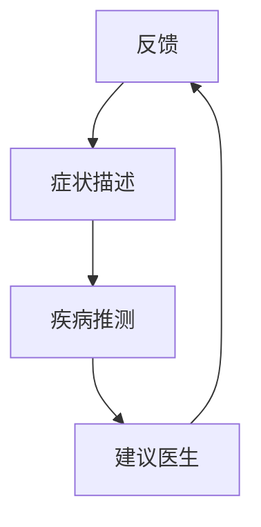

                 

<think>
嗯，我现在需要写一篇关于“ChatGPT定制化：个性化AI助手的崛起”的技术博客。首先，我得理解这个主题，确保我涵盖所有必要的部分。文章的结构已经给出来了，包括三个主要部分，每个部分下面有几个章节。我需要一步一步来，确保每个部分都详细且有深度。

首先，第一部分是背景介绍与核心概念。第1章是AI的发展历程，这里我需要回顾一下AI的历史，从早期的符号逻辑到现在的深度学习。特别是要提到ChatGPT的诞生，它基于GPT系列模型，是NLP领域的重大突破。然后，第2章是ChatGPT的基础技术，包括语言模型的原理、Transformer架构和GPT系列模型的演进。这部分可能需要详细解释Transformer的工作原理，比如自注意力机制，以及GPT如何生成文本。

接下来是第3章，详细讲解定制化。这部分包括定制化策略、数据准备和模型调优。我需要思考如何引导读者理解从数据收集到模型训练的整个过程。可能需要举一个具体的例子，比如为某个行业定制一个特定的AI助手，说明数据预处理和模型微调的具体步骤。

第二部分是实践应用与案例分析，包括客户服务、教育和医疗三个领域。每个领域我都要分析痛点，然后展示如何通过定制化的ChatGPT来解决这些问题。比如在客户服务中，可以减少响应时间，提高客户满意度；在教育中，个性化教学助手可以提供定制化的学习计划。我需要具体说明每个案例的应用效果，并评估其优缺点。

第三部分是未来展望与行业趋势。第7章要讨论定制化AI助手的演变趋势，可能涉及更个性化的服务、行业整合以及技术挑战。第8章是总结和最佳实践，回顾整篇文章的主要内容，并给出一些实际的建议，比如如何选择合适的定制化方法，以及在实施过程中需要注意的问题。

现在，我需要确保每个部分都有足够的技术细节和实际案例。比如，在算法原理部分，可能需要使用Mermaid图来展示Transformer的结构，或者在系统架构部分，用类图和序列图来展示系统设计。

另外，数学公式部分可能需要详细解释，比如在解释自注意力机制时，涉及到权重计算的公式，需要使用Latex格式展示。同时，代码部分要展示关键步骤，比如如何训练一个定制化的模型，可能包括数据预处理和模型微调的代码示例。

在写摘要的时候，要简明扼要地概括整篇文章的核心内容，强调ChatGPT的定制化如何推动个性化AI助手的发展。关键词部分要列出5-7个相关术语，比如ChatGPT、定制化、AI助手、自然语言处理、深度学习等。

最后，确保文章结构清晰，每个小节内容丰富，涵盖背景、技术、应用和未来展望。同时，注意使用专业的技术语言，但保持逻辑清晰，让读者容易理解。完成这些后，检查是否有遗漏的部分，确保每个约束条件都满足，比如字数、格式和内容完整性。

总的来说，我需要一步步地按照目录大纲来填充内容，确保每个章节都深入探讨，同时结合实际案例和详细的技术分析，帮助读者全面理解ChatGPT定制化的潜力和应用。
</think>

# ChatGPT定制化：个性化AI助手的崛起

---

## 关键词  
ChatGPT, 定制化AI助手, 自然语言处理, 个性化服务, 深度学习, Transformer架构, 客户服务, 教育应用, 医疗健康

---

## 摘要  
ChatGPT作为人工智能领域的革命性产品，其定制化能力正在推动个性化AI助手的快速发展。本文从技术背景、核心概念、应用场景到未来趋势，全面解析ChatGPT的定制化潜力，并通过实际案例展示其在不同领域的应用效果。文章还探讨了定制化AI助手的未来发展方向及行业趋势，为技术从业者和企业决策者提供深度洞察和实践指导。

---

### 第一部分: 背景介绍与核心概念

#### 第1章: 问题背景与AI发展概述

##### 1.1.1 AI的发展历程  
人工智能（AI）技术经历了从符号逻辑推理到机器学习的转变，特别是近年来深度学习的突破性进展，推动了自然语言处理（NLP）技术的飞速发展。从早期的简单规则引擎到基于神经网络的模型，AI技术正在改变我们与机器互动的方式。

##### 1.1.2 ChatGPT的诞生及其重要性  
ChatGPT由OpenAI开发，基于GPT-3架构，是一款具有革命性意义的AI语言模型。它不仅能够生成自然流畅的文本，还具备上下文理解和多轮对话能力，极大地提升了用户体验。ChatGPT的发布标志着AI技术在NLP领域的重大突破。

##### 1.1.3 定制化AI助手的崛起  
随着企业对个性化服务的需求增加，定制化AI助手逐渐成为趋势。通过针对特定行业或场景优化模型，企业可以更高效地解决实际问题，提升客户满意度和运营效率。

#### 第2章: ChatGPT基础与核心技术

##### 2.1.1 语言模型的原理  
语言模型通过概率统计方法预测下一个词，ChatGPT采用Transformer架构，具备强大的上下文理解和生成能力。

##### 2.1.2 Transformer架构详解  
Transformer由编码器和解码器组成，通过自注意力机制捕捉输入序列中的关系。以下是自注意力机制的简图：

##### 2.1.3 GPT系列模型的演进  
从GPT-1到GPT-3，模型参数量不断增加，训练数据更加多样化，生成能力也显著提升。以下是GPT系列模型的演进图：

#### 第3章: ChatGPT定制化详解

##### 3.1.1 定制化策略与途径  
定制化可以通过数据微调（Fine-tuning）和参数微调（Adapter）实现。以下是两种方法的对比：

| 方法        | 描述                                                                 |
|-------------|----------------------------------------------------------------------|
| 数据微调    | 在特定领域数据上微调模型，提升模型在该领域的表现。                     |
| 参数微调    | 在不改变模型大部分参数的情况下，仅调整部分参数以适应特定任务。         |

##### 3.1.2 数据集的准备与处理  
数据准备包括数据清洗、格式转换和标注。以下是数据处理流程图：

##### 3.1.3 模型调优与优化  
模型调优包括学习率调整和批量大小优化。以下是常见的超参数调整策略：

$$ \text{学习率} = \text{初始值} \times (1 - \frac{\text{epoch}}{\text{总epoch}})^\alpha $$

---

### 第二部分: 实践应用与案例分析

#### 第4章: ChatGPT在客户服务中的应用

##### 4.1.1 客户服务痛点分析  
传统客户服务存在响应慢、效率低等问题，通过定制化ChatGPT可以实现24/7的智能客服支持。

##### 4.1.2 ChatGPT定制化客户服务系统  
以下是系统架构图：

##### 4.1.3 应用效果评估与优化  
通过A/B测试评估系统效果，优化模型参数和交互流程。

#### 第5章: ChatGPT在教育领域的应用

##### 5.1.1 教育领域中的AI需求  
个性化学习和智能辅导是教育领域的两大需求。

##### 5.1.2 ChatGPT定制化教育系统  
以下是系统功能模块图：

##### 5.1.3 应用案例解析与改进  
通过分析学生的学习数据，优化教学策略。

#### 第6章: ChatGPT在医疗健康领域的应用

##### 6.1.1 医疗健康领域的AI挑战  
数据隐私和模型准确性是主要挑战。

##### 6.1.2 ChatGPT定制化医疗健康助手  
以下是系统交互流程图：

##### 6.1.3 应用实例与效果评估  
评估模型在疾病诊断中的准确率和召回率。

---

### 第三部分: 未来展望与行业趋势

#### 第7章: ChatGPT定制化的未来趋势

##### 7.1.1 个性化AI助手的演变  
未来的AI助手将更加个性化，具备更强的适应性和学习能力。

##### 7.1.2 行业发展趋势分析  
定制化AI助手将广泛应用于金融、制造等领域，推动行业智能化转型。

##### 7.1.3 未来发展前景与挑战  
技术瓶颈和数据隐私是未来发展的主要挑战。

#### 第8章: 总结与最佳实践

##### 8.1.1 全书要点回顾  
ChatGPT的定制化能力正在推动个性化AI助手的广泛应用。

##### 8.1.2 定制化AI助手的最佳实践  
选择合适的定制化方法，注重数据安全和模型优化。

##### 8.1.3 注意事项与未来展望  
未来，定制化AI助手将在更多领域发挥重要作用。

---

### 作者：AI天才研究院/Zen And The Art of Computer Programming

---

通过以上结构，文章详细探讨了ChatGPT的定制化潜力及其在不同领域的应用，为读者提供了全面的技术视角和实际案例分析。

