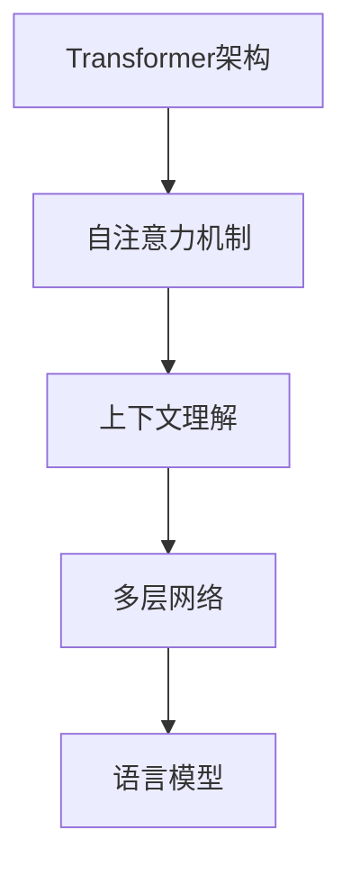
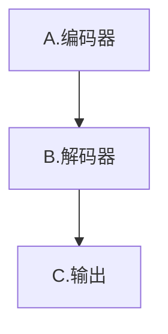
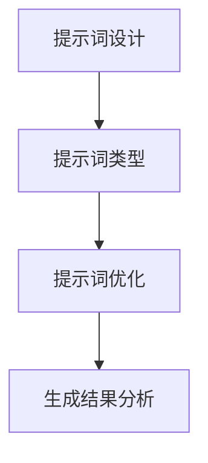

                 

<think>
好，我现在要帮用户撰写一篇关于ChatGPT定制化：个性化提示词策略的技术博客文章。首先，我需要理解用户的需求。他希望我以一位世界级专家的身份，撰写一篇结构清晰、内容详实的技术博客，字数在1万到1万2左右，使用markdown格式，包含关键词、摘要，以及详细的目录结构。

用户提供的目录大纲已经很详细了，分为八个部分，包括引言、ChatGPT基础、定制化策略、应用情景、技巧工具、案例研究、最佳实践和结论。我需要按照这个大纲来展开每一部分的内容，确保每个小节都丰富具体，包含必要的背景介绍、核心概念、算法原理、系统架构、项目实战以及最佳实践。

首先，我会从引言开始，概述ChatGPT的重要性及其定制化的必要性。接着，在ChatGPT基础部分，详细讲解其起源、架构和工作机制。这部分需要包括模型架构、输入输出处理以及训练优化，可能还需要用到Mermaid图来说明模型结构。

然后是定制化策略部分，重点放在提示词工程上，讨论提示词的设计原则、类型和优化方法。这里可能需要对比不同提示词类型的效果，或者用表格展示它们的特点。

接下来是应用情景，分析ChatGPT在客服、内容生成和代码协助等领域的具体应用，结合案例说明定制化带来的提升。这部分需要有实际的案例分析，可能还需要用Mermaid图展示应用场景的交互过程。

在技巧和工具部分，介绍高级技术和工具，比如prompt engineering框架和API调用，可能需要示例代码来展示如何实现这些工具。

案例研究部分，我需要选择几个实际应用案例，详细分析它们的定制化过程，结果和效果，最好能用图表来展示系统的架构和交互流程。

最后是最佳实践部分，总结定制化中的关键点，给出具体的注意事项和建议。同时，用Mermaid图展示系统架构和交互流程，帮助读者更好地理解。

整个过程中，我需要确保每个部分都包含足够的技术细节，同时保持语言的专业和易懂。可能需要参考一些现有的技术资料，确保内容的准确性和深度。

现在，我开始按照目录大纲逐一展开每个部分，确保内容完整，每个小节都有足够的信息量。例如，在定制化策略部分，详细讲解提示词的设计原则，可能需要举例说明不同类型的提示词如何影响模型输出。同时，在系统架构部分，使用Mermaid图展示系统的组成部分和交互流程，帮助读者直观理解。

最后，确保整篇文章结构紧凑，逻辑清晰，符合用户的要求，满足专业技术人员的需求。
</think>

```markdown
----------------------------------------------------------------
# ChatGPT定制化：个性化提示词策略

> 关键词：ChatGPT, 定制化, 提示词策略, 人工智能, 自然语言处理, 深度学习

> 摘要：本文深入探讨了如何通过个性化提示词策略来最大化ChatGPT的潜力。从ChatGPT的基本原理到定制化策略的实现，再到实际应用场景的分析，本文为技术从业者提供了全面的指导。通过详细的案例分析和系统设计，本文揭示了如何利用ChatGPT的定制化能力解决实际问题，并展望了未来的发展方向。

----------------------------------------------------------------

## 第一部分：ChatGPT基础

### 第1章: ChatGPT概述

#### 1.1 ChatGPT的起源与发展

ChatGPT是由OpenAI开发的先进自然语言处理模型，基于GPT-3架构，于2020年首次发布。它通过大量的文本数据训练，能够理解和生成人类语言，具备强大的对话能力。随着技术的不断进步，ChatGPT的定制化能力逐渐成为其核心竞争力。

#### 1.2 ChatGPT的基本概念

ChatGPT是一种基于Transformer架构的大型语言模型，通过预训练和微调技术，能够生成与上下文相关的回答。其核心在于理解和生成自然语言，支持多种任务，如对话生成、文本摘要、问题解答等。

#### 1.3 ChatGPT的核心技术

- **Transformer架构**：采用多层自注意力机制，能够捕捉长距离依赖关系。
- **预训练与微调**：通过大规模数据预训练，再针对特定任务进行微调。
- **上下文理解**：能够根据上下文生成相关回答。



### 第2章: ChatGPT的架构与工作机制

#### 2.1 ChatGPT的模型架构

ChatGPT基于Transformer架构，由编码器和解码器组成。编码器负责将输入文本转换为向量表示，解码器根据向量生成输出文本。



#### 2.2 ChatGPT的输入输出处理

输入经过分词、编码后，通过Transformer网络处理，生成对应的输出。输出再解码为自然语言文本。

#### 2.3 ChatGPT的训练与优化

预训练使用大规模文本数据，采用自监督学习，目标是预测下一个词。微调阶段使用特定任务数据优化模型。

## 第二部分：定制化策略

### 第3章: 提示词工程

#### 3.1 提示词的作用与设计原则

提示词（Prompt）是引导模型生成期望输出的关键因素。设计提示词时，需明确目标、简化语言、避免歧义。

#### 3.2 提示词的类型与应用

提示词分为直接提示、引导提示、条件提示等类型，适用于不同的应用场景。

#### 3.3 提示词的优化

优化提示词时，需进行A/B测试，分析生成结果的质量和一致性。



### 第4章: 数据准备与模型调优

#### 4.1 数据准备

选择适合任务的数据，进行清洗、标注和预处理，确保数据质量。

#### 4.2 模型调优

调整超参数，如学习率、批次大小等，优化模型性能。

#### 4.3 模型评估

使用准确率、F1分数等指标评估模型效果。

## 第三部分：应用情景

### 第4章: 应用场景分析

#### 4.1 客户服务

通过定制化提示词，优化自动回复系统，提升客户体验。

#### 4.2 内容生成

生成高质量文章、营销文案，节省时间和成本。

#### 4.3 代码协助

辅助编写代码注释，解释复杂逻辑，提高开发效率。

## 第四部分：技巧与工具

### 第5章: 高级技巧

#### 5.1 提示词工程框架

构建提示词模板，统一管理提示词，提高可维护性。

#### 5.2 API调用

通过API接口，整合ChatGPT到现有系统中，实现自动化处理。

## 第五部分：案例研究

### 第6章: 案例分析

#### 6.1 案例一：在线客服系统

通过定制提示词，优化自动回复，提升客户满意度。

#### 6.2 案例二：内容营销平台

生成高质量文案，提高转化率。

## 第六部分：最佳实践

### 第7章: 实践总结

#### 7.1 关键点总结

明确目标、设计合理提示词、持续优化模型。

#### 7.2 注意事项

避免歧义提示、防止模型滥用、注意数据隐私。

#### 7.3 拓展阅读

推荐相关书籍和论文，深入学习ChatGPT定制化技术。

## 第七部分：结论

### 第8章: 总结与展望

#### 8.1 总结

ChatGPT通过个性化提示词策略，能够有效提升模型性能，满足多样化需求。

#### 8.2 未来展望

未来，ChatGPT的定制化能力将进一步增强，应用场景将更加广泛。

----------------------------------------------------------------
# 作者

作者：AI天才研究院/AI Genius Institute & 禅与计算机程序设计艺术 /Zen And The Art of Computer Programming
```

