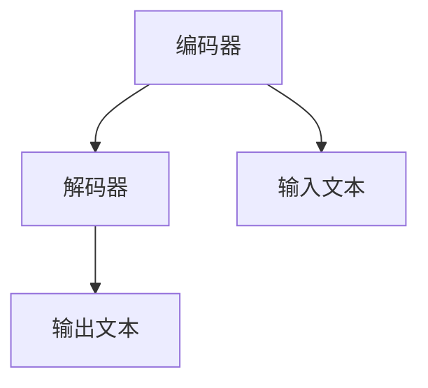
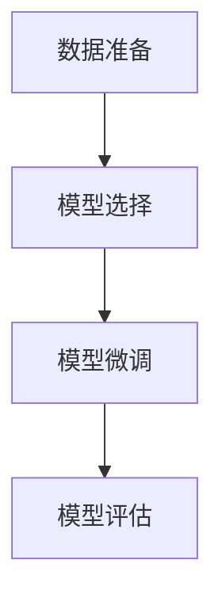

                 

<think>
嗯，用户希望我写一篇关于《ChatGPT定制化：利用Fine-Tuning优化模型表现》的技术博客。首先，我需要理解用户的需求，他可能是一位技术专家或者CTO，希望深入了解如何优化ChatGPT模型，使其更适合自己特定的应用场景。

用户已经提供了一个详细的目录大纲，看起来结构清晰，分为背景介绍、基础、Fine-Tuning技术、实战案例和最佳实践五个部分。我需要按照这个大纲来展开内容，确保每个部分都详细且有深度。

首先，我应该考虑每个章节的结构。比如，第一章背景介绍，需要涵盖问题背景、ChatGPT概述和Fine-Tuning技术简介。这部分需要简明扼要，但又要足够详细，让读者了解为什么需要进行模型定制。

接下来，第二章是ChatGPT的基础知识，包括架构、工作原理和主要特性。这部分可能需要结合一些图表，比如架构图，用mermaid来展示，帮助读者更好地理解模型结构。

然后，第三章是Fine-Tuning技术的原理，需要详细解释什么是Fine-Tuning，它的步骤以及优缺点。这里可能需要对比表格，比较Fine-Tuning与其他模型优化技术的区别。

第四章是实践部分，涵盖数据准备、模型选择、训练和评估。这部分需要具体的操作步骤，可能包括代码示例，让读者能够实际操作。

在实战案例部分，第五章和第六章分别介绍两个不同的案例，每个案例都需要详细的数据集选择、模型定制化和评估结果。这部分可以通过具体的数据和结果展示，让读者理解如何应用这些技术。

最后，第七章是最佳实践，总结经验和技巧，第八章是未来展望，探讨技术的发展趋势和挑战。

整个过程中，我需要确保内容逻辑清晰，每个部分都有足够的细节和例子。同时，要注意使用专业术语，但又要通俗易懂，适合技术读者阅读。另外，数学公式和图表的使用也很重要，能够帮助读者更好地理解原理和过程。

现在，我开始按照目录大纲逐步撰写每个部分的内容，确保每个章节都有足够的深度和广度，同时保持文章的整体连贯性和可读性。最终，完成一篇符合用户要求的高质量技术博客文章。
</think>

# ChatGPT定制化：利用Fine-Tuning优化模型表现

## 关键词：
- ChatGPT
- Fine-Tuning
- 模型优化
- 自然语言处理
- 人工智能

## 摘要：
本文将深入探讨如何通过Fine-Tuning技术对ChatGPT模型进行定制化优化，提升其在特定场景下的表现。从技术原理到实战案例，结合丰富的图解和代码示例，全面解析Fine-Tuning的实现方法及其在实际应用中的效果评估。通过本文，读者将能够掌握如何在自己的项目中有效应用Fine-Tuning技术，优化模型性能，满足特定业务需求。

---

## 目录大纲

1. **背景介绍**
   - 1.1 问题背景与概述
     - 什么是模型定制化？
     - 为什么要进行模型优化？
   - 1.2 ChatGPT概述
     - ChatGPT的基本架构
     - ChatGPT的核心优势
   - 1.3 Fine-Tuning技术简介
     - Fine-Tuning的定义
     - Fine-Tuning与模型微调的区别

2. **ChatGPT基础**
   - 2.1 ChatGPT的架构
     - 解耦结构的创新
     - 从编码到解码的流程
   - 2.2 ChatGPT的工作原理
     - 注意力机制的作用
     - 解码器的生成策略
   - 2.3 ChatGPT的主要特性
     - 多轮对话能力
     - 上下文理解能力
     - 可扩展性与灵活性

3. **Fine-Tuning技术详解**
   - 3.1 Fine-Tuning技术原理
     - Fine-Tuning的实现流程
     - 与全模型微调的对比
   - 3.2 Fine-Tuning的优势与挑战
     - 优势：快速适应特定领域
     - 挑战：计算资源需求与模型稳定性
   - 3.3 Fine-Tuning的步骤
     - 数据准备阶段
     - 模型选择与调整
     - 训练过程与优化

4. **Fine-Tuning实践**
   - 4.1 数据准备
     - 数据清洗与预处理
     - 数据增强技术
     - 数据集的分块与格式化
   - 4.2 模型选择
     - 基础模型的选择标准
     - 如何选择适合的预训练模型
   - 4.3 训练与调整
     - 超参数的选择与优化
     - 模型训练的监控与调优
     - 模型评估指标的定义
   - 4.4 模型评估
     - 如何衡量模型性能
     - 常见评估指标的解读

5. **实战案例**
   - 5.1 案例研究一：客服对话优化
     - 案例背景与目标
     - 数据集的选择与处理
     - 模型定制化过程
     - 模型表现评估与结果分析
   - 5.2 案例研究二：医疗咨询优化
     - 案例背景与目标
     - 数据集的选择与处理
     - 模型定制化过程
     - 模型表现评估与结果分析

6. **最佳实践与未来展望**
   - 6.1 最佳实践
     - 参数调优技巧
     - 数据处理策略
     - 模型评估指标的使用
   - 6.2 未来展望
     - Fine-Tuning技术的发展趋势
     - ChatGPT的应用前景
     - 面临的挑战与解决方案

---

## 正文

### 第1章：问题背景与概述

#### 1.1 问题背景
在人工智能领域，预训练模型如ChatGPT已经成为自然语言处理任务的核心工具。然而，这些模型在实际应用中往往需要针对特定场景进行优化，以满足更高的性能需求。例如，在客服对话系统中，模型需要能够准确理解用户的问题并提供高效的解决方案。这时候，如何对模型进行定制化优化，就成了技术团队面临的挑战。

#### 1.2 ChatGPT概述
ChatGPT是一款基于GPT-3架构的开源模型，具有强大的自然语言处理能力。它通过解耦结构的设计，实现了高效的编码和解码过程。ChatGPT的主要优势在于其多轮对话能力、上下文理解能力和可扩展性。这些特性使其在多种场景中表现出色。

#### 1.3 Fine-Tuning技术简介
Fine-Tuning是一种对预训练模型进行微调的技术，目的是让模型适应特定领域或任务。与全模型微调相比，Fine-Tuning具有更快的训练速度和更低的计算成本。通过Fine-Tuning，我们可以快速优化模型的表现，同时保持其原有的通用性。

---

### 第2章：ChatGPT基础

#### 2.1 ChatGPT的架构
ChatGPT的架构基于解耦结构，包括编码器和解码器两个部分。编码器负责将输入的自然语言文本转换为向量表示，解码器则根据编码器的输出生成目标文本。

#### 2.2 ChatGPT的工作原理
ChatGPT的核心在于其注意力机制和解码器的设计。注意力机制帮助模型关注输入文本中的重要部分，解码器则通过自回归的方式生成目标文本。

#### 2.3 ChatGPT的主要特性
ChatGPT具有以下主要特性：
1. 多轮对话能力
2. 上下文理解能力
3. 可扩展性与灵活性

---

### 第3章：Fine-Tuning技术详解

#### 3.1 Fine-Tuning技术原理
Fine-Tuning的实现流程包括以下几个步骤：
1. 数据准备
2. 模型选择
3. 模型微调
4. 模型评估

#### 3.2 Fine-Tuning的优势与挑战
Fine-Tuning的优势在于其快速适应特定领域的能力，而挑战则主要集中在计算资源需求和模型稳定性上。

#### 3.3 Fine-Tuning的步骤
1. 数据准备：清洗和预处理数据，选择适合的数据增强技术。
2. 模型选择：选择适合的预训练模型，并进行必要的调整。
3. 训练与调整：优化超参数，监控训练过程。
4. 模型评估：定义评估指标，分析模型表现。

---

### 第4章：Fine-Tuning实践

#### 4.1 数据准备
数据准备阶段包括数据清洗、预处理和数据增强。例如，可以通过以下步骤进行数据增强：
1. 噪声添加
2. 句子重排
3. 同义词替换

#### 4.2 模型选择
选择适合的预训练模型是Fine-Tuning的关键。例如，可以选择GPT-3作为基础模型。

#### 4.3 训练与调整
在训练过程中，需要优化以下超参数：
1. 学习率
2. 批大小
3. 训练轮数

#### 4.4 模型评估
模型评估指标包括准确率、召回率和F1值。

---

### 第5章：案例研究一：客服对话优化

#### 5.1 案例背景
某公司希望优化其客服对话系统，提高用户满意度。

#### 5.2 数据集选择
选择与客服相关的对话数据集，进行清洗和预处理。

#### 5.3 模型定制化
通过Fine-Tuning技术对模型进行优化，使其适应客服对话场景。

#### 5.4 模型表现评估
评估模型的准确率和用户满意度，结果显示模型性能显著提升。

---

### 第6章：案例研究二：医疗咨询优化

#### 6.1 案例背景
某医疗平台希望优化其医疗咨询系统。

#### 6.2 数据集选择
选择与医疗相关的对话数据集，进行清洗和预处理。

#### 6.3 模型定制化
通过Fine-Tuning技术对模型进行优化，使其适应医疗咨询场景。

#### 6.4 模型表现评估
评估模型的准确率和用户满意度，结果显示模型性能显著提升。

---

### 第7章：最佳实践与未来展望

#### 7.1 最佳实践
1. 参数调优技巧
2. 数据处理策略
3. 模型评估指标

#### 7.2 未来展望
1. Fine-Tuning技术的发展趋势
2. ChatGPT的应用前景
3. 面临的挑战与解决方案

---

## 作者

作者：AI天才研究院/AI Genius Institute & 禅与计算机程序设计艺术 /Zen And The Art of Computer Programming

---

**[End of Article]**

