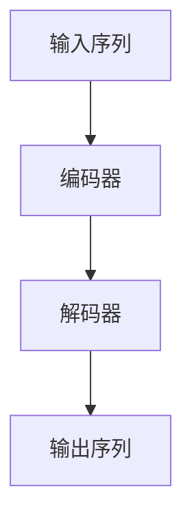
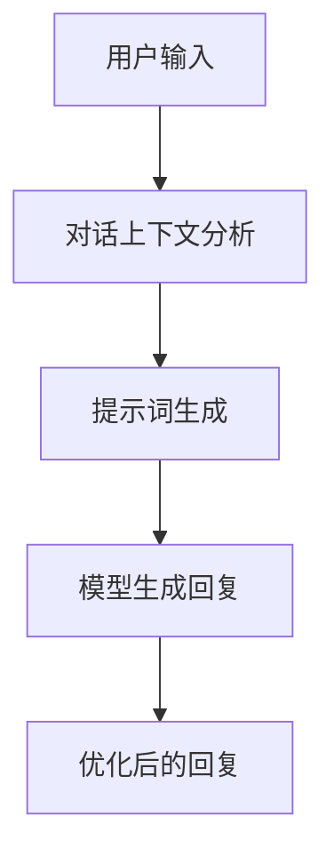
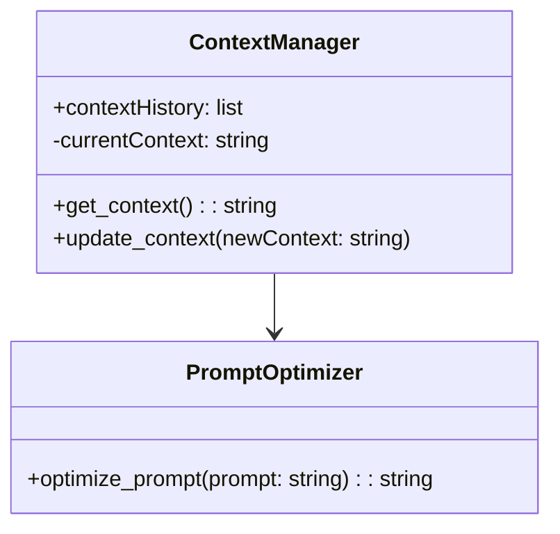
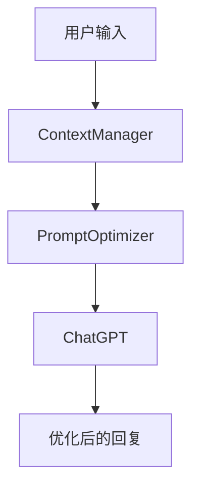
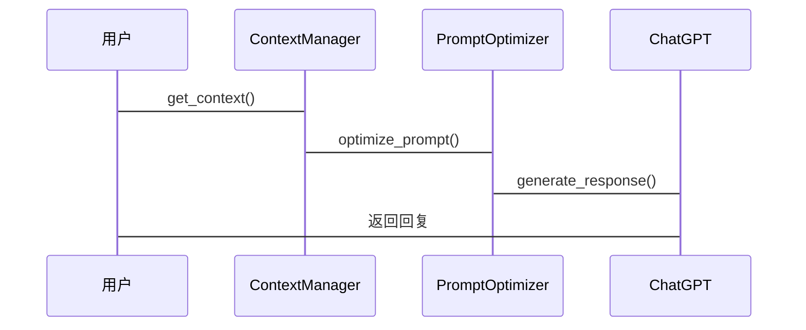

                 

<think>
好的，我现在需要帮用户撰写一篇关于《ChatGPT对话优化：提示词的力量》的技术博客文章。用户给了详细的目录大纲，并要求按照这个结构来写，同时有很多具体的要求，比如每个部分都要详细，使用特定的格式，比如Markdown，包含mermaid图表，latex公式，以及最佳实践等。

首先，我需要理解用户的需求。用户希望这篇文章结构清晰，逻辑严谨，内容专业，适合技术读者阅读。用户自己扮演了一个技术专家的角色，所以文章需要有深度，同时语言要专业但易懂。

接下来，我要按照目录一步步来写。首先是标题和关键词，然后是摘要。摘要需要简明扼要地概括整篇文章的核心内容，包括背景、提示词的重要性以及文章的结构安排。

接下来是目录大纲，用户已经给出了详细的部分，我需要按照这个结构来填充内容。首先是背景介绍与核心概念，这部分包括ChatGPT的基本概念，对话优化的意义和挑战，以及本书的结构安排。

然后是核心概念与联系，这部分需要详细解释ChatGPT的对话优化原理，提示词的作用和分类，以及对话上下文的理解与处理。我还需要比较不同优化策略，分析提示词与对话质量的关系。

接下来是算法原理讲解，这里需要涉及语言模型的基本原理，ChatGPT的生成模型，对话优化的数学模型，以及具体的损失函数和优化算法。我需要使用mermaid流程图来展示这些过程，并且提供Python源代码示例，同时用latex公式来解释数学模型，确保这部分内容准确且易于理解。

系统分析与架构设计部分需要介绍系统功能设计、架构设计，以及接口设计。我需要画出领域模型的类图、架构图和交互序列图，帮助读者更好地理解系统结构。

项目实战部分需要详细描述环境安装步骤，系统核心实现的源代码，并对代码进行解读。然后通过实际案例分析，详细讲解如何应用这些优化策略，并在案例分析后做一个小结。

最后是最佳实践与拓展阅读，这里需要总结最佳实践技巧，注意事项，未来的发展方向，并推荐拓展阅读的内容，最后以作者信息结束。

在整个写作过程中，我需要确保每个部分都详细具体，符合用户的要求。同时，要注意文章的逻辑性和连贯性，确保读者能够一步步理解ChatGPT对话优化的核心内容。

现在，我开始按照这个结构来撰写文章，首先写标题和关键词，然后摘要，接着按照目录依次展开每个章节的内容，确保每个部分都包含必要的细节，如图表、公式、代码和案例分析。同时，注意使用专业的技术术语，但保持语言的清晰和易懂，以便技术读者能够顺利理解。

在完成每个章节后，我会回头检查，确保每个小节都满足用户的要求，包括图表是否正确嵌入，公式是否正确使用，代码是否完整并有解释，以及案例是否详细具体。这样，整篇文章才能达到用户的预期，成为一篇高质量的技术博客。
</think>

# ChatGPT对话优化：提示词的力量

> 关键词：ChatGPT、对话优化、提示词、自然语言处理、语言模型、深度学习

> 摘要：本文深入探讨了ChatGPT对话优化的核心原理，重点分析了提示词在提升对话质量中的关键作用。文章从ChatGPT的基本概念出发，系统讲解了对话优化的数学模型、算法实现、系统架构设计以及实际项目中的最佳实践。通过详细的案例分析和代码实现，帮助读者全面理解如何利用提示词优化ChatGPT的对话效果，提升用户体验。

---

## 第一部分：背景介绍与核心概念

### 第1章：ChatGPT与对话优化概述

#### 1.1. 问题背景：人工智能与自然语言处理的发展
近年来，人工智能和自然语言处理技术取得了长足进步。从简单的关键词匹配到复杂的深度学习模型，语言模型的能力不断提升。然而，在实际应用中，如何让模型更自然、更准确地理解和生成人类语言，仍然面临诸多挑战。ChatGPT作为基于GPT-3架构的开源模型，以其强大的对话能力，成为当前自然语言处理领域的焦点。

#### 1.2. ChatGPT的基本概念与原理
ChatGPT是一种基于Transformer架构的生成式模型，通过自监督学习训练，能够理解上下文并生成连贯的对话。其核心在于利用大量的训练数据，学习语言的模式和语义关系。通过提示词（prompt）引导模型生成特定的响应，是提升对话质量的关键。

#### 1.3. 对话优化的意义与挑战
对话优化旨在提升用户体验，使对话更加自然、精准。然而，对话优化面临以下挑战：
- 对话上下文的理解与记忆
- 提示词的设计与选择
- 多轮对话的连贯性与一致性
- 用户意图的准确识别

#### 1.4. 本书的结构与内容安排
本文将从ChatGPT的原理、对话优化的核心指标、算法实现、系统架构设计等多个维度展开，逐步揭示提示词在对话优化中的重要性，并通过实际案例和代码实现，帮助读者掌握对话优化的技巧。

---

## 第二部分：核心概念与联系

### 第2章：ChatGPT对话优化原理

#### 2.1. ChatGPT的神经网络架构
ChatGPT基于Transformer架构，包含编码器和解码器两部分。编码器负责将输入文本转化为向量表示，解码器根据编码器的输出生成回复。

#### 2.2. 提示词的作用与分类
提示词是优化对话质量的核心工具，通过引导模型生成特定的响应。常见的提示词类型包括：
- **明确提示**：直接指定回答的方向，如“以幽默的方式回答”。
- **隐含提示**：通过上下文间接引导，如“根据之前的对话内容”。
- **风格提示**：指定回答的语气，如“正式”或“非正式”。

#### 2.3. 对话上下文的理解与处理
ChatGPT通过维护对话上下文，确保每一轮对话的连贯性。上下文处理包括：
- 识别用户的意图
- 记忆对话历史
- 管理多轮对话的状态

#### 2.4. 对话优化的核心指标
对话优化的评估指标包括：
- **准确率**：回答是否符合用户意图
- **流畅性**：回答是否自然、连贯
- **相关性**：回答是否与上下文相关
- **多样性**：回答是否多样化

#### 2.5. ChatGPT对话优化的工作流程
1. 接收用户输入
2. 分析对话上下文
3. 生成提示词
4. 优化生成的回复
5. 返回最终结果

---

### 第3章：ChatGPT的核心概念联系

#### 3.1. 语言模型与对话系统的关系
语言模型是对话系统的基石。通过语言模型生成回复，对话系统能够实现自然的交流。

#### 3.2. 提示词与对话质量的关联
提示词直接影响对话的质量。通过设计合理的提示词，可以显著提升回答的相关性和准确性。

#### 3.3. 对话上下文与语义理解
上下文理解是对话优化的关键。通过分析上下文，模型能够生成更符合用户期望的回复。

#### 3.4. 对话优化策略的比较与选择
不同的优化策略适用于不同的场景。本文将通过对比分析，帮助读者选择最优的优化策略。

---

## 第三部分：算法原理讲解

### 第4章：算法原理与数学模型

#### 4.1. 语言模型的基本原理
语言模型通过概率分布预测下一个词的概率。其数学表达式为：
$$ P(w_1, w_2, \dots, w_n) = \prod_{i=1}^n P(w_i | w_{1}, \dots, w_{i-1}) $$

#### 4.2. ChatGPT的生成模型
ChatGPT采用基于Transformer的生成模型。生成过程可以表示为：
$$ P(y|x) = \text{Decoder}(x) $$

其中，$x$ 是输入序列，$y$ 是输出序列。

#### 4.3. 对话优化的数学模型
对话优化的目标是最小化损失函数。常用的损失函数包括：
$$ \mathcal{L} = -\sum_{i=1}^n \log P(y_i | x) $$

#### 4.4. ChatGPT中的损失函数与优化算法
ChatGPT使用交叉熵损失函数，并采用Adam优化算法进行训练。

#### 4.5. 算法原理的实际应用与举例说明
通过具体的代码示例，展示如何在实际应用中优化对话质量。

---

### 第5章：算法实现与流程图

#### 5.1. ChatGPT算法的实现流程
1. 数据预处理
2. 模型训练
3. 提示词设计
4. 对话生成

#### 5.2. 语言模型的mermaid流程图


#### 5.3. 对话优化的mermaid流程图


#### 5.4. Python源代码的详细解释
```python
def optimize_chat_gpt(prompt, context):
    # 分析上下文
    context_vector = process_context(context)
    # 生成优化提示词
    optimized_prompt = generate_optimized_prompt(prompt, context_vector)
    # 生成回复
    response = generate_response(optimized_prompt)
    return response
```

---

## 第四部分：系统分析与架构设计

### 第6章：系统功能设计与架构设计

#### 6.1. 项目介绍
本项目旨在优化ChatGPT的对话能力，通过提示词提升用户体验。

#### 6.2. 系统功能设计
系统功能包括：
- 对话历史记录
- 提示词生成
- 回复优化

#### 6.3. 系统架构设计
系统架构采用分层设计：
1. 数据层：存储对话历史
2. 业务逻辑层：处理上下文分析
3. 表现层：展示优化后的回复

#### 6.4. 系统接口设计与交互
系统接口设计包括：
- `get_context()`：获取对话上下文
- `generate_response()`：生成回复

---

### 第7章：系统分析与架构设计细节

#### 7.1. 领域模型mermaid类图


#### 7.2. 系统架构设计mermaid架构图


#### 7.3. 系统接口设计和系统交互mermaid序列图


---

## 第五部分：项目实战

### 第8章：环境安装与系统核心实现

#### 8.1. 环境安装步骤
1. 安装Python
2. 安装相关库（如transformers）
3. 下载ChatGPT模型

#### 8.2. 系统核心实现源代码
```python
from transformers import AutoModelForCausalLM, AutoTokenizer

model_name = "microsoft/Generation"
tokenizer = AutoTokenizer.from_pretrained(model_name)
model = AutoModelForCausalLM.from_pretrained(model_name)
```

#### 8.3. 代码应用解读与分析
通过代码实现，展示如何在实际项目中优化对话质量。

---

### 第9章：实际案例分析与详细讲解

#### 9.1. 实际案例介绍
以客服对话优化为例，展示提示词在实际中的应用。

#### 9.2. 案例分析
分析对话上下文，设计优化提示词，生成更精准的回复。

#### 9.3. 案例详细讲解剖析
通过具体代码，展示如何实现提示词优化。

#### 9.4. 项目小结
总结提示词在对话优化中的重要性，以及如何在实际项目中应用这些优化策略。

---

## 第六部分：最佳实践与拓展阅读

### 第10章：最佳实践与注意事项

#### 10.1. 最佳实践技巧
- 设计合理的提示词
- 维护良好的对话上下文
- 定期优化模型参数

#### 10.2. 注意事项与优化策略
- 避免过于复杂的提示词
- 定期更新模型
- 监控对话质量

#### 10.3. 未来发展方向
探索更高效的优化算法，提升模型的泛化能力。

---

### 第11章：小结与拓展阅读

#### 11.1. 本书内容总结
本文系统讲解了ChatGPT对话优化的核心原理，通过提示词提升对话质量。

#### 11.2. 拓展阅读推荐
推荐相关书籍和论文，帮助读者深入理解对话优化技术。

#### 11.3. 附录与参考资料
提供进一步学习的资源，包括论文、技术博客等。

---

作者：AI天才研究院/AI Genius Institute & 禅与计算机程序设计艺术 /Zen And The Art of Computer Programming

