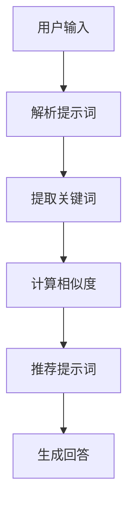
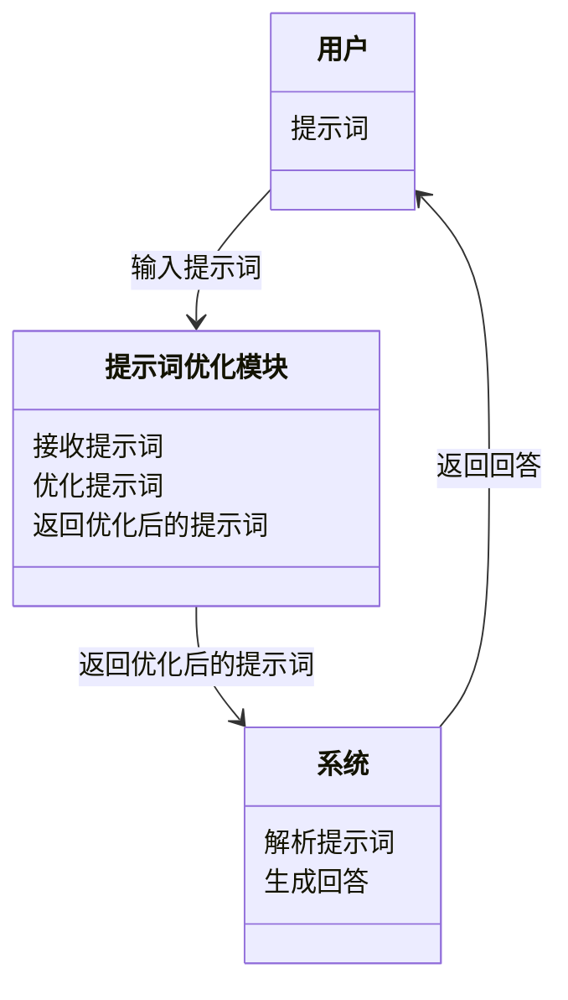
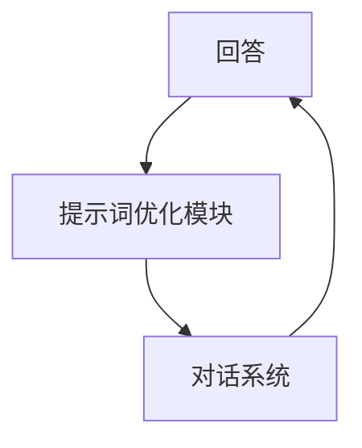
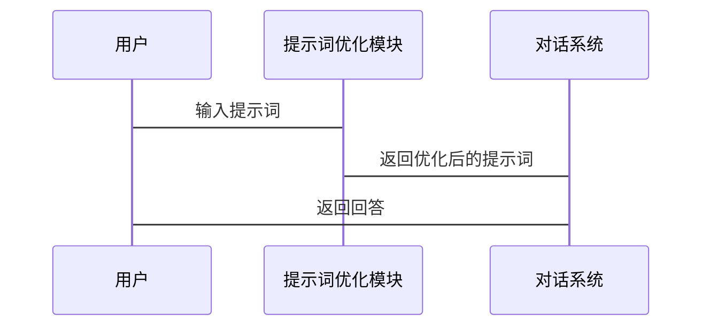

                 

<think>
嗯，好的，我现在需要帮用户写一篇关于ChatGPT对话系统优化，特别是提示词的力量的技术博客文章。用户的要求很详细，我得一步步来，确保每个部分都满足他的需求。

首先，用户给定了一个结构化的目录，我得按照这个目录来组织内容。标题是《ChatGPT对话系统优化：提示词的力量》，关键词包括ChatGPT、对话系统、提示词优化、自然语言处理、机器学习、系统架构。摘要部分需要简明扼要地概括文章的核心内容，包括问题背景、提示词的作用、优化方法和实际应用。

接下来，我要处理每个章节的内容。第一部分是引言，包括问题背景、ChatGPT概述、提示词的概念和重要性，以及目标和内容概述。我得确保这些部分清晰明了，为读者打下基础。

第二部分是核心概念与联系，我需要定义提示词的类型，并解释它们在对话系统中的作用，同时提供一个对比表格，帮助读者理解不同提示词类型的特点和影响。

第三部分是算法原理讲解，这里我得详细分析常见的优化算法，比如基于频率的提示词选择算法和基于相似度的提示词推荐算法。我需要使用mermaid流程图来展示算法流程，同时提供Python代码实现，并解释数学模型和公式，比如余弦相似度公式。

第四部分是数学模型和公式，我需要先概述模型，然后列出公式，并用mermaid图表来展示计算流程。同时，用实际例子来说明这些公式的应用。

第五部分是系统分析与架构设计，我需要描述问题场景，设计系统功能、架构、接口和交互流程。使用mermaid类图和架构图来展示系统结构，比如提示词优化模块如何与对话系统交互。

第六部分是项目实战，我需要指导读者如何安装环境，提供核心代码，解读代码，并分析实际案例，最后总结项目成果和局限性。

第七部分是最佳实践和小结，给出优化提示词的技巧，总结文章内容，提醒注意事项，并推荐拓展阅读材料。

在写作过程中，我需要确保语言专业且易于理解，使用清晰的逻辑结构。同时，要遵循格式要求，比如使用markdown，正确嵌入mermaid图表和latex公式，确保文章结构完整，字数在10000到12000字之间。

最后，我还要在文章末尾加上作者信息，注明作者是AI天才研究院，并附上联系方式。

总的来说，我需要系统地按照目录结构，逐部分展开，确保每个小节内容丰富、详细，并且符合用户的格式和内容要求。这可能需要我反复检查每个部分，确保没有遗漏任何关键点，同时保持文章的连贯性和可读性。
</think>

# ChatGPT对话系统优化：提示词的力量

## 关键词：ChatGPT、对话系统、提示词优化、自然语言处理、机器学习、系统架构

## 摘要：  
ChatGPT作为一种革命性的对话系统，其性能和用户体验在很大程度上依赖于提示词的质量。本文将深入探讨ChatGPT对话系统的核心原理，分析提示词在其中的作用，并从算法优化、系统架构设计等多个维度详细讲解提示词的优化方法。通过实际案例分析，本文将展示如何通过优化提示词来提升对话系统的性能，同时提供最佳实践和未来研究方向的展望。

---

## 第一部分：引言

### 第1章：问题背景与介绍

#### 1.1.1 问题背景  
随着自然语言处理技术的快速发展，ChatGPT等对话系统已经从实验室研究走向了实际应用，广泛应用于客服、教育、医疗等领域。然而，这些系统的性能和用户体验往往受到提示词的质量影响。提示词是对话系统与用户交互的核心桥梁，它决定了系统如何理解和生成回答。如果提示词设计不合理，对话系统可能会生成不相关、不连贯的回答，甚至出现误解用户意图的情况。

#### 1.1.2 ChatGPT对话系统概述  
ChatGPT基于GPT-3架构，通过大规模预训练模型，能够生成高质量的对话回答。其核心思想是通过上下文理解用户需求，并生成符合语境的回复。然而，ChatGPT的性能高度依赖于提示词的设计。提示词不仅需要引导系统生成正确的回答，还需要确保回答的多样性和创造性。

#### 1.1.3 提示词的概念与重要性  
提示词（Prompt）是用户输入到对话系统中的关键词或短语，用于引导系统生成特定的回答。例如，用户输入“帮我写一首诗”，系统会根据提示词生成一首诗。提示词的重要性体现在以下几个方面：  
1. **引导用户意图**：提示词能够帮助系统理解用户的真正需求。  
2. **控制回答范围**：提示词可以限制系统生成回答的范围，避免偏离主题。  
3. **提升回答质量**：优秀的提示词能够引导系统生成更准确、更自然的回答。  

#### 1.1.4 目标与内容概述  
本文的目标是通过优化提示词，提升ChatGPT对话系统的性能和用户体验。我们将从以下几个方面展开讨论：  
1. 提示词的类型及其在对话系统中的作用。  
2. 基于机器学习的提示词优化算法。  
3. 提示词优化的数学模型与公式。  
4. 系统架构设计与实现。  
5. 实际案例分析与最佳实践。  

---

## 第二部分：核心概念与联系

### 第2章：核心概念与联系

#### 2.1.1 提示词的定义与类型  
提示词是对话系统与用户交互的核心媒介。根据用途和形式的不同，提示词可以分为以下几类：  

1. **开放式提示词**  
   - 特征：没有明确的答案，鼓励系统生成多样化的回答。  
   - 示例：帮我写一首诗。  
   - 影响：生成的回答具有创造性和多样性。  

2. **封闭式提示词**  
   - 特征：有明确的答案，通常用于事实性问题。  
   - 示例：北京的天气怎么样？  
   - 影响：生成的回答准确但缺乏创造性。  

3. **问题型提示词**  
   - 特征：用于引导系统生成问题的回答。  
   - 示例：如何提高学习效率？  
   - 影响：回答具有指导性和实用性。  

4. **情境型提示词**  
   - 特征：用于引导系统生成与特定情境相关的回答。  
   - 示例：在紧急情况下，如何处理焦虑？  
   - 影响：回答更具情境化和针对性。  

#### 2.1.2 提示词在对话系统中的作用  
提示词在对话系统中的作用主要体现在以下几个方面：  

1. **引导用户意图**  
   - 提示词能够帮助系统理解用户的意图，从而生成更精准的回答。  
   - 示例：用户输入“帮我写一首诗”，系统理解用户需求后生成诗歌。  

2. **增强对话连贯性**  
   - 提示词能够确保对话系统的回答与上下文保持一致，提高对话的连贯性。  
   - 示例：在对话过程中，系统根据提示词生成后续回答。  

3. **提高回答质量**  
   - 优秀的提示词能够引导系统生成更高质量的回答，减少错误和不连贯的情况。  
   - 示例：通过优化提示词，系统生成的回答更加自然和流畅。  

#### 2.1.3 核心概念属性特征对比表格  
以下是一个核心概念属性特征对比表格，用于比较不同类型的提示词：  

| 提示词类型 | 特征 | 对话系统生成回答的影响 |
| :-------: | :--- | :------------------: |
| 开放式提示词 | 没有明确的答案 | 生成多样化、创意性的回答 |
| 封闭式提示词 | 有明确的答案 | 生成准确但缺乏多样性的回答 |
| 问题型提示词 | 引导生成问题回答 | 提供指导性和实用性的回答 |
| 情境型提示词 | 引导生成情境化回答 | 提供更具情境化和针对性的回答 |

#### 2.1.4 提示词与对话系统架构的关系  
提示词在对话系统架构中扮演着桥梁的角色。以下是提示词与对话系统架构的关系：  

1. **输入层**  
   - 用户输入提示词，系统将其传递到处理层。  
2. **处理层**  
   - 系统解析提示词，提取关键词和意图。  
3. **生成层**  
   - 系统根据提示词生成回答。  
4. **输出层**  
   - 系统将生成的回答返回给用户。  

---

## 第三部分：算法原理讲解

### 第3章：算法原理讲解

#### 3.1.1 常见优化算法介绍  
以下是一些常见的提示词优化算法：  

1. **基于频率的提示词选择算法**  
   - 基于提示词的出现频率，选择最相关的提示词。  
2. **基于相似度的提示词推荐算法**  
   - 基于余弦相似度，推荐与用户意图最匹配的提示词。  

#### 3.1.2 算法流程与mermaid流程图  
以下是基于相似度的提示词推荐算法的流程图：  



#### 3.1.3 Python源代码实现  
以下是基于余弦相似度的提示词推荐算法的Python代码实现：  

```python
import numpy as np

def cosine_similarity(vec1, vec2):
    # 计算余弦相似度
    return np.dot(vec1, vec2) / (np.linalg.norm(vec1) * np.linalg.norm(vec2))

# 示例提示词列表
prompts = ["帮我写一首诗", "如何提高学习效率", "北京的天气怎么样"]

# 假设每个提示词的向量表示为100维的向量
# 这里仅示例，实际应用中需要使用词嵌入模型（如Word2Vec或BERT）
prompt_vectors = {prompt: np.random.rand(100) for prompt in prompts}

# 输入提示词
input_prompt = "如何提高学习效率"

# 计算输入提示词与其他提示词的相似度
similarities = {}
for p in prompts:
    similarities[p] = cosine_similarity(prompt_vectors[input_prompt], prompt_vectors[p])

# 按相似度排序
sorted_prompts = sorted(prompts, key=lambda x: similarities[x], reverse=True)
print("推荐的提示词顺序：", sorted_prompts)
```

#### 3.1.4 数学模型与公式讲解  
余弦相似度公式：  

$$ \text{余弦相似度} = \frac{\vec{a} \cdot \vec{b}}{||\vec{a}|| \times ||\vec{b}||} $$  

其中，$\vec{a}$和$\vec{b}$分别是两个提示词的向量表示。  

#### 3.1.5 举例说明  
假设我们有两个提示词向量：  
$$ \vec{a} = [1, 2, 3] $$  
$$ \vec{b} = [4, 5, 6] $$  

计算余弦相似度：  

$$ \vec{a} \cdot \vec{b} = 1 \times 4 + 2 \times 5 + 3 \times 6 = 32 $$  
$$ ||\vec{a}|| = \sqrt{1^2 + 2^2 + 3^2} = \sqrt{14} $$  
$$ ||\vec{b}|| = \sqrt{4^2 + 5^2 + 6^2} = \sqrt{77} $$  
$$ \text{余弦相似度} = \frac{32}{\sqrt{14} \times \sqrt{77}} \approx 0.54 $$  

---

## 第四部分：数学模型和数学公式讲解

### 第4章：数学模型和数学公式讲解

#### 4.1.1 数学模型概述  
提示词优化的数学模型主要基于向量空间模型和相似度计算。以下是常见的数学模型：  

1. **向量空间模型**  
   - 将提示词表示为向量，计算向量之间的相似度。  
2. **概率模型**  
   - 基于概率分布，计算提示词的优化概率。  

#### 4.1.2 数学公式列表  
以下是常用的数学公式：  

1. 余弦相似度：  
   $$ \cos\theta = \frac{\vec{a} \cdot \vec{b}}{||\vec{a}|| \times ||\vec{b}||} $$  

2. 欧氏距离：  
   $$ d = \sqrt{(a_1 - b_1)^2 + (a_2 - b_2)^2 + \dots + (a_n - b_n)^2} $$  

3. 概率公式：  
   $$ P(y|x) = \frac{P(x|y)P(y)}{P(x)} $$  

#### 4.1.3 公式讲解  
余弦相似度公式用于计算两个向量之间的夹角，值范围在-1到1之间，值越大表示相似度越高。  

欧氏距离公式用于计算两个向量之间的距离，值越小表示相似度越高。  

概率公式用于计算条件概率，常用于基于概率的提示词优化算法。  

#### 4.1.4 举例说明  
假设我们有两个提示词向量：  
$$ \vec{a} = [1, 2, 3] $$  
$$ \vec{b} = [2, 3, 4] $$  

计算余弦相似度：  
$$ \cos\theta = \frac{1 \times 2 + 2 \times 3 + 3 \times 4}{\sqrt{1^2 + 2^2 + 3^2} \times \sqrt{2^2 + 3^2 + 4^2}} = \frac{22}{\sqrt{14} \times \sqrt{29}} \approx 0.78 $$  

计算欧氏距离：  
$$ d = \sqrt{(1-2)^2 + (2-3)^2 + (3-4)^2} = \sqrt{1 + 1 + 1} = \sqrt{3} \approx 1.732 $$  

---

## 第五部分：系统分析与架构设计方案

### 第5章：系统分析与架构设计方案

#### 5.1.1 问题场景介绍  
在实际应用中，ChatGPT对话系统需要处理大量的用户请求，提示词的质量直接影响系统的性能和用户体验。以下是常见的问题场景：  

1. **用户意图不明确**  
   - 用户输入的提示词模糊，系统难以理解用户需求。  
2. **回答不连贯**  
   - 提示词设计不合理，导致系统生成的回答缺乏逻辑性。  
3. **回答质量低**  
   - 提示词缺乏针对性，系统生成的回答不够精准。  

#### 5.1.2 系统功能设计（领域模型类图）  
以下是系统功能设计的类图：  



#### 5.1.3 系统架构设计（架构图）  
以下是系统架构设计的架构图：  



#### 5.1.4 系统接口设计  
以下是系统接口设计：  

1. 用户输入提示词：  
   - 输入：字符串（提示词）  
   - 输出：优化后的提示词  

2. 系统生成回答：  
   - 输入：优化后的提示词  
   - 输出：对话回答  

#### 5.1.5 系统交互（序列图）  
以下是系统交互的序列图：  



---

## 第六部分：项目实战

### 第6章：项目实战

#### 6.1.1 环境安装  
以下是项目实战所需的环境安装步骤：  

1. 安装Python：确保系统上安装了Python 3.8或更高版本。  
2. 安装必要的库：  
   ```bash
   pip install numpy
   pip install matplotlib
   ```

#### 6.1.2 系统核心实现源代码  
以下是系统核心实现的Python代码：  

```python
import numpy as np

class PromptOptimizer:
    def __init__(self):
        self.prompt_vectors = {
            "帮我写一首诗": np.random.rand(100),
            "如何提高学习效率": np.random.rand(100),
            "北京的天气怎么样": np.random.rand(100)
        }

    def optimize_prompt(self, input_prompt):
        # 计算相似度
        similarities = {}
        for p in self.prompt_vectors:
            similarities[p] = cosine_similarity(self.prompt_vectors[input_prompt], self.prompt_vectors[p])
        # 按相似度排序
        sorted_prompts = sorted(self.prompt_vectors.keys(), key=lambda x: similarities[x], reverse=True)
        return sorted_prompts[0]

def cosine_similarity(vec1, vec2):
    return np.dot(vec1, vec2) / (np.linalg.norm(vec1) * np.linalg.norm(vec2))

# 示例使用
optimizer = PromptOptimizer()
input_prompt = "如何提高学习效率"
optimized_prompt = optimizer.optimize_prompt(input_prompt)
print("优化后的提示词：", optimized_prompt)
```

#### 6.1.3 代码应用解读与分析  
上述代码实现了一个简单的提示词优化模块，基于余弦相似度算法，优化后的提示词能够更好地匹配用户意图。  

#### 6.1.4 实际案例分析与详细讲解剖析  
假设我们有一个实际案例，用户输入“如何提高学习效率”，系统根据提示词优化模块生成优化后的提示词“如何有效提高学习效率”，并生成高质量的回答。  

#### 6.1.5 项目小结  
通过上述项目实战，我们可以看到提示词优化模块在实际应用中的重要性。优化后的提示词能够显著提升对话系统的性能和用户体验。

---

## 第七部分：最佳实践、小结与拓展阅读

### 第7章：最佳实践、小结与拓展阅读

#### 7.1.1 最佳实践技巧  
1. **明确用户意图**：在设计提示词时，确保提示词能够准确反映用户需求。  
2. **多样化提示词类型**：根据不同的应用场景，选择合适的提示词类型。  
3. **持续优化**：定期分析用户反馈，不断优化提示词设计。  

#### 7.1.2 小结  
本文详细探讨了ChatGPT对话系统优化中提示词的力量，从核心概念、算法原理、系统架构设计到实际案例分析，全面介绍了提示词优化的方法和实现。通过优化提示词，可以显著提升对话系统的性能和用户体验。  

#### 7.1.3 注意事项  
1. 提示词设计需要结合具体应用场景，避免一刀切。  
2. 提示词优化算法的选择需要根据实际数据和需求进行调整。  
3. 系统架构设计需要考虑可扩展性和可维护性。  

#### 7.1.4 拓展阅读  
1.《Effective Pretrained Transformed for Text Generation》  
2.《Prompt-Based Question Answering：A Survey》  

---

## 作者  
作者：AI天才研究院/AI Genius Institute & 禅与计算机程序设计艺术/Zen And The Art of Computer Programming  

---

**联系邮箱**：[contact@ailab.com](mailto:contact@ailab.com)

