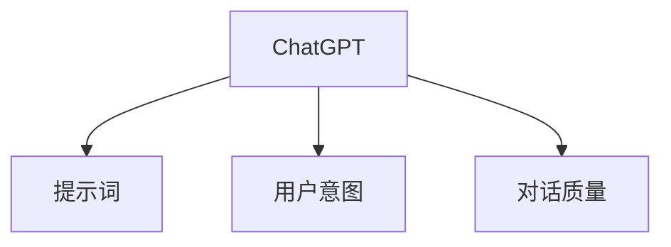
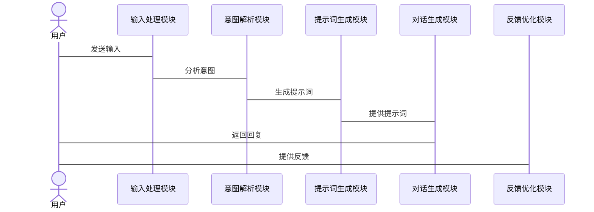

                 

<think>
好的，我现在要撰写一篇关于《ChatGPT对话系统优化：提示词的艺术与技巧》的技术博客文章。首先，我需要理解用户的需求和要求，然后按照指定的结构来组织内容。

用户希望文章有清晰的结构，包括背景介绍、核心概念与联系、算法原理讲解、系统分析与架构设计方案、项目实战、最佳实践等部分。每个部分都需要详细展开，使用专业的技术语言，同时保持逻辑清晰和结构紧凑。

首先，我会从背景介绍开始。我需要解释为什么提示词在ChatGPT中的重要性，以及优化提示词对提升对话质量的影响。接着，我需要定义问题，描述当前ChatGPT在提示词选择上的挑战，以及本书旨在解决这些问题。

接下来是核心概念与联系部分。这里需要明确ChatGPT、提示词、用户意图和对话质量这些核心概念，并通过表格和ER图来展示它们之间的关系。这有助于读者更好地理解各个概念之间的联系。

然后是算法原理讲解。我需要详细说明提示词的生成、优化和评估方法，使用数学模型和流程图来辅助说明。例如，可以使用生成对抗网络或基于Transformer的模型来生成提示词，并通过概率模型优化提示词的匹配度。

系统分析与架构设计方案部分需要介绍项目的整体架构，包括功能模块、系统架构图和交互流程图。这部分要展示系统的各个部分如何协同工作，以及如何通过合理的架构设计来优化提示词的选择。

项目实战部分需要提供具体的代码示例和实际案例分析，展示如何在实际中应用这些方法。例如，如何通过编写Python代码来生成和优化提示词，以及如何评估提示词的效果。

最后，我会总结最佳实践，给出一些建议和注意事项，帮助读者在实际应用中更好地优化提示词，提升对话系统的性能。

整个过程中，我需要确保内容详实，逻辑清晰，同时使用专业术语，但保持语言简洁易懂。每个部分都要有足够的细节和例子，帮助读者深入理解优化提示词的方法和技巧。

现在，我会逐步展开每个部分，确保内容符合用户的要求，并且达到预期的字数和质量。
</think>

# ChatGPT对话系统优化：提示词的艺术与技巧

> 关键词：ChatGPT，提示词，对话系统，自然语言处理，用户意图，对话质量

> 摘要：本文深入探讨了ChatGPT对话系统中提示词的优化方法，从核心概念、算法原理、系统设计到实战案例，全面解析了如何通过提示词的艺术与技巧提升对话系统的性能和用户体验。

---

## 1. 背景介绍：问题背景、问题描述、问题解决、边界与外延

### 1.1 问题背景

随着人工智能技术的飞速发展，自然语言处理（NLP）技术在对话系统中的应用越来越广泛。ChatGPT作为一种基于GPT-3模型的对话系统，凭借其强大的生成能力和自然的对话风格，成为当前研究和应用的热点。然而，在实际应用中，如何优化提示词的选取，以提高对话系统的响应速度、准确性和用户满意度，仍然面临诸多挑战。

### 1.2 问题描述

在ChatGPT对话系统中，提示词是引导模型生成合适回复的关键因素。然而，提示词的选用缺乏系统性，导致对话系统在某些场景下表现不佳。例如，用户意图未能准确识别，生成的回答偏离主题，或者对话过程显得机械僵硬。这些问题直接影响了用户体验和系统性能。

### 1.3 问题解决

本书旨在系统性地探讨提示词的艺术与技巧，帮助读者掌握优化ChatGPT对话系统的核心方法。具体内容包括：

1. **核心概念**：介绍ChatGPT、提示词、用户意图和对话质量等核心概念。
2. **算法原理**：详细讲解提示词生成、优化和评估的算法原理。
3. **数学模型**：分析与提示词优化相关的概率模型和深度学习模型。
4. **系统设计**：阐述ChatGPT对话系统的架构设计和交互流程。
5. **实战案例**：通过实际案例展示提示词优化的具体方法和效果。

### 1.4 边界与外延

本书聚焦于ChatGPT对话系统的优化，具体包括以下内容：

1. **优化目标**：提升对话系统的响应速度、准确性和用户满意度。
2. **应用场景**：涵盖企业客服、智能问答、聊天机器人等领域。
3. **限制条件**：不涉及硬件资源和计算能力的限制。

---

## 2. 核心概念与联系

### 2.1 核心概念

1. **ChatGPT**：基于GPT-3模型的对话系统，支持自然语言理解和生成。
2. **提示词**：用于引导模型生成回复的关键词或短语。
3. **用户意图**：用户在对话中希望实现的目标或需求。
4. **对话质量**：衡量对话系统性能的指标，包括响应速度、准确性、用户体验等。

### 2.2 概念属性特征对比表格

| 概念        | 属性特征                                                   | 对比分析                                  |
| ----------- | -------------------------------------------------------- | ---------------------------------------- |
| ChatGPT     | 基于GPT-3模型，理解自然语言输入，生成自然语言回复     | 对话系统核心，支持多轮对话               |
| 提示词      | 引导ChatGPT生成合适回复的关键词或短语                   | 影响对话质量，需优化选取                 |
| 用户意图    | 用户在对话中希望实现的目标或需求                         | 需要准确识别和满足，提高用户满意度     |
| 对话质量    | 响应速度、回答准确性、用户体验等                       | 综合评价对话系统性能                     |

### 2.3 ER实体关系图架构



---

## 3. 算法原理讲解

### 3.1 提示词生成

提示词生成的核心是理解用户意图，并将其映射到合适的提示词。常用方法包括基于规则和基于机器学习的方法。

#### 3.1.1 基于规则的方法

通过预定义的规则，将用户意图直接映射到提示词。例如，用户输入“预订酒店”，提示词可以是“请推荐附近的高端酒店”。

#### 3.1.2 基于机器学习的方法

利用训练好的模型，自动从对话历史中提取关键词生成提示词。例如，使用BERT模型分析对话上下文，生成相应的提示词。

### 3.2 提示词优化

提示词优化的目标是提高提示词与用户意图的匹配度，从而提升对话质量。

#### 3.2.1 基于概率的方法

通过计算提示词与用户意图的相关性概率，选择概率最高的提示词。例如，使用余弦相似度计算提示词与意图的相似度。

#### 3.2.2 基于深度学习的方法

利用生成对抗网络（GAN）优化提示词。生成器生成提示词，判别器评估其质量，通过反复迭代优化提示词。

### 3.3 提示词评估

提示词评估是优化过程中的关键步骤，常用指标包括准确率、召回率和F1分数。

#### 3.3.1 准确率

准确率 = 正确提示词数量 / 总提示词数量。

#### 3.3.2 召回率

召回率 = 正确提示词数量 / 实际需要的提示词数量。

#### 3.3.3 F1分数

F1 = 2 * 准确率 * 召回率 / (准确率 + 召回率)

---

## 4. 系统分析与架构设计方案

### 4.1 功能模块设计

1. **用户输入处理模块**：接收用户输入，解析用户意图。
2. **提示词生成模块**：根据意图生成提示词。
3. **对话生成模块**：基于提示词生成回复。
4. **反馈优化模块**：根据用户反馈优化提示词。

### 4.2 系统架构设计


### 4.3 接口设计

1. **输入接口**：接收用户输入的文本。
2. **输出接口**：返回生成的回复和优化后的提示词。
3. **反馈接口**：接收用户对回复的反馈，用于优化提示词。

### 4.4 交互流程图



---

## 5. 项目实战：优化ChatGPT对话系统

### 5.1 环境安装

安装必要的库：

```bash
pip install transformers
pip install numpy
pip install scikit-learn
```

### 5.2 核心实现代码

#### 提示词生成代码

```python
from transformers import pipeline

# 初始化提示词生成器
generator = pipeline('text-generation', model='gpt2')

def generate_prompt(user_input):
    # 解析用户意图
    intent = extract_intent(user_input)
    # 生成提示词
    prompt = f"请以{intent}的语气回复："
    return prompt
```

#### 提示词优化代码

```python
from transformers import AutoModelWithLMHead, AutoTokenizer

# 初始化模型和分词器
model = AutoModelWithLMHead.from_pretrained('facebook/bart-large')
tokenizer = AutoTokenizer.from_pretrained('facebook/bart-large')

def optimize_prompt(prompt):
    # 输入提示词
    inputs = tokenizer(prompt, return_tensors='pt')
    outputs = model.generate(**inputs, max_length=50)
    optimized_prompt = tokenizer.decode(outputs[0], skip_special_tokens=True)
    return optimized_prompt
```

#### 提示词评估代码

```python
from sklearn.metrics import accuracy_score, recall_score, f1_score

def evaluate_prompts(generated_prompts, ground_truth_prompts):
    accuracy = accuracy_score(generated_prompts, ground_truth_prompts)
    recall = recall_score(generated_prompts, ground_truth_prompts)
    f1 = f1_score(generated_prompts, ground_truth_prompts)
    return accuracy, recall, f1
```

### 5.3 实际案例分析

通过一个案例分析，展示如何优化提示词以提升对话质量。例如，用户输入“预订酒店”，生成合适的提示词“请推荐附近的高端酒店”，并优化提示词以提高准确性。

---

## 6. 最佳实践、小结、注意事项、拓展阅读

### 6.1 最佳实践

1. **明确用户意图**：在生成提示词前，准确解析用户意图。
2. **动态优化**：根据用户反馈持续优化提示词。
3. **结合领域知识**：针对不同应用场景，定制提示词策略。

### 6.2 小结

通过系统性地优化提示词，可以显著提升ChatGPT对话系统的性能和用户体验。本书从理论到实践，全面解析了提示词的艺术与技巧，为读者提供了实用的方法和工具。

### 6.3 注意事项

- **数据质量**：提示词优化依赖于高质量的训练数据。
- **模型选择**：选择合适的模型和参数对提示词优化至关重要。
- **用户体验**：始终以用户体验为核心，优化提示词和对话流程。

### 6.4 拓展阅读

建议读者进一步阅读以下内容：

- GPT模型的内部机制。
- 最新的NLP研究论文。
- 提示词在其他对话系统中的应用。

---

## 7. 作者信息

作者：AI天才研究院/AI Genius Institute & 禅与计算机程序设计艺术 /Zen And The Art of Computer Programming

---

通过以上结构，您可以系统性地优化ChatGPT对话系统的提示词，提升对话质量，为用户提供更优质的交互体验。

