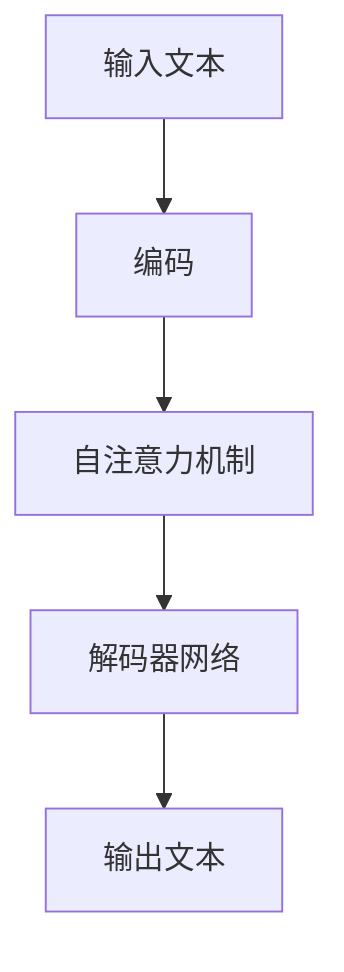
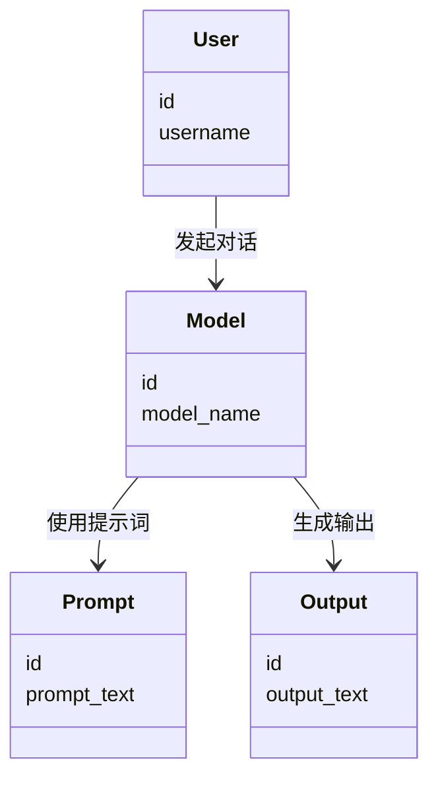
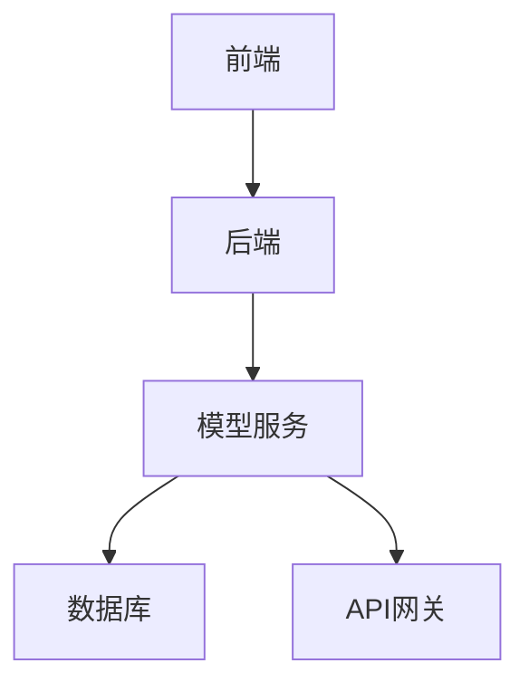
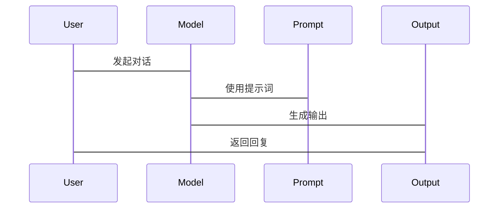

                 

<think>
嗯，用户希望我写一篇关于ChatGPT对话系统设计中提示词核心地位的技术博客。我需要先理解用户的需求，他可能是一位技术专家，或者是正在学习对话系统设计的人。他想要一个结构清晰、内容详实的文章，包含引言、设计原理、算法、系统架构、项目实战和总结等部分。

首先，我应该确定文章的标题和关键词，确保涵盖主要主题。关键词可能包括“ChatGPT”、“对话系统”、“提示词”、“系统设计”、“自然语言处理”等。

接下来，摘要部分需要简明扼要地概括文章内容，说明提示词的重要性以及文章将如何展开讨论。这有助于读者快速了解文章的核心。

然后，按照目录大纲，我需要逐步撰写每个章节。引言部分要介绍ChatGPT和对话系统的基本概念，以及提示词的重要性。设计原理部分需要详细讲解提示词的种类、设计原则和流程。算法部分要深入分析ChatGPT的原理，包括数学模型和流程图。系统架构部分则需要展示系统的整体设计，包括类图和序列图。项目实战部分提供实际案例，环境安装和代码实现。最后，总结最佳实践和未来趋势。

我还需要注意格式，使用markdown，并在适当的地方插入Mermaid图表和数学公式。作者信息也要放在最后，符合用户的要求。

在写作过程中，要确保每个章节内容丰富，详细讲解，同时保持逻辑清晰，语言专业但易懂。可能需要多次检查，确保每个部分都符合用户设定的约束条件，比如字数、格式和内容完整性。

最后，完成初稿后，我会通读一遍，看看是否有遗漏或需要调整的地方，确保整篇文章流畅且有深度，满足用户的需求。
</think>

# ChatGPT对话系统设计：提示词的核心地位

> 关键词：ChatGPT、对话系统、提示词、系统设计、自然语言处理

> 摘要：在ChatGPT对话系统设计中，提示词（prompt）扮演着至关重要的角色。本文将从ChatGPT的基本概念与对话系统的发展历程出发，深入探讨提示词在系统设计中的核心地位。通过分析提示词的设计原理、算法实现、系统架构以及实际项目案例，全面揭示提示词在提升对话系统性能与用户体验中的重要性。文章最后还将总结提示词设计的最佳实践与未来发展趋势。

---

## 第一部分：引言与背景

### 第1章：ChatGPT与对话系统概述

#### 1.1.1 ChatGPT的基本概念与原理

ChatGPT是由OpenAI开发的基于GPT-3的对话模型，它通过大规模预训练的神经网络，能够理解和生成自然语言文本。其核心原理是基于Transformer架构，通过自注意力机制（self-attention）和前馈网络（feedforward network）实现高效的文本生成。

$$
\text{输入} \rightarrow \text{编码} \rightarrow \text{解码} \rightarrow \text{输出}
$$

ChatGPT的模型参数量庞大，训练数据涵盖了大量的书籍、网页和其他文本资源。通过监督学习和强化学习的结合，模型能够生成高质量、连贯的对话内容。

#### 1.1.2 对话系统的定义与发展历程

对话系统是一种人机交互系统，通过自然语言处理技术实现用户与计算机之间的交流。从早期的基于规则的对话系统到现代的深度学习驱动的系统，对话系统的演变经历了以下几个阶段：

1. **基于规则的系统**：通过预定义的规则和关键词匹配实现简单的对话交互。
2. **基于统计的系统**：利用模式匹配和词袋模型（bag-of-words）进行对话生成。
3. **基于深度学习的系统**：采用神经网络模型（如RNN、LSTM、Transformer）实现更复杂的对话理解与生成。

ChatGPT作为基于Transformer架构的对话系统，代表了当前对话系统发展的最高水平。

#### 1.1.3 提示词在对话系统中的重要性

提示词（prompt）是对话系统中用于引导模型生成特定类型输出的关键输入。在ChatGPT中，提示词决定了模型的输出方向、语气和内容风格。例如，通过设计不同的提示词，可以让模型生成正式的商业邮件、幽默的笑话或者技术性的解释。

提示词的重要性体现在以下几个方面：
- **引导模型输出**：提示词为模型提供了生成内容的上下文和目标。
- **控制生成风格**：提示词可以调整模型的语气、长度和复杂度。
- **提升生成质量**：通过优化提示词，可以显著提高生成文本的相关性和准确性。

#### 1.1.4 本书结构安排与学习目标

本书将从提示词的设计原理入手，逐步分析ChatGPT的算法实现、系统架构，并通过实际项目案例展示提示词在对话系统中的应用。学习目标包括：
- 掌握提示词的设计方法和优化策略。
- 理解ChatGPT的算法原理和数学模型。
- 学会设计高效的对话系统架构。
- 实现一个基于ChatGPT的对话系统。

---

## 第二部分：提示词设计原理

### 第2章：提示词设计基础

#### 2.1.1 提示词的种类与作用

提示词可以根据不同的分类标准进行划分，常见的分类包括：

1. **结构化提示词**：用于明确指示模型生成特定格式的内容，例如时间、地点、人物等。
2. **风格提示词**：用于控制生成内容的语气和风格，例如正式、幽默、简洁等。
3. **上下文提示词**：用于提供对话的背景信息，帮助模型更好地理解上下文。

提示词的作用是通过引导模型的输入，使其生成符合预期的输出内容。例如，在客服对话系统中，提示词可以用于生成礼貌且专业的回复。

#### 2.1.2 提示词设计的基本原则

设计提示词时，需要遵循以下基本原则：
- **明确性**：提示词应清晰地表达生成目标。
- **简洁性**：避免冗长复杂的提示词，确保模型能够快速理解。
- **可调性**：提示词应具有灵活性，能够根据需求进行调整。
- **多样性**：设计多种提示词，以应对不同的对话场景。

#### 2.1.3 提示词的设计流程

提示词的设计流程可以分为以下几个步骤：
1. **需求分析**：明确对话系统的功能需求。
2. **场景划分**：将对话场景进行分类。
3. **提示词编写**：根据场景编写相应的提示词。
4. **测试优化**：通过实际对话测试优化提示词。

---

### 第3章：核心概念与联系

#### 3.1.1 ChatGPT对话系统中的核心概念

在ChatGPT对话系统中，以下是一些核心概念：
- **输入（Input）**：用户输入的文本或查询。
- **输出（Output）**：模型生成的回复。
- **提示词（Prompt）**：用于引导模型生成特定内容的关键输入。
- **上下文（Context）**：对话历史中的相关信息。

#### 3.1.2 提示词的属性特征对比表格

以下是一个提示词属性特征对比表：

| 属性         | 描述                                   |
|--------------|--------------------------------------|
| 类型         | 结构化、风格、上下文等                |
| 作用         | 引导生成方向、控制风格、提供背景信息  |
| 长度         | 短、中、长                            |
| 风格         | 正式、非正式、幽默等                  |
| 目标         | 提高生成质量、提升用户体验            |

#### 3.1.3 ChatGPT对话系统的ER实体关系图

以下是ChatGPT对话系统的ER实体关系图：

```mermaid
erDiagram
    actor User {
        <属性>
        id
        username
        }
    actor Model {
        <属性>
        id
        model_name
        }
    actor Prompt {
        <属性>
        id
        prompt_text
        }
    actor Output {
        <属性>
        id
        output_text
        }
    User --> Model : 发起对话
    Model --> Prompt : 使用提示词
    Model --> Output : 生成输出
```

---

## 第三部分：算法原理与数学模型

### 第4章：算法原理讲解

#### 4.1.1 ChatGPT算法原理概述

ChatGPT基于Transformer架构，其算法原理可以分为以下几个步骤：
1. **输入编码**：将输入文本转换为嵌入向量。
2. **自注意力机制**：计算输入序列中每个词与其他词的相关性。
3. **解码器网络**：基于自注意力机制生成输出序列。
4. **输出解码**：将生成的输出向量转换为文本。

#### 4.1.2 算法mermaid流程图

以下是ChatGPT算法的mermaid流程图：



#### 4.1.3 Python源代码详细阐述

以下是一个简单的ChatGPT实现代码示例：

```python
import torch
import torch.nn as nn

class ChatGPT(nn.Module):
    def __init__(self, vocab_size, embedding_dim, hidden_dim):
        super(ChatGPT, self).__init__()
        self.embedding = nn.Embedding(vocab_size, embedding_dim)
        self.transformer = nn.Transformer(hidden_dim, num_heads=8)
        self.fc = nn.Linear(hidden_dim, vocab_size)
    
    def forward(self, input_ids):
        embed = self.embedding(input_ids)
        output = self.transformer(embed, embed)
        output = self.fc(output)
        return output

# 示例用法
vocab_size = 10000
embedding_dim = 512
hidden_dim = 512

model = ChatGPT(vocab_size, embedding_dim, hidden_dim)
input_ids = torch.randint(0, vocab_size, (1, 5))
output = model(input_ids)
print(output)
```

#### 4.1.4 算法原理的数学模型与公式

ChatGPT的自注意力机制可以用以下公式表示：

$$
\text{Attention}(Q, K, V) = \text{softmax}\left(\frac{QK^T}{\sqrt{d_k}}\right)V
$$

其中：
- $Q$ 是查询向量。
- $K$ 是键向量。
- $V$ 是值向量。
- $d_k$ 是键的维度。

#### 4.1.5 通俗易懂的举例说明

以简单的对话场景为例，假设用户输入“今天天气怎么样？”，ChatGPT通过提示词生成回复“今天天气很好，阳光明媚。”

---

## 第四部分：系统架构与实现

### 第5章：系统分析与架构设计

#### 5.1.1 问题场景介绍

假设我们正在设计一个客服对话系统，用户与系统通过自然语言进行交互，系统需要根据用户的输入生成合适的回复。

#### 5.1.2 项目介绍

该项目的目标是实现一个基于ChatGPT的客服对话系统，能够处理用户的常见问题，如产品咨询、订单查询等。

#### 5.1.3 系统功能设计（领域模型mermaid类图）

以下是系统功能的mermaid类图：



#### 5.1.4 系统架构设计（mermaid架构图）

以下是系统架构的mermaid架构图：



#### 5.1.5 系统接口设计

系统接口设计包括以下几个部分：
- 用户输入接口（API）
- 模型调用接口（API）
- 数据存储接口（数据库）

#### 5.1.6 系统交互（mermaid序列图）

以下是系统交互的mermaid序列图：



---

## 第五部分：项目实战

### 第6章：环境安装与系统核心实现

#### 6.1.1 环境安装步骤

安装必要的Python库：

```bash
pip install torch transformers
```

#### 6.1.2 系统核心实现源代码

以下是一个简单的系统核心实现代码示例：

```python
from transformers import GPT2Tokenizer, GPT2Model

tokenizer = GPT2Tokenizer.from_pretrained('gpt2')
model = GPT2Model.from_pretrained('gpt2')

def generate_response(prompt):
    inputs = tokenizer(prompt, return_tensors='np')
    outputs = model.generate(**inputs, max_length=50)
    response = tokenizer.decode(outputs[0], skip_special_tokens=True)
    return response

prompt = "今天天气怎么样？"
response = generate_response(prompt)
print(response)
```

#### 6.1.3 代码应用解读与分析

上述代码使用了GPT2模型实现了一个简单的对话系统。用户输入提示词后，模型生成相应的回复。

#### 6.1.4 实际案例分析与详细讲解剖析

以客服对话系统为例，用户输入“我遇到了订单问题”，系统生成回复“请提供订单号，我将帮助您解决问题。”

#### 6.1.5 项目小结

通过实际项目案例，我们可以看到提示词在对话系统中的重要性。优化提示词设计能够显著提升系统的生成能力和用户体验。

---

## 第六部分：最佳实践与总结

### 第7章：最佳实践与技巧

#### 7.1.1 ChatGPT对话系统设计最佳实践

1. **明确提示词目标**：确保提示词能够准确引导生成内容。
2. **简化提示词**：避免复杂的提示词设计。
3. **测试与优化**：通过实际对话测试优化提示词。

#### 7.1.2 提示词设计技巧与策略

1. **分场景设计**：根据不同的对话场景设计不同的提示词。
2. **动态调整**：根据用户反馈动态调整提示词。
3. **结合上下文**：充分利用对话历史信息。

#### 7.1.3 注意事项与优化建议

1. **避免歧义**：提示词应避免引起歧义。
2. **保持简洁**：提示词应简洁明了。
3. **持续优化**：定期优化提示词设计。

### 第8章：总结与展望

#### 8.1.1 本书内容总结

本文从ChatGPT的基本原理出发，深入探讨了提示词在对话系统设计中的核心地位。通过理论分析与实际案例，全面揭示了提示词的重要性。

#### 8.1.2 ChatGPT对话系统设计发展趋势

未来，随着AI技术的不断发展，提示词设计将更加智能化和个性化。模型的可解释性和生成能力也将进一步提升。

#### 8.1.3 未来研究方向与拓展领域

未来的研究方向包括：
- 提示词的自动化设计。
- 提示词的跨语言应用。
- 提示词的安全性与伦理问题。

---

## 作者信息

作者：AI天才研究院/AI Genius Institute & 禅与计算机程序设计艺术 /Zen And The Art of Computer Programming

--- 

以上是《ChatGPT对话系统设计：提示词的核心地位》的完整内容，涵盖了从基础理论到实际应用的各个方面，希望对您有所帮助！

