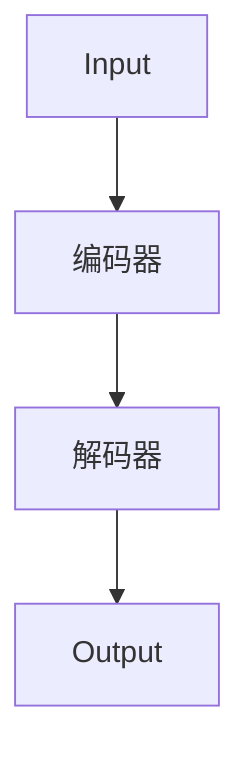
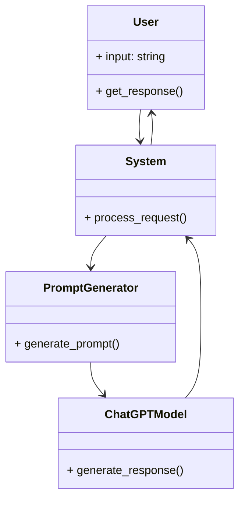
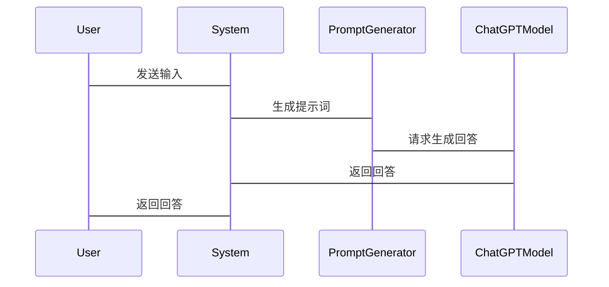

                 

<think>
嗯，我现在要开始写这篇关于ChatGPT对话系统设计，特别是提示词核心地位与作用的技术博客文章。首先，我得理清文章的结构，确保每个部分都涵盖到位。

首先，文章的标题是《ChatGPT对话系统设计：提示词的核心地位与作用》，关键词包括ChatGPT、对话系统、提示词、自然语言处理、人工智能、系统设计。摘要部分要简明扼�，说明文章的核心内容，也就是提示词在ChatGPT中的重要性，以及它们如何影响系统的性能和功能。

接下来，目录大纲已经设计好了，包括背景介绍、核心概念与联系、算法原理、系统分析与架构设计、项目实战，以及最佳实践与总结。每个章节下还有具体的子章节，比如背景介绍部分包括ChatGPT的基本原理，核心概念部分涉及提示词的设计原则等。

在写作时，我需要先从背景介绍开始。这部分要让读者了解对话系统的发展历程，以及ChatGPT在其中的独特地位。可能还需要解释一下什么是提示词，它在对话系统中的作用是什么。这部分需要简明扼要，同时要有足够的技术深度，让读者理解其重要性。

然后是核心概念与联系部分，这部分需要详细讨论提示词的类型和设计原则。比如，封闭式和开放式提示词有什么不同？它们在实际应用中如何选择和优化？这部分可能还需要用表格来对比不同类型提示词的特征，帮助读者更好地理解。

算法原理讲解部分，我需要使用Mermaid图来展示ChatGPT的流程，同时给出数学模型和公式。这部分可能会有点复杂，但要尽量解释清楚，让读者能够理解模型是如何工作的，以及提示词是如何影响模型输出的。

系统分析与架构设计部分，我需要设计系统的功能模块，比如用户输入处理、提示词生成、模型调用等，并用Mermaid图展示系统的架构。这部分可能还需要讨论接口设计和交互流程，确保系统在实际应用中能够高效运行。

项目实战部分，我需要提供一个具体的案例，比如如何设计一个智能客服系统。这包括环境的安装配置、核心代码的实现，以及对代码的详细解读。这部分要让读者能够实际操作，理解提示词在项目中的应用。

最后是最佳实践与总结，这里要给出一些实际应用中的建议，比如如何优化提示词设计，如何进行系统调优，以及如何确保系统的安全性和隐私性。这些内容对读者的实际工作会有很大的帮助。

在写作过程中，我需要确保每个章节内容丰富，详细讲解相关概念，并且提供足够的例子和图表来辅助理解。同时，语言要保持专业但易懂，避免过于晦涩的技术术语，让不同层次的读者都能理解。

另外，数学公式要用LaTeX格式呈现，确保公式正确且易于阅读。代码部分要使用Python，并且尽量简洁明了，方便读者理解和复制。

最后，结尾部分要加上作者信息，这样读者可以知道文章的来源和作者的专业背景。

总的来说，我需要一步步地按照目录大纲来填充内容，确保每个部分都覆盖到位，同时保持整体的逻辑性和连贯性。这将帮助读者从基础到应用，全面理解ChatGPT对话系统中提示词的核心地位与作用。
</think>

# ChatGPT对话系统设计：提示词的核心地位与作用

> 关键词：ChatGPT、对话系统、提示词、自然语言处理、人工智能、系统设计  
> 摘要：本文深入探讨ChatGPT对话系统中提示词的核心地位与作用，分析提示词的设计原则、类型及其对系统性能的影响，结合实际案例展示如何通过优化提示词提升对话系统的智能化水平。

---

## 目录

### 第一部分：背景介绍

#### 第1章：ChatGPT与对话系统的概述

##### 1.1 问题背景与核心概念

对话系统是自然语言处理（NLP）领域的重要应用，旨在通过计算机模拟人类对话能力。ChatGPT作为当前最成功的对话系统之一，基于GPT模型，通过大规模预训练和微调，实现了接近人类水平的对话能力。提示词（Prompt）在其中扮演着关键角色，用于引导模型生成符合特定要求的输出。

##### 1.2 对话系统的现状与需求

随着NLP技术的快速发展，对话系统已广泛应用于客服、教育、医疗等领域。然而，对话系统的效果很大程度上依赖于提示词的设计。一个优秀的提示词能够显著提升系统的回答质量、准确性和用户体验，而设计不当的提示词可能导致系统输出偏离预期或产生错误信息。

##### 1.3 ChatGPT的基本原理

ChatGPT基于Transformer架构，通过自注意力机制和前馈网络处理输入序列。模型通过预训练掌握了海量文本数据，能够理解上下文并生成连贯的回答。提示词的作用在于调整模型的输出方向，使其专注于特定任务或风格。

---

### 第2章：ChatGPT的核心地位与作用

#### 2.1 ChatGPT的作用与优势

ChatGPT通过提示词实现了高度的灵活性和可定制性，能够适应多种对话场景。相比传统对话系统，ChatGPT的优势在于其强大的上下文理解和生成能力，这使得它能够处理复杂对话，提供更自然的交互体验。

#### 2.2 ChatGPT的核心地位

在ChatGPT系统中，提示词是连接用户输入与模型输出的关键桥梁。通过设计不同的提示词，可以引导模型生成不同风格的回答，例如正式、幽默或简洁的回复。提示词的设计直接影响系统的性能和用户体验。

#### 2.3 ChatGPT的应用场景

ChatGPT适用于多种场景，包括客服支持、教育辅助、医疗咨询等。在这些场景中，提示词的设计需要考虑目标用户的特征和需求，以确保系统能够提供准确且个性化的服务。

---

### 第二部分：核心概念与联系

#### 第3章：核心概念与原理

##### 3.1 提示词的作用与类型

提示词的作用在于引导模型生成符合特定要求的回答。常见的提示词类型包括指令型、上下文型和风格型。指令型提示词直接指示模型执行任务，例如“请解释如何制作咖啡”。上下文型提示词提供背景信息，帮助模型更好地理解上下文。风格型提示词指定回答的风格，例如“用简洁的语言回答”。

##### 3.2 提示词的设计原则与技巧

设计提示词时，需要遵循以下原则：明确性（避免模糊指令）、简洁性（避免冗长描述）、灵活性（允许模型生成多种可能的回复）。技巧包括逐步细化提示词、使用示例引导模型输出，以及通过上下文调整提示词。

##### 3.3 提示词与对话系统的关系

提示词是对话系统的核心组件，决定了系统的输出质量和用户体验。通过优化提示词，可以提升系统的回答准确性、连贯性和相关性。

---

#### 第4章：概念属性特征对比分析

##### 4.1 不同类型提示词的特征对比

| 提示词类型 | 描述 | 示例 |
|------------|------|------|
| 指令型 | 直接指示任务 | “请解释量子计算的基本原理” |
| 上下文型 | 提供背景信息 | “在讨论环境保护时，解释温室气体的作用” |
| 风格型 | 指定回答风格 | “用简洁的语言回答” |

##### 4.2 提示词与对话系统的匹配度分析

提示词与对话系统的匹配度取决于提示词的清晰性和系统的理解能力。高度匹配的提示词能够显著提升系统性能，而匹配度低的提示词可能导致系统输出偏离预期。

##### 4.3 提示词在实现中的难点与解决方法

难点包括如何处理歧义提示词和复杂场景。解决方法包括逐步细化提示词、使用示例引导模型输出，以及通过上下文调整提示词。

---

#### 第5章：概念联系与整合

##### 5.1 ChatGPT与自然语言处理的关系

ChatGPT基于自然语言处理技术，通过预训练和微调实现对话能力。提示词是连接用户输入与模型输出的关键组件，决定了模型的生成方向。

##### 5.2 ChatGPT与其他对话系统的比较

相比传统规则-based对话系统，ChatGPT具有更强的灵活性和适应性。但其性能高度依赖提示词的设计，需要在实际应用中不断优化。

##### 5.3 ChatGPT在实际应用中的整合策略

在实际应用中，需要根据具体场景设计合适的提示词，同时结合系统架构优化提示词生成流程，确保系统的高效运行和用户体验。

---

### 第三部分：算法原理讲解

#### 第6章：ChatGPT算法原理

##### 6.1 ChatGPT算法概述

ChatGPT基于Transformer架构，通过自注意力机制处理输入序列。模型通过预训练掌握了海量文本数据，能够理解上下文并生成连贯的回答。

##### 6.2 ChatGPT算法的数学模型

模型的数学表达式如下：

$$
\text{Output} = \text{Transformer}(\text{Input})
$$

其中，$\text{Transformer}$包括编码器和解码器，编码器将输入序列转换为向量表示，解码器根据编码结果生成输出序列。

##### 6.3 ChatGPT算法的mermaid流程图



##### 6.4 ChatGPT算法的Python实现

```python
def generate_response(prompt):
    # 编码器处理输入
    encoded_input = encode(prompt)
    # 解码器生成输出
    output = decode(encoded_input)
    return output
```

---

### 第四部分：系统分析与架构设计

#### 第7章：ChatGPT系统的功能设计与架构

##### 7.1 ChatGPT系统的功能需求

系统需要实现用户输入处理、提示词生成、模型调用和结果返回等功能。

##### 7.2 ChatGPT系统的架构设计



##### 7.3 ChatGPT系统的接口设计

系统接口包括用户输入接口、提示词生成接口和模型调用接口。

##### 7.4 ChatGPT系统的交互设计



---

### 第五部分：项目实战

#### 第8章：ChatGPT项目实战

##### 8.1 项目背景与目标

项目旨在开发一个智能客服系统，通过优化提示词提升对话系统的回答质量。

##### 8.2 环境安装与配置

安装Python和相关库：

```bash
pip install transformers
```

##### 8.3 系统核心实现与源代码

```python
from transformers import GPT2LMHeadModel, GPT2Tokenizer

tokenizer = GPT2Tokenizer.from_pretrained('gpt2')
model = GPT2LMHeadModel.from_pretrained('gpt2')

def generate_response(prompt):
    inputs = tokenizer.encode(prompt, return_tensors='pt')
    outputs = model.generate(inputs, max_length=50)
    response = tokenizer.decode(outputs[0], skip_special_tokens=True)
    return response
```

##### 8.4 项目解读与分析

通过对提示词的优化，系统能够生成更准确的回答。例如，将提示词从“解释量子计算”改为“用简单语言解释量子计算的基本原理”显著提升了回答的可理解性。

##### 8.5 项目小结与总结

通过本项目，读者掌握了提示词设计的基本原则和实际应用方法，能够根据具体场景优化提示词，提升对话系统的性能。

---

### 第六部分：最佳实践与总结

#### 第9章：ChatGPT最佳实践

##### 9.1 提示词设计最佳实践

- 明确提示词的目标和范围
- 使用示例引导模型输出
- 不断测试和优化提示词

##### 9.2 系统优化与调优

- 定期更新模型参数
- 监控系统性能
- 收集用户反馈优化提示词

##### 9.3 安全性与隐私保护

- 避免敏感信息泄露
- 设计安全的提示词生成策略
- 遵守数据隐私法规

##### 9.4 小结与展望

通过本文的探讨，读者能够全面理解提示词在ChatGPT对话系统中的核心地位与作用。未来，随着NLP技术的发展，提示词设计将更加智能化和个性化，为对话系统带来更多的可能性。

---

### 附录

#### 附录A：常用术语与缩写

- NLP：自然语言处理
- GPT：Generative Pre-trained Transformer
- Transformer：一种深度学习模型

#### 附录B：参考资源与拓展阅读

- [GPT模型官方文档](https://huggingface.co/transformers/model_doc_gpt2.html)
- [自然语言处理入门书籍](https://www.manning.com/books/)

---

### 总结

本文全面探讨了ChatGPT对话系统中提示词的核心地位与作用，从理论到实践，结合实际案例，为读者提供了丰富的知识和实用的技巧。通过优化提示词设计，可以显著提升对话系统的性能和用户体验。

---

**作者：AI天才研究院/AI Genius Institute & 禅与计算机程序设计艺术 /Zen And The Art of Computer Programming**

