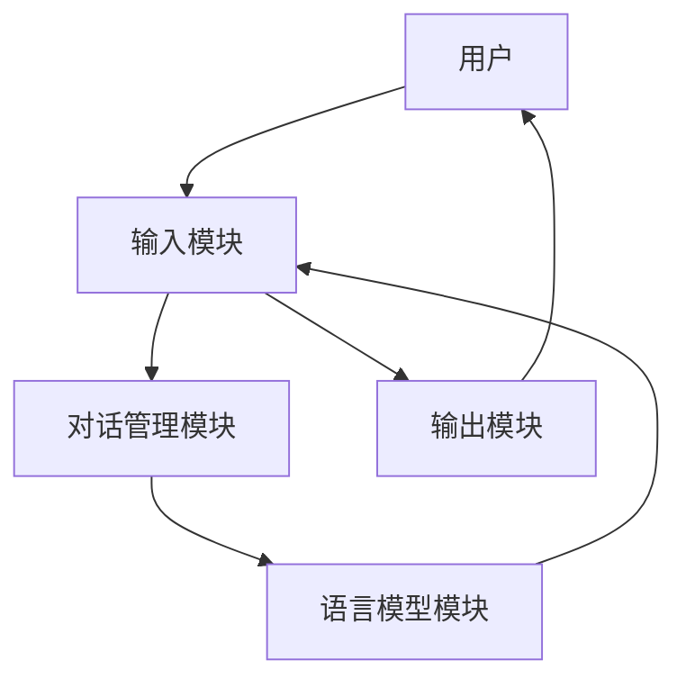

                 

<think>
嗯，好的，我现在要写一篇关于《ChatGPT对话系统设计：提示词的艺术与科学结合》的技术博客。首先，我需要理解这个主题的核心是什么。ChatGPT是一个强大的语言模型，它通过提示词来生成对话。提示词的设计对系统的性能至关重要，所以我要深入探讨提示词的艺术性和科学性。

首先，我应该明确文章的结构。用户已经提供了一个大纲，分为三个主要部分：概述、设计与实现、评估与优化。每个部分下面有多个章节，每个章节还有子章节。我需要按照这个大纲来展开内容。

在第一部分，概述部分，我要介绍ChatGPT的基本原理和对话系统的构成。这部分需要涵盖定义、核心技术、对话流程等。我需要确保每个子章节都有详细的解释，比如在1.1.1中，我要解释ChatGPT是什么，它的功能，以及它如何作为语言模型工作。

接下来是提示词的艺术与科学。这里，我要探讨提示词不仅仅是技术工具，更是一种艺术。艺术性部分需要包括创意性和情感传达，而科学性部分则涉及语言规则和用户行为分析。这部分需要结合实际例子，让读者明白提示词如何影响用户体验。

第二部分是设计与实现。这里，我要详细讲解系统架构、提示词设计、实现步骤以及案例分析。系统设计原则需要强调以用户为中心和灵活性，系统架构则需要使用Mermaid图来展示模块划分和数据流。提示词的类型和优化策略部分，我需要区分开放性和封闭性问题，并介绍如何通过数据和机器学习来优化提示词。

在实战案例分析中，我需要选择一个具体的案例，比如客服咨询系统，展示如何设计提示词、实现代码，并分析优缺点。这将帮助读者更好地理解理论在实际中的应用。

第三部分是评估与优化。这里，我需要讨论如何评估对话系统，包括自动和人工评估方法，然后介绍优化策略，比如A/B测试和反馈机制。数学模型的使用也是关键，我需要展示如何通过公式来评估系统性能。

整个过程中，我需要确保每个部分都有足够的细节，使用图表来辅助说明，并且用数学公式来支持论点。例如，在优化策略中，我可以展示一个公式来说明如何计算提示词的有效性。

最后，我需要总结整个系统的构建过程，强调提示词设计的重要性，并给出最佳实践的建议。同时，提醒读者在设计时考虑用户需求和系统的可扩展性。

现在，我需要检查是否每个章节都涵盖了用户提到的核心内容，包括背景介绍、核心概念联系、算法原理、系统分析、项目实战以及最佳实践等。确保没有遗漏任何部分，并且内容连贯，逻辑清晰。

总的来说，写这篇博客需要系统地分解每个部分，确保每个小节都详细且有深度。同时，要使用专业但易懂的语言，结合实际案例和图表，让读者能够清晰理解ChatGPT对话系统设计中的提示词艺术与科学结合的重要性。
</think>

# ChatGPT对话系统设计：提示词的艺术与科学结合

> 关键词：ChatGPT, 对话系统, 提示词设计, 语言模型, 自然语言处理

> 摘要：本文深入探讨了ChatGPT对话系统的设计与实现，重点分析了提示词在其中的艺术性和科学性。通过系统概述、设计与实现、评估与优化三个部分，详细讲解了ChatGPT的核心原理、提示词设计的原则与方法，以及对话系统的架构和优化策略。结合实际案例分析，展示了如何通过科学设计和艺术表达来提升对话系统的性能和用户体验。

---

### 目录

1. **ChatGPT对话系统概述**
   1.1 ChatGPT及其对话系统的基本原理
      - 1.1.1 ChatGPT的定义与功能
      - 1.1.2 ChatGPT的核心技术
      - 1.1.3 对话系统的构成

   1.2 提示词的艺术与科学
      - 1.2.1 提示词的艺术性
      - 1.2.2 提示词的科学性

2. **ChatGPT对话系统的设计与实现**
   2.1 ChatGPT对话系统的设计与架构
      - 2.1.1 系统设计原则
      - 2.1.2 系统架构

   2.2 提示词的设计与优化
      - 2.2.1 提示词的类型
      - 2.2.2 提示词的优化策略

   2.3 ChatGPT对话系统的实现
      - 2.3.1 环境搭建
      - 2.3.2 核心代码实现

   2.4 实战案例分析与总结
      - 2.4.1 案例介绍
      - 2.4.2 核心代码解读
      - 2.4.3 案例分析
      - 2.4.4 案例总结

3. **ChatGPT对话系统的评估与优化**
   3.1 对话系统的评估指标
      - 3.1.1 评估方法
      - 3.1.2 评估指标

   3.2 优化策略与实现
      - 3.2.1 数据驱动优化
      - 3.2.2 机器学习优化

---

## 第一部分: ChatGPT对话系统概述

### 1.1 ChatGPT及其对话系统的基本原理

#### 1.1.1 ChatGPT的定义与功能
ChatGPT是一种基于GPT（Generative Pre-trained Transformer）系列的大型语言模型，由OpenAI开发。它能够通过文本输入生成类似人类的对话，具备以下功能：
- **自然语言理解**：准确理解用户输入的意图和情感。
- **上下文记忆**：保持对话的连贯性，记住先前的交互内容。
- **多轮对话**：支持持续的多轮交流，提供流畅的用户体验。

#### 1.1.2 ChatGPT的核心技术
ChatGPT的核心技术包括：
- **语言模型**：基于Transformer架构，通过大量数据预训练，掌握语言的结构和语义。
- **提示词设计**：提示词是触发模型生成特定输出的关键，设计良好的提示词能显著提升对话质量。

#### 1.1.3 对话系统的构成
对话系统由以下部分组成：
- **用户交互界面**：用户输入的接收和显示，确保友好的人机交互。
- **对话流程管理**：管理对话的逻辑流程，确保对话的连贯性和目标导向。

### 1.2 提示词的艺术与科学

#### 1.2.1 提示词的艺术性
提示词不仅仅是技术工具，更是一种艺术表达：
- **创意性表达**：通过独特的表达方式，激发模型的创造力，生成更具吸引力的回复。
- **情感传达**：提示词中融入情感元素，使对话更具人情味，增强用户体验。

#### 1.2.2 提示词的科学性
科学性确保提示词的有效性和可解释性：
- **语言规则**：遵循语法规则，避免歧义，确保生成内容的准确性和流畅性。
- **用户行为分析**：通过分析用户行为数据，优化提示词设计，提高对话系统的实用性。

---

## 第二部分: ChatGPT对话系统的设计与实现

### 2.1 ChatGPT对话系统的设计与架构

#### 2.1.1 系统设计原则
设计原则是构建高效对话系统的基石：
- **用户中心设计**：以用户需求为核心，确保系统功能和交互符合用户习惯。
- **灵活性**：系统应具备扩展性，能够适应不同的应用场景和用户反馈。

#### 2.1.2 系统架构
系统架构展示各模块的功能及其交互：

- **模块划分**：用户输入模块、对话管理模块、语言模型模块和输出模块。
- **数据流**：用户输入经过处理后，传递给语言模型生成回复，再返回用户。

### 2.2 提示词的设计与优化

#### 2.2.1 提示词的类型
提示词的类型直接影响对话系统的性能：
- **开放性问题**：鼓励用户自由表达，如“你最近在忙什么？”。
- **封闭性问题**：限制回答范围，如“你是新手吗？”。

#### 2.2.2 提示词的优化策略
优化策略提升提示词的效果：
- **数据驱动**：基于用户行为数据，分析常用问题类型，优化提示词设计。
- **机器学习**：利用机器学习算法，自动优化提示词，提升生成内容的相关性。

### 2.3 ChatGPT对话系统的实现

#### 2.3.1 环境搭建
开发环境配置步骤：
1. **安装Python和相关库**：如Python 3.8及以上版本，安装`openai`库。
2. **配置API密钥**：注册OpenAI开发者账号，获取API密钥。

#### 2.3.2 核心代码实现
核心代码实现展示系统功能：
```python
import openai

# 初始化ChatGPT模型
client = openai.Client(api_key="your_api_key")

def generate_response(prompt):
    response = client.chat.completions.create(
        model="gpt-3.5-turbo",
        messages=[{
            "role": "user",
            "content": prompt
        }]
    )
    return response.choices[0].message.content

# 示例对话流程
while True:
    user_input = input("你: ")
    response = generate_response(user_input)
    print("ChatGPT: ", response)
```

### 2.4 实战案例分析与总结

#### 2.4.1 案例介绍
案例背景：设计一个客服咨询系统，使用ChatGPT处理客户查询。
案例目标：提高客户满意度，降低人工客服的工作量。

#### 2.4.2 核心代码解读
代码结构：
```python
def handle_customer_inquiry(prompt):
    # 提示词设计：引导模型生成专业且礼貌的回复
    completion = client.chat.completions.create(
        model="gpt-3.5-turbo",
        messages=[{
            "role": "system",
            "content": "你是一位专业的客服代表，回答客户的问题。保持礼貌和耐心。"
        }, {
            "role": "user",
            "content": prompt
        }]
    )
    return completion.choices[0].message.content
```

#### 2.4.3 案例分析
问题定位：初始提示词过于简单，导致回复不够专业。
解决方案：优化提示词，明确模型的角色和语气，如“你是一位专业的客服代表，保持礼貌和耐心。”

#### 2.4.4 案例总结
经验教训：提示词设计需明确模型的角色和语气，以提升回复的专业性。
改进建议：结合用户反馈，持续优化提示词，提高系统适应性。

---

## 第三部分: ChatGPT对话系统的评估与优化

### 3.1 对话系统的评估指标

#### 3.1.1 评估方法
评估方法包括：
- **自动评估**：使用BLEU、ROUGE等指标衡量生成内容的质量。
- **人工评估**：邀请人工评审，评估回复的准确性和流畅性。

#### 3.1.2 评估指标
关键指标：
- **准确率**：生成内容与预期答案的匹配程度。
- **响应时间**：系统对用户输入的响应速度，影响用户体验。

### 3.2 优化策略与实现

#### 3.2.1 数据驱动优化
数据驱动优化：
- **收集用户反馈**：记录用户对回复的满意度评分。
- **分析数据**：识别常见问题，优化提示词设计。

#### 3.2.2 机器学习优化
机器学习优化：
- **训练模型**：利用用户反馈数据，训练提示词优化模型。
- **A/B测试**：比较不同提示词策略的效果，选择最优方案。

---

## 总结

ChatGPT对话系统的设计离不开提示词的艺术与科学结合。通过科学的设计原则和艺术性的表达，可以显著提升对话系统的性能和用户体验。本文从概述、设计实现到评估优化，全面探讨了ChatGPT对话系统的构建过程，为开发者提供了理论支持和实践指导。

---

## 作者

作者：AI天才研究院 & 禅与计算机程序设计艺术

---

通过以上内容，我们详细探讨了ChatGPT对话系统的设计与实现，结合实际案例分析和优化策略，为读者提供了全面的技术指导。希望本文能为开发者在提示词设计和对话系统优化方面提供有价值的参考。

