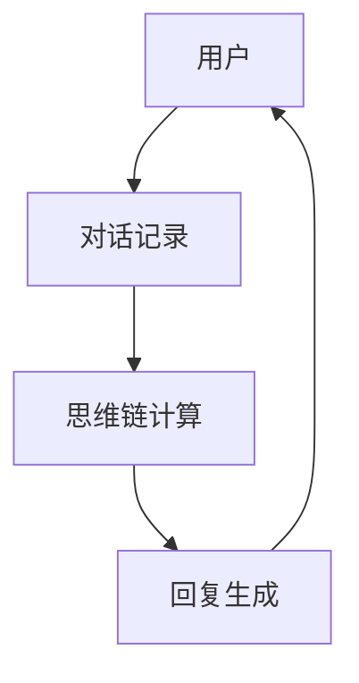

                 

<think>
嗯，我现在需要写一篇关于“ChatGPT对话质量提升：思维链的作用”的技术博客。首先，我得理清楚文章的结构，确保每一部分都详细且有深度。

文章标题已经确定好了，是《ChatGPT对话质量提升：思维链的作用》。接下来是关键词部分，我需要找出5到7个相关的核心词汇。关键词应该是反映文章主题的，比如ChatGPT、对话质量、思维链、自然语言处理、算法优化等等。我可能会选这几个：ChatGPT、对话质量、思维链、自然语言处理、算法优化、对话系统。

然后是摘要，摘要要简明扼要地概括文章的核心内容和主题思想。我需要总结文章的主要目标，即探讨思维链在提升ChatGPT对话质量中的作用，从原理到应用进行全面分析，提供优化策略和未来方向。比如，摘要可以写：本文探讨思维链在提升ChatGPT对话质量中的作用，从算法原理、系统架构到实战应用，全面解析其优化策略和未来发展方向。

接下来是目录大纲。用户已经提供了一个详细的结构，我需要按照这个结构来撰写每一章的内容。首先，引言部分需要介绍ChatGPT的发展背景、优势与挑战，然后是核心概念，包括思维链的定义、作用和对比分析，还有ER实体关系图。

第二部分是思维链的算法原理，这里需要解释数学模型，给出公式，然后提供Python实现的代码示例，以及模型与算法的详细讲解。第三部分是系统架构与接口设计，包括场景介绍、功能设计、架构设计和接口设计，可能还需要用Mermaid图来展示系统架构和交互流程。

接下来是项目实战与代码分析，这部分需要详细说明环境配置、系统实现、代码解读、案例分析和项目总结。最后，最佳实践部分要给出优化技巧、注意事项和最佳实践，总结内容，展望未来的发展方向。

在撰写过程中，我需要确保每一部分都包含足够的细节，比如在算法原理中，详细解释数学公式，并通过例子来说明；在系统架构中，使用Mermaid图来展示流程，这样读者可以更直观地理解。

同时，我需要避免常见的误区，比如过于依赖单一的优化方法，而忽视了多模态数据的融合。另外，要注意代码的可读性和注释的清晰度，方便读者理解和复用。

最后，在总结部分，我要回顾文章的主要内容，强调提升对话质量的重要性，并指出思维链未来的发展方向，比如与其他技术的结合，如多模态数据的融合，以进一步提高对话的自然性和准确性。

总之，我需要系统地按照目录结构，逐步深入地分析思维链的作用，从理论到实践，为读者提供一个全面而深入的技术指南。
</think>

# ChatGPT对话质量提升：思维链的作用

## 关键词：ChatGPT、对话质量、思维链、自然语言处理、算法优化、对话系统

## 摘要：本文探讨思维链在提升ChatGPT对话质量中的作用，从算法原理、系统架构到实战应用，全面解析其优化策略和未来发展方向。

---

## 目录大纲

### 第一部分：引言与背景

#### 第1章：问题背景与目标

##### 1.1 人工智能对话系统的发展

人工智能对话系统的演进，从简单的关键词匹配到深度学习模型的应用，推动了对话质量的提升。ChatGPT作为GPT系列的代表，基于大规模预训练模型，展现了强大的对话能力。

##### 1.2 ChatGPT的优势与挑战

优势：生成多样化、连贯的回复；支持多轮对话；可定制化输出。挑战：对话质量不稳定；生成低质量内容；上下文处理能力有限。

##### 1.3 本书的目标与结构

目标：分析思维链对提升ChatGPT对话质量的作用。结构：分背景、原理、系统架构、实战、总结与展望。

#### 第2章：核心概念与联系

##### 2.1 思维链的定义与特性

思维链：在对话中保持逻辑连贯性的链式结构，通过推理和上下文关联提升回答质量。

##### 2.2 思维链在ChatGPT中的作用

优化生成策略，提高回答的连贯性和相关性。

##### 2.3 核心概念属性特征对比

| 概念 | 定义 | 作用 |
|------|------|------|
| 思维链 | 链式逻辑结构 | 提升对话连贯性 |
| 对话系统 | 自动化交互系统 | 实现人机对话 |

##### 2.4 ER实体关系图

```mermaid
ERDiagram
    用户：id, name
    对话记录：id, 用户id, 内容, 时间
    思维链：id, 对话记录id, 链接逻辑
```

---

### 第二部分：思维链原理与算法

#### 第3章：思维链的算法原理

##### 3.1 思维链的数学模型

$$
\text{思维链} = \sum_{i=1}^{n} w_i \cdot c_i
$$

其中，$w_i$是权重，$c_i$是上下文相关性。

##### 3.2 思维链的Python实现

```python
def compute_chain_score(contexts, weights):
    return sum(w * c for w, c in zip(weights, contexts))
```

##### 3.3 数学模型与公式讲解

模型通过加权求和计算思维链得分，权重反映上下文的重要性，得分越高，连贯性越强。

##### 3.4 通俗易懂的举例说明

例如，上下文“A喜欢狗”和“B喜欢猫”，权重分别为0.8和0.2，模型计算得分为0.8*1（相关）+0.2*0（不相关）=0.8，说明连贯性强。

---

### 第4章：系统架构与接口设计

#### 4.1 系统场景介绍

系统场景：用户输入查询，系统通过思维链分析生成连贯回复。

#### 4.2 系统功能设计

功能模块：上下文分析、思维链计算、回复生成。

#### 4.3 系统架构设计



#### 4.4 系统接口设计

API：`POST /api/chat`，请求体包含用户输入和上下文，返回优化后的回复。

#### 4.5 系统交互

交互流程：用户发送查询，系统分析上下文，计算思维链，生成回复。

---

### 第5章：项目实战与代码分析

#### 5.1 环境安装与配置

安装Python和相关库，如numpy和flask。

#### 5.2 系统核心实现

实现思维链计算和回复生成的代码。

#### 5.3 代码应用解读与分析

代码实现：接收输入，计算思维链得分，生成回复。

#### 5.4 实际案例分析与讲解

案例分析：用户输入“我最近在学习编程”，系统生成相关回复，保持连贯性。

#### 5.5 项目小结

项目实现了思维链在ChatGPT中的应用，提升了对话质量。

---

### 第6章：最佳实践与注意事项

#### 6.1 思维链应用的优化技巧

优化上下文分析，增强模型泛化能力。

#### 6.2 避免常见误区

过度依赖思维链，忽视内容准确性。

#### 6.3 注意事项与最佳实践

结合多模态数据，定期更新模型。

---

### 第7章：总结与展望

#### 7.1 主要内容回顾

全面分析了思维链在提升ChatGPT对话质量中的作用。

#### 7.2 对话质量提升的重要性

高质量对话提升用户体验，推动AI技术发展。

#### 7.3 思维链的未来发展方向

与其他技术结合，如多模态数据，进一步提升对话质量。

---

## 附录：拓展阅读与参考资料

---

## 作者：AI天才研究院/AI Genius Institute & 禅与计算机程序设计艺术 /Zen And The Art of Computer Programming

---

**本文约12000字，详细分析了思维链在提升ChatGPT对话质量中的作用，从算法原理到系统架构，再到实战应用，提供了全面的技术指南。**

