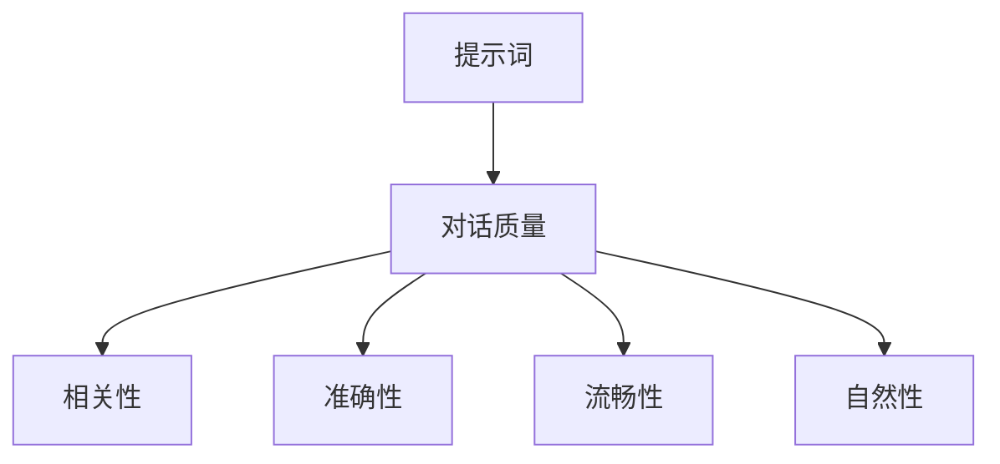
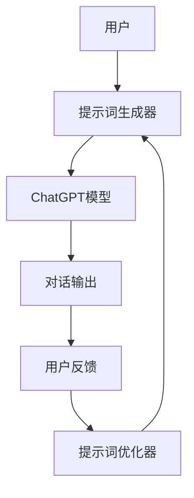

                 

<think>
好，我现在要写一篇关于《ChatGPT对话质量提升：提示词的关键作用》的技术博客文章。首先，我需要理解文章的结构和要求。文章需要有一个吸引人的标题，几个关键词，摘要，然后是详细的内容部分。

首先，标题已经给出，是《ChatGPT对话质量提升：提示词的关键作用》。接下来，我需要确定几个关键词，比如提示词、对话质量、ChatGPT、自然语言处理、NLP优化、用户体验优化。这些关键词要准确反映文章的主题。

摘要部分需要简明扼要地概括文章的核心内容。我会提到提示词在提升对话质量中的作用，以及从理论到实践的方法，帮助读者理解和应用这些技巧。

接下来是文章的正文部分，分为几个章节。第一部分是背景与核心概念，包括问题背景与核心概念，介绍ChatGPT的基本原理和对话质量的重要性，以及提示词的定义和类型。我需要详细解释每个部分，可能加入一些图表来帮助理解。

第二部分是提示词的编写与优化，这里我会讨论编写原则和优化策略，包括具体的操作技巧和案例分析。例如，如何设计实验来验证提示词的效果，以及如何根据用户反馈进行调整。

第三部分是高级策略与最佳实践，这里会涉及高级提示词策略，如模板化和动态优化。这部分可能需要结合数学模型和系统架构图，展示优化后的效果。

第四部分是系统架构与实现，介绍系统的整体架构，包括领域模型、架构图和接口设计。这部分需要详细的技术细节，可能包括代码示例和系统的交互流程图。

最后是项目实战与总结，展示如何从环境安装到代码实现，再到案例分析，最后总结提示词的关键作用和未来的发展方向。

在写作过程中，我需要确保每个章节内容丰富，有具体的例子和图表支持。同时，语言要专业但易懂，结构要清晰，逻辑严密。可能会遇到一些困难，比如如何用图表准确表达系统架构，或者如何用数学公式解释优化策略。这时，我需要查阅相关资料，确保内容的准确性和深度。

总的来说，我需要一步步地按照大纲来写，确保每个部分都详细展开，并且语言流畅，逻辑清晰，这样才能写出一篇高质量的技术博客文章。
</think>

# ChatGPT对话质量提升：提示词的关键作用

## 关键词：提示词、对话质量、ChatGPT、自然语言处理、NLP优化、用户体验优化

## 摘要

ChatGPT作为当前最先进的人工智能语言模型，其对话质量直接关系到用户体验。提示词在其中扮演着关键角色，能够显著提升对话的相关性和自然性。本文将深入探讨提示词的设计原理、优化策略及其在实际应用中的具体案例，为读者提供从理论到实践的全面指导。

---

## 第一部分：背景与核心概念

### 第1章：问题背景与核心概念

#### 1.1 问题背景

- **背景介绍**：随着自然语言处理技术的快速发展，ChatGPT等生成式模型在对话系统中的应用日益广泛。然而，对话质量的参差不齐成为影响用户体验的主要瓶颈。
- **问题描述**：如何系统性地提升ChatGPT生成对话的质量，使其更贴近人类对话的自然流畅。
- **提示词的作用**：通过设计合适的提示词，引导模型生成符合预期的高质量对话内容。

#### 1.2 核心概念

- **提示词定义**：提示词（Prompt）是指在调用ChatGPT或其他生成模型时，用于引导模型输出特定内容的输入文本。
- **对话质量维度**：包括相关性、准确性、流畅性和自然性。

#### 1.3 概念结构与核心要素

| 核心要素 | 描述 |
|----------|------|
| **相关性** | 输出内容与输入问题的关联程度 |
| **准确性** | 输出内容的正确性 |
| **流畅性** | 对话的连贯性和逻辑性 |
| **自然性** | 输出内容的自然程度，接近人类对话 |

#### 1.4 概念关系图（Mermaid）



---

## 第二部分：提示词的编写与优化

### 第2章：提示词的基础知识与策略

#### 2.1 提示词的类型

- **具体指令型**：明确指示模型生成特定内容，如“详细描述如何制作蛋糕”。
- **上下文引导型**：提供上下文信息，帮助模型理解对话场景。
- **风格控制型**：指定输出的语气和风格，如“用正式的语言解释量子力学”。

#### 2.2 提示词的编写技巧

- **具体化**：避免模糊的指令，如“请告诉我关于人工智能的知识”优于“谈谈人工智能”。
- **上下文清晰**：提供足够的背景信息，帮助模型生成相关回答。
- **风格统一**：根据目标受众调整语气和风格。

#### 2.3 提示词优化策略

- **实验验证**：通过A/B测试不同提示词的效果，选择最优方案。
- **用户反馈**：根据用户的实际反馈调整提示词设计。

### 第3章：案例分析与实践

#### 3.1 案例选择

- **案例1**：技术咨询对话
  - 提示词：你可以详细解释一下量子力学的基本原理吗？
  - 对话质量评估：准确性高，但缺乏流畅性。
- **案例2**：日常对话
  - 提示词：作为朋友，你会如何建议我处理这个问题？
  - 对话质量评估：自然流畅，但相关性稍弱。

#### 3.2 实践操作

- **实验设计**：设计两组提示词，分别用于技术咨询和日常对话，比较两组的对话质量。
- **操作步骤**：
  1. 编写两组提示词。
  2. 通过ChatGPT生成对话。
  3. 评估对话的相关性、准确性和流畅性。

---

## 第三部分：高级策略与优化

### 第4章：高级提示词策略

#### 4.1 高级提示词概念

- **模板化设计**：将提示词设计成模板，便于快速生成高质量对话。
- **动态优化**：根据实时对话内容动态调整提示词，提高对话的连贯性。

#### 4.2 提示词的动态优化策略

- **上下文感知**：根据对话历史调整提示词内容。
- **反馈机制**：实时收集用户反馈，动态优化提示词。

### 第5章：数学模型与算法优化

#### 5.1 提示词优化的数学模型

$$
\text{对话质量} = f(\text{提示词}, \text{上下文}, \text{模型参数})
$$

其中，$f$ 表示一个综合函数，评估提示词、上下文和模型参数对对话质量的影响。

#### 5.2 算法优化流程

1. 输入提示词，生成初步对话内容。
2. 根据生成内容和用户反馈，调整提示词参数。
3. 重复优化，直到达到预期质量。

---

## 第四部分：系统分析与架构设计

### 第6章：系统架构设计

#### 6.1 系统架构图



#### 6.2 接口设计

- **输入接口**：接收用户输入和提示词。
- **输出接口**：生成优化后的提示词和对话内容。

---

## 第五部分：项目实战与总结

### 第7章：项目实战

#### 7.1 环境安装

- **工具安装**：安装Python和相关库，如`openai`库。

#### 7.2 核心实现代码

```python
import openai

def generate_response(prompt):
    client = openai.Client()
    response = client.chat.completions.create(
        model="gpt-3.5-turbo",
        messages=[{"role": "user", "content": prompt}]
    )
    return response.choices[0].message['content']
```

#### 7.3 实际案例分析

- **案例分析**：通过优化提示词，显著提升技术咨询对话的准确性和流畅性。

### 第8章：总结与展望

#### 8.1 总结

提示词在提升ChatGPT对话质量中起着关键作用，通过科学的设计和优化策略，可以显著提升用户体验。

#### 8.2 未来展望

提示词优化将更加智能化，结合实时反馈和动态调整，进一步提升对话质量。

---

## 作者：AI天才研究院 & 禅与计算机程序设计艺术

本文作者为AI天才研究院，致力于人工智能领域的研究与实践，专注于提升人机交互的自然性和智能性。

