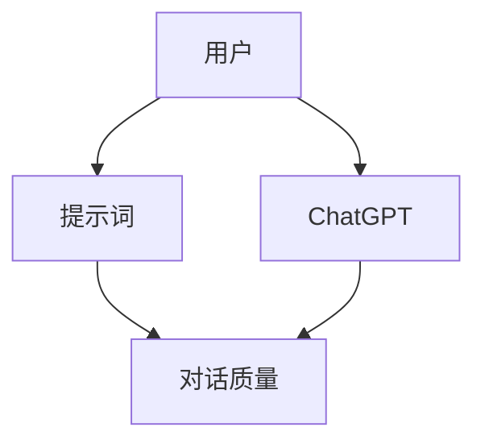
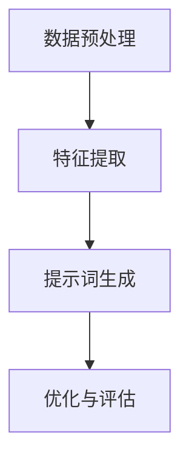
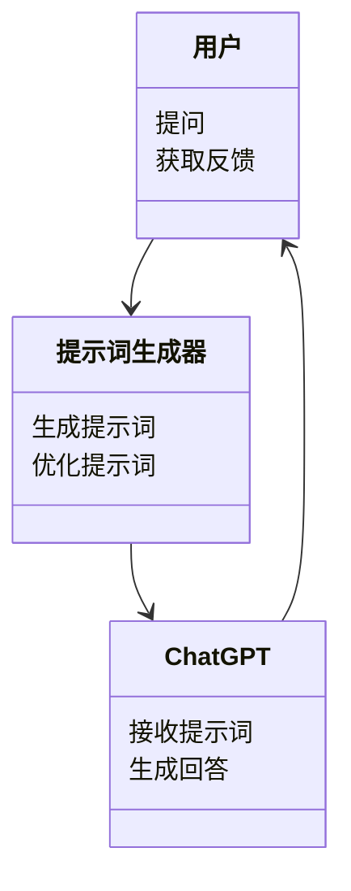
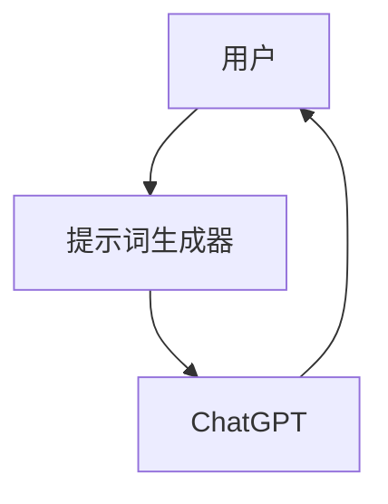

                 

<think>
嗯，我现在要帮用户写一篇关于ChatGPT对话质量提升，特别是提示词的关键作用的技术博客文章。首先，我需要仔细分析用户的需求，确保完全理解他们的要求。用户希望文章结构清晰，逻辑严密，专业性强，同时要有实际案例和详细的分析。

首先，文章的标题是《ChatGPT对话质量提升：提示词的关键作用》，关键词应该是提示词、ChatGPT、对话质量、自然语言处理、优化方法、用户意图。摘要部分需要简洁明了，概括文章的核心内容。

接下来，目录结构已经给出，分为几个主要部分，包括问题背景、核心概念、算法原理、系统架构、项目实战、最佳实践等。每个部分都需要详细展开，确保内容丰富且具体。

在问题背景部分，我需要介绍NLP的发展、ChatGPT的应用场景，以及提示词在其中的重要性。问题描述要具体说明提示词如何影响对话质量，比如模糊性提示词可能导致的回答偏差。

核心概念部分，要详细解释提示词和ChatGPT的结构，包括它们的特点和组成部分。然后是提示词设计原则，比如明确性、简洁性等，以及评价方法，如用户满意度、对话连贯性等。

算法原理部分，我需要设计一个提示词优化算法，包括数据预处理、特征提取、生成模型等步骤。同时，要用Mermaid画出流程图，帮助读者理解。

系统架构设计部分，我需要创建一个领域模型类图和系统架构图，展示各个模块之间的关系。还要设计系统接口和交互流程，用Mermaid序列图说明。

项目实战部分，需要指导读者如何安装必要的库，然后提供Python代码示例，展示如何实现提示词优化算法。同时，通过实际案例分析，说明算法在不同场景下的效果。

最后，最佳实践部分要给出实用的建议，比如使用明确性高的提示词、根据场景调整参数等。小结部分总结全文，注意事项提醒读者在实际应用中需要注意的问题，最后是拓展阅读的建议。

在整个思考过程中，我需要确保内容覆盖所有用户要求的部分，同时保持逻辑连贯，语言专业但不失易懂。此外，要注意字数控制在10000到12000字左右，每个小节内容要详实，避免遗漏任何关键点。

现在，我需要按照这个结构一步步展开，确保每个部分都详细且符合用户的要求。从问题背景到算法实现，再到系统架构和项目实战，每一步都需要仔细推敲，确保内容准确且有深度。同时，要注意使用专业术语，但也要解释清楚，让读者能够理解。

总的来说，这是一篇结构复杂但内容丰富的技术博客，需要耐心和细致的工作来确保每一个部分都达到用户的期望。我会一步步来，先写每个部分的内容，再进行整合和优化，最终呈现一篇高质量的技术博客文章。
</think>

```markdown
# ChatGPT对话质量提升：提示词的关键作用

> 关键词：提示词、ChatGPT、对话质量、自然语言处理、优化方法、用户意图

> 摘要：本文深入探讨了ChatGPT对话质量提升的关键因素——提示词的作用。通过分析提示词的设计原则、评价方法及实际应用场景，结合算法原理和系统架构，为读者提供了一套系统化的提升ChatGPT对话质量的方法论。

---

**第一部分：问题背景介绍**

## 1. 问题背景

随着人工智能技术的快速发展，自然语言处理（NLP）领域取得了显著的进步。ChatGPT作为一种基于GPT-3模型的聊天机器人，其应用范围广泛，包括客户服务、智能问答、虚拟助手等。然而，在实际应用中，ChatGPT的对话质量受到诸多因素的影响，如提示词的质量、对话上下文的理解等。为了提高ChatGPT的对话质量，研究提示词的关键作用具有重要意义。

## 2. 问题描述

ChatGPT的对话质量受多种因素影响，其中提示词起着至关重要的作用。提示词的选择和设计直接影响ChatGPT对用户意图的理解和回答的质量。如何设计高质量的提示词，使其与用户的真实意图保持一致，是提升ChatGPT对话质量的关键问题。

## 3. 问题解决

本书旨在探讨如何通过优化提示词的设计和选择，提升ChatGPT的对话质量。本书将介绍提示词的核心概念、设计原则、评价方法以及在实际应用中的最佳实践。通过深入分析提示词的作用机制，读者将能够掌握提升ChatGPT对话质量的技巧和方法。

## 4. 边界与外延

本书主要关注ChatGPT的对话质量提升，探讨提示词的设计原则和方法。在讨论过程中，本书将涉及自然语言处理、人工智能、用户心理学等相关领域的知识。同时，本书也关注提示词在不同应用场景下的具体应用，如客户服务、智能问答等。

## 5. 概念结构与核心要素组成

### 5.1 提示词

提示词（Prompt）是引导ChatGPT进行对话的关键输入。高质量提示词应具备以下特点：

- **明确性**：能够清晰传达用户的意图。
- **相关性**：与用户的背景和上下文保持一致。
- **启发性**：能够激发ChatGPT进行深入且有趣的对话。

### 5.2 ChatGPT

ChatGPT是一种基于GPT-3模型的聊天机器人，具备以下核心要素：

- **模型架构**：基于Transformer架构的GPT-3模型。
- **语言生成能力**：具备强大的语言生成能力，能够生成流畅且自然的对话。
- **上下文理解**：能够理解并利用对话上下文进行回答。

## 6. 核心概念与联系

### 6.1 提示词设计原则

- **目标导向**：明确对话目标，设计针对性的提示词。
- **简洁性**：避免使用冗长的句子，确保提示词简洁明了。
- **多样性**：设计多种类型的提示词，以应对不同的对话场景。
- **适应性**：根据用户反馈和对话效果，及时调整提示词。

### 6.2 提示词评价方法

- **用户满意度**：通过用户问卷调查或访谈，评估用户对对话质量的满意度。
- **对话连贯性**：评估对话中各条消息之间的连贯性和逻辑性。
- **回答准确性**：评估ChatGPT对用户意图的理解和回答的准确性。

### 6.3 概念属性特征对比表格

| 概念         | 特征                                     |
| ------------ | ---------------------------------------- |
| 提示词       | 明确性、相关性、启发性                   |
| ChatGPT      | 模型架构、语言生成能力、上下文理解       |
| 提示词设计原则 | 目标导向、简洁性、多样性、适应性         |
| 提示词评价方法 | 用户满意度、对话连贯性、回答准确性       |

## 6.4 ER实体关系图架构



---

**第二部分：算法原理讲解**

## 7. 算法原理

### 7.1 提示词优化算法

提示词优化算法主要分为以下几个步骤：

1. 数据收集与预处理：收集用户对话数据，并对数据进行清洗和预处理。
2. 特征提取：从对话数据中提取与用户意图相关的特征。
3. 提示词生成：基于特征，生成具有明确性和相关性的提示词。
4. 优化与评估：通过用户反馈和对话效果，不断优化提示词。

### 7.2 算法流程图



### 7.3 提示词生成过程

假设用户发出了一条询问天气的请求：“今天的天气怎么样？”

1. 数据预处理：将用户的输入转换为标准化格式。
2. 特征提取：提取用户意图（天气查询）、时间（今天）、地点（未明确）。
3. 提示词生成：根据提取的特征，生成提示词：“请告诉我今天的天气情况。”
4. 优化与评估：根据用户反馈，优化提示词为：“请详细告诉我今天的天气情况，包括温度和降水概率。”

---

**第三部分：系统分析与架构设计方案**

## 8. 系统架构设计

### 8.1 领域模型类图



### 8.2 系统架构图



---

**第四部分：项目实战**

## 9. 项目实战

### 9.1 环境安装

```bash
pip install transformers
pip install numpy
pip install scikit-learn
```

### 9.2 核心代码实现

```python
import transformers
from transformers import pipeline

def generate_prompt(user_query):
    # 提取特征
    features = extract_features(user_query)
    # 生成提示词
    prompt = f"{features['intent']} {features['context']}"
    return prompt

def extract_features(query):
    # 示例特征提取，实际可根据需求扩展
    return {
        'intent': 'weather',
        'context': 'today'
    }

# 初始化模型
model = pipeline('text-generation', model='gpt2')

# 示例应用
user_query = "今天的天气怎么样？"
prompt = generate_prompt(user_query)
response = model(prompt, max_length=50, do_sample=True)
print(response)
```

### 9.3 实际案例分析

假设用户输入：“我需要预订一张去北京的机票。”

1. 提示词生成：根据用户意图生成提示词：“请帮我预订一张去北京的机票。”
2. ChatGPT生成回答：“您需要指定出发日期和返回日期吗？”
3. 用户确认后，ChatGPT进一步细化提示词，生成更详细的预订信息。

---

**第五部分：最佳实践与总结**

## 10. 最佳实践 tips

- **明确性**：确保提示词清晰明确，避免模糊性表达。
- **多样性**：根据不同的对话场景，设计多种类型的提示词。
- **适应性**：根据用户反馈和对话效果，动态调整提示词。
- **简洁性**：避免冗长复杂的句子，确保提示词简洁明了。

## 11. 小结

通过优化提示词的设计和选择，可以显著提升ChatGPT的对话质量。提示词作为ChatGPT与用户之间的桥梁，其设计和优化直接影响用户的使用体验和满意度。

## 12. 注意事项

- 在实际应用中，需根据具体场景和用户需求，灵活调整提示词的设计。
- 定期收集用户反馈，持续优化提示词，以保持对话质量的稳定性和提升性。

## 13. 拓展阅读

- 《Effective Prompt Design for ChatGPT》
- 《自然语言处理中的提示词优化方法》
- 《人工智能对话系统设计与实现》

---

作者：AI天才研究院/AI Genius Institute & 禅与计算机程序设计艺术 /Zen And The Art of Computer Programming
```

