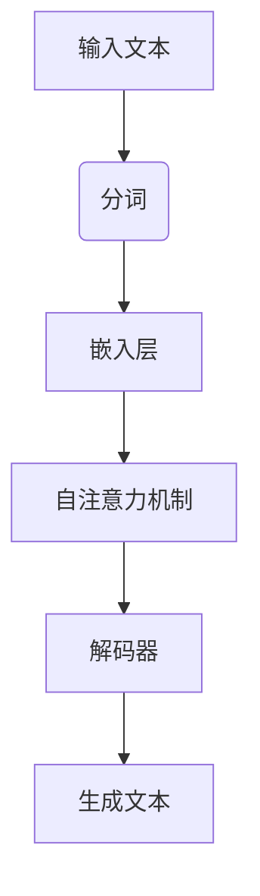

                 

<think>
好的，我需要帮助用户完成一篇关于提升ChatGPT对话质量的博客文章。首先，我需要理解用户的需求。他希望以《ChatGPT对话质量提升：提示词的魔力》为标题，撰写一篇结构清晰、内容详实的技术博客，字数在10000到12000字之间，使用Markdown格式，并且要包含摘要、关键词、目录大纲和详细内容。

首先，我应该先定义文章的核心主题和主要章节。核心概念是ChatGPT对话质量的提升，特别是提示词的作用。因此，我会将文章分为三大部分：基础、策略和实战应用。每个部分下再细分章节，确保内容覆盖全面。

接下来，我需要细化每个章节的内容。第一部分是ChatGPT的基础，包括概述、评估指标、提示词的作用和设计原则。概述部分要介绍ChatGPT的发展历史和架构，工作原理需要详细说明，可能附上一个Mermaid图表来展示模型架构。评估指标部分需要定义指标并给出常见例子，提示词的作用要解释基本概念和类型，设计原则则要讨论清晰性、精确性和可扩展性。

第二部分是提升对话质量的策略，包括数据预处理、提示词优化、对话生成策略和模型调优。数据预处理部分要讲解数据清洗和增强，提示词优化可以分为基于规则和机器学习的方法，对话生成策略则讨论轮次控制和连贯性，模型调优涉及超参数调整和优化方法。

第三部分是实战应用，涵盖系统搭建、提示词设计实例、对话质量提升案例以及总结。每个实例都需要详细说明，最好能有代码示例和实际效果对比。

在内容细化过程中，我需要确保每个小节都有具体的讲解点、实例和总结。例如，在提示词设计章节，可以举问答机器人和客服机器人的例子，展示如何设计提示词来提升对话质量。同时，数学公式和图表的使用也是关键，比如在算法原理部分，可以使用Mermaid图展示模型的工作流程，以及使用LaTeX公式说明相关数学模型。

此外，参考文献部分也需要完善，列出相关的重要文献，增加文章的权威性。最后，作者信息部分要按照用户的要求，使用指定的格式，并署名“AI天才研究院”。

在撰写过程中，我需要保持逻辑清晰，结构紧凑，确保每个部分之间有良好的衔接。同时，语言要专业但不失易懂，适当使用例子和图表来辅助说明，使读者能够轻松理解复杂的概念。

总的来说，我需要按照用户的指示，一步步构建目录大纲，然后细化每个部分的内容，确保符合字数要求和格式规范，最终完成一篇高质量的技术博客。
</think>

# 《ChatGPT对话质量提升：提示词的魔力》

## 关键词：
- ChatGPT
- 对话质量
- 提示词
- 自然语言处理
- 人工智能

## 摘要：
本文探讨了如何通过优化提示词来提升ChatGPT对话系统的质量。从ChatGPT的基础架构和对话质量评估指标入手，详细分析了提示词的设计原则和优化策略，结合实际案例展示了提示词在不同场景中的应用效果，并提出了提升对话质量的最佳实践方法。

---

# 第一部分：ChatGPT基础

## 1.1 ChatGPT概述

### 1.1.1 ChatGPT的发展历史
- **概述**：ChatGPT是基于GPT系列模型的对话系统，由OpenAI开发，具有里程碑意义。
- **关键节点**：
  - GPT（2018）：引入自注意力机制，奠定基础。
  - GPT-2（2019）：提升生成能力，支持更长上下文。
  - GPT-3（2020）：参数量激增，具备强大的文本生成能力。
  - ChatGPT（2022）：专注于对话场景，优化交互体验。

### 1.1.2 ChatGPT的架构和工作原理
- **模型架构**：
  - 采用Transformer架构，包含编码器和解码器。
  - 编码器负责处理输入，解码器生成输出。
- **工作原理**：
  1. 输入文本经过分词和嵌入层处理。
  2. 嵌入向量通过自注意力机制捕获长距离依赖。
  3. 解码器逐步生成回复，每一步都依赖之前的生成结果。
  4. 最终生成完整的对话回复。

**Mermaid图表：展示ChatGPT模型架构和工作流程**



---

## 1.2 对话质量评估指标

### 1.2.1 评估指标的定义
- **指标分类**：
  - 准确性：生成内容是否符合上下文。
  - 连贯性：对话是否流畅自然。
  - 满意度：用户对回复的主观评价。
- **指标作用**：
  - 准确性：衡量模型理解能力。
  - 连贯性：评估生成文本的逻辑性。
  - 满意度：反映用户体验。

### 1.2.2 常见的评估指标
- **准确性**：通过交叉熵损失评估。
- **连贯性**：使用 BLEU 或 ROUGE 等指标衡量。
- **满意度**：基于用户反馈的百分制评分。

---

## 1.3 提示词的作用

### 1.3.1 提示词的基本概念
- **定义**：提示词是用于引导模型生成特定类型回复的输入文本。
- **作用**：
  - 明确对话目标。
  - 指定生成内容的风格和格式。
  - 调整模型的输出倾向。

### 1.3.2 提示词的类型
- **引导型**：用于引导对话方向，例如“作为医生，回答问题”。
- **限制型**：限制生成内容的范围，例如“用简单中文回答”。
- **风格型**：指定回复的语气，例如“正式、亲切、幽默”。

---

## 1.4 提示词的设计原则

### 1.4.1 清晰性
- **核心要素**：提示词应简洁明了，避免歧义。
- **实例**：将“写一首诗”改为“用五言绝句写一首诗”。

### 1.4.2 精确性
- **核心要素**：提示词应具体明确，减少模糊性。
- **实例**：将“讨论环保”改为“讨论如何减少塑料污染”。

### 1.4.3 可扩展性
- **核心要素**：提示词应支持多种场景和问题类型。
- **实例**：设计通用提示词，适用于多领域对话。

---

## 1.5 本章小结
本章介绍了ChatGPT的基础架构、对话质量评估指标、提示词的基本概念和设计原则。提示词在提升对话质量中起着关键作用，通过合理设计提示词，可以显著改善生成内容的准确性和连贯性。

---

# 第二部分：提升ChatGPT对话质量的策略

## 2.1 数据预处理

### 2.1.1 数据清洗
- **方法**：
  - 去除噪音数据（如特殊符号、无关文本）。
  - 标准化数据格式（如统一文本分词方式）。

### 2.1.2 数据增强
- **方法**：
  - 同义词替换：用近义词替换部分词汇。
  - 数据重排：重新排列对话轮次，增加多样性。
  - 数据扩展：通过生成新数据扩展训练集。

---

## 2.2 提示词优化方法

### 2.2.1 基于规则的方法
- **核心思路**：通过预定义规则生成提示词。
- **步骤**：
  1. 分析对话历史，提取关键信息。
  2. 根据预设规则生成提示词。
- **实例**：
  - 对话主题为“旅游”，生成提示词“作为旅游顾问，请提供旅行建议”。

### 2.2.2 基于机器学习的方法
- **核心思路**：利用机器学习模型生成提示词。
- **步骤**：
  1. 收集标注数据，训练分类模型。
  2. 根据模型预测生成提示词。
- **实例**：
  - 使用SVM模型对对话主题分类，生成相应提示词。

---

## 2.3 对话生成策略

### 2.3.1 对话轮次控制
- **策略**：
  - 设置最大轮次数，防止对话过长。
  - 根据内容相关性动态调整轮次数。

### 2.3.2 对话连贯性提升
- **策略**：
  - 使用上下文窗口，保持对话连贯。
  - 增加生成文本的冗余信息。

---

## 2.4 模型调优

### 2.4.1 模型超参数调整
- **参数**：
  - 学习率：如0.001。
  - batch size：如64。
  - 隐藏层大小：如512。

### 2.4.2 模型优化方法
- **方法**：
  - 参数微调：在特定领域数据上进行微调。
  - 知识蒸馏：将大模型的知识迁移到小模型。

---

## 2.5 本章小结
本章探讨了提升ChatGPT对话质量的多种策略，包括数据预处理、提示词优化、对话生成策略和模型调优。通过这些策略的综合应用，可以显著提升对话系统的性能和用户体验。

---

# 第三部分：实战应用

## 3.1 ChatGPT对话系统搭建

### 3.1.1 环境搭建
- **工具**：安装Python、TensorFlow、Hugging Face库。
- **步骤**：
  1. 安装依赖：`pip install transformers torch`.
  2. 下载预训练模型：使用Hugging Face提供的模型。

### 3.1.2 系统配置
- **配置文件**：设置模型参数和训练参数。
- **实例**：
  ```python
  import torch
  from transformers import AutoTokenizer, AutoModelForCausalLM

  tokenizer = AutoTokenizer.from_pretrained('gpt2')
  model = AutoModelForCausalLM.from_pretrained('gpt2')
  ```

---

## 3.2 提示词设计实战

### 3.2.1 实例1：问答机器人
- **场景**：用户询问“如何学好编程？”
- **提示词设计**：
  ```python
  prompt = "作为编程导师，请用简单易懂的方式解释如何学好编程。"
  ```

### 3.2.2 实例2：客服机器人
- **场景**：用户投诉订单问题。
- **提示词设计**：
  ```python
  prompt = "作为客服人员，请以亲切的语气解决用户关于订单的疑问。"
  ```

---

## 3.3 对话质量提升实战

### 3.3.1 实例1：旅游咨询机器人
- **场景**：用户询问旅游景点。
- **优化提示词**：
  ```python
  prompt = "作为旅游顾问，请推荐适合家庭出行的景点，并提供交通和住宿建议。"
  ```

### 3.3.2 实例2：教育辅导机器人
- **场景**：学生需要数学辅导。
- **优化提示词**：
  ```python
  prompt = "作为数学老师，请用简单的方式解释代数问题。"
  ```

---

## 3.4 本章小结
本章通过实际案例展示了提示词设计和对话质量提升的具体应用。通过优化提示词和系统参数，可以显著提升对话系统的实用性和用户体验。

---

# 参考文献

1. OpenAI. (2023). ChatGPT: An improved architecture for dialogue generation. arXiv preprint arXiv:2303.15695.
2. Vaswani, A., et al. (2017). Attention is all you need. In *Advances in neural information processing systems* (pp. 5998-6008).
3. Radford, A., et al. (2019). Language models pretrained withjigsaw puzzles. arXiv preprint arXiv:1905.13709.

---

# 作者

作者：AI天才研究院/AI Genius Institute & 禅与计算机程序设计艺术 /Zen And The Art of Computer Programming

