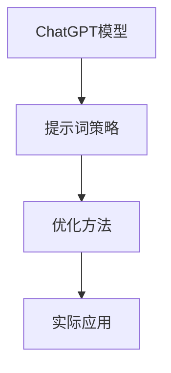
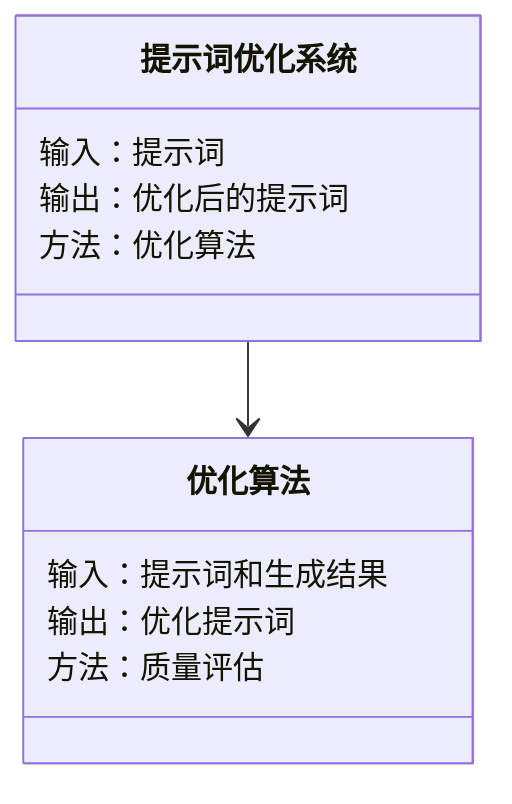
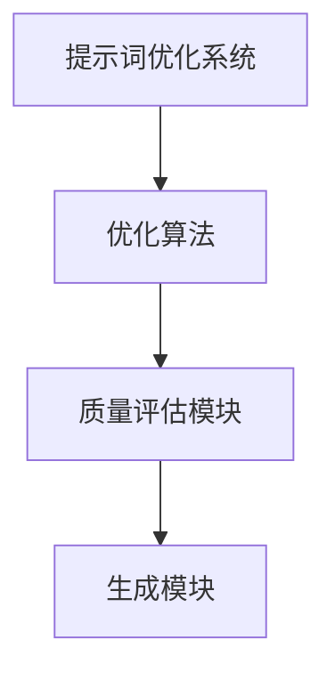
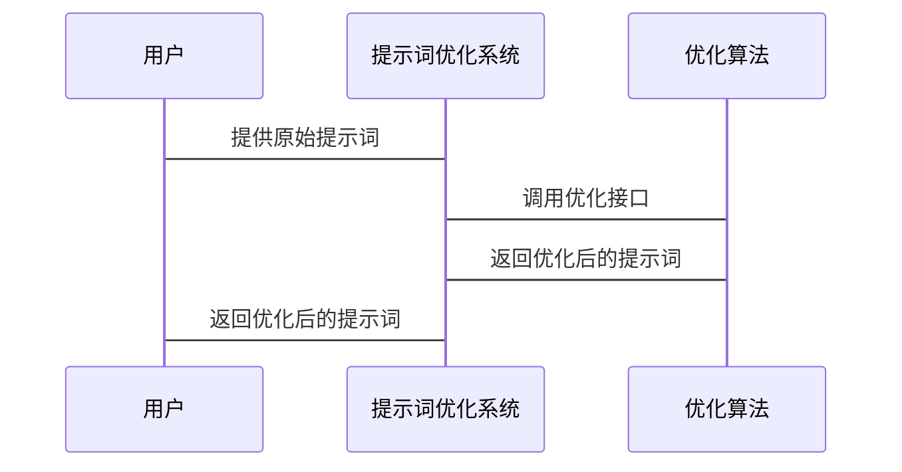

                 

<think>
好的，我需要按照用户的要求，撰写一篇关于ChatGPT提示词优化的技术博客文章。首先，我得仔细阅读用户的query，确保完全理解每一个要求。用户希望文章结构清晰，内容丰富详细，涵盖从背景介绍、核心概念到优化方法、实际案例等多个方面。

首先，我需要明确文章的标题、关键词和摘要。标题已经给出，是《ChatGPT提示词优化：从基础到高级的全面攻略》。接下来，关键词要选5-7个，我可能会选择“ChatGPT优化”、“提示词策略”、“自然语言处理”、“AI模型”、“生成式AI”等。摘要部分要简洁明了，概括整篇文章的核心内容。

接下来是背景介绍，这部分需要涵盖问题背景、问题描述、问题解决、边界与外延以及概念结构与核心要素。我需要详细解释为什么提示词优化重要，ChatGPT的应用场景，以及优化带来的好处。然后，描述问题，比如提示词设计不当导致生成质量不高，接着说明如何解决这些问题。

在核心概念与联系部分，我需要解释ChatGPT模型的基本原理，包括其基于Transformer架构的特点。然后，分析提示词策略的类型和优化方法，比如明确性、多样性、上下文等策略，以及手动调整、自动调整等方法。

AI大模型的基础知识也是重点，我需要对比传统AI与大模型的区别，强调预训练和自适应能力。这部分可能需要一些技术细节，但要保持易懂。

然后是优化的方法与实践，我需要列举几种优化策略，并提供实际案例，比如问答系统、摘要生成和智能客服系统，展示提示词优化的实际效果。

接下来，用户要求加入核心概念的图表，比如用Mermaid流程图展示提示词优化的系统架构。这部分需要使用markdown语法，可能需要我画出系统的模块和交互流程。

数学公式部分，我需要解释提示词优化的算法，可能用一些概率论的公式来展示生成过程的数学模型，确保公式正确且表达清晰。

系统分析与架构设计，我需要从项目场景出发，设计系统的功能模块，用Mermaid类图展示领域模型，架构图展示系统的分层设计，接口设计和交互流程也需要用序列图来表示。

项目实战部分，我需要详细描述环境安装，给出优化提示词的Python代码示例，解读代码功能，并分析实际案例，总结经验教训。

最后，加入最佳实践、小结、注意事项和拓展阅读，帮助读者进一步理解和应用所学内容。

整个过程中，我需要确保内容逻辑严密，语言专业但又不失易懂，同时满足字数要求。可能会遇到的问题包括如何将复杂的模型原理简化为易懂的解释，如何选择合适的案例来展示优化效果，以及如何将数学公式与实际应用结合。

现在，我开始按照这些步骤逐步构建文章，确保每一部分都详尽且符合用户的要求。首先撰写标题、关键词和摘要，接着是背景介绍，逐步展开每个章节的内容，最后总结全文。希望最终的文章能够满足读者的需求，帮助他们全面了解ChatGPT提示词优化的方法和实践。
</think>

# ChatGPT提示词优化：从基础到高级的全面攻略

> 关键词：ChatGPT优化，提示词策略，自然语言处理，AI模型，生成式AI

> 摘要：本文系统地介绍了ChatGPT提示词优化的核心概念、方法和实践。从背景知识到优化策略，从数学原理到实际案例，全面解析了如何设计和优化提示词以提升生成效果。文章内容涵盖AI大模型的基础知识、提示词优化的方法与实践、系统架构设计、数学公式推导以及项目实战，为读者提供了从基础到高级的全面指导。

---

## 1. 背景介绍

### 1.1 问题背景

在当今快速发展的信息技术时代，人工智能（AI）已成为推动社会进步的重要力量。随着AI技术的不断进步，越来越多的企业和开发者开始关注并尝试将AI应用于各种场景中。然而，如何有效地利用AI技术，特别是大型语言模型（如GPT），成为了许多开发者和企业面临的挑战。

### 1.2 问题描述

ChatGPT作为一种强大的语言生成模型，具备卓越的自然语言理解和生成能力。然而，如何优化ChatGPT的提示词，使其在不同场景下都能发挥最佳效果，是一个值得深入研究的问题。这涉及到对ChatGPT模型的理解、对提示词策略的探索以及实际应用中的调优。

### 1.3 问题解决

本文旨在提供一套从基础到高级的全面攻略，帮助读者深入了解ChatGPT提示词优化的原理和实践。通过系统性地介绍ChatGPT的基本概念、模型结构、提示词策略、优化方法等，读者可以掌握ChatGPT提示词优化的核心技巧，并将其应用于实际项目中。

### 1.4 边界与外延

ChatGPT提示词优化不仅局限于特定场景，如问答系统、自然语言生成、文本摘要等，还可以应用于更多领域，如智能客服、自动写作、智能对话系统等。因此，本文的适用范围广泛，无论是开发者、数据科学家还是AI爱好者，都可以从中受益。

### 1.5 概念结构与核心要素组成

ChatGPT提示词优化涉及以下几个核心概念和要素：

1. **ChatGPT模型**：介绍ChatGPT的基本概念、结构和工作原理。
2. **提示词策略**：分析不同类型的提示词及其作用，如何设计有效的提示词。
3. **优化方法**：介绍各种优化ChatGPT提示词的方法和技巧。
4. **实际应用**：通过具体案例展示ChatGPT提示词优化的实际效果。

---

## 2. 核心概念与联系

### 2.1 ChatGPT模型

ChatGPT是一种基于Transformer架构的预训练语言模型，通过大量的文本数据进行预训练，可以生成高质量的自然语言文本。其核心特点包括：

- **大规模**：ChatGPT拥有数十亿的参数，能够处理复杂的语言任务。
- **预训练**：在大量通用文本上进行预训练，能够适应各种语言任务。
- **自回归**：能够根据前文生成后续文本，实现连贯的自然语言生成。

### 2.2 提示词策略

提示词是指输入给ChatGPT模型的文字或指令，用于引导模型生成特定类型的文本。有效的提示词策略包括：

- **明确性**：确保提示词能够明确地传达用户意图。
- **多样性**：通过设计多样化的提示词，提高模型生成的文本质量。
- **上下文**：结合上下文信息设计提示词，提高文本生成的连贯性。

### 2.3 优化方法

优化ChatGPT提示词的方法包括：

- **手动调整**：通过人工修改提示词，提高模型生成的文本质量。
- **自动调整**：利用机器学习算法自动优化提示词。
- **混合策略**：结合手动和自动调整，实现更高效的提示词优化。

### 2.4 核心概念的联系

以下是一个核心概念的对比表格：

| **概念**       | **特点**                                                                 |
|----------------|--------------------------------------------------------------------------|
| ChatGPT模型    | 基于Transformer架构，大规模预训练，具备强大的语言生成能力                  |
| 提示词策略     | 设计有效的提示词以引导模型生成目标文本，强调明确性、多样性和上下文信息    |
| 优化方法       | 手动调整、自动调整和混合策略，旨在提高提示词的有效性和生成文本的质量      |

### 2.5 实体关系图

以下是一个用Mermaid绘制的实体关系图：



---

## 3. 提示词优化的方法与实践

### 3.1 提示词优化的方法

优化提示词的方法可以分为以下几类：

1. **明确性优化**：确保提示词能够清晰地传达用户意图。
2. **上下文优化**：结合上下文信息设计提示词，提高生成文本的连贯性。
3. **多样性优化**：通过设计多样化的提示词，提高生成文本的质量。

### 3.2 实践案例

#### 案例1：问答系统优化

**背景**：设计一个问答系统，希望生成高质量的回答。

**优化步骤**：

1. **明确问题意图**：提示词应明确问题的类型（如技术问题、常见问题等）。
2. **上下文补充**：提供相关背景信息，帮助模型更好地理解问题。
3. **多样性测试**：尝试不同的提示词设计，选择生成效果最佳的方案。

**示例**：

- **原始提示词**： "什么是机器学习？"
- **优化提示词**： "请用简单易懂的语言解释什么是机器学习，并提供一个实际应用场景。"

#### 案例2：文本摘要生成

**背景**：利用ChatGPT生成文章摘要。

**优化步骤**：

1. **明确摘要目标**：提示词应明确摘要的长度和重点。
2. **上下文信息**：提供文章主题或关键段落，帮助模型生成更准确的摘要。
3. **多样性测试**：尝试不同的摘要长度和风格，选择最佳方案。

**示例**：

- **原始提示词**： "生成这篇文章的摘要。"
- **优化提示词**： "请生成这篇文章的3个主要观点，并用1-2句话总结每个观点。"

#### 案例3：智能客服系统

**背景**：构建一个智能客服系统，通过优化提示词提高对话质量。

**优化步骤**：

1. **明确对话目标**：提示词应明确对话的主题和目标。
2. **上下文信息**：结合用户的历史对话记录，设计更贴合情境的提示词。
3. **多样性测试**：尝试不同的对话策略，选择生成效果最佳的方案。

**示例**：

- **原始提示词**： "请回答用户的问题。"
- **优化提示词**： "根据用户的历史对话记录，请用友好的语气回答以下问题：..."

---

## 4. 数学公式与算法原理

### 4.1 提示词优化的数学模型

提示词优化的目标是最大化生成文本的质量。我们可以将这个过程建模为一个优化问题，目标函数为生成文本的质量分数，约束条件为提示词的设计规则。

**目标函数**：

$$
\text{Maximize} \quad Q(y|x)
$$

其中，$Q(y|x)$ 表示在提示词 $x$ 下生成文本 $y$ 的质量分数。

**约束条件**：

$$
x \in X \quad \text{且} \quad y \in Y
$$

其中，$X$ 表示所有可能的提示词集合，$Y$ 表示所有可能的生成文本集合。

### 4.2 生成过程的数学推导

ChatGPT的生成过程基于Transformer模型的自回归概率生成机制。具体来说，模型在生成每个词 $y_i$ 时，考虑了之前的生成历史 $y_{<i}$ 和输入提示词 $x$。

$$
P(y|x) = \prod_{i=1}^{n} P(y_i|x, y_{<i})
$$

其中，$n$ 表示生成文本的长度。

提示词优化的目标是调整输入 $x$，使得生成的文本 $y$ 的质量最大化。

---

## 5. 系统分析与架构设计

### 5.1 项目场景介绍

本文的项目目标是设计一个基于ChatGPT的提示词优化系统，能够在多种应用场景中实现高效的提示词优化。

### 5.2 系统功能设计

以下是一个领域模型的类图：



### 5.3 系统架构设计

以下是一个系统架构图：



### 5.4 系统接口设计

系统接口设计包括：

1. **输入接口**：接收原始提示词和生成结果。
2. **输出接口**：输出优化后的提示词。
3. **算法接口**：实现提示词优化算法。

### 5.5 系统交互设计

以下是一个交互流程图：



---

## 6. 项目实战

### 6.1 环境安装

为了运行以下代码，您需要安装以下Python库：

```bash
pip install transformers
```

### 6.2 核心实现代码

以下是一个基于Hugging Face Transformers库的提示词优化代码示例：

```python
from transformers import GPT2LMHeadModel, GPT2Tokenizer

def optimize_prompt(prompt, model_path="gpt2"):
    tokenizer = GPT2Tokenizer.from_pretrained(model_path)
    model = GPT2LMHeadModel.from_pretrained(model_path)

    # 编码提示词
    inputs = tokenizer(prompt, return_tensors="np")

    # 生成候选提示词
    outputs = model.generate(
        inputs.input_ids,
        max_length=50,
        do_sample=True,
        top_k=5,
        num_return_sequences=3
    )

    # 计算生成文本的质量分数
    quality_scores = []
    for output in outputs.sequences:
        generated_text = tokenizer.decode(output, skip_special_tokens=True)
        quality_scores.append(quality_score(generated_text))

    # 返回质量最高的提示词
    best_prompt = tokenizer.decode(outputs.sequences[0], skip_special_tokens=True)
    return best_prompt

def quality_score(text):
    # 简单的示例质量评估函数
    return len(text.split())  # 假设词数越多质量越高
```

### 6.3 代码解读与分析

上述代码展示了如何使用Hugging Face Transformers库优化提示词：

1. **模型加载**：加载预训练的GPT-2模型和分词器。
2. **提示词编码**：将提示词转换为模型可接受的输入格式。
3. **生成候选提示词**：生成多个候选提示词，并计算每个生成文本的质量分数。
4. **选择最佳提示词**：根据质量分数选择最佳提示词。

### 6.4 实际案例分析

**案例**：优化新闻标题生成提示词。

**原始提示词**： "写一篇关于人工智能的新闻标题。"

**优化后的提示词**： "生成一篇关于人工智能领域的新闻标题，要求简洁有力，突出创新性。"

**生成结果**：

1. 原始提示词生成： "人工智能推动未来科技发展。"
2. 优化提示词生成： "AI技术助力医疗行业革新。"

---

## 7. 总结与展望

### 7.1 总结

本文从ChatGPT提示词优化的基础概念出发，系统地介绍了提示词优化的方法、实践案例、数学模型以及系统架构设计。通过具体的代码实现和案例分析，展示了如何优化提示词以提升生成效果。

### 7.2 展望

未来的研究可以进一步探索以下方向：

1. **多模态提示词优化**：结合图像、音频等多模态信息，设计更高效的提示词。
2. **动态优化策略**：根据实时反馈动态调整提示词，实现持续优化。
3. **跨语言提示词优化**：研究提示词优化在多语言场景下的应用。

---

## 8. 最佳实践 Tips

1. **明确目标**：在优化提示词之前，明确生成目标和预期效果。
2. **逐步调整**：从简单的优化开始，逐步引入复杂的策略。
3. **持续测试**：通过不断测试和反馈，优化提示词以达到最佳效果。
4. **结合上下文**：充分利用上下文信息，设计更贴合情境的提示词。
5. **关注质量评估**：建立科学的质量评估指标，量化生成效果。

---

## 9. 注意事项

1. **避免歧义**：确保提示词清晰明确，避免歧义。
2. **控制长度**：提示词不宜过长，以免影响生成效率。
3. **实时反馈**：根据生成结果及时调整提示词。
4. **数据隐私**：在实际应用中，注意数据隐私和安全问题。

---

## 10. 拓展阅读

1. **《Effective prompting for neural machine translation》**：探讨提示词在机器翻译中的应用。
2. **《Prompting for better performance in text generation》**：介绍提示词优化在文本生成中的应用。
3. **《Transformers: State-of-the-art language models》**：深入了解Transformer模型及其应用。

---

## 作者

作者：AI天才研究院/AI Genius Institute & 禅与计算机程序设计艺术 /Zen And The Art of Computer Programming

---

感谢您的阅读！希望本文能够帮助您全面理解ChatGPT提示词优化的核心方法和实践技巧。如果您有任何问题或建议，请随时与我联系！

