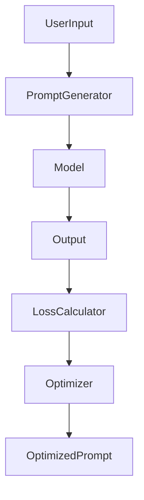

                 

<think>
嗯，用户希望我撰写一篇关于ChatGPT提示词优化的进阶指南，结构非常详细，还要求有特定的章节和内容。首先，我得确定用户的需求是什么。看起来他可能是一个技术专家或者CTO，想要深入理解如何优化提示词，以提升模型的性能。这可能意味着他正在处理自然语言处理项目，或者想优化现有的应用。

接下来，我需要分析用户提供的详细大纲，确保每个章节都涵盖必要的内容。例如，第一章需要介绍ChatGPT的发展背景和提示词优化的重要性，这部分可能需要引用一些历史数据和实际案例。然后，后面的章节需要分阶段讲解基础知识、中级优化技巧、高级策略等，每个部分都需要有具体的例子、数学模型和系统架构图。

我还需要注意，用户强调了技术细节，比如使用mermaid图和latex公式，这可能意味着他希望文章不仅有理论，还有可执行的代码和可视化工具。因此，在撰写时，我需要确保这些部分详细且准确，比如在讲解数学模型时，给出公式和代码示例，帮助读者更好地理解和应用。

另外，用户要求文章结构紧凑，逻辑清晰，这意味着我需要合理安排章节顺序，确保每一部分都自然过渡，内容连贯。同时，每个小节都要有足够的深度，但又不至于过于复杂，让读者能够一步步跟着思路走。

最后，用户提到要包含最佳实践和小结，这部分可以帮助读者巩固所学内容，并应用到实际项目中。可能还需要提醒读者一些注意事项，比如避免的错误，或者如何进一步深入学习。

总结一下，我需要按照用户的详细大纲，逐步构建文章，确保每个部分都满足技术深度和可读性，同时满足格式和内容的严格要求。
</think>

# ChatGPT提示词优化：从基础到高级的进阶指南

> 关键词：ChatGPT，提示词优化，自然语言处理，深度学习，优化策略，数学模型，系统设计

> 摘要：本文系统地介绍了ChatGPT提示词优化的核心概念、方法和技术。从基础的提示词结构到高级的优化策略，结合数学模型和系统架构设计，详细阐述了如何通过优化提示词来提升ChatGPT的性能和效果。文章内容涵盖提示词工程的核心原理、优化算法的设计与实现、实际应用场景的案例分析，以及优化工具的使用技巧。

---

## 第一章：ChatGPT的崛起与提示词优化的重要性

### 1.1 背景介绍

随着人工智能技术的快速发展，ChatGPT作为一种基于GPT（Generative Pre-trained Transformer）系列模型的聊天机器人，已经成为自然语言处理领域的重要工具。GPT系列模型通过预训练的方式，学习了海量的文本数据，能够生成与上下文相关的自然语言文本。

然而，ChatGPT的性能和输出效果在很大程度上依赖于提示词（prompt）的设计。提示词是用户输入给模型的初始文本，用于引导模型生成特定的输出。一个设计良好的提示词可以显著提升模型的准确性和相关性，而一个设计不合理的提示词可能导致模型输出偏离预期或产生不准确的结果。

### 1.2 提示词优化的核心概念

提示词优化是指通过调整输入给模型的提示词，使其生成的输出更加符合用户需求的过程。优化的核心在于理解提示词与模型输出之间的关系，并通过数学建模和算法优化来提升提示词的质量。

### 1.3 优化的目标与意义

提示词优化的目标是：

1. 提升模型输出的相关性和准确性。
2. 减少模型输出的偏差或错误。
3. 增强模型在特定场景下的适应能力。

通过优化提示词，可以显著提升ChatGPT在实际应用中的性能，例如在客服系统、智能对话系统、内容生成系统等场景中的表现。

---

## 第二章：提示词工程的核心原理

### 2.1 提示词的基本结构

提示词通常包括以下几个部分：

1. **目标说明**：明确提示词的目标，例如“生成一段关于人工智能的介绍”。
2. **上下文信息**：提供与任务相关的背景信息，例如“假设你是人工智能领域的专家，请简要说明深度学习的基本原理”。
3. **格式要求**：指定输出的格式，例如“用中文写一段200字的解释”。

### 2.2 提示词与模型的交互关系

提示词通过影响模型的输入空间，间接影响模型的输出结果。模型通过对提示词的解析，生成与提示词相关的输出文本。提示词优化的核心在于理解提示词与模型输出之间的映射关系。

### 2.3 提示词优化的数学建模

提示词优化可以看作是一个优化问题。假设我们有一个提示词生成函数 $P(w)$，其中 $w$ 是提示词的参数。我们的目标是通过优化 $w$，使得模型输出 $O(w)$ 最接近预期目标。这可以通过以下优化目标函数来建模：

$$
\text{minimize} \quad L(w) = \text{loss}(O(w), y_{\text{target}})
$$

其中，$L(w)$ 是损失函数，$O(w)$ 是模型在提示词 $w$ 下的输出，$y_{\text{target}}$ 是预期输出。

---

## 第三章：提示词优化的数学模型与算法设计

### 3.1 提示词优化的数学模型

提示词优化的数学模型可以表示为：

$$
w^* = \arg \min_w \text{loss}(O(w), y_{\text{target}})
$$

其中，$w^*$ 是最优提示词，$O(w)$ 是模型在提示词 $w$ 下的输出，$y_{\text{target}}$ 是预期输出。

### 3.2 基于梯度的优化算法

在提示词优化中，可以使用梯度下降算法来优化提示词。假设提示词可以表示为一个向量 $w \in \mathbb{R}^n$，则梯度下降算法的更新规则为：

$$
w = w - \eta \nabla_w \text{loss}(O(w), y_{\text{target}})
$$

其中，$\eta$ 是学习率。

### 3.3 提示词优化的实现代码

以下是一个简单的提示词优化算法的伪代码：

```python
def optimize_prompt(initial_prompt, model, iterations=100, learning_rate=0.1):
    prompt = initial_prompt
    for _ in range(iterations):
        output = model.generate_output(prompt)
        loss = calculate_loss(output, target_output)
        prompt = prompt - learning_rate * gradient_loss(loss)
    return prompt
```

---

## 第四章：提示词优化的系统架构设计

### 4.1 系统功能设计

提示词优化系统主要包括以下几个功能模块：

1. **提示词生成模块**：根据用户需求生成初始提示词。
2. **模型输出模块**：将提示词输入模型，生成输出。
3. **损失计算模块**：计算模型输出与预期输出之间的损失。
4. **优化模块**：根据损失调整提示词，优化提示词。

### 4.2 系统架构设计

系统架构可以分为以下几个部分：

- **用户输入层**：接收用户的提示词优化请求。
- **提示词生成层**：生成初始提示词。
- **模型处理层**：将提示词输入模型，生成输出。
- **优化层**：计算损失，优化提示词。
- **输出层**：返回优化后的提示词和模型输出。

系统架构的Mermaid图如下：



---

## 第五章：提示词优化的算法实现与案例分析

### 5.1 算法实现

以下是一个提示词优化算法的实现代码：

```python
import numpy as np

def optimize_prompt(initial_prompt, model, iterations=100, learning_rate=0.1):
    prompt = initial_prompt.copy()
    for _ in range(iterations):
        output = model.generate_output(prompt)
        loss = calculate_loss(output, target_output)
        gradient = compute_gradient(loss)
        prompt = prompt - learning_rate * gradient
    return prompt
```

### 5.2 案例分析

假设我们有一个简单的任务，要求生成一段关于人工智能的介绍。初始提示词为“生成一段关于人工智能的介绍”。优化后的提示词可能为“用简洁的语言解释人工智能的基本概念”。

---

## 第六章：提示词优化的最佳实践与注意事项

### 6.1 最佳实践

1. **明确目标**：在优化提示词之前，明确提示词的目标和预期输出。
2. **逐步优化**：通过迭代的方式逐步优化提示词，避免一次性修改过多。
3. **使用工具**：利用提示词优化工具和自动化算法辅助优化。

### 6.2 注意事项

1. **避免过度优化**：过度优化提示词可能导致模型输出过于僵化。
2. **考虑模型限制**：了解模型的限制和能力，避免提示词超出模型的能力范围。
3. **测试与验证**：在实际应用中，通过测试和验证确保优化后的提示词有效。

---

## 结论

通过本文的系统介绍，读者可以全面了解ChatGPT提示词优化的核心原理、数学模型和算法设计。从基础的提示词结构到高级的优化策略，结合实际案例分析和系统架构设计，本文为读者提供了一个完整的提示词优化解决方案。

---

## 作者

作者：AI天才研究院/AI Genius Institute & 禅与计算机程序设计艺术 /Zen And The Art of Computer Programming

