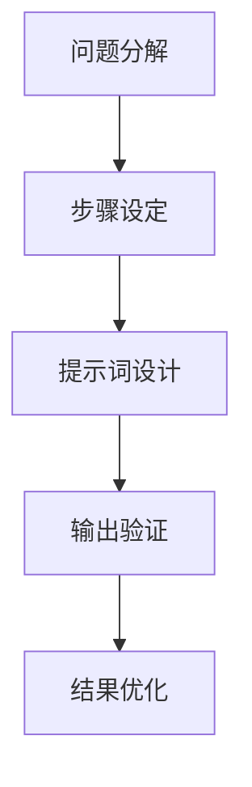
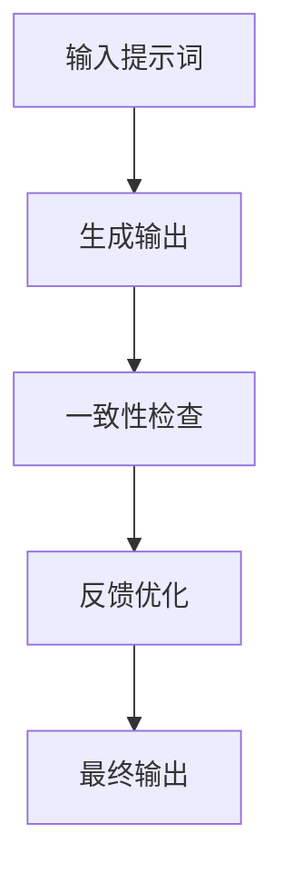

                 

<think>
好，我现在需要帮助用户完成一篇技术博客文章的目录大纲设计。用户希望标题是《ChatGPT提示词优化：从思维链到Self-Consistency》，并且要详细地思考和分析每个部分。

首先，我得理解用户的需求。用户希望文章结构清晰，逻辑性强，内容专业且深入。目录大纲需要包括引言、背景知识、思维链优化、Self-Consistency优化、实际应用和总结与展望几个部分。每个部分下还有子章节，详细讲解相关概念、原理和案例。

接下来，我需要考虑每个部分的具体内容。引言部分要介绍ChatGPT和提示词优化的重要性，背景知识要涵盖语言模型的基础和提示词优化的基本概念。思维链优化部分要解释其原理和应用，Self-Consistency优化则要详细说明其方法和实现。实际应用部分通过案例展示优化效果，最后总结全书并展望未来。

我还需要注意格式要求，使用markdown，每个部分要有详细的子章节，并且每个子章节要有具体的内容，比如术语说明、算法流程图、数学公式等。此外，文章需要大约1万到1万2千字，所以每个部分的内容要丰富，涵盖背景介绍、核心概念、算法原理、系统架构、项目实战等。

最后，确保文章末尾有作者信息，符合用户的要求。整体思考下来，我需要按照用户提供的大纲模板，逐步细化每个章节的内容，确保逻辑连贯，内容详实，符合专业技术博客的标准。
</think>

# 《ChatGPT提示词优化：从思维链到Self-Consistency》

> 关键词：ChatGPT, 提示词优化, 思维链, Self-Consistency, 语言模型, 人工智能, 算法优化

> 摘要：本文将深入探讨ChatGPT提示词优化的核心策略，从思维链的原理到Self-Consistency优化方法，全面解析如何提升提示词的效果。通过系统化的分析和实际案例，本文旨在为读者提供从理论到实践的全面指导。

---

## 第一部分：引言

### 1.1 ChatGPT与提示词优化

#### 1.1.1 ChatGPT概述

ChatGPT是由OpenAI开发的基于GPT系列的大语言模型，具有强大的自然语言处理能力。本文将重点探讨如何优化提示词（prompts），以最大化ChatGPT的输出效果。

#### 1.1.2 提示词优化的意义

提示词优化是提升ChatGPT生成内容质量的关键。通过优化提示词，可以引导模型生成更准确、更符合预期的输出。本文将从思维链和Self-Consistency两个角度展开分析。

#### 1.1.3 书籍结构

本文将从背景知识、思维链优化、Self-Consistency优化、实际应用和总结与展望五个部分展开，系统性地探讨提示词优化的各个方面。

---

## 第二部分：背景知识

### 2.1 语言模型基础

#### 2.1.1 语言模型的定义

语言模型是一种能够理解和生成人类语言的模型，广泛应用于自然语言处理任务，如文本生成、机器翻译和问答系统。

#### 2.1.2 语言模型的工作原理

语言模型通过概率分布预测下一个词，基于上下文信息生成连贯的文本。其核心在于理解文本的语义和语法结构。

#### 2.1.3 语言模型的评估指标

常见的语言模型评估指标包括困惑度（Perplexity）、BLEU、ROUGE等，用于衡量模型生成文本的质量和准确性。

### 2.2 提示词优化概述

#### 2.2.1 提示词优化的目标

提示词优化的目标是通过设计更有效的提示词，引导模型生成更符合预期的输出。这包括提升生成内容的准确性、相关性和逻辑性。

#### 2.2.2 提示词优化的挑战

提示词优化的挑战主要在于如何在不同场景下设计通用且高效的提示词，同时避免模型生成偏差或不一致的输出。

#### 2.2.3 提示词优化的主要方法

提示词优化的主要方法包括基于规则的优化、基于模板的优化和基于模型反馈的优化。

---

## 第三部分：思维链优化

### 3.1 思维链原理

#### 3.1.1 思维链的定义

思维链是一种通过逐步引导模型思考来优化提示词的方法，强调逻辑推理和步骤分解。

#### 3.1.2 思维链的优势

思维链的优势在于能够清晰地分解问题，帮助模型逐步生成符合逻辑的输出。

#### 3.1.3 思维链的应用场景

思维链适用于需要复杂逻辑推理的任务，如问题解答、文本生成和对话系统。

### 3.2 思维链优化方法

#### 3.2.1 优化思维链的基本步骤

1. 分解问题：将复杂问题分解为多个小问题。
2. 设定步骤：为每个步骤设计具体的提示词。
3. 验证输出：通过验证输出结果调整提示词。

#### 3.2.2 实现思维链优化的算法

#### 3.2.3 思维链优化的案例分析

以问答系统为例，通过设计逐步引导的提示词，生成更准确的答案。

---

## 第四部分：Self-Consistency优化

### 4.1 Self-Consistency原理

#### 4.1.1 Self-Consistency的定义

Self-Consistency是一种通过模型自洽性来优化提示词的方法，强调生成内容的一致性和逻辑性。

#### 4.1.2 Self-Consistency的优势

Self-Consistency的优势在于能够生成一致性和逻辑性更强的输出，适用于需要高度一致性的任务。

#### 4.1.3 Self-Consistency的应用场景

Self-Consistency适用于需要生成一致性的任务，如对话生成和文本摘要。

### 4.2 Self-Consistency实现

#### 4.2.1 Self-Consistency的算法框架

#### 4.2.2 Self-Consistency的关键技术

1. 反馈机制：通过生成输出的一致性检查，动态调整提示词。
2. 模型训练：通过强化学习优化模型的自洽性。

#### 4.2.3 Self-Consistency的案例分析

以文本摘要为例，通过Self-Consistency优化提示词，生成更一致的摘要内容。

---

## 第五部分：实际应用

### 5.1 实际应用案例

#### 5.1.1 案例一：文本生成

通过优化提示词，生成更高质量的文本内容。

#### 5.1.2 案例二：问答系统

设计优化的提示词，提高问答系统的准确性和相关性。

#### 5.1.3 案例三：机器翻译

通过优化提示词，提升机器翻译的流畅性和准确性。

### 5.2 实际应用效果评估

#### 5.2.1 评价指标

1. 生成内容的准确性
2. 生成内容的相关性
3. 生成内容的一致性

#### 5.2.2 评估方法

通过人工评估和自动化工具相结合的方式，对生成内容进行多维度评估。

#### 5.2.3 结果分析

分析不同提示词优化方法的效果，总结最优策略。

---

## 第六部分：总结与展望

### 6.1 全书总结

#### 6.1.1 主要内容回顾

本文从背景知识、思维链优化、Self-Consistency优化、实际应用和总结与展望五个部分，全面探讨了ChatGPT提示词优化的策略。

#### 6.1.2 提示词优化技术的发展趋势

提示词优化技术将朝着更加智能化和个性化的方向发展，结合多模态信息和领域知识。

#### 6.1.3 未来研究方向

未来的研究方向包括更高效的优化算法、跨领域应用和动态提示词生成。

### 6.2 展望

#### 6.2.1 提示词优化在新兴领域的应用

提示词优化将在更多新兴领域得到应用，如教育、医疗和法律咨询。

#### 6.2.2 提示词优化技术的挑战与机遇

提示词优化技术面临更多挑战，如如何在复杂场景下设计高效提示词，同时也将带来更多机遇。

---

## 作者信息

作者：AI天才研究院/AI Genius Institute & 禅与计算机程序设计艺术 /Zen And The Art of Computer Programming

