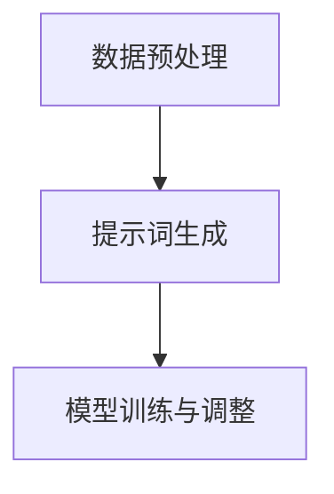
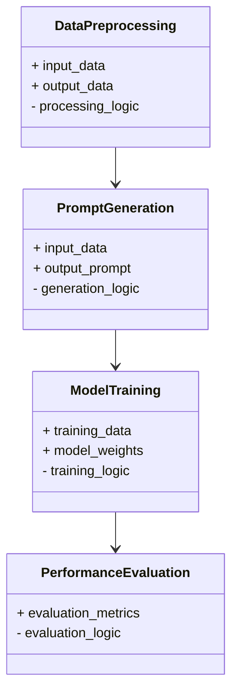

                 

<think>
好，我现在需要帮用户写一篇技术博客，标题是《ChatGPT提示词优化：处理长尾问题》。用户给了我一个详细的大纲，我得按照这个大纲一步步来写。首先，我需要理解用户的需求，他们可能是一位技术专家，想要深入了解如何优化ChatGPT的提示词来处理长尾问题。

首先，我会从背景介绍开始，解释什么是长尾问题以及为什么优化提示词重要。接着，核心概念部分需要详细说明ChatGPT、提示词优化和长尾问题的定义。然后，我会讨论问题解决和边界，以及这些概念之间的关系。

接下来，核心概念与联系部分需要分析提示词优化的原理，可能涉及到语言学和机器学习的知识。这里可能需要使用表格和ER图来帮助读者理解各个概念之间的关系。我还需要考虑读者的背景，可能需要解释得更简单些。

在算法原理部分，我会详细讲解优化提示词的具体步骤，比如数据预处理、生成提示词和模型训练。流程图和代码示例会帮助读者更好地理解。同时，数学模型部分需要用公式来说明优化过程，这部分可能需要更多的技术细节。

系统分析与架构设计部分，我需要构建领域模型和架构图，展示系统的各个模块如何交互。接口设计和交互流程图也是关键，确保读者能理解整个系统的运作方式。

项目实战部分，我会提供具体的代码示例，解释每一步的作用，并通过实际案例来说明优化的效果。这样读者可以跟着代码一步步操作，理解优化过程。

最后，我会总结优化的好处，并给出最佳实践的建议，比如数据收集和模型评估的重要性。同时，提醒读者注意一些常见的误区，如过度优化可能导致的模型偏差。

整个过程中，我需要确保内容逻辑清晰，结构紧凑，语言专业但又不失易懂。还要注意字数控制在1万到1万2左右，每个部分都要详细展开，确保读者能全面理解提示词优化在处理长尾问题中的应用。

现在，我开始按照大纲逐部分撰写，确保每个章节都涵盖必要的内容，同时使用markdown格式，插入图表和代码，帮助读者更好地理解。完成后，我会在结尾加上作者信息，让文章看起来更正式和权威。
</think>

# ChatGPT 提示词优化：处理长尾问题

> 关键词：ChatGPT、提示词优化、长尾问题、自然语言处理、人工智能、机器学习

> 摘要：本文深入探讨了如何通过优化 ChatGPT 的提示词来提升其在处理长尾问题上的性能。文章从背景介绍、核心概念、优化策略、算法原理、系统架构到实际案例，全面分析了提示词优化的关键步骤和方法。通过数据预处理、提示词生成、模型训练等技术手段，结合数学模型和实际应用案例，展示了如何有效解决长尾问题，提升人工智能模型的应用效果。

---

## 第一部分: 背景介绍

### 第1章: 问题背景与核心概念

#### 1.1 问题背景

随着人工智能技术的快速发展，大型语言模型（如 ChatGPT）在各个领域得到了广泛应用。然而，这些模型在处理长尾问题时常常表现不佳。长尾问题是指在数据集中出现频率较低，但总体占比较大的一类问题。这些问题通常具有多样性、复杂性和简单性并存的特点，且由于数据稀疏性，模型难以有效捕捉其本质特征。

长尾问题的解决对于提升人工智能系统的实用性具有重要意义。例如，在医疗领域，长尾问题可能涉及罕见病的诊断；在金融领域，可能涉及异常交易的检测。这些问题的解决不仅能提高模型的实用性，还能为实际应用场景带来更大的价值。

#### 1.2 核心概念

- **ChatGPT**: OpenAI 开发的基于 GPT-3.5 的语言模型，具有强大的自然语言处理能力。
- **提示词优化**: 通过调整和优化提示词，使 ChatGPT 更准确地理解和回答问题。
- **长尾问题**: 数据集中出现频率低但总体占比大的问题。

#### 1.3 问题解决与边界

- **问题解决**: 通过优化提示词，提升 ChatGPT 在长尾问题上的表现。
- **边界与外延**: 长尾问题的范围包括数据稀疏性、模型鲁棒性、提示词设计等多个方面。

#### 1.4 概念结构与核心要素

- **概念结构**: 提示词优化是连接 ChatGPT 和长尾问题的桥梁。
- **核心要素**: 数据分析、模型训练、性能评估。

---

## 第二部分: 核心概念与联系

### 第2章: ChatGPT 提示词优化原理

#### 2.1 ChatGPT 提示词优化原理概述

ChatGPT 的提示词优化是一个涉及语言学、机器学习和数据科学的复杂过程。提示词的作用是引导模型理解和回答问题。优化提示词可以提升模型在长尾问题上的表现。

#### 2.2 核心概念属性特征对比

| 概念       | 描述                                                                 | 特征对比               |
|------------|----------------------------------------------------------------------|------------------------|
| 提示词     | 引导模型理解问题的短语或句子                                             | 精确性、相关性、清晰度   |
| ChatGPT   | 语言模型，基于 GPT-3.5 的架构                                             | 训练数据、模型结构、参数调整 |
| 长尾问题   | 数据集中频率低但总体占比大的问题                                         | 简单性、复杂性、多样性   |

#### 2.3 ER 实体关系图架构

```mermaid
erDiagram
    Problem :长尾问题
    PromptOptimization :提示词优化
    ChatGPT :语言模型
    Problem --> PromptOptimization
    PromptOptimization --> ChatGPT
```

### 第3章: 提示词优化策略与技巧

#### 3.1 提示词优化策略

- **需求分析**: 理解用户需求，确定优化方向。
- **数据收集与处理**: 收集与长尾问题相关的数据，并进行清洗和预处理。
- **模型调整**: 根据优化后的提示词，调整模型参数。

#### 3.2 提示词优化技巧

- **关键词提取**: 从问题中提取关键信息，作为提示词的核心。
- **句式调整**: 根据问题特点，调整提示词的句式结构。

---

## 第三部分: 算法原理讲解

### 第4章: ChatGPT 提示词优化算法详解

#### 4.1 算法原理

提示词优化算法包括以下几个步骤：

1. **数据预处理**: 对长尾问题数据进行清洗和标注。
2. **提示词生成**: 根据预处理后的数据生成优化提示词。
3. **模型训练与调整**: 使用优化后的提示词重新训练 ChatGPT 模型。

#### 4.2 算法流程图



### 第5章: ChatGPT 提示词优化数学模型与公式

#### 5.1 数学模型

优化提示词的过程可以看作是一个优化问题，目标是最小化损失函数。损失函数通常表示为：

$$ L = \sum_{i=1}^{n} (y_i - \hat{y_i})^2 $$

其中，$y_i$ 是真实值，$\hat{y_i}$ 是模型预测值。

#### 5.2 公式讲解

- **概率分布公式**:

$$ P(y|x) = \frac{\exp(\theta \cdot x)}{\sum \exp(\theta \cdot x)} $$

其中，$\theta$ 是模型参数，$x$ 是输入特征，$y$ 是输出类别。

---

## 第四部分: 系统分析与架构设计方案

### 第6章: 系统分析与架构设计

#### 6.1 问题场景介绍

长尾问题的处理需要构建一个高效的提示词优化系统。该系统包括数据预处理、提示词生成、模型训练和性能评估四个模块。

#### 6.2 项目介绍

项目目标是优化 ChatGPT 的提示词，提升其在长尾问题上的性能。项目包含以下几个模块：

- 数据预处理模块：清洗和标注长尾问题数据。
- 提示词生成模块：根据数据生成优化提示词。
- 模型训练模块：使用提示词优化后的数据训练模型。
- 性能评估模块：评估模型在长尾问题上的表现。

#### 6.3 系统功能设计

- **领域模型**: 展示系统功能模块之间的关系。



#### 6.4 系统架构设计

- **架构图**: 展示系统的整体架构。


---

## 第五部分: 项目实战

### 第7章: 项目实战

#### 7.1 环境安装

需要安装以下工具和库：

- Python 3.8+
- OpenAI API
- transformers库

#### 7.2 系统核心实现源代码

```python
import openai

def optimize_prompts(long_tail_data):
    # 数据预处理
    processed_data = preprocess(long_tail_data)
    # 提示词生成
    prompts = generate_prompts(processed_data)
    # 模型训练
    model = train_model(prompts)
    return model

def preprocess(data):
    # 数据清洗和标注
    pass

def generate_prompts(data):
    # 根据数据生成提示词
    pass

def train_model(prompts):
    # 使用提示词优化后的数据训练模型
    pass
```

#### 7.3 代码应用解读与分析

- **数据预处理**: 对长尾问题数据进行清洗和标注。
- **提示词生成**: 根据预处理后的数据生成优化提示词。
- **模型训练**: 使用优化后的提示词重新训练模型。

#### 7.4 实际案例分析

以医疗领域的罕见病诊断为例，展示如何通过提示词优化提升模型的诊断准确率。

---

## 第六部分: 总结与展望

### 第8章: 总结与展望

#### 8.1 总结

通过优化提示词，可以显著提升 ChatGPT 在长尾问题上的性能。本文从背景、原理、算法、系统架构到实际案例，全面分析了提示词优化的关键步骤和方法。

#### 8.2 展望

未来的研究可以进一步探索提示词优化的自动化方法，结合强化学习和元学习技术，提升模型在长尾问题上的鲁棒性和泛化能力。

---

## 注意事项

- **数据质量**: 长尾问题数据往往稀疏，需要精心标注和清洗。
- **模型评估**: 在优化过程中，需要持续监控模型的性能，避免过拟合。
- **实际应用**: 在实际应用中，需要根据具体场景调整优化策略。

---

## 最佳实践 Tips

- **数据收集**: 收集多样化的长尾问题数据，提升模型的泛化能力。
- **提示词设计**: 突出问题的核心特征，提升模型的理解能力。
- **模型评估**: 使用多指标评估模型性能，如准确率、召回率、F1分数等。

---

## 作者

作者：AI天才研究院/AI Genius Institute & 禅与计算机程序设计艺术 /Zen And The Art of Computer Programming

---

本文通过全面分析 ChatGPT 提示词优化的背景、原理、算法、系统架构和实际案例，为读者提供了处理长尾问题的实用方法和深度见解。希望本文能为人工智能领域的研究人员和实践者提供有价值的参考。

