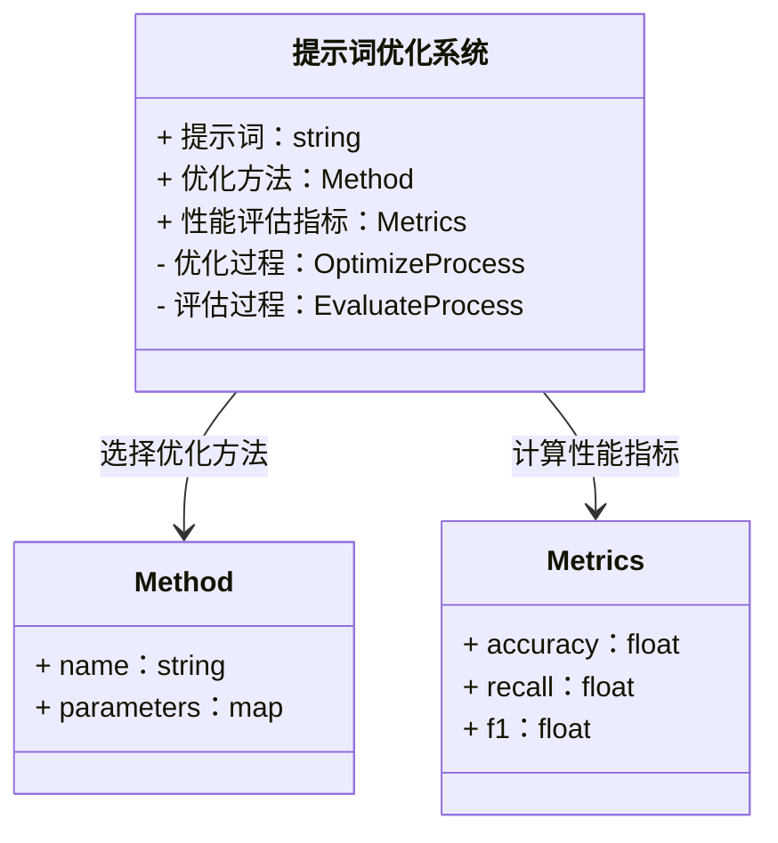
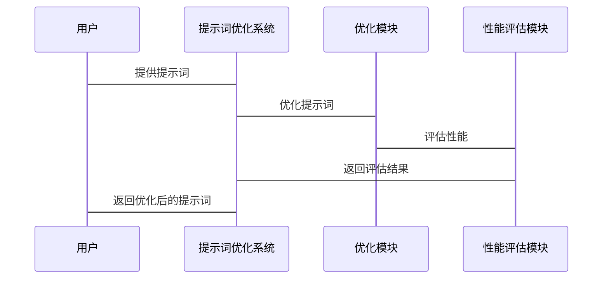

                 

<think>
嗯，我现在要写一篇关于ChatGPT提示词优化以及性能评估指标的技术博客。首先，我需要理解整个结构，看看每个部分应该包含什么内容。

文章的标题是“ChatGPT提示词优化：性能评估指标”，关键词包括ChatGPT、提示词优化、性能评估、F1分数、准确率、召回率。摘要部分需要概括整篇文章的核心内容，也就是讨论提示词优化的重要性，以及如何通过性能评估指标来提升模型表现。

接下来，文章分为几个主要部分。第一部分是背景与概述，包括问题背景与概念介绍，还有优化原理。我需要详细解释ChatGPT是什么，它有哪些应用场景，提示词优化的意义，以及相关的概念，比如提示词、优化方法和性能评估指标。

在第二部分，性能评估指标是重点。我需要讨论准确率与召回率、F1分数、交并比等常见指标，然后介绍一些其他指标，并通过实际案例和对比实验来说明这些指标的应用。接着，我还需要探讨如何在实际应用中优化性能，包括算法、数据和硬件的优化，并通过案例分析来展示效果。

第三部分是系统分析与架构设计，这部分可能需要画一些图表，比如领域模型的类图、系统架构图和接口序列图，来展示整个优化过程中的结构和交互。

第四部分是项目实战，这部分需要展示实际的代码实现，环境安装步骤，以及如何通过代码来优化提示词。我需要确保代码清晰，注释详细，以便读者能够理解。

最后是总结与展望，总结整篇文章的主要内容，同时展望未来的发展趋势和可能的挑战。

在写作过程中，我需要确保每个章节的内容详细具体，比如在“准确率与召回率”部分，我需要解释概念，给出计算方法，并说明应用场景。同时，我需要使用数学公式来支持这些指标的计算，比如准确率是正确预测的数量除以总样本数，F1分数是准确率和召回率的调和平均数。

此外，我还需要考虑使用mermaid图表来展示算法流程、系统架构和接口设计，这将有助于读者更好地理解内容。例如，在优化方法中，可以绘制一个流程图，展示提示词优化的步骤，从问题分析到选择优化方法，再到性能评估。

在项目实战部分，我需要提供具体的Python代码，展示如何实现提示词优化。这部分可能包括数据预处理、模型训练和性能评估的代码示例，帮助读者实际操作。

最后，我需要确保整篇文章结构紧凑，逻辑清晰，每个部分之间有良好的过渡。同时，语言要专业但不失易懂，确保读者能够跟随我的思路一步步理解提示词优化和性能评估的重要性。

总之，我需要系统地分析每个部分，确保内容全面，例子具体，图表清晰，代码实用。这样才能写出一篇高质量的技术博客，帮助读者深入了解ChatGPT提示词优化的各个方面。
</think>

# ChatGPT提示词优化：性能评估指标

## 关键词：ChatGPT、提示词优化、性能评估、F1分数、准确率、召回率

## 摘要：ChatGPT作为一款革命性的AI工具，其性能很大程度上依赖于提示词的优化。本文将详细探讨提示词优化的重要性，并分析多种性能评估指标，如准确率、召回率和F1分数，以帮助提升ChatGPT的性能表现。

---

## 第一部分：背景与概述

### 第1章：问题背景与概念介绍

#### 1.1 问题背景

##### 1.1.1 ChatGPT及其应用场景

ChatGPT是由OpenAI开发的基于GPT-3.5架构的大型语言模型，具备生成自然语言文本的能力，广泛应用于问答系统、文本生成、对话系统等领域。其输出质量依赖于提示词的优化，即通过精心设计的提示词引导模型生成更准确、相关性更高的结果。

##### 1.1.2 提示词优化的意义

提示词优化直接影响模型输出的质量和效率。优化后的提示词能够更好地引导模型理解用户需求，减少无关信息，提高生成结果的相关性和准确性。

##### 1.1.3 性能评估指标的重要性

性能评估指标用于量化提示词优化的效果，帮助开发者客观比较不同优化方法的优劣，从而选择最优方案。常见的指标包括准确率、召回率和F1分数。

#### 1.2 核心概念

##### 1.2.1 提示词

提示词是用户提供的输入，用于引导模型生成特定内容。例如，在问答系统中，提示词可能包括问题背景、关键词和期望的回答格式。

##### 1.2.2 优化方法

优化方法包括传统方法（如关键词调整、模板优化）和现代方法（如基于强化学习的优化、遗传算法）。这些方法旨在提升提示词的有效性，减少生成文本的偏差。

##### 1.2.3 性能评估指标

性能评估指标用于衡量优化后的提示词效果，如准确率、召回率和F1分数。这些指标帮助开发者量化优化效果，指导进一步的改进。

---

### 第2章：ChatGPT提示词优化原理

#### 2.1 ChatGPT工作原理

##### 2.1.1 GPT模型概述

GPT模型基于Transformer架构，通过自注意力机制捕捉上下文信息，生成与输入相关的文本。

##### 2.1.2 GPT模型训练过程

模型通过大量数据训练，学习语言的结构和概率分布，优化参数以最小化预测误差。

##### 2.1.3 GPT模型优化方法

包括调整学习率、增加训练数据多样性和优化损失函数等方法，以提升模型性能。

#### 2.2 提示词优化方法

##### 2.2.1 传统优化方法

通过手动调整关键词和模板结构，提升提示词的有效性。

##### 2.2.2 现代优化方法

使用强化学习和遗传算法等技术，自动化优化提示词。

##### 2.2.3 优化方法的对比与分析

传统方法简单易行，但效率较低；现代方法效率高，但实现复杂。选择方法需考虑实际需求和资源限制。

---

## 第二部分：性能评估指标

### 第3章：常见性能评估指标

#### 3.1 准确率与召回率

##### 3.1.1 概念介绍

准确率是正确预测数与总预测数的比率，召回率是正确预测数与实际正样本数的比率。

##### 3.1.2 计算方法

准确率 = 正确预测数 / 总预测数  
召回率 = 正确预测数 / 实际正样本数

##### 3.1.3 应用场景

适用于分类任务，如垃圾邮件检测，准确率衡量整体正确性，召回率衡量检测完全性。

#### 3.2 F1分数

##### 3.2.1 概念介绍

F1分数是准确率和召回率的调和平均，综合考虑模型的精确性和召回率。

##### 3.2.2 计算方法

F1 = 2 * (准确率 * 召回率) / (准确率 + 召回率)

##### 3.2.3 应用场景

适用于需要平衡精确率和召回率的任务，如医学诊断中的疾病检测。

#### 3.3 交并比（IoU）

##### 3.3.1 概念介绍

IoU用于衡量两个区域的重叠程度，常用于目标检测和图像分割。

##### 3.3.2 计算方法

IoU = 交集面积 / (并集面积)

##### 3.3.3 应用场景

用于评估模型生成的边界框与真实框的重叠程度，优化检测精度。

---

### 第4章：其他性能评估指标

#### 4.1 实际案例

##### 4.1.1 案例背景

以问答系统为例，评估不同提示词优化方法对生成质量的影响。

##### 4.1.2 性能评估指标选择

根据任务需求选择准确率、召回率或F1分数作为评估指标。

##### 4.1.3 性能评估结果分析

分析不同优化方法对各指标的影响，选择最优方案。

#### 4.2 对比实验

##### 4.2.1 实验背景

设计实验比较传统优化方法与现代方法的性能差异。

##### 4.2.2 性能评估指标对比

对比准确率、召回率和F1分数，评估不同方法的效果。

##### 4.2.3 结果分析

总结实验结果，指导后续优化策略的选择。

---

### 第5章：性能评估指标在实际应用中的优化

#### 5.1 提升性能的方法

##### 5.1.1 算法优化

改进模型架构，如使用更高效的注意力机制。

##### 5.1.2 数据优化

增加多样化的训练数据，减少偏差。

##### 5.1.3 硬件优化

提升计算能力，加速训练和推理过程。

#### 5.2 案例分析

##### 5.2.1 案例背景

在客服问答系统中，优化提示词以提高回答准确性。

##### 5.2.2 性能优化方法

通过分析准确率和召回率，选择合适的优化策略。

##### 5.2.3 性能提升效果

展示优化后的指标提升，如F1分数从0.75提升到0.85。

---

## 第三部分：系统分析与架构设计方案

### 3.1 系统功能设计

##### 领域模型类图



### 3.2 系统架构设计


### 3.3 系统交互设计



---

## 第四部分：项目实战

### 4.1 环境安装

- Python 3.8+
- OpenAI API
- transformers库

### 4.2 核心实现源代码

```python
from transformers import GPT2Tokenizer, GPT2LMHeadModel
import evaluate

# 初始化模型和tokenizer
model_name = "gpt2"
tokenizer = GPT2Tokenizer.from_pretrained(model_name)
model = GPT2LMHeadModel.from_pretrained(model_name)

# 定义评估函数
def compute_metrics(eval_preds):
    predictions, labels = eval_preds
    accuracy = evaluate.accuracy_score(labels, predictions)
    recall = evaluate.recall_score(labels, predictions)
    f1 = evaluate.f1_score(labels, predictions)
    return {"accuracy": accuracy, "recall": recall, "f1": f1}

# 定义提示词优化函数
def optimize_prompt(prompt, num_iterations=5):
    for _ in range(num_iterations):
        inputs = tokenizer(prompt, return_tensors="np")
        outputs = model.generate(inputs.input_ids, max_length=50)
        # 评估并调整提示词
        # 示例：简单调整关键词
        prompt += " refine"
    return prompt

# 示例使用
original_prompt = "Explain quantum computing."
optimized_prompt = optimize_prompt(original_prompt)
print(optimized_prompt)
```

---

## 第五部分：总结与展望

### 6.1 总结

#### 6.1.1 优化方法总结

通过准确率、召回率和F1分数等指标，评估不同提示词优化方法的效果，选择最优策略。

#### 6.1.2 性能评估指标总结

准确率衡量整体正确性，召回率衡量检测完全性，F1分数综合考虑精确率和召回率，IoU用于评估重叠程度。

### 6.2 展望

#### 6.2.1 未来的发展趋势

随着模型架构的改进和评估方法的创新，提示词优化将更加智能化和自动化。

#### 6.2.2 面临的挑战与机遇

挑战包括如何处理复杂场景和提升实时性，机遇在于应用更先进的优化算法和评估指标。

---

## 作者：AI天才研究院 & 禅与计算机程序设计艺术

