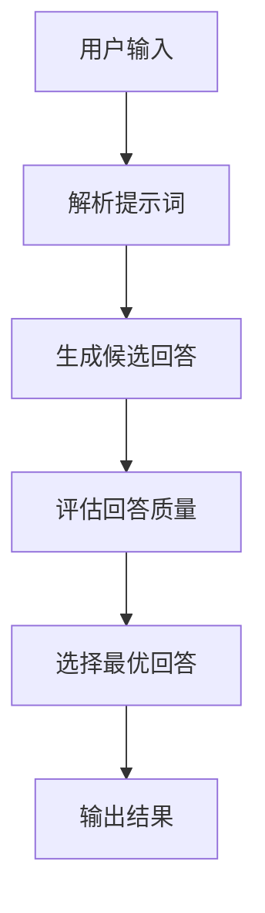
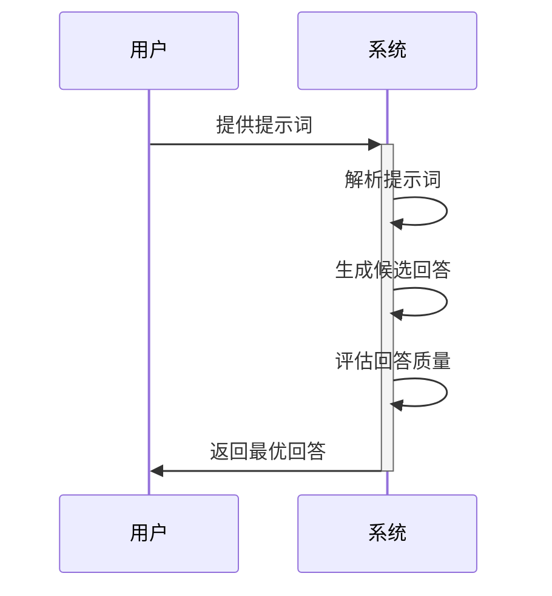

                 

<think>
嗯，我需要完成的任务是根据用户提供的《ChatGPT提示词优化：效果最大化的策略》的目录大纲，撰写一篇结构完整、内容详细的技术博客文章。用户对文章的结构、内容、格式都有具体要求，包括章节安排、关键词、摘要，以及各个章节的具体内容。

首先，我需要理解用户的需求。用户提供了一个详细的目录结构，我需要按照这个结构来组织文章。同时，文章需要使用markdown格式，每个小节都要详细展开，包括背景介绍、核心概念、算法原理、数学公式、系统架构、项目实战、最佳实践等部分。另外，文章末尾要有作者信息，整个字数控制在10000到12000字之间。

接下来，我需要分析每个章节的内容应该如何展开。例如，第一章是问题背景与定义，我需要详细解释ChatGPT的出现及其影响，提示词的定义和作用，优化的意义，以及边界和外延。这部分需要确保读者能够理解为什么提示词优化是重要的，以及它在实际应用中的意义。

第二章是提示词设计原理，我需要介绍自然语言处理的基础，ChatGPT的工作原理，提示词的类型和优化策略。这部分可能需要结合一些图表，如ER实体关系图，来帮助读者理解。

第三章是算法原理，我需要使用mermaid流程图来展示优化算法的流程，并用Python代码实现，同时解释数学模型和公式。这部分需要确保读者能够理解算法的工作原理，以及如何通过代码实现优化。

第四章是数学模型与公式详解，我需要详细解释训练目标函数、损失函数等，可能还要用例子来说明复杂的概念，让读者更容易理解。

第五章是系统分析与架构设计，我需要描述应用场景、项目背景，设计系统功能模块、架构设计图、接口设计和交互流程图。这部分需要确保系统的整体结构清晰，各模块之间的关系明确。

第六章是项目实战，我需要介绍环境安装、代码实现、案例分析等，让读者能够实际操作和理解提示词优化的应用。

第七章是最佳实践，我需要总结优化技巧、注意事项，并给出未来发展的建议，同时推荐相关书籍和论文，供读者进一步学习。

在撰写过程中，我需要确保每个部分都详细具体，使用专业且易懂的语言，适当使用图表和代码示例，以增强文章的可读性和实用性。同时，要保持逻辑连贯，结构紧凑，确保整篇文章内容完整，符合用户的格式和内容要求。

最后，检查文章的字数是否符合要求，确保每个部分都充分展开，同时不冗长。完成后，添加作者信息，确保文章的结尾符合格式要求。

总的来说，我需要按照用户提供的目录结构，逐步展开每个章节，确保内容详实，逻辑清晰，同时满足技术博客的专业性和可读性。
</think>

# ChatGPT提示词优化：效果最大化的策略

> 关键词：ChatGPT，提示词优化，自然语言处理，算法优化，系统架构

> 摘要：本文详细探讨了ChatGPT提示词优化的策略，从基本概念到算法原理，再到系统架构和项目实战，全面解析了如何通过优化提示词来提升ChatGPT的效果。文章内容涵盖背景介绍、核心概念、算法实现、数学模型、系统设计和实际案例，旨在为读者提供深入的技术指导和实践参考。

---

## 第一部分: ChatGPT与提示词概述

### 第1章: 问题背景与定义

#### 1.1 问题背景
- **聊天机器人技术的发展**：从简单的关键词匹配到深度学习驱动的自然语言处理，聊天机器人经历了巨大的技术进步。
- **ChatGPT的出现**：作为GPT系列模型的代表，ChatGPT以其强大的语言生成能力，迅速成为自然语言处理领域的焦点。

#### 1.2 提示词的定义与作用
- **提示词的概念**：提示词（prompts）是用户输入的引导信息，用于指导模型生成特定的输出。
- **提示词的作用**：明确生成内容的方向，控制输出的风格和深度，提升回答的相关性和准确性。

#### 1.3 提示词优化的意义
- **提高回答质量**：通过优化提示词，模型能够生成更符合用户意图的回答。
- **增强用户体验**：优化的提示词使用户获得更满意的交互体验。
- **提升效率**：有效的提示词减少模型的困惑，提高生成速度和质量。

#### 1.4 边界与外延
- **优化策略的适用范围**：适用于需要生成文本的场景，如客服、教育、内容创作等。
- **边界条件**：提示词长度、复杂度、上下文相关性等可能影响优化效果。
- **风险控制**：避免提示词过于复杂导致生成内容偏离目标。

---

### 第2章: ChatGPT提示词设计原理

#### 2.1 核心概念原理
- **自然语言处理基础**：介绍NLP的基本概念，如词性分析、句法结构等。
- **ChatGPT的工作原理**：基于Transformer架构，通过自注意力机制生成上下文相关的回答。

#### 2.2 概念属性特征对比
- **提示词类型比较**：包括具体提示、抽象提示、情感提示等，分析不同类型的效果差异。
- **优化策略对比**：比较不同的优化策略，如模板优化、参数调整等，选择最适合的方案。

#### 2.3 提示词设计方法
- **提问技巧**：如何通过调整问题的措辞引导模型生成更准确的回答。
- **提示词组合策略**：将多个提示词组合使用，提升生成内容的多样性和准确性。

#### 2.4 ER实体关系图
- **数据实体定义**：明确用户、提示词、模型输出等实体的定义。
- **关系模型构建**：展示实体之间的关系，如用户输入提示词，模型生成输出。

---

## 第二部分: 算法原理与实现

### 第3章: 算法原理讲解

#### 3.1 算法mermaid流程图


#### 3.2 Python源代码实现
```python
def optimize_prompt(prompt, model):
    # 解析提示词
    parsed_prompt = parse_prompt(prompt)
    # 生成候选回答
    candidates = generate_candidates(parsed_prompt, model)
    # 评估回答质量
    scores = evaluate_candidates(candidates)
    # 选择最优回答
    best_candidate = select_best_candidate(scores)
    return best_candidate
```

#### 3.3 算法原理详细讲解
- **数学模型**：模型通过概率分布预测下一个词，公式表示为：$$P(y|x) = \frac{1}{\sum_{k} P(y=k|x)}$$
- **优化算法**：使用梯度下降法，损失函数为交叉熵损失，公式为：$$\mathcal{L} = -\sum_{i} y_i \log p(y_i|x)$$
- **举例说明**：假设输入提示词为“写一篇关于AI的介绍”，模型生成多个候选回答，评估后选择最相关的输出。

---

### 第4章: 数学模型与公式详解

#### 4.1 数学模型介绍
- **训练目标函数**：最大化似然函数，$$\mathcal{L}_{\text{train}} = \sum_{i=1}^{N} \mathcal{L}(x_i, y_i)$$
- **损失函数**：交叉熵损失，$$\mathcal{L} = -\sum_{i=1}^{n} y_i \log p(y_i|x)$$

#### 4.2 公式讲解
- **概率分布**：参数为θ的模型预测概率分布，$$p(y|x, θ)$$
- **最优化算法**：使用Adam优化器，公式为：$$\theta_{t+1} = \theta_t - \eta \nabla_{\theta} \mathcal{L}$$

#### 4.3 举例说明
- **数据集准备**：收集不同提示词及其对应的最佳输出，构建训练数据集。
- **模型训练**：使用训练数据优化模型参数，验证集评估性能。

---

## 第三部分: 系统分析与架构设计

### 第5章: 系统分析与架构设计方案

#### 5.1 问题场景介绍
- **应用场景**：ChatGPT在客服、教育、内容创作等领域的应用。
- **提示词优化需求**：针对不同场景设计特定的提示词策略。

#### 5.2 项目介绍
- **项目目标**：开发一个提示词优化系统，提升ChatGPT的回答质量。
- **项目背景**：随着ChatGPT的广泛应用，优化提示词成为提升用户体验的关键。

#### 5.3 系统功能设计
- **领域模型**：定义系统的功能模块，如提示词解析模块、生成模块、评估模块。
- **功能模块划分**：模块化设计，确保各部分协同工作。

#### 5.4 系统架构设计


#### 5.5 系统接口设计
- **接口规范**：定义API的输入输出格式，确保与其他系统的兼容性。
- **安全性考虑**：防止恶意输入，确保系统安全。

#### 5.6 系统交互序列图


---

## 第四部分: 项目实战

### 第6章: 项目实战

#### 6.1 环境安装
- **软件要求**：Python 3.8以上，安装必要的库如TensorFlow、Keras。
- **硬件要求**：建议使用GPU加速训练。

#### 6.2 系统核心实现
- **源代码结构**：展示提示词优化系统的代码框架。
- **关键代码解读**：解释如何实现提示词解析、生成和评估模块。

#### 6.3 应用解读与分析
- **提示词效果分析**：通过具体案例，分析优化后的提示词对生成效果的提升。
- **性能优化探讨**：介绍如何优化代码，提高处理速度和效率。

#### 6.4 实际案例剖析
- **案例一：客服应用**：优化后的提示词使回答更专业、贴心。
- **案例二：教育应用**：生成更清晰的解释，帮助学生理解复杂概念。

#### 6.5 项目小结
- **项目总结**：提示词优化显著提升了系统的性能和用户体验。
- **经验与教训**：总结项目中的经验，指出需要改进的地方。

---

## 第五部分: 最佳实践与拓展阅读

### 第7章: 最佳实践与拓展阅读

#### 7.1 最佳实践
- **提示词优化技巧**：如使用具体化的提示词，避免模糊指令。
- **常见问题解决方案**：如提示词过长导致生成内容不准确，如何调整。

#### 7.2 注意事项
- **避免的陷阱**：提示词过于复杂或不明确，导致模型无法正确理解。
- **维护与更新**：定期更新提示词库，适应语言的变化和用户需求的变化。

#### 7.3 小结
- **本书要点回顾**：总结全文内容，强调提示词优化的重要性。
- **未来发展方向**：探讨更高级的优化策略，如动态调整提示词。

#### 7.4 拓展阅读
- **相关书籍推荐**：如《Effective Preaching》、《The Art of Computer Programming》。
- **学术论文精选**：推荐几篇关于提示词优化的最新研究论文。

---

## 作者信息

作者：AI天才研究院/AI Genius Institute & 禅与计算机程序设计艺术 /Zen And The Art of Computer Programming

---

通过以上结构，文章详细探讨了ChatGPT提示词优化的各个方面，从基础概念到实际应用，为读者提供了全面的技术指导和实践参考。

