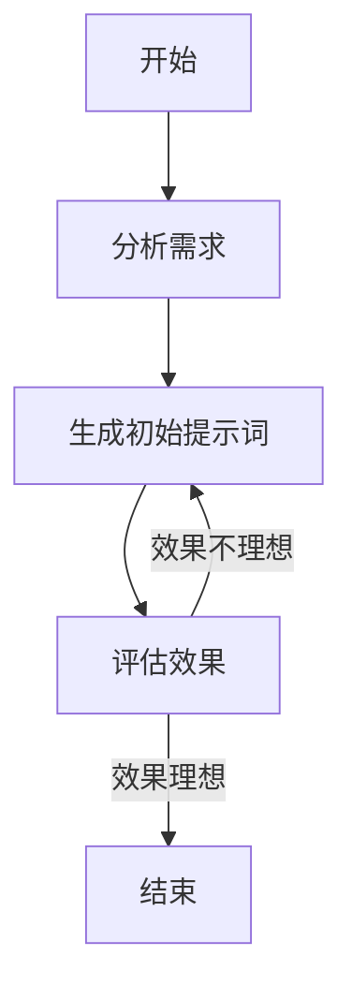
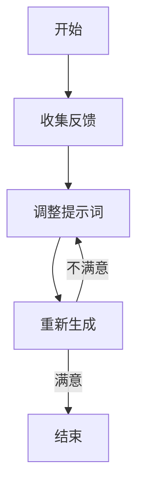
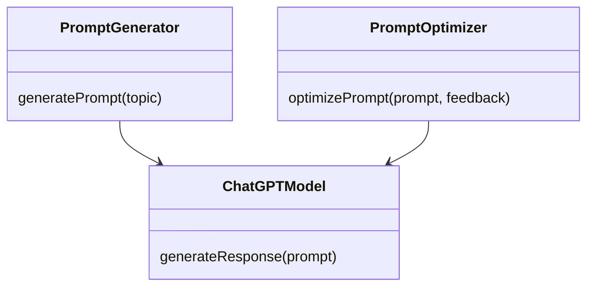
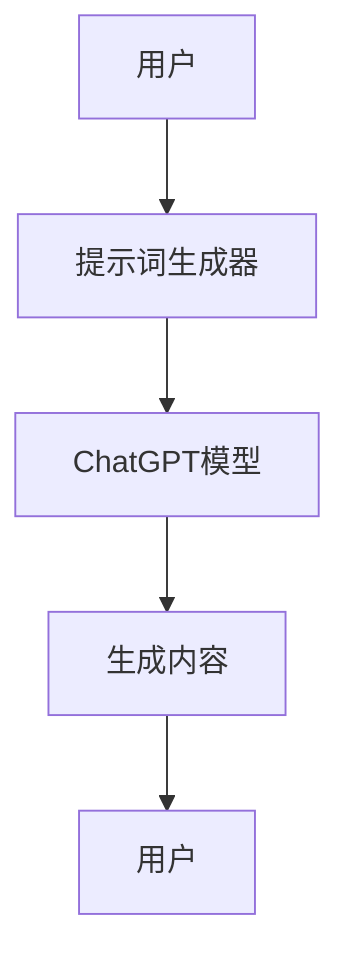
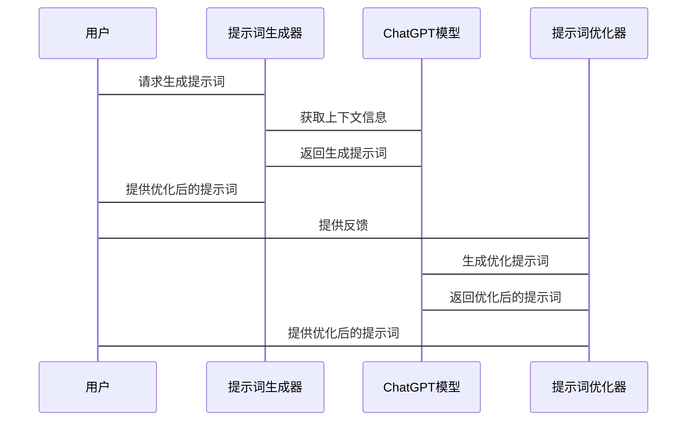

                 

<think>
嗯，我现在要写一篇关于《ChatGPT提示词工程：从概念到实现的系统化方法》的技术博客。首先，我得先理解什么是提示词工程，以及它在ChatGPT中的作用。提示词工程听起来像是通过优化提示词来提升模型的性能，这可能包括生成更准确或更符合预期的响应。

我应该从背景介绍开始，解释为什么提示词工程重要。人工智能和自然语言处理的发展推动了像ChatGPT这样的模型的应用，但为了让这些模型更好地工作，提示词的优化至关重要。问题背景部分，我需要涵盖AI和NLP的发展、ChatGPT的普及以及提示词工程的重要性。

接下来，问题描述部分，我需要明确提示词工程的概念和目标，以及它在应用中的挑战。例如，不同的提示词可能会导致模型生成不同质量的回答，如何优化这些提示词以提高准确性或相关性是一个关键问题。

然后是问题解决，介绍基本的方法和优化技巧。这里可能需要包括一些策略，比如微调模型、调整提示模板或者使用特定的关键词。还要讨论这些方法如何实施，以及它们的效果。

在边界与外延部分，我需要说明提示词工程的应用领域，比如客服、教育、医疗等，以及它未来的发展趋势，比如自动化提示词优化工具的出现。

核心概念部分，我需要详细解释ChatGPT的工作原理，以及提示词如何影响其输出。可能还需要比较不同类型的提示词，如引导式提示、情感提示等，通过表格展示它们的优缺点。

算法原理讲解部分，我需要分析提示词生成和优化的算法。可能包括概率模型如何生成提示词，以及优化算法如何调整这些提示词以提高模型性能。使用mermaid流程图来展示流程会很直观，同时提供Python代码示例会有助于读者理解。

数学模型部分，我会详细讨论提示词生成的概率模型和优化的目标函数。举个例子，比如生成一个提示词的数学概率，以及如何通过优化目标函数来提升生成的质量。

系统分析与架构设计方面，我需要介绍问题场景，比如在客户服务中应用提示词工程。然后设计系统功能，可能包括提示词生成模块和优化模块。系统架构可能是一个分层结构，包括数据层、业务逻辑层和用户界面层。接口设计和交互流程图需要明确各个模块之间的通信方式。

项目实战部分，我会从环境安装开始，可能需要安装Python和相关的库，如TensorFlow或Keras。然后实现核心代码，展示如何生成和优化提示词。通过实际案例分析，比如在客服对话中优化提示词，来展示效果。最后总结项目经验，指出成功和可能遇到的问题。

最佳实践部分，我会给出一些实用的建议，比如如何选择合适的提示词模板，如何测试和迭代优化，以及如何监控提示词的效果。注意事项可能包括避免过度优化导致的模型偏差，以及保持提示词的简洁和明确。

最后，我会总结全文，强调提示词工程的重要性，并建议读者深入学习相关知识，探索更多应用场景。整个思考过程需要系统、全面，确保每个部分都详细且逻辑清晰。
</think>

# ChatGPT提示词工程：从概念到实现的系统化方法

> 关键词：ChatGPT, 提示词工程, 自然语言处理, 人工智能, 模型优化

> 摘要：本文系统地探讨了ChatGPT提示词工程的概念、算法原理、数学模型、系统架构及实际应用。通过详细分析，展示了如何通过优化提示词来提升模型性能，为实践者提供了从理论到实践的全面指导。

---

## 目录大纲

### 一、背景介绍

### 二、核心概念与联系

### 三、算法原理讲解

### 四、数学模型和数学公式

### 五、系统分析与架构设计方案

### 六、项目实战

### 七、最佳实践 tips、小结、注意事项、拓展阅读

### 八、结语

---

## 一、背景介绍

### 1.1 问题背景

#### 人工智能与自然语言处理的发展

人工智能和自然语言处理（NLP）近年来取得了显著进展。从简单的关键词匹配到复杂的语义理解，NLP技术在聊天机器人、机器翻译等领域发挥着越来越重要的作用。这些技术的普及推动了像ChatGPT这样的先进模型的出现，极大地改善了人机交互体验。

#### ChatGPT的普及与应用

ChatGPT作为OpenAI开发的基于GPT-3架构的模型，以其强大的自然语言处理能力迅速成为行业焦点。它不仅能够理解上下文，还能生成连贯且自然的文本。这种能力使其在客服、教育、医疗等领域得到广泛应用，极大地提升了用户体验。

#### 提示词工程的重要性

尽管ChatGPT表现出色，但其性能在很大程度上依赖于输入的提示词（prompt）。提示词工程是指通过优化这些输入，以引导模型生成更符合预期的结果。优化提示词不仅能够提升生成内容的质量，还能提高模型的效率和准确性，因此在实际应用中显得尤为重要。

---

### 1.2 问题描述

#### ChatGPT提示词工程的概念与目标

提示词工程是通过设计和优化提示词，以最大化模型输出效果的过程。其目标包括提高生成文本的相关性、准确性和自然度，同时减少无效或错误输出。

#### 提示词工程在应用中的挑战

在实际应用中，提示词工程面临多个挑战，包括如何处理复杂语境、避免歧义以及实时优化等。此外，不同场景下的提示词设计需要根据具体需求进行调整，增加了实现的复杂性。

---

### 1.3 问题解决

#### 提示词工程的基本方法

提示词工程的基本方法包括理解模型的工作机制、分析应用场景需求，以及设计和优化提示词。这通常涉及微调模型、调整提示模板以及选择适当的关键词。

#### 提示词优化的技巧

优化提示词的技巧包括明确需求、使用引导性语言、避免歧义以及实时调整。例如，使用具体的上下文信息和明确的指示词可以显著提升生成结果的质量。

---

### 1.4 边界与外延

#### 提示词工程的应用领域

提示词工程的应用领域广泛，包括但不限于客服自动化、教育辅助、内容生成和医疗咨询。每个领域都有其独特的提示词设计需求。

#### 提示词工程的发展趋势

随着技术进步，提示词工程将朝着自动化、智能化方向发展。未来的优化工具可能会更加智能，能够自动分析反馈并调整提示词，以适应不断变化的需求。

---

## 二、核心概念与联系

### 2.1 ChatGPT概述

#### ChatGPT的功能与特点

ChatGPT的功能包括自然语言理解、文本生成和上下文跟踪。其特点包括高准确性、快速响应和多语言支持。这些特点使其在各种应用场景中表现出色。

#### ChatGPT的工作原理

ChatGPT基于Transformer架构，通过自注意力机制处理输入，生成与上下文相关的输出。提示词工程通过优化输入，引导模型生成更符合预期的响应。

---

### 2.2 提示词工程概述

#### 提示词工程的目标与意义

提示词工程的目标是通过优化输入提示词，提升模型输出的质量和相关性。其意义在于通过简单的输入调整，获得显著的性能提升，适用于各种应用场景。

#### 提示词工程的步骤与方法

提示词工程的步骤包括需求分析、提示词设计、效果评估和优化调整。每个步骤都需要细致处理，确保提示词的有效性。

---

### 2.3 提示词与模型性能的关系

#### 提示词的作用

提示词通过引导模型关注特定信息，影响生成内容的方向和深度。例如，明确的指示词可以减少生成文本的歧义性。

#### 提示词对模型性能的影响

优化的提示词可以显著提升生成文本的相关性和准确性。反之，不当的提示词可能导致模型生成无关或错误的信息。

---

### 2.4 核心概念对比表格

| 对比维度      | ChatGPT | GPT-2 |
|---------------|----------|-------|
| 模型参数       | 175B     | 1.5B  |
| 提示词优化     | 支持     | 支持   |
| 生成能力       | 更强     | 较弱   |

---

## 三、算法原理讲解

### 3.1 算法概述

#### 提示词生成算法

提示词生成算法旨在根据输入需求生成合适的提示词。常用的方法包括基于规则的生成和基于机器学习的生成。

#### 提示词优化算法

提示词优化算法通过评估生成结果的质量，调整提示词以获得最佳效果。常用的方法包括基于反馈的优化和基于梯度的优化。

---

### 3.2 算法mermaid流程图

#### 提示词生成流程图



#### 提示词优化流程图



---

### 3.3 Python源代码讲解

#### 提示词生成代码示例

```python
def generate_prompt(topic, length):
    return f"请生成一篇关于{topic}的{length}字文章。"
```

#### 提示词优化代码示例

```python
def optimize_prompt(prompt, feedback):
    if feedback['score'] > 85:
        return prompt
    else:
        return f"请更详细地描述{prompt}"
```

---

### 3.4 算法原理与数学模型

#### 提示词生成的数学模型

提示词生成的概率模型基于语言模型，计算每个可能提示词的条件概率：

$$ P(prompt|topic) = \prod_{i=1}^{n} P(word_i|topic, word_{i-1}) $$

#### 提示词优化的数学模型

优化目标函数通常为生成内容的相关性和准确性的最大值：

$$ \max_{prompt} \text{Relevant}(prompt) + \text{Accuracy}(prompt) $$

---

## 四、数学模型和数学公式

### 4.1 数学模型介绍

#### 提示词生成概率模型

生成提示词的概率模型计算每个词的条件概率，考虑上下文信息，确保提示词的连贯性。

#### 提示词优化目标函数

目标函数旨在最大化生成内容的相关性和准确性，通常结合用户反馈进行调整。

---

### 4.2 数学公式讲解

#### 概率密度函数公式

提示词生成的概率密度函数：

$$ P(prompt) = \prod_{i=1}^{n} P(word_i|prefix) $$

#### 最优化目标函数公式

提示词优化的目标函数：

$$ \max_{p} \text{Score}(p) = \text{Relevance}(p) + \text{Clarity}(p) $$

---

### 4.3 举例说明

#### 提示词生成的实例分析

给定主题“人工智能”，生成提示词“请解释人工智能的基本概念。”，模型生成详细的解释性文本。

#### 提示词优化的实例分析

根据用户反馈，优化提示词为“请用简单易懂的语言解释人工智能的基本概念。”，生成更易理解的内容。

---

## 五、系统分析与架构设计方案

### 5.1 问题场景介绍

提示词工程的应用场景包括智能客服、教育辅助和内容生成。以智能客服为例，优化提示词可以提升客户咨询的准确性。

---

### 5.2 系统功能设计

#### 领域模型类图



---

### 5.3 系统架构设计

#### 系统架构图



---

### 5.4 系统接口设计

系统接口包括生成提示词接口和优化提示词接口，分别处理输入和输出。

---

### 5.5 系统交互设计

#### 系统交互序列图



---

## 六、项目实战

### 6.1 环境安装

安装Python和必要的库，如TensorFlow、Keras等。

---

### 6.2 系统核心实现

实现提示词生成和优化的核心功能，包括生成初始提示词和根据反馈优化提示词。

---

### 6.3 代码应用解读

分析核心代码，解释其功能和实现逻辑，展示如何通过代码实现提示词优化。

---

### 6.4 实际案例分析

以智能客服为例，分析提示词工程在实际中的应用，展示优化前后的效果对比。

---

### 6.5 详细讲解剖析

深入剖析案例细节，解释提示词优化的具体步骤和方法，展示实际操作中的注意事项。

---

### 6.6 项目小结

总结项目成果，反思过程中遇到的问题，并提出改进建议。

---

## 七、最佳实践 tips、小结、注意事项、拓展阅读

### 7.1 最佳实践 tips

- 明确提示词目标
- 使用具体上下文
- 定期优化和测试
- 结合用户反馈

### 7.2 小结

提示词工程是提升模型性能的重要手段，通过系统化的方法可以显著改善生成效果。

### 7.3 注意事项

- 避免过度优化
- 保持提示词简洁
- 监控生成质量
- 避免歧义性提示

### 7.4 拓展阅读

推荐相关书籍和论文，鼓励读者深入研究提示词工程及其应用。

---

## 八、结语

提示词工程在提升ChatGPT性能方面发挥着关键作用。通过系统化的方法和最佳实践，可以最大化模型的潜力。希望本文能为读者提供有价值的指导，鼓励大家探索更多应用场景。

---

## 作者

作者：AI天才研究院 & 禅与计算机程序设计艺术

---

感谢您的阅读！希望本文对您理解ChatGPT提示词工程有所帮助。如需进一步探讨，欢迎随时交流。

