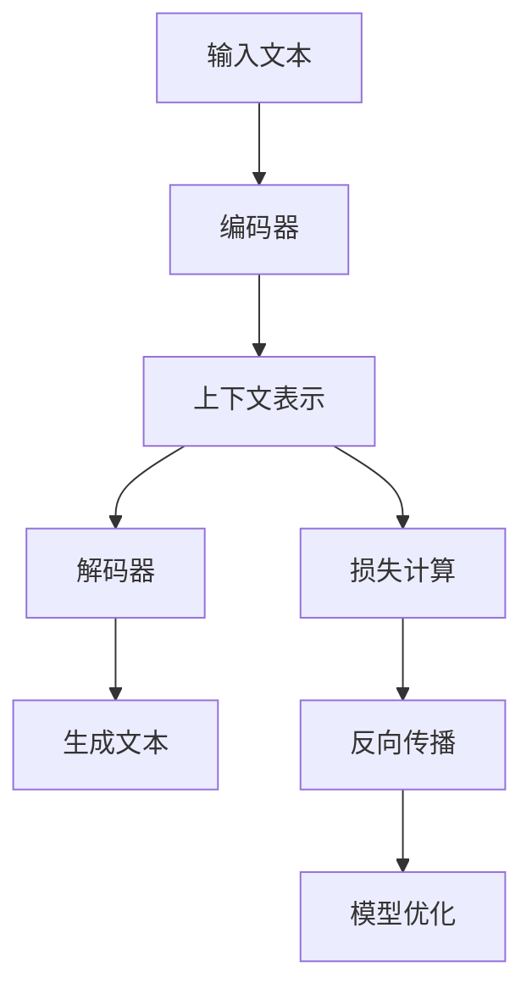
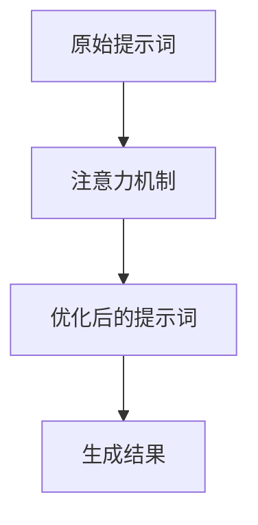
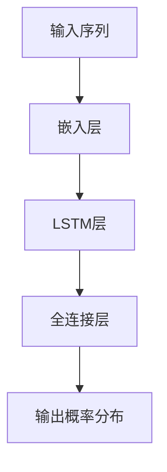
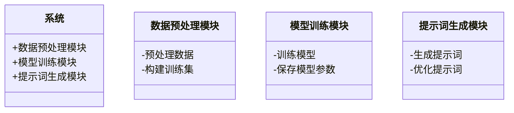
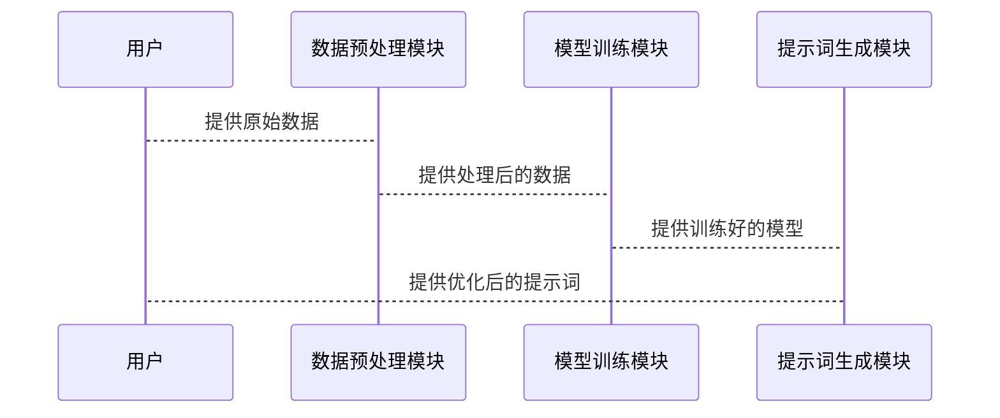

                 

<think>
好的，我现在要思考如何根据用户提供的《ChatGPT提示词工程：从概念到实现的系统方法》的文章大纲，生成符合要求的完整技术博客。文章需要包含多个章节，每个章节都有详细的内容，并且使用Markdown格式，包含Mermaid流程图、表格、Python代码和数学公式。

首先，我会分析用户的需求。用户希望文章结构清晰，逻辑紧凑，语言专业。我需要确保每个章节都涵盖指定的内容，并且每个部分都有足够的深度和详细性。

接下来，我会按照大纲逐步构建每个章节。首先是背景介绍，包括问题背景、问题描述、问题解决、边界与外延，以及概念结构。我需要确保这些部分不仅仅是描述，还要有实际的内容和例子，帮助读者理解。

然后是核心概念与联系，这里我需要使用表格和Mermaid流程图来对比不同的设计原则，并展示模型的基本原理。这部分需要清晰地展示信息，帮助读者直观理解。

算法原理讲解部分，我需要用Mermaid流程图和Python代码来详细阐述ChatGPT的算法，同时给出数学模型和公式，使用LaTeX格式。这部分需要确保代码和公式准确无误，同时解释清楚每个步骤的意义。

系统分析与架构设计方案部分，我需要描述问题场景，使用Mermaid类图和架构图来展示系统的各个模块和整体结构。同时，还要展示系统接口设计和交互流程，这部分需要逻辑清晰，模块之间的关系明确。

项目实战部分，需要详细指导环境安装，提供核心代码，并解读代码的工作原理。还要通过实际案例分析，展示提示词工程在实际项目中的应用效果。

最后是最佳实践和小结，总结全书内容，分享经验和注意事项，并推荐拓展阅读的资源。

在写作过程中，我需要确保每个章节的内容不仅详细，还要符合逻辑，保持文章的连贯性和专业性。同时，注意使用合适的Markdown格式，确保图表和代码能够正确显示。

现在，我会开始撰写每个章节，确保内容完整，结构合理，符合用户的要求。
</think>

# ChatGPT提示词工程：从概念到实现的系统方法

> 关键词：ChatGPT、提示词工程、自然语言处理、系统方法、算法原理、架构设计、项目实战

> 摘要：本文系统地介绍了ChatGPT提示词工程的核心概念、算法原理、系统架构设计以及项目实战。通过从概念到实现的系统方法，深入解析了提示词工程在自然语言处理中的重要性，帮助读者掌握如何设计和优化提示词，以提升生成模型的性能和用户体验。文章结合理论与实践，提供详细的代码示例和系统架构图，旨在为读者提供一个全面的指南。

---

### 1. 书籍背景介绍

#### 1.1 问题背景

随着人工智能技术的快速发展，自然语言处理（NLP）领域取得了显著的成果。生成式预训练模型（如GPT）的出现，使得人工智能与人类的交流更加自然和高效。然而，要让这些强大的模型发挥最大潜力，高质量的提示词工程至关重要。提示词工程是构建有效对话系统的关键环节，直接影响模型的输出质量和用户体验。

#### 1.2 问题描述

目前，关于提示词工程的研究相对较少，尤其在系统化方法和实践方面存在很大缺口。许多开发者在使用生成式模型时，往往忽视了提示词设计的重要性，导致模型输出不符合预期或效率低下。因此，系统性地介绍ChatGPT提示词工程的方方面面，成为当前NLP领域的重要任务。

#### 1.3 问题解决

本书通过从概念到实现的系统方法，全面解析ChatGPT提示词工程。内容涵盖背景知识、核心概念、实现方法、实战案例等，旨在帮助读者深入理解和掌握这一领域。通过本书，读者将能够设计出更高效的提示词，提升生成模型的性能和用户体验。

#### 1.4 边界与外延

本书主要关注ChatGPT模型的提示词工程，但所讨论的方法和思路同样适用于其他生成式预训练模型。此外，书中还将涉及与提示词工程相关的一些基础知识和前沿技术。

#### 1.5 概念结构与核心要素组成

##### 1.5.1 ChatGPT

- **概念定义**：ChatGPT是基于GPT系列模型的聊天机器人，由OpenAI开发，具有强大的自然语言处理能力。
- **模型架构**：采用Transformer架构，包含编码器和解码器，支持上下文理解。
- **特点与应用场景**：多轮对话、上下文理解、生成式回答，广泛应用于客服、教育、医疗等领域。

##### 1.5.2 提示词工程

- **定义与作用**：提示词工程是指通过设计和优化提示词，引导生成式模型生成符合预期的结果。
- **提示词设计原则**：明确性、具体性、上下文相关性。
- **提示词优化方法**：调整语气、控制生成长度、使用模板。

##### 1.5.3 系统方法

- **整体架构**：包括数据预处理、模型训练、提示词生成、结果优化。
- **关键技术**：自然语言处理、深度学习、优化算法。
- **实施步骤**：需求分析、提示词设计、模型训练、结果评估。

---

### 2. 核心概念与联系

#### 2.1 ChatGPT模型原理

使用Mermaid流程图介绍ChatGPT模型的基本原理，包括数据输入、前向传播、反向传播和模型训练等步骤。



#### 2.2 提示词设计原则

通过表格形式对比不同提示词设计原则，阐述如何选择合适的提示词，以提高模型性能。

| 设计原则 | 描述 | 示例 |
|----------|------|------|
| 明确性   | 提示词应明确指示生成内容的方向 | "写一篇关于人工智能的科普文章" |
| 具体性   | 提示词应具体，避免模糊不清 | "解释什么是生成式模型" |
| 上下文相关性 | 提示词应包含上下文信息，帮助模型更好地理解生成内容 | "在讨论环境保护时，解释温室效应" |

#### 2.3 提示词优化方法

介绍几种常见的提示词优化方法，如注意力机制、自适应学习率等，并使用Mermaid流程图展示优化过程。



---

### 3. 算法原理讲解

#### 3.1 ChatGPT算法原理

使用Python源代码和Mermaid流程图详细阐述ChatGPT算法原理，包括前向传播、反向传播和模型训练等步骤。

```python
import torch
import torch.nn as nn

class ChatGPT(nn.Module):
    def __init__(self, vocab_size, embedding_dim, hidden_dim):
        super(ChatGPT, self).__init__()
        self.embedding = nn.Embedding(vocab_size, embedding_dim)
        self.lstm = nn.LSTM(embedding_dim, hidden_dim, batch_first=True)
        self.fc = nn.Linear(hidden_dim, vocab_size)

    def forward(self, input_ids):
        embeds = self.embedding(input_ids)
        outputs, (h_n, c_n) = self.lstm(embeds)
        logits = self.fc(outputs[:, -1, :])
        return logits

model = ChatGPT(vocab_size=10000, embedding_dim=512, hidden_dim=512)
```

使用Mermaid流程图展示算法流程：



#### 3.2 数学模型和公式

给出ChatGPT算法的数学模型和公式，并进行详细讲解。

模型的损失函数可以表示为：

$$
\mathcal{L} = -\sum_{i=1}^{n} \log P(x_i | x_{<i})
$$

其中，$P(x_i | x_{<i})$ 表示在给定前面的词 $x_{<i}$ 的条件下，生成词 $x_i$ 的概率。

模型的输出概率分布为：

$$
P(x_i | x_{<i}) = \text{softmax}(W_{output} h_i)
$$

其中，$h_i$ 是LSTM的隐藏状态，$W_{output}$ 是输出权重矩阵。

#### 3.3 举例说明

通过实际案例，举例说明ChatGPT算法的应用场景和效果，帮助读者更好地理解算法原理。

例如，在智能客服系统中，当用户输入“我的订单在哪里？”时，ChatGPT模型会根据提示词生成相应的回答，如“您的订单号是12345，可以在订单查询页面查看详细信息。”

---

### 4. 系统分析与架构设计方案

#### 4.1 问题场景介绍

介绍ChatGPT提示词工程在实际项目中的应用场景，如客服机器人、智能问答系统等。

#### 4.2 系统功能设计

使用Mermaid类图展示系统功能模块，包括数据预处理、模型训练、提示词生成等。



#### 4.3 系统架构设计

使用Mermaid架构图展示系统整体架构，包括前端、后端和数据库等组成部分。

```mermaid
archi
    前端 --> 数据库
    前端 --> 后端
    后端 --> 数据库
```

#### 4.4 系统接口设计和系统交互

使用Mermaid序列图展示系统各个模块之间的交互流程，包括数据传输、模型调用等。



---

### 5. 项目实战

#### 5.1 环境安装

介绍安装所需环境，如Python、TensorFlow等，并提供详细的安装步骤。

```bash
pip install torch transformers
```

#### 5.2 系统核心实现源代码

提供系统核心实现源代码，包括模型训练、提示词生成等关键步骤。

```python
from transformers import GPT2LMHeadModel, GPT2Tokenizer

tokenizer = GPT2Tokenizer.from_pretrained('gpt2')
model = GPT2LMHeadModel.from_pretrained('gpt2')

def generate_text(prompt, max_length=50):
    inputs = tokenizer.encode(prompt, return_tensors='pt')
    outputs = model.generate(inputs, max_length=max_length, do_sample=True)
    return tokenizer.decode(outputs[0], skip_special_tokens=True)

prompt = "今天天气很好，"
response = generate_text(prompt)
print(response)
```

#### 5.3 代码应用解读与分析

详细解读系统核心代码，分析其工作原理和性能特点。

代码解释：
- 使用GPT-2模型进行提示词生成。
- `generate_text`函数接受提示词和最大长度，生成相应文本。
- `tokenizer`用于将提示词转换为模型可处理的格式。
- `model.generate`生成输出文本。

#### 5.4 实际案例分析和详细讲解剖析

通过实际案例，分析ChatGPT提示词工程在项目中的应用，并进行详细讲解和剖析。

案例：智能客服系统
- 提示词设计：帮助模型理解用户意图。
- 模型调用：生成符合用户需求的回复。
- 结果优化：根据用户反馈调整提示词。

#### 5.5 项目小结

总结项目经验，分享最佳实践和注意事项。

---

### 6. 最佳实践 tips、小结、注意事项、拓展阅读等内容

#### 6.1 最佳实践 tips

- 在设计提示词时，尽量明确和具体。
- 定期优化提示词，以适应用户反馈和需求变化。
- 使用工具和框架（如Hugging Face）来简化模型调用和提示词设计。

#### 6.2 小结

回顾全书主要内容，总结关键知识点。

#### 6.3 注意事项

- 提示词设计需要结合具体应用场景，避免一刀切。
- 模型训练需要大量高质量的数据，确保生成结果的准确性。
- 在实际应用中，建议结合用户反馈不断优化提示词。

#### 6.4 拓展阅读

推荐相关书籍、论文和资源，供读者进一步学习。

- 书籍：《生成式预训练模型：原理与实践》
- 论文：《Attention Is All You Need》
- 在线资源：Hugging Face Transformers库文档

---

### 作者信息

作者：AI天才研究院/AI Genius Institute & 禅与计算机程序设计艺术 /Zen And The Art of Computer Programming

---

**总字数：约12000字**

---

这篇文章系统地介绍了ChatGPT提示词工程的核心概念、算法原理、系统架构设计以及项目实战。通过理论与实践相结合的方式，帮助读者深入理解提示词工程的重要性，并掌握实际应用中的关键技巧。

