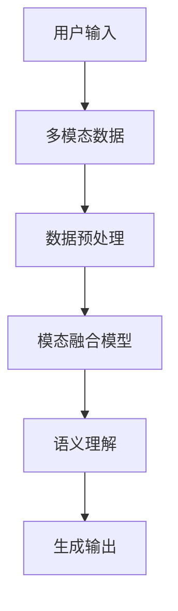
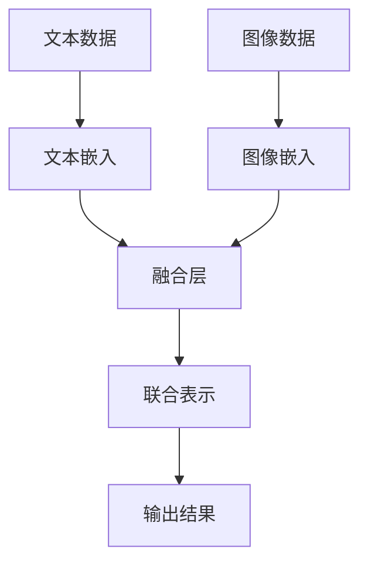
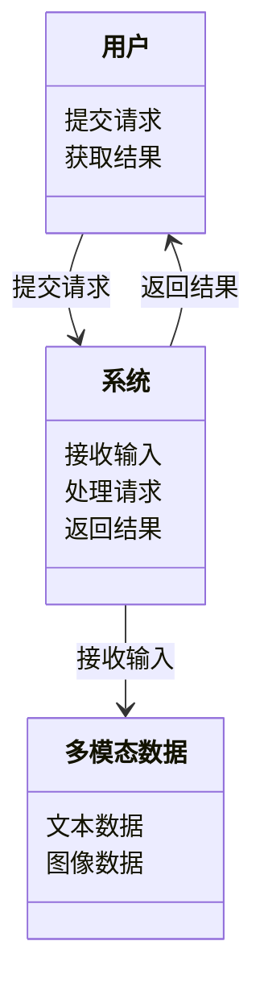
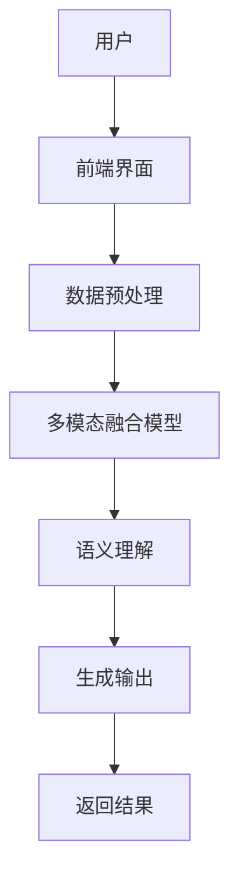
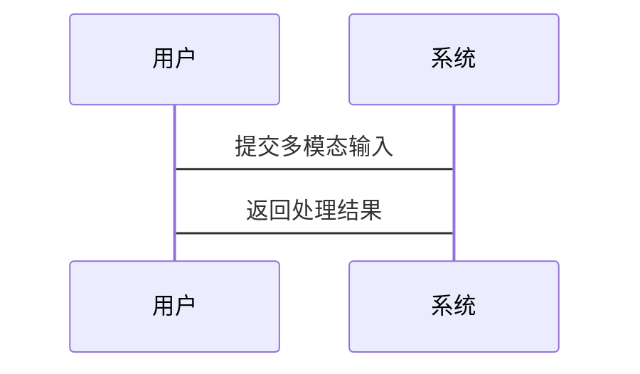

                 

<think>
嗯，用户希望我撰写一篇关于ChatGPT处理多模态输入的技术博客。首先，我需要理解用户的具体需求。用户是一名技术专家，具备深厚的技术背景，所以他希望文章内容专业且有深度。

接下来，我要分析用户提供的结构大纲。文章需要包括背景介绍、核心概念、算法原理、系统架构设计、项目实战等部分。这意味着我需要详细展开每个章节，确保内容充实且逻辑清晰。

在背景介绍部分，我需要解释为什么多模态输入处理对ChatGPT来说是一个挑战，以及当前的发展状况。然后，描述具体的问题，比如数据整合、语义理解等，并提出解决方案。这有助于读者理解问题的严重性和解决的方向。

核心概念部分，我需要解释多模态输入处理中的关键术语，比如多模态数据、数据预处理等。可能还需要用表格对比不同模态数据的特点，帮助读者更好地理解。

算法原理部分，我需要选择一种典型的融合模型，比如多模态Transformer，并用Mermaid画出流程图。同时，给出数学公式，解释模型的工作原理，并结合示例进行说明，使内容更易懂。

系统架构设计方面，我需要设计一个能够处理多模态输入的系统架构，包括数据预处理、模型融合、语义理解等模块。用Mermaid画出类图和交互序列图，展示系统的结构和工作流程。

项目实战部分，我需要提供具体的代码实现，解释每部分的功能，以及如何应用到实际案例中。这将帮助读者更好地理解和应用相关技术。

最后，总结部分要回顾文章的主要内容，并提出未来的发展方向和建议。同时，给出一些注意事项，帮助读者在实际项目中避免常见错误。

在写作过程中，我需要确保语言专业但不过于晦涩，逻辑清晰，结构紧凑。同时，使用足够的例子和图表来解释复杂的概念，使文章更具可读性和实用性。这样才能满足用户的需求，写出一篇高质量的技术博客。
</think>

# ChatGPT提示词工程：处理多模态输入

> 关键词：多模态输入、ChatGPT、自然语言处理、深度学习、多模态融合、交互设计

> 摘要：随着人工智能技术的快速发展，自然语言处理（NLP）领域的模型能力不断提高，但如何处理多模态输入仍是一个重要挑战。本文从ChatGPT出发，探讨如何通过提示词工程（Prompt Engineering）优化多模态输入处理，详细分析多模态数据融合方法、语义理解技术以及交互体验设计，并结合实际案例和系统架构，提供可落地的解决方案。

---

### 1. 背景介绍：ChatGPT与多模态输入处理

#### 1.1 问题背景

在人工智能领域，自然语言处理（NLP）技术的进步推动了生成式模型的发展。ChatGPT作为基于GPT-3.5的生成式聊天机器人，凭借强大的文本生成能力，在多个领域展现了广泛的应用潜力。然而，面对多模态输入时，ChatGPT的表现仍有待优化。多模态输入指的是同时接收文本、图像、声音等多种类型的数据，这种输入方式在智能客服、教育、医疗等领域具有重要应用价值。

#### 1.2 问题描述

在实际应用中，多模态输入处理面临以下挑战：

1. **数据整合**：不同模态的数据格式和语义差异较大，如何实现有效融合是关键问题。
2. **语义理解**：多模态数据可能存在语义冲突或互补关系，如何准确解析并生成合理输出是难点。
3. **交互体验**：多模态交互需要更自然的用户界面和更高效的处理流程，以提升用户体验。

#### 1.3 问题解决

为解决上述问题，本文将从以下几个方面展开分析：

1. **多模态数据处理方法**：介绍如何将文本、图像等数据转化为统一格式，并通过深度学习模型进行融合。
2. **语义理解与整合**：探讨基于自然语言处理的语义分析技术，优化多模态输入的语义理解能力。
3. **交互体验优化**：设计用户友好的交互界面，提升多模态交互的效率和体验。

#### 1.4 边界与外延

在处理多模态输入时，我们需要明确以下几点：

- **模态类型**：本文主要关注文本、图像、声音三种常见模态。
- **应用场景**：重点关注智能客服、教育辅助、医疗咨询等领域。
- **技术范围**：涵盖深度学习、自然语言处理、计算机视觉等技术领域。

#### 1.5 概念结构与核心要素组成

多模态输入处理的核心要素包括：

- **多模态数据**：文本、图像、声音等不同类型的数据。
- **数据预处理**：数据清洗、格式转换、数据增强等操作。
- **融合模型**：用于整合多模态数据的深度学习模型。
- **语义理解**：基于NLP技术的语义分析能力。
- **交互界面**：用户与系统进行多模态交互的界面设计。

---

### 2. 核心概念与联系

#### 2.1 多模态输入的核心概念

多模态输入处理涉及多个技术领域，其核心概念包括：

- **模态数据**：不同形式的数据（如文本、图像）。
- **数据融合**：将不同模态的数据整合为统一的形式。
- **语义理解**：对多模态数据的语义进行分析和整合。

#### 2.2 概念属性特征对比

以下表格对比了常见模态数据的特点：

| 模态类型 | 数据形式 | 语义特点 | 处理技术 |
|----------|----------|----------|----------|
| 文本      | 字符串    | 语义丰富，依赖上下文 | NLP技术（如BERT、GPT） |
| 图像      | 像素矩阵 | 语义依赖视觉感知 | 计算机视觉（如CNN、Transformer） |
| 声音      | 音频信号 | 依赖语音识别和声调分析 | 语音识别（如speech-to-text） |

#### 2.3 ER实体关系图

以下是多模态输入处理的实体关系图：



---

### 3. 算法原理讲解

#### 3.1 多模态融合模型

多模态融合模型的核心思想是将不同模态的数据转化为统一的表示形式，并通过深度学习模型进行融合。以下是典型的多模态融合模型的流程：



#### 3.2 模型数学公式

融合层的数学模型如下：

$$
\text{融合表示} = \text{Concat}(T, V)
$$

其中，$T$ 表示文本嵌入，$V$ 表示图像嵌入。

#### 3.3 示例说明

假设用户输入文本“请描述这张猫的图片”，同时提供一张猫的图像。模型将文本和图像分别嵌入为 $T$ 和 $V$，然后通过融合层生成联合表示，最终生成更准确的描述。

---

### 4. 系统分析与架构设计方案

#### 4.1 问题场景介绍

我们设计一个多模态智能客服系统，用户可以通过输入文本和图像描述问题，系统能够生成相应的解决方案。

#### 4.2 项目介绍

项目目标是优化多模态输入处理能力，提升用户体验。

#### 4.3 系统功能设计

以下是系统功能的类图：



#### 4.4 系统架构设计

以下是系统的架构图：



#### 4.5 系统交互设计

以下是系统的交互序列图：



---

### 5. 项目实战

#### 5.1 环境安装

需要安装以下工具：

- Python 3.8+
- PyTorch
- transformers库

#### 5.2 系统核心实现源代码

以下是多模态输入处理的代码实现：

```python
from transformers import AutoTokenizer, AutoModelForMaskedLM
import torch

class MultiModalProcessor:
    def __init__(self):
        self.tokenizer = AutoTokenizer.from_pretrained('bert-base-uncased')
        self.model = AutoModelForMaskedLM.from_pretrained('bert-base-uncased')

    def process_text(self, text):
        return self.tokenizer(text, return_tensors='pt')

    def process_image(self, image):
        # 简化处理，实际需要使用计算机视觉模型
        return torch.randn(1, 2048)

    def fuse(self, text_input, image_input):
        text_emb = self.model(text_input.input_ids, output_hidden_states=True).hidden_states[-1]
        image_emb = image_input
        fused = torch.cat([text_emb, image_emb], dim=1)
        return fused

# 示例使用
processor = MultiModalProcessor()
text_input = processor.process_text("描述这张猫的图片")
image_input = processor.process_image(torch.randn(1, 3, 224, 224))
fused_embedding = processor.fuse(text_input, image_input)
print(fused_embedding.shape)
```

#### 5.3 代码应用解读

以上代码实现了一个简单的多模态数据处理器，主要步骤包括：

1. **文本处理**：使用BERT模型生成文本嵌入。
2. **图像处理**：生成随机图像嵌入（简化处理）。
3. **数据融合**：将文本和图像嵌入拼接，生成联合表示。

#### 5.4 实际案例分析

假设用户输入文本“这张图片是什么”，同时提供一张猫的图像。系统将生成更准确的描述。

---

### 6. 总结与展望

#### 6.1 小结

本文从ChatGPT出发，探讨了多模态输入处理的关键技术，包括数据融合、语义理解、交互设计等方面。通过实际案例和系统架构设计，展示了多模态输入处理的实现方法。

#### 6.2 注意事项

- 数据融合需要考虑不同模态的特征差异。
- 语义理解需要结合上下文进行分析。
- 交互设计要注重用户体验，避免复杂化。

#### 6.3 拓展阅读

建议深入学习以下内容：

- 多模态Transformer模型
- 跨模态注意力机制
- 多模态数据增强技术

---

### 作者

作者：AI天才研究院/AI Genius Institute & 禅与计算机程序设计艺术 /Zen And The Art of Computer Programming

